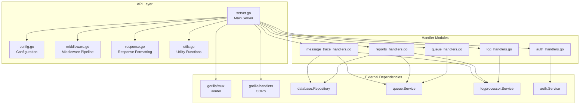
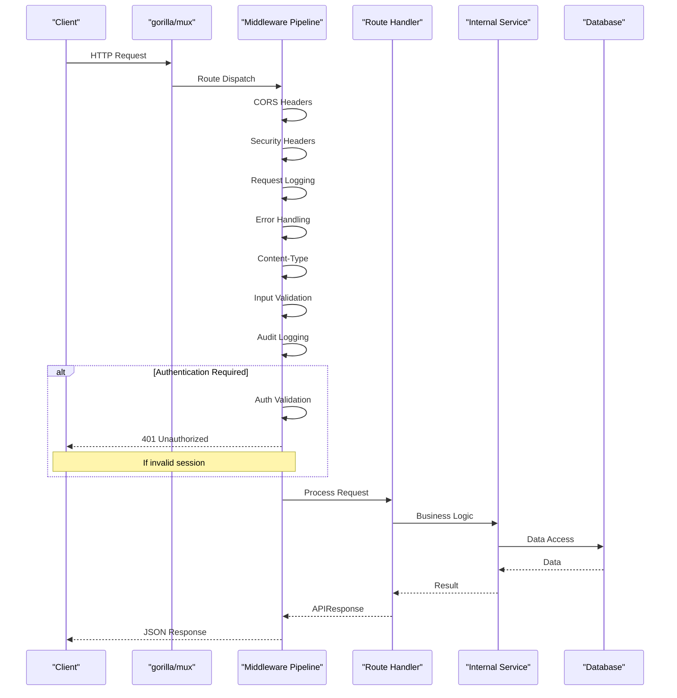
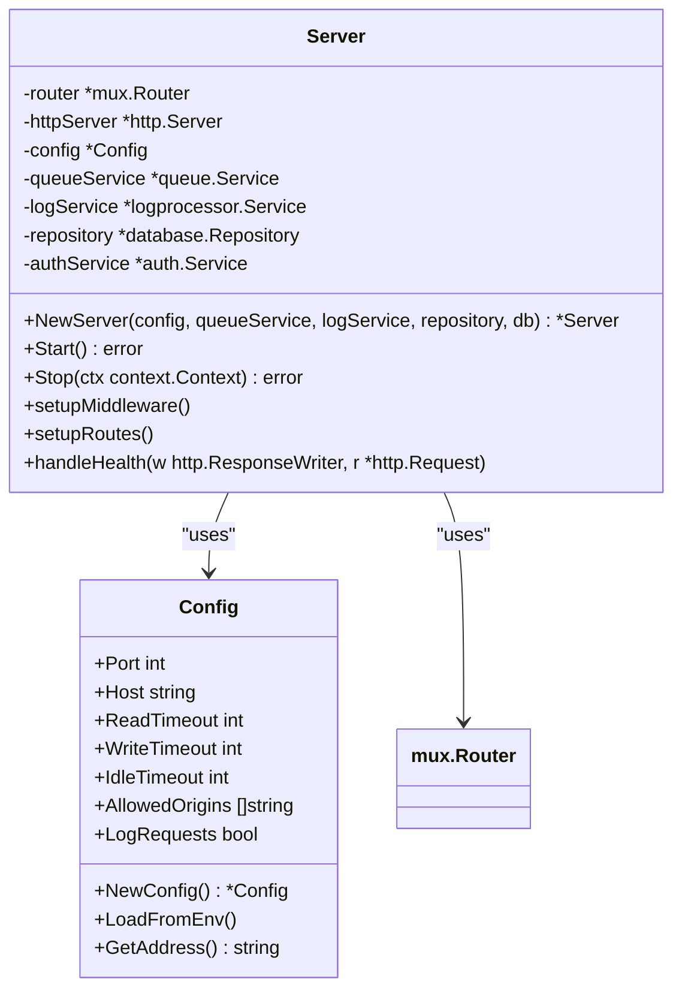
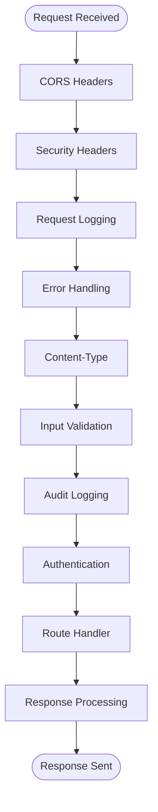
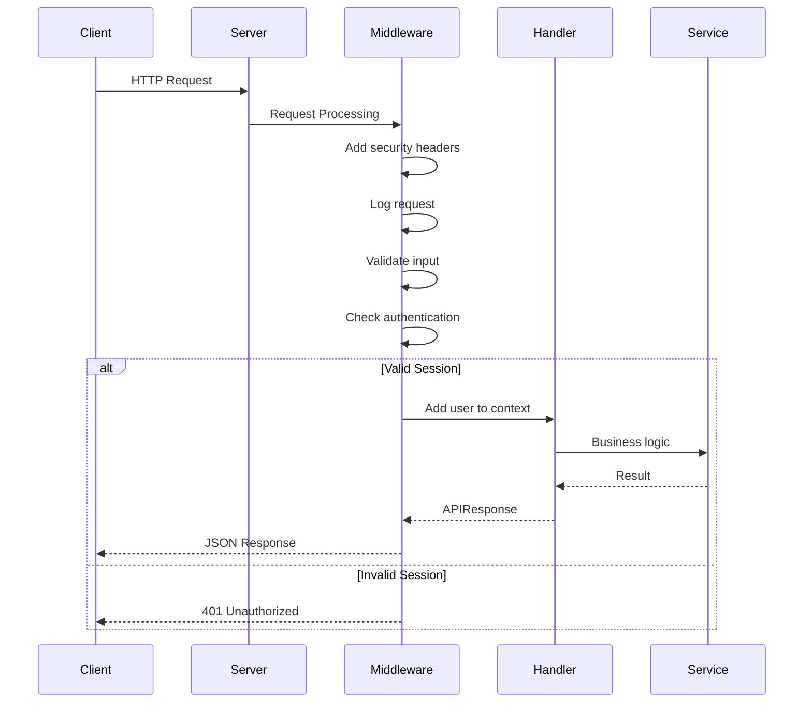
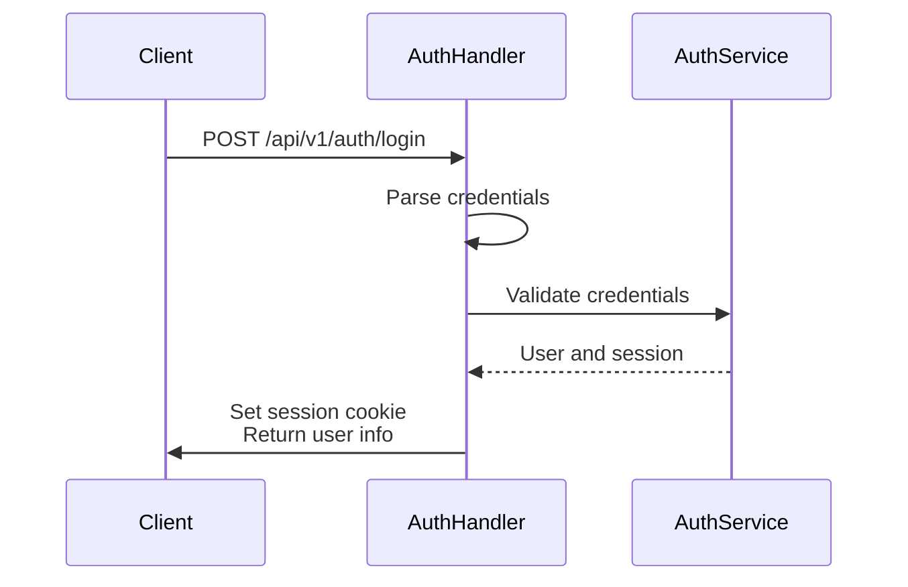
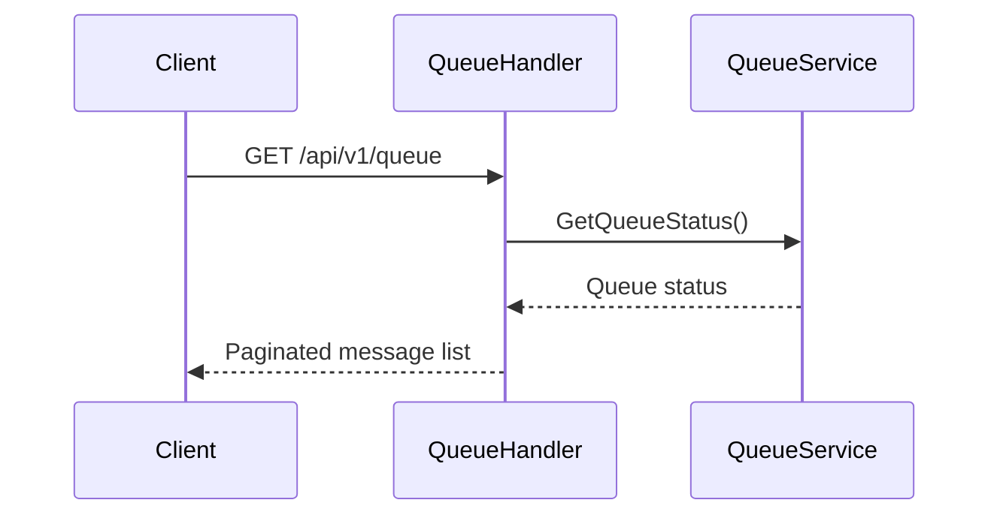
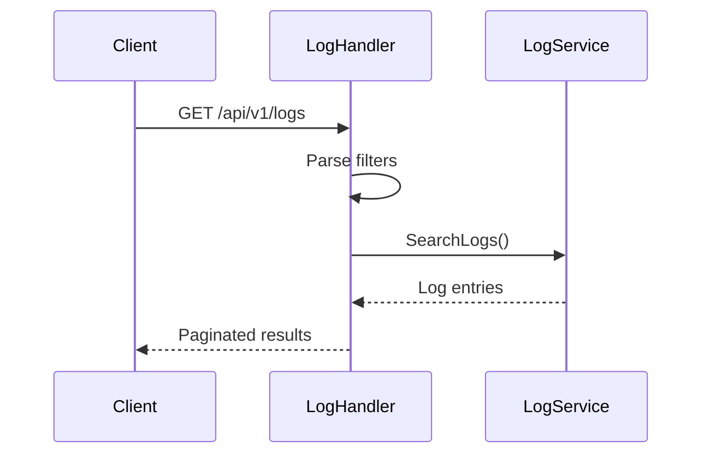
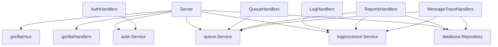

# API Server


## Table of Contents
1. [Introduction](#introduction)
2. [Project Structure](#project-structure)
3. [Core Components](#core-components)
4. [Architecture Overview](#architecture-overview)
5. [Detailed Component Analysis](#detailed-component-analysis)
6. [Dependency Analysis](#dependency-analysis)
7. [Performance Considerations](#performance-considerations)
8. [Troubleshooting Guide](#troubleshooting-guide)
9. [Conclusion](#conclusion)

## Introduction
The API Server component of the Exim-Pilot system serves as the central interface for managing email queue operations, log monitoring, message tracing, and reporting. Built using Go and the gorilla/mux router, it provides a RESTful API that enables both frontend interaction and programmatic access to Exim mail server functionality. This documentation details the server's architecture, routing implementation, middleware pipeline, request lifecycle, configuration, and response handling mechanisms.

## Project Structure
The API server is organized within the `internal/api` directory and follows a modular design pattern with clear separation of concerns. The main components include server configuration, route handlers, middleware, response formatting, and utility functions. The server integrates with various internal services such as authentication, queue management, log processing, and database operations.





**Diagram sources**
- [internal/api/server.go](file://internal/api/server.go#L1-L50)
- [internal/api/config.go](file://internal/api/config.go#L1-L20)
- [internal/api/middleware.go](file://internal/api/middleware.go#L1-L30)

**Section sources**
- [internal/api/server.go](file://internal/api/server.go#L1-L50)
- [internal/api/config.go](file://internal/api/config.go#L1-L20)

## Core Components
The API server's core components include the Server struct, configuration management, middleware pipeline, and standardized response handling. The server is initialized with dependencies including the queue service, log processing service, database repository, and authentication service. It uses gorilla/mux for routing with versioned API endpoints and implements a comprehensive middleware stack for security, logging, authentication, and error handling.

**Section sources**
- [internal/api/server.go](file://internal/api/server.go#L29-L48)
- [internal/api/config.go](file://internal/api/config.go#L29-L71)

## Architecture Overview
The API server follows a layered architecture with clear separation between routing, middleware, business logic, and data access. The server receives HTTP requests through the gorilla/mux router, processes them through a middleware pipeline, and dispatches to appropriate handlers based on the route. Each handler interacts with internal services to perform operations and returns standardized JSON responses.





**Diagram sources**
- [internal/api/server.go](file://internal/api/server.go#L49-L200)
- [internal/api/middleware.go](file://internal/api/middleware.go#L17-L175)

## Detailed Component Analysis

### Routing Implementation with gorilla/mux
The API server uses gorilla/mux for flexible and powerful routing capabilities. Routes are organized under the `/api/v1` prefix with subrouters for different functionality areas. The router supports path parameters, method restrictions, and middleware chaining.





**Diagram sources**
- [internal/api/server.go](file://internal/api/server.go#L10-L20)
- [internal/api/config.go](file://internal/api/config.go#L8-L18)

**Section sources**
- [internal/api/server.go](file://internal/api/server.go#L29-L200)
- [internal/api/config.go](file://internal/api/config.go#L29-L71)

#### Route Registration and Path Patterns
The server implements a hierarchical routing structure with versioned API endpoints. Routes are registered using subrouters for logical grouping and middleware application. Path parameters are used for resource identification, and routes are restricted to specific HTTP methods.


```go
// API v1 routes
api := s.router.PathPrefix("/api/v1").Subrouter()

// Health check endpoint (no auth required)
api.HandleFunc("/health", s.handleHealth).Methods("GET")

// Authentication routes
authHandlers := NewAuthHandlers(s.authService)
api.HandleFunc("/auth/login", authHandlers.handleLogin).Methods("POST")

// Protected routes with authentication middleware
protected := api.PathPrefix("").Subrouter()
protected.Use(s.authMiddleware)

// Queue management routes with path parameters
protected.HandleFunc("/queue/{id}", queueHandlers.handleQueueDetails).Methods("GET")
protected.HandleFunc("/queue/{id}/deliver", queueHandlers.handleQueueDeliver).Methods("POST")
```


**Section sources**
- [internal/api/server.go](file://internal/api/server.go#L69-L150)

#### Middleware Pipeline
The middleware pipeline is a critical component of the API server, providing cross-cutting concerns such as security, logging, authentication, and error handling. Middleware functions are chained in a specific order to ensure proper processing of requests and responses.





**Diagram sources**
- [internal/api/middleware.go](file://internal/api/middleware.go#L30-L175)

**Section sources**
- [internal/api/middleware.go](file://internal/api/middleware.go#L30-L175)

### Request Lifecycle Management
The request lifecycle spans from reception to response rendering, with context propagation and error recovery mechanisms in place. Each request passes through the middleware pipeline, where context is enriched with user information and other metadata.





**Diagram sources**
- [internal/api/middleware.go](file://internal/api/middleware.go#L175-L225)
- [internal/api/auth_handlers.go](file://internal/api/auth_handlers.go#L100-L150)

**Section sources**
- [internal/api/middleware.go](file://internal/api/middleware.go#L175-L225)
- [internal/api/auth_handlers.go](file://internal/api/auth_handlers.go#L100-L150)

#### Context Propagation
The server uses Go's context package to propagate request-scoped values, including authenticated user information. The authentication middleware adds the authenticated user to the request context, making it available to downstream handlers.


```go
// Add user to request context
ctx := r.Context()
ctx = SetUserInContext(ctx, user)
r = r.WithContext(ctx)
```


**Section sources**
- [internal/api/middleware.go](file://internal/api/middleware.go#L140-L145)

#### Error Recovery
The error handling middleware uses a defer/recover pattern to catch panics and convert them to standardized error responses, ensuring the server remains stable even when individual requests encounter unexpected errors.


```go
defer func() {
    if err := recover(); err != nil {
        log.Printf("Panic in handler: %v", err)
        response := APIResponse{
            Success: false,
            Error:   "Internal server error",
        }
        WriteJSONResponse(w, http.StatusInternalServerError, response)
    }
}()
```


**Section sources**
- [internal/api/middleware.go](file://internal/api/middleware.go#L50-L65)

### Server Configuration and Lifecycle
The server configuration is managed through a Config struct that supports both default values and environment variable overrides. The server implements graceful startup and shutdown procedures to ensure reliable operation.

#### Configuration Structure
The server configuration includes settings for network binding, timeouts, CORS, and logging. Default values are provided, but can be overridden via environment variables.


```go
type Config struct {
    Port           int
    Host           string
    ReadTimeout    int
    WriteTimeout   int
    IdleTimeout    int
    AllowedOrigins []string
    LogRequests    bool
}
```


**Section sources**
- [internal/api/config.go](file://internal/api/config.go#L8-L18)

#### Graceful Startup and Shutdown
The server implements proper startup initialization and graceful shutdown procedures. During startup, it connects to dependencies and sets up routing. During shutdown, it uses a context with timeout to allow in-flight requests to complete.


```go
// Graceful shutdown
quit := make(chan os.Signal, 1)
signal.Notify(quit, syscall.SIGINT, syscall.SIGTERM)
<-quit

ctx, cancel := context.WithTimeout(context.Background(), 30*time.Second)
defer cancel()
if err := server.Stop(ctx); err != nil {
    log.Fatalf("Server forced to shutdown: %v", err)
}
```


**Section sources**
- [cmd/exim-pilot/main.go](file://cmd/exim-pilot/main.go#L150-L180)
- [internal/api/server.go](file://internal/api/server.go#L256-L259)

### Response Formatting and Error Handling
The API server uses a standardized response envelope structure for consistent client interaction. All responses follow the same format, whether successful or erroneous.

#### Response Envelope Structure
The APIResponse struct provides a consistent format for all API responses, including success status, data payload, error messages, and metadata.


```go
type APIResponse struct {
    Success bool        `json:"success"`
    Data    interface{} `json:"data,omitempty"`
    Error   string      `json:"error,omitempty"`
    Meta    *Meta       `json:"meta,omitempty"`
}
```


**Section sources**
- [internal/api/response.go](file://internal/api/response.go#L8-L15)

#### Error Response Strategy
The server provides specialized functions for different error types, ensuring appropriate HTTP status codes and consistent error messaging.


```go
func WriteErrorResponse(w http.ResponseWriter, statusCode int, message string) {
    response := APIResponse{
        Success: false,
        Error:   message,
    }
    WriteJSONResponse(w, statusCode, response)
}
```


**Section sources**
- [internal/api/response.go](file://internal/api/response.go#L40-L48)

#### Versioning Strategy
The API uses URL-based versioning with the `/api/v1` prefix. This allows for future API evolution while maintaining backward compatibility with existing clients.


```go
api := s.router.PathPrefix("/api/v1").Subrouter()
```


**Section sources**
- [internal/api/server.go](file://internal/api/server.go#L69-L70)

### Handler Implementations
The API server organizes route handlers into separate modules based on functionality, promoting code organization and maintainability.

#### Authentication Handlers
The authentication handlers manage user login, logout, and session validation. They handle credential verification and session management through cookies.





**Diagram sources**
- [internal/api/auth_handlers.go](file://internal/api/auth_handlers.go#L30-L100)

**Section sources**
- [internal/api/auth_handlers.go](file://internal/api/auth_handlers.go#L30-L162)

#### Queue Management Handlers
The queue handlers provide operations for viewing, searching, and managing email queue messages, including delivery, freezing, and deletion operations.





**Diagram sources**
- [internal/api/queue_handlers.go](file://internal/api/queue_handlers.go#L30-L100)

**Section sources**
- [internal/api/queue_handlers.go](file://internal/api/queue_handlers.go#L30-L200)

#### Log and Reporting Handlers
The log and reporting handlers provide access to log data, dashboard metrics, and analytical reports for message deliverability, volume, and failures.





**Diagram sources**
- [internal/api/log_handlers.go](file://internal/api/log_handlers.go#L30-L100)

**Section sources**
- [internal/api/log_handlers.go](file://internal/api/log_handlers.go#L30-L200)

## Dependency Analysis
The API server has well-defined dependencies on internal services and external libraries. The dependency graph shows clear separation between the API layer and business logic components.





**Diagram sources**
- [internal/api/server.go](file://internal/api/server.go#L10-L20)
- [internal/api/auth_handlers.go](file://internal/api/auth_handlers.go#L10-L20)

**Section sources**
- [internal/api/server.go](file://internal/api/server.go#L10-L20)
- [internal/api/auth_handlers.go](file://internal/api/auth_handlers.go#L10-L20)

## Performance Considerations
The API server implements several performance optimizations including request timeouts, pagination for large datasets, and efficient middleware chaining. The use of gorilla/mux provides fast route matching, and the middleware pipeline is optimized to minimize overhead for each request.

## Troubleshooting Guide
Common issues with the API server typically involve configuration errors, database connectivity problems, or authentication failures. The comprehensive logging middleware helps diagnose request processing issues, while the standardized error responses provide clear feedback to clients.

**Section sources**
- [internal/api/middleware.go](file://internal/api/middleware.go#L30-L65)
- [internal/api/response.go](file://internal/api/response.go#L40-L48)

## Conclusion
The API server component of Exim-Pilot provides a robust, well-structured interface for managing email operations. Its use of gorilla/mux for routing, comprehensive middleware pipeline, and standardized response formatting create a maintainable and scalable foundation. The clear separation of concerns between routing, middleware, and handlers promotes code organization and testability. The server's graceful startup and shutdown procedures ensure reliable operation in production environments.

**Referenced Files in This Document**   
- [cmd/exim-pilot/main.go](file://cmd/exim-pilot/main.go)
- [internal/api/server.go](file://internal/api/server.go)
- [internal/api/middleware.go](file://internal/api/middleware.go)
- [internal/api/config.go](file://internal/api/config.go)
- [internal/api/response.go](file://internal/api/response.go)
- [internal/api/utils.go](file://internal/api/utils.go)
- [internal/api/auth_handlers.go](file://internal/api/auth_handlers.go)
- [internal/api/queue_handlers.go](file://internal/api/queue_handlers.go)
- [internal/api/log_handlers.go](file://internal/api/log_handlers.go)
- [internal/api/reports_handlers.go](file://internal/api/reports_handlers.go)
- [internal/api/message_trace_handlers.go](file://internal/api/message_trace_handlers.go)