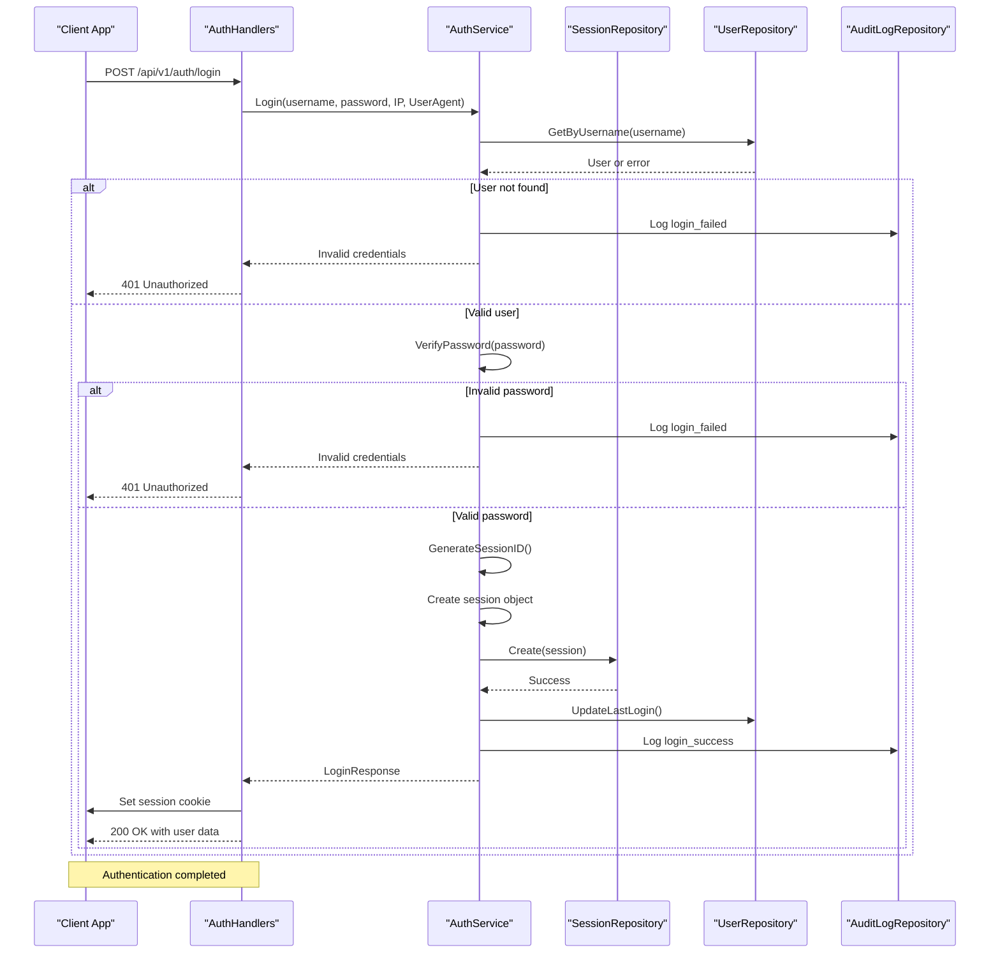
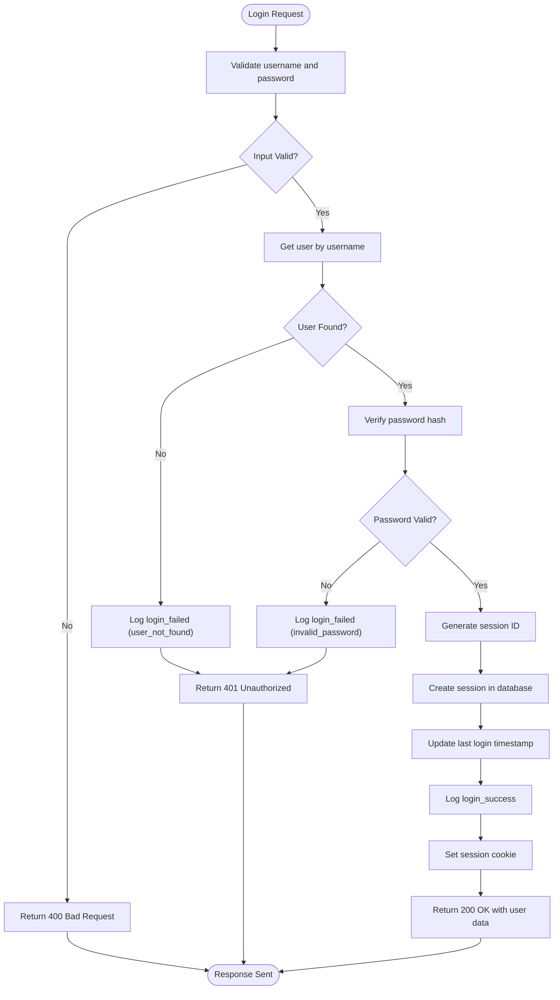

# Authentication Service


## Table of Contents
1. [Introduction](#introduction)
2. [Authentication Flow Overview](#authentication-flow-overview)
3. [Login Endpoint Implementation](#login-endpoint-implementation)
4. [Session Management](#session-management)
5. [Authentication Middleware](#authentication-middleware)
6. [Security Measures](#security-measures)
7. [Password Hashing](#password-hashing)
8. [Integration with API Server](#integration-with-api-server)
9. [Audit Logging](#audit-logging)
10. [Example Requests and Responses](#example-requests-and-responses)

## Introduction
The Authentication Service provides secure user authentication and session management for the Exim-Pilot application. It implements a server-side session-based authentication system using secure cookies, with comprehensive security measures and audit logging. This document details the implementation of the authentication system, including the login flow, session management, security headers, and integration with other components.

## Authentication Flow Overview
The authentication system follows a standard server-side session management pattern. Users authenticate with their username and password, and upon successful verification, receive a session cookie that grants access to protected resources. The system uses database-stored sessions with expiration and provides mechanisms for session validation and cleanup.





**Diagram sources**
- [service.go](file://internal/auth/service.go#L25-L85)
- [auth_handlers.go](file://internal/api/auth_handlers.go#L48-L100)

**Section sources**
- [service.go](file://internal/auth/service.go#L25-L85)
- [auth_handlers.go](file://internal/api/auth_handlers.go#L48-L100)

## Login Endpoint Implementation
The login endpoint handles user authentication by validating credentials and creating a session upon successful authentication. The implementation includes input validation, credential verification, session creation, and appropriate response handling.

### Credential Verification Process
The credential verification process follows these steps:
1. Validate that both username and password are provided
2. Retrieve the user record from the database using the username
3. Compare the provided password with the stored hash using bcrypt
4. Create a session upon successful authentication
5. Update the user's last login timestamp
6. Return appropriate response with session information





**Diagram sources**
- [auth_handlers.go](file://internal/api/auth_handlers.go#L0-L51)
- [service.go](file://internal/auth/service.go#L25-L85)

**Section sources**
- [auth_handlers.go](file://internal/api/auth_handlers.go#L0-L51)
- [service.go](file://internal/auth/service.go#L25-L85)

## Session Management
The session management system handles the creation, validation, and expiration of user sessions. Sessions are stored in the database with expiration timestamps and are validated on each request to protected endpoints.

### Session Creation and Storage
When a user successfully authenticates, a cryptographically secure session ID is generated and stored in the database along with user information and metadata.


```go
// Session creation in service.go
sessionID, err := generateSessionID()
if err != nil {
    return nil, fmt.Errorf("failed to generate session ID: %w", err)
}

expiresAt := time.Now().Add(24 * time.Hour) // 24 hour session
session := &database.Session{
    ID:        sessionID,
    UserID:    user.ID,
    ExpiresAt: expiresAt,
    IPAddress: &ipAddress,
    UserAgent: &userAgent,
}

if err := s.sessionRepo.Create(session); err != nil {
    return nil, fmt.Errorf("failed to create session: %w", err)
}
```


### Session Validation
The system validates sessions by checking the session ID against the database and ensuring the session has not expired.


```go
// Session validation in service.go
func (s *Service) ValidateSession(sessionID string) (*database.User, error) {
    // Get session
    session, err := s.sessionRepo.GetByID(sessionID)
    if err != nil {
        return nil, fmt.Errorf("invalid session")
    }

    // Get user
    user, err := s.userRepo.GetByID(session.UserID)
    if err != nil {
        return nil, fmt.Errorf("user not found")
    }

    return user, nil
}
```


### Session Expiration and Cleanup
Sessions have a 24-hour expiration period. The system includes a cleanup mechanism to remove expired sessions from the database.


```mermaid
classDiagram
class Session {
+string ID
+int64 UserID
+time.Time ExpiresAt
+*string IPAddress
+*string UserAgent
+time.Time CreatedAt
+time.Time UpdatedAt
}
class SessionRepository {
+Create(session *Session) error
+GetByID(id string) (*Session, error)
+Delete(id string) error
+DeleteExpired() (int64, error)
+DeleteByUserID(userID int64) error
}
class Database {
+Exec(query string, args ...interface{}) (Result, error)
+QueryRow(query string, args ...interface{}) *Row
}
SessionRepository --> Database : "uses"
SessionRepository --> Session : "manages"
```


**Diagram sources**
- [service.go](file://internal/auth/service.go#L84-L135)
- [repository.go](file://internal/database/repository.go#L1505-L1601)
- [schema.go](file://internal/database/schema.go#L169-L194)

**Section sources**
- [service.go](file://internal/auth/service.go#L84-L135)
- [repository.go](file://internal/database/repository.go#L1505-L1601)
- [schema.go](file://internal/database/schema.go#L169-L194)

## Authentication Middleware
The authentication middleware enforces authentication on protected routes and extracts user context for downstream handlers. It intercepts requests to protected endpoints and validates the session before allowing access.

### Middleware Implementation
The middleware checks for a valid session cookie and validates the session with the authentication service.


```go
// authMiddleware in server.go
func (s *Server) authMiddleware(next http.Handler) http.Handler {
    return http.HandlerFunc(func(w http.ResponseWriter, r *http.Request) {
        // Get session ID from cookie
        cookie, err := r.Cookie("session_id")
        if err != nil {
            WriteJSONResponse(w, http.StatusUnauthorized, APIResponse{
                Success: false,
                Error:   "Authentication required",
            })
            return
        }

        // Validate session
        user, err := s.authService.ValidateSession(cookie.Value)
        if err != nil {
            WriteJSONResponse(w, http.StatusUnauthorized, APIResponse{
                Success: false,
                Error:   "Invalid or expired session",
            })
            return
        }

        // Add user to request context
        ctx := context.WithValue(r.Context(), userContextKey, user)
        
        // Call the next handler
        next.ServeHTTP(w, r.WithContext(ctx))
    })
}
```


### Protected Route Configuration
The server configuration defines which routes require authentication by applying the auth middleware to a protected subrouter.


```go
// setupRoutes in server.go
protected := api.PathPrefix("").Subrouter()
protected.Use(s.authMiddleware)

// Protected routes
protected.HandleFunc("/auth/logout", authHandlers.handleLogout).Methods("POST")
protected.HandleFunc("/auth/me", authHandlers.handleMe).Methods("GET")
```


**Section sources**
- [server.go](file://internal/api/server.go#L100-L120)
- [middleware.go](file://internal/api/middleware.go#L100-L150)

## Security Measures
The authentication system implements multiple security measures to protect against common vulnerabilities and ensure the integrity of the authentication process.

### Security Headers
The system applies security headers to all responses to mitigate various web-based attacks.


```go
// securityHeadersMiddleware in middleware.go
w.Header().Set("X-Content-Type-Options", "nosniff")
w.Header().Set("X-Frame-Options", "DENY")
w.Header().Set("X-XSS-Protection", "1; mode=block")
w.Header().Set("Referrer-Policy", "strict-origin-when-cross-origin")
w.Header().Set("Content-Security-Policy", "default-src 'self'; script-src 'self' 'unsafe-inline'; style-src 'self' 'unsafe-inline'")
w.Header().Set("Server", "Exim-Pilot")
```


### Session Security
Session cookies are configured with security attributes to prevent client-side access and ensure transmission only over secure connections when available.


```go
// Session cookie in auth_handlers.go
cookie := &http.Cookie{
    Name:     "session_id",
    Value:    loginResp.SessionID,
    Expires:  loginResp.ExpiresAt,
    HttpOnly: true,
    Secure:   r.TLS != nil, // Only secure if HTTPS
    SameSite: http.SameSiteStrictMode,
    Path:     "/",
}
```


**Section sources**
- [middleware.go](file://internal/api/middleware.go#L223-L262)
- [auth_handlers.go](file://internal/api/auth_handlers.go#L48-L100)

## Password Hashing
The system uses bcrypt for password hashing, providing strong protection against password cracking attacks.

### Hashing Implementation
Passwords are hashed using bcrypt with the default cost factor when users are created or passwords are updated.


```go
// Password hashing in service.go
hashedPassword, err := bcrypt.GenerateFromPassword([]byte(password), bcrypt.DefaultCost)
if err != nil {
    return nil, fmt.Errorf("failed to hash password: %w", err)
}

user := &database.User{
    Username:     username,
    PasswordHash: string(hashedPassword),
    // ... other fields
}
```


### Password Verification
During login, the system verifies passwords by comparing the provided password with the stored hash using bcrypt's comparison function.


```go
// Password verification in service.go
if err := bcrypt.CompareHashAndPassword([]byte(user.PasswordHash), []byte(password)); err != nil {
    // Log failed login attempt
    s.auditRepo.Create(&database.AuditLog{
        Action:    "login_failed",
        UserID:    &userIDStr,
        Details:   stringPtr(`{"reason": "invalid_password"}`),
        IPAddress: &ipAddress,
    })
    return nil, fmt.Errorf("invalid credentials")
}
```


**Section sources**
- [service.go](file://internal/auth/service.go#L25-L85)

## Integration with API Server
The authentication service is integrated with the API server through handlers and middleware, providing a seamless authentication experience across the application.

### Handler Registration
The authentication handlers are registered with the API server during setup, connecting the authentication endpoints to the service implementation.


```go
// setupRoutes in server.go
authHandlers := NewAuthHandlers(s.authService)
api.HandleFunc("/auth/login", authHandlers.handleLogin).Methods("POST")
protected.HandleFunc("/auth/logout", authHandlers.handleLogout).Methods("POST")
protected.HandleFunc("/auth/me", authHandlers.handleMe).Methods("GET")
```


### Service Initialization
The authentication service is initialized with database repositories during server startup, establishing the dependency chain.


```go
// NewServer in server.go
s.authService = auth.NewService(db)
```


**Section sources**
- [server.go](file://internal/api/server.go#L50-L120)
- [auth_handlers.go](file://internal/api/auth_handlers.go#L0-L51)

## Audit Logging
The authentication system integrates with the audit logging service to record all authentication events, providing a complete audit trail for security monitoring.

### Authentication Event Logging
All authentication attempts, both successful and failed, are logged with relevant details.


```go
// Successful login logging in service.go
s.auditRepo.Create(&database.AuditLog{
    Action:    "login_success",
    UserID:    &userIDStr,
    Details:   stringPtr(fmt.Sprintf(`{"session_id": "%s"}`, sessionID)),
    IPAddress: &ipAddress,
})

// Failed login logging in service.go
s.auditRepo.Create(&database.AuditLog{
    Action:    "login_failed",
    UserID:    &userIDStr,
    Details:   stringPtr(`{"reason": "invalid_password"}`),
    IPAddress: &ipAddress,
})
```


### Logout Event Logging
Logout events are also recorded in the audit log, capturing the session ID and user information.


```go
// Logout logging in service.go
s.auditRepo.Create(&database.AuditLog{
    Action:    "logout",
    UserID:    &userIDStr,
    Details:   stringPtr(fmt.Sprintf(`{"session_id": "%s"}`, sessionID)),
    IPAddress: &ipAddress,
})
```


**Section sources**
- [service.go](file://internal/auth/service.go#L25-L135)
- [audit/service.go](file://internal/audit/service.go#L150-L186)

## Example Requests and Responses
This section provides examples of authentication requests and responses to illustrate the API usage.

### Login Request

```http
POST /api/v1/auth/login HTTP/1.1
Content-Type: application/json
Host: exim-pilot.example.com

{
    "username": "admin",
    "password": "securepassword123"
}
```


### Successful Login Response

```http
HTTP/1.1 200 OK
Content-Type: application/json
Set-Cookie: session_id=abc123def456...; Expires=Wed, 21 Oct 2023 07:28:00 GMT; HttpOnly; Secure; SameSite=Strict; Path=/

{
    "success": true,
    "data": {
        "user": {
            "id": 1,
            "username": "admin",
            "email": "admin@example.com",
            "full_name": "Administrator",
            "is_active": true,
            "created_at": "2023-10-20T07:28:00Z",
            "updated_at": "2023-10-20T07:28:00Z"
        },
        "expires_at": "2023-10-21T07:28:00Z"
    }
}
```


### Failed Login Response

```http
HTTP/1.1 401 Unauthorized
Content-Type: application/json

{
    "success": false,
    "error": "Invalid credentials"
}
```


### Logout Request

```http
POST /api/v1/auth/logout HTTP/1.1
Cookie: session_id=abc123def456...
Host: exim-pilot.example.com
```


### Logout Response

```http
HTTP/1.1 200 OK
Content-Type: application/json

{
    "success": true
}
```


**Section sources**
- [auth_handlers.go](file://internal/api/auth_handlers.go#L48-L100)
- [service.go](file://internal/auth/service.go#L25-L85)

**Referenced Files in This Document**   
- [service.go](file://internal/auth/service.go)
- [auth_handlers.go](file://internal/api/auth_handlers.go)
- [server.go](file://internal/api/server.go)
- [middleware.go](file://internal/api/middleware.go)
- [repository.go](file://internal/database/repository.go)
- [schema.go](file://internal/database/schema.go)
- [models.go](file://internal/database/models.go)