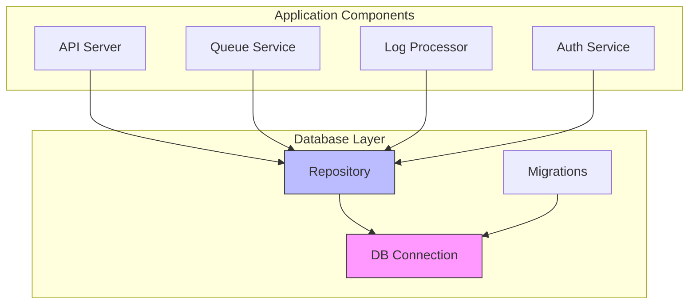

# Connection Management


## Table of Contents
1. [Introduction](#introduction)
2. [Connection Initialization](#connection-initialization)
3. [Configuration Parameters](#configuration-parameters)
4. [Connection Pool Management](#connection-pool-management)
5. [Health Checking and Error Handling](#health-checking-and-error-handling)
6. [Lifecycle and Graceful Shutdown](#lifecycle-and-graceful-shutdown)
7. [Testing and Resilience](#testing-and-resilience)
8. [Architecture Overview](#architecture-overview)

## Introduction
The Exim-Pilot system implements a robust SQLite database connection management system that ensures reliable data access throughout the application lifecycle. This documentation details the initialization, configuration, and maintenance of database connections, with a focus on connection pooling, error handling, and performance optimization. The system uses a singleton pattern for connection management and integrates comprehensive health checking and graceful shutdown procedures.

## Connection Initialization
Database connection initialization occurs during application startup in the main entry point. The system creates a database configuration from the loaded configuration file and establishes a connection using the `database.Connect()` function.


```go
// Create database config from main config
dbConfig := &database.Config{
    Path:            cfg.Database.Path,
    MaxOpenConns:    cfg.Database.MaxOpenConns,
    MaxIdleConns:    cfg.Database.MaxIdleConns,
    ConnMaxLifetime: cfg.GetDatabaseConnMaxLifetime(),
}

// Connect to database
db, err := database.Connect(dbConfig)
if err != nil {
    log.Fatalf("Failed to connect to database: %v", err)
}
defer db.Close()
```


The connection process includes creating the database directory if it doesn't exist and handling migration commands before establishing the main application flow. The connection is established before other services start, ensuring data availability for the entire system.

**Section sources**
- [main.go](file://cmd/exim-pilot/main.go#L52-L78)

## Configuration Parameters
The database connection behavior is controlled by parameters defined in the configuration file, which can be overridden by environment variables. These parameters affect connection pooling, performance, and reliability.

**Database Configuration Parameters**
- **path**: Database file path (default: "data/exim-pilot.db")
- **max_open_conns**: Maximum open database connections (default: 25)
- **max_idle_conns**: Maximum idle database connections (default: 5)
- **conn_max_lifetime**: Connection lifetime in minutes (default: 5)
- **backup_enabled**: Enable automatic database backups (default: true)
- **backup_interval**: Backup interval in hours (default: 24)

The configuration also supports environment variable overrides:
- `EXIM_PILOT_DB_PATH` - Override database path
- Other environment variables can override specific configuration values as needed

**Section sources**
- [config.example.yaml](file://config/config.example.yaml#L19-L25)

## Connection Pool Management
The system implements connection pooling through the `database.DB` struct, which wraps the standard `sql.DB` connection pool with additional metadata.


```go
type DB struct {
    *sql.DB
    path string
}
```


The connection pool is configured with the following parameters from the configuration:


```go
// Configure connection pool
sqlDB.SetMaxOpenConns(config.MaxOpenConns)
sqlDB.SetMaxIdleConns(config.MaxIdleConns)
sqlDB.SetConnMaxLifetime(config.ConnMaxLifetime)
```


**Connection Pool Settings**
- **Maximum Open Connections**: Controls the total number of connections, both in use and idle, that the pool can have. Higher values allow more concurrent operations but consume more system resources.
- **Maximum Idle Connections**: Specifies the maximum number of idle connections in the pool. Idle connections are kept alive for reuse, reducing connection establishment overhead.
- **Connection Maximum Lifetime**: Defines how long a connection can remain open before being closed and replaced. This helps prevent issues with stale connections and database server resource exhaustion.

The default configuration allows 25 open connections with 5 idle connections, providing a balance between performance and resource usage. Connections are automatically closed after 5 minutes to prevent resource leaks.

**Section sources**
- [connection.go](file://internal/database/connection.go#L12-L15)
- [connection.go](file://internal/database/connection.go#L52-L55)

## Health Checking and Error Handling
The system implements comprehensive health checking and error handling during connection establishment and operation.

### Connection Health Verification
During connection initialization, the system performs a ping test to verify database connectivity:


```go
// Test the connection
if err := sqlDB.Ping(); err != nil {
    sqlDB.Close()
    return nil, fmt.Errorf("failed to ping database: %w", err)
}
```


This ensures that the database is accessible and responsive before the application proceeds with initialization.

### Error Handling Strategy
The error handling approach includes:
1. Immediate connection closure on failure
2. Detailed error wrapping with context
3. Graceful application termination with descriptive error messages
4. Resource cleanup through deferred closure

The system also implements health checking through the API endpoint:


```go
func (s *Server) handleHealth(w http.ResponseWriter, r *http.Request) {
    response := APIResponse{
        Success: true,
        Data: map[string]interface{}{
            "status":    "healthy",
            "timestamp": time.Now().UTC(),
            "version":   "1.0.0",
        },
    }
    WriteJSONResponse(w, http.StatusOK, response)
}
```


**Section sources**
- [connection.go](file://internal/database/connection.go#L57-L60)
- [server.go](file://internal/api/server.go#L268-L274)

## Lifecycle and Graceful Shutdown
The database connection lifecycle is carefully managed throughout the application runtime, with proper initialization and graceful shutdown procedures.

### Application Startup Sequence
1. Load configuration from file
2. Initialize embedded assets
3. Create database configuration
4. Ensure database directory exists
5. Establish database connection
6. Run migrations
7. Initialize repositories and services
8. Start API server

### Graceful Shutdown Process
The system implements a graceful shutdown mechanism that handles interrupt signals and ensures proper cleanup:


```go
// Wait for interrupt signal to gracefully shutdown
quit := make(chan os.Signal, 1)
signal.Notify(quit, syscall.SIGINT, syscall.SIGTERM)
<-quit

log.Println("Shutting down server...")

// Create a context with timeout for graceful shutdown
ctx, cancel := context.WithTimeout(context.Background(), 30*time.Second)
defer cancel()

if err := server.Stop(ctx); err != nil {
    log.Fatalf("Server forced to shutdown: %v", err)
}
```


The database connection is automatically closed through the `defer db.Close()` statement in the main function, ensuring proper resource cleanup even if the application terminates unexpectedly.

**Section sources**
- [main.go](file://cmd/exim-pilot/main.go#L100-L135)

## Testing and Resilience
The system includes comprehensive testing for connection resilience and failure recovery.

### Unit Testing
The connection package includes unit tests that verify connection functionality:


```go
func TestConnect(t *testing.T) {
    // Use a temporary database file
    dbPath := "test_connection.db"
    defer os.Remove(dbPath)

    config := &Config{
        Path:            dbPath,
        MaxOpenConns:    5,
        MaxIdleConns:    2,
        ConnMaxLifetime: time.Minute,
    }

    db, err := Connect(config)
    if err != nil {
        t.Fatalf("Failed to connect to database: %v", err)
    }
    defer db.Close()

    // Test that we can ping the database
    if err := db.Ping(); err != nil {
        t.Fatalf("Failed to ping database: %v", err)
    }
}
```


The tests cover:
- Successful connection establishment
- Connection with default configuration
- Connection with nil configuration (uses defaults)
- Connection health verification
- Proper cleanup of temporary database files

### Resilience Features
The system implements several resilience features:
- Automatic retry of failed operations through the repository layer
- Connection validation through periodic pings
- Graceful degradation when database is unavailable
- Comprehensive error logging for troubleshooting

**Section sources**
- [connection_test.go](file://internal/database/connection_test.go#L4-L62)

## Architecture Overview
The database connection management system is integrated into the overall application architecture, providing a centralized point of access for all components.





**Diagram sources**
- [connection.go](file://internal/database/connection.go#L12-L15)
- [repository.go](file://internal/database/repository.go#L6-L12)

**Section sources**
- [main.go](file://cmd/exim-pilot/main.go#L52-L78)
- [connection.go](file://internal/database/connection.go#L12-L15)

**Referenced Files in This Document**   
- [main.go](file://cmd/exim-pilot/main.go)
- [connection.go](file://internal/database/connection.go)
- [connection_test.go](file://internal/database/connection_test.go)
- [config.example.yaml](file://config/config.example.yaml)
- [migrations.go](file://internal/database/migrations.go)
- [server.go](file://internal/api/server.go)