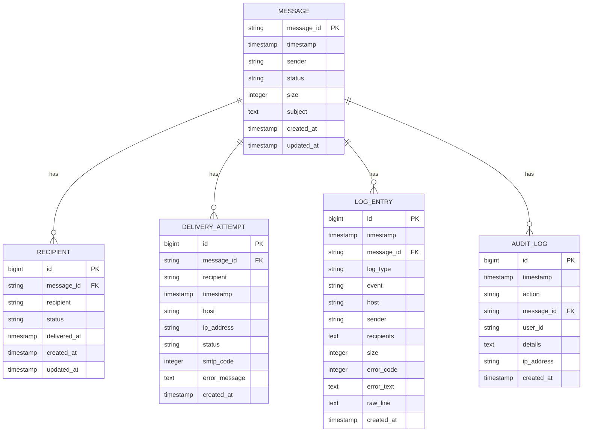

# Schema Design

## Table of Contents
1. [Introduction](#introduction)
2. [Core Entities](#core-entities)
3. [Entity Relationships](#entity-relationships)
4. [Data Model Diagram](#data-model-diagram)
5. [Field Definitions and Constraints](#field-definitions-and-constraints)
6. [Indexing Strategy](#indexing-strategy)
7. [Data Validation Rules](#data-validation-rules)
8. [Schema Evolution and Versioning](#schema-evolution-and-versioning)
9. [Denormalization for Performance](#denormalization-for-performance)
10. [Conclusion](#conclusion)

## Introduction
This document provides comprehensive data model documentation for the Exim-Pilot database schema. The system is designed to track email message delivery, recipients, delivery attempts, log entries, and audit trails. The schema supports message tracing, delivery analytics, and operational monitoring for an Exim-based email infrastructure. This documentation details all core entities, their relationships, constraints, and performance considerations.

## Core Entities
The database schema consists of several core entities that work together to provide complete message delivery tracking and analysis capabilities.

### Message Entity
The **Message** entity represents an individual email message in the system. It contains metadata about the message including timestamps, sender information, status, and size.

### Recipient Entity
The **Recipient** entity tracks individual recipients of a message. Each message can have multiple recipients, and each recipient has a delivery status and timestamp.

### DeliveryAttempt Entity
The **DeliveryAttempt** entity records each attempt to deliver a message to a recipient. This includes connection details, SMTP responses, and error information.

### LogEntry Entity
The **LogEntry** entity captures raw log data from the Exim mail server. These entries are parsed and correlated with messages to provide detailed delivery context.

### AuditLog Entity
The **AuditLog** entity maintains a record of administrative actions taken on messages, such as manual delivery triggers, freezing, thawing, or deletion.

**Section sources**
- [models.go](file://internal/database/models.go#L1-L100)

## Entity Relationships
The data model establishes clear relationships between core entities to support comprehensive message tracing and analysis.

### Message-Recipient Relationship
A message can have multiple recipients, establishing a one-to-many relationship. This relationship is enforced through the `message_id` foreign key in the recipients table.

### Message-DeliveryAttempt Relationship
Each message can have multiple delivery attempts across all its recipients. The delivery_attempts table contains a `message_id` field that references the parent message.

### Message-LogEntry Relationship
Log entries are correlated with messages through the `message_id` field. Multiple log entries can be associated with a single message, creating a one-to-many relationship.

### Message-AuditLog Relationship
Administrative actions on messages are recorded in the audit_log table, which includes an optional `message_id` field to link audit entries to specific messages.

### Recipient-DeliveryAttempt Relationship
Delivery attempts are associated with specific recipients through the `recipient` field, allowing the system to track delivery progress for each individual recipient.

**Section sources**
- [repository.go](file://internal/database/repository.go#L200-L400)
- [models.go](file://internal/database/models.go#L156-L166)

## Data Model Diagram

**Diagram sources**
- [models.go](file://internal/database/models.go#L1-L142)
- [repository.go](file://internal/database/repository.go#L200-L1602)

## Field Definitions and Constraints
This section details the field definitions, data types, primary/foreign keys, and constraints for each table in the schema.

### Message Table
**Label Structure Requirements:**
- **message_id**: string, Primary Key, Not Null
- **timestamp**: timestamp, Not Null
- **sender**: string, Not Null
- **status**: string, Not Null (values: "pending", "delivered", "bounced", "deferred")
- **size**: integer, Not Null
- **subject**: text
- **created_at**: timestamp, Not Null
- **updated_at**: timestamp, Not Null

Primary Key: message_id  
Indexes: created_at (for time-based queries)

### Recipient Table
**Label Structure Requirements:**
- **id**: bigint, Primary Key, Auto-increment
- **message_id**: string, Foreign Key → Message.message_id, Not Null
- **recipient**: string, Not Null
- **status**: string, Not Null (values: "pending", "delivered", "bounced", "deferred")
- **delivered_at**: timestamp
- **created_at**: timestamp, Not Null
- **updated_at**: timestamp, Not Null

Primary Key: id  
Foreign Key: message_id references Message(message_id)  
Indexes: message_id (for message-based queries), recipient (for recipient searches)

### DeliveryAttempt Table
**Label Structure Requirements:**
- **id**: bigint, Primary Key, Auto-increment
- **message_id**: string, Foreign Key → Message.message_id, Not Null
- **recipient**: string, Not Null
- **timestamp**: timestamp, Not Null
- **host**: string
- **ip_address**: string
- **status**: string, Not Null (values: "success", "bounce", "defer", "timeout")
- **smtp_code**: integer
- **error_message**: text
- **created_at**: timestamp, Not Null

Primary Key: id  
Foreign Key: message_id references Message(message_id)  
Indexes: message_id (for message-based queries), timestamp (for chronological analysis)

### LogEntry Table
**Label Structure Requirements:**
- **id**: bigint, Primary Key, Auto-increment
- **timestamp**: timestamp, Not Null
- **message_id**: string, Foreign Key → Message.message_id, Not Null
- **log_type**: string, Not Null (values: "main", "reject", "panic")
- **event**: string, Not Null (values: "arrival", "delivery", "defer", "bounce", "reject")
- **host**: string
- **sender**: string
- **recipients**: text (JSON array)
- **size**: integer
- **error_code**: integer
- **error_text**: text
- **raw_line**: text, Not Null
- **created_at**: timestamp, Not Null

Primary Key: id  
Foreign Key: message_id references Message(message_id)  
Indexes: message_id (for message correlation), timestamp (for time-based queries), event (for event type filtering)

### AuditLog Table
**Label Structure Requirements:**
- **id**: bigint, Primary Key, Auto-increment
- **timestamp**: timestamp, Not Null
- **action**: string, Not Null (values: "deliver_now", "freeze", "thaw", "delete")
- **message_id**: string, Foreign Key → Message.message_id
- **user_id**: string
- **details**: text (JSON format)
- **ip_address**: string
- **created_at**: timestamp, Not Null

Primary Key: id  
Foreign Key: message_id references Message(message_id)  
Indexes: message_id (for message audit trails), timestamp (for chronological analysis), action (for action type filtering)

**Section sources**
- [models.go](file://internal/database/models.go#L1-L142)
- [repository.go](file://internal/database/repository.go#L200-L1602)

## Indexing Strategy
The schema employs a targeted indexing strategy to optimize query performance for common access patterns.

### Primary Indexes
Each table has appropriate primary keys:
- Message: message_id (string)
- Recipient: id (bigint, auto-increment)
- DeliveryAttempt: id (bigint, auto-increment)
- LogEntry: id (bigint, auto-increment)
- AuditLog: id (bigint, auto-increment)

### Foreign Key Indexes
All foreign key columns are indexed to optimize join operations:
- Recipient.message_id
- DeliveryAttempt.message_id  
- LogEntry.message_id
- AuditLog.message_id

### Query Optimization Indexes
Additional indexes support common query patterns:
- Message.created_at: For time-based message retrieval
- Recipient.recipient: For recipient-based searches
- DeliveryAttempt.timestamp: For chronological delivery analysis
- LogEntry.timestamp: For log timeline queries
- LogEntry.event: For filtering by event type
- AuditLog.timestamp: For audit trail chronological ordering
- AuditLog.action: For filtering by action type

The indexing strategy balances query performance with write overhead, focusing on the most common read patterns in the application.

**Section sources**
- [repository.go](file://internal/database/repository.go#L400-L600)
- [schema.go](file://internal/database/schema.go#L1-L50)

## Data Validation Rules
The schema enforces data integrity through a combination of database constraints and application-level validation.

### Schema-Level Constraints
- NOT NULL constraints on critical fields to ensure data completeness
- Foreign key constraints to maintain referential integrity
- Appropriate data types to prevent invalid data storage
- Timestamp fields with automatic defaults where applicable

### Business Logic Validation
Application code enforces additional validation rules:

#### Message Validation
- Message ID format validation (must match Exim message ID pattern)
- Sender email format validation
- Status field restricted to predefined values
- Size must be non-negative

#### Recipient Validation
- Email address format validation
- Status field restricted to predefined values ("pending", "delivered", "bounced", "deferred")
- Delivered_at timestamp must be after message timestamp if set

#### DeliveryAttempt Validation
- Status field restricted to predefined values ("success", "bounce", "defer", "timeout")
- SMTP code must be valid three-digit number if present
- Timestamp must be reasonable (not in distant past or future)

#### LogEntry Validation
- Event type restricted to predefined values
- Raw line must not be empty
- Recipients stored as valid JSON array
- Error code must be valid if present

#### AuditLog Validation
- Action type restricted to predefined values
- Timestamp must be current or recent
- Details stored as valid JSON if present

These validation rules ensure data consistency and prevent invalid states in the system.

**Section sources**
- [repository.go](file://internal/database/repository.go#L200-L1602)
- [models.go](file://internal/database/models.go#L1-L142)

## Schema Evolution and Versioning
The system employs a structured approach to schema evolution and versioning to support safe database changes.

### Migration Strategy
Database migrations are managed through code-based migration scripts that:
- Are versioned and stored in source control
- Follow incremental version numbering
- Include both upgrade and downgrade operations
- Are tested in development and staging environments before production deployment

### Backward Compatibility
Schema changes maintain backward compatibility through:
- Additive changes (adding columns, tables) preferred over destructive changes
- Deprecation period for removed fields before actual removal
- Application code that handles both old and new schema versions during transition

### Version Tracking
The system tracks schema version in a dedicated table:
- Current schema version is stored and checked at application startup
- Migration scripts are executed in order to bring the database to the required version
- Rollback procedures are defined for each migration

### Change Process
Schema changes follow a formal process:
1. Design review of proposed changes
2. Impact analysis on existing queries and reports
3. Migration script development and testing
4. Staging deployment and validation
5. Production deployment during maintenance window
6. Post-deployment verification

This approach ensures reliable schema evolution with minimal risk to data integrity.

**Section sources**
- [migrations.go](file://internal/database/migrations.go#L1-L100)
- [repository.go](file://internal/database/repository.go#L1-L50)

## Denormalization for Performance
The schema incorporates strategic denormalization to optimize query performance for critical use cases.

### Recipients in LogEntry
The **LogEntry** table includes a **recipients** field that stores recipient information as a JSON array, even though recipients are also stored in the normalized **Recipient** table.

**Rationale:**
- Enables complete log entry retrieval without joins
- Supports fast text search across recipient addresses
- Preserves original recipient data as it appeared in the log
- Reduces query complexity for log analysis operations

### Message Correlation Fields
Several tables include direct references to messages beyond the standard foreign key:

**DeliveryAttempt** includes:
- message_id: Direct reference to parent message
- recipient: Recipient address (denormalized from Recipient table)

**Rationale:**
- Enables direct message-based queries without joins
- Supports efficient delivery attempt analysis by message
- Facilitates message trace generation with minimal queries

### Timestamp Redundancy
Multiple timestamp fields are maintained for performance:

**LogEntry** includes:
- timestamp: Event timestamp from log
- created_at: Record creation timestamp

**Rationale:**
- Separates event time from record creation time
- Enables accurate time-based analysis of delivery events
- Supports audit and debugging of data ingestion process

### Pre-calculated Fields
The **MessageTraceRepository** generates pre-calculated views:

**MessageDeliveryTrace** includes:
- Summary statistics (delivered count, deferred count, etc.)
- Delivery timeline with formatted events
- Retry schedule with estimated times

**Rationale:**
- Reduces computational overhead on each request
- Provides consistent formatting across the application
- Enables fast rendering of complex message trace views

These denormalization choices significantly improve query performance for the most common operations while maintaining data integrity through application logic.

**Section sources**
- [repository.go](file://internal/database/repository.go#L600-L1602)
- [models.go](file://internal/database/models.go#L156-L166)

## Conclusion
The Exim-Pilot database schema is designed to provide comprehensive message delivery tracking with optimal query performance. The data model establishes clear relationships between messages, recipients, delivery attempts, log entries, and audit logs, enabling detailed message tracing and analysis. Strategic denormalization and indexing support fast queries for critical use cases, while validation rules and constraints ensure data integrity. The schema evolution strategy allows for safe and reliable changes over time. This design effectively supports the system's goals of providing visibility into email delivery operations and enabling rapid troubleshooting of delivery issues.

**Referenced Files in This Document**   
- [models.go](file://internal/database/models.go#L1-L200)
- [repository.go](file://internal/database/repository.go#L200-L1602)
- [schema.go](file://internal/database/schema.go#L1-L50)