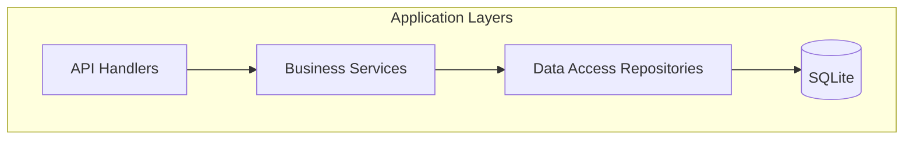
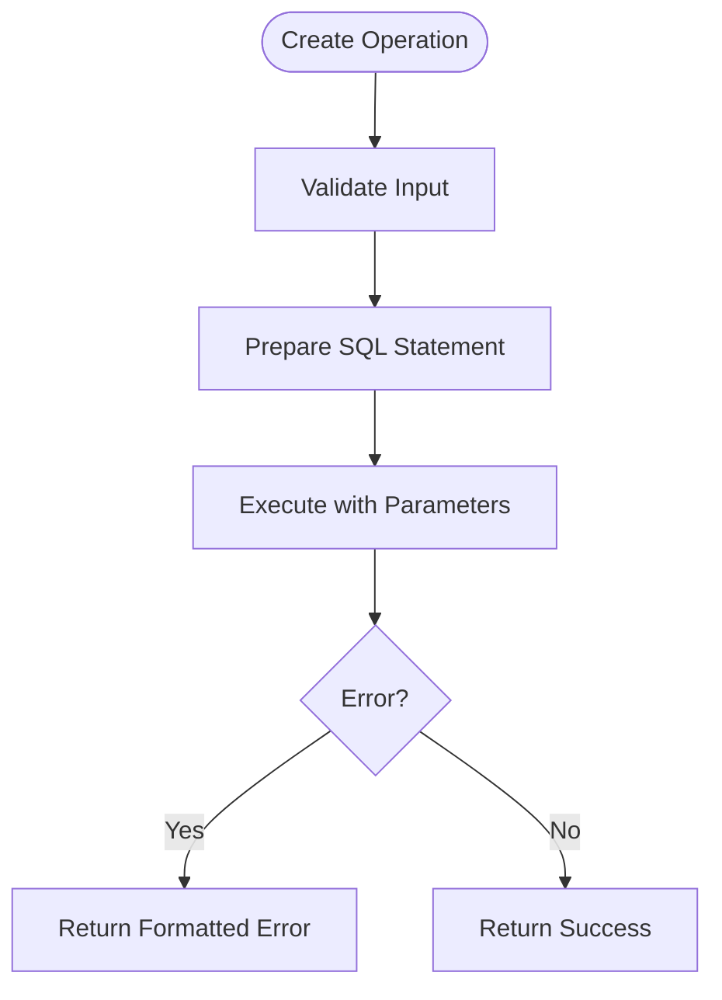
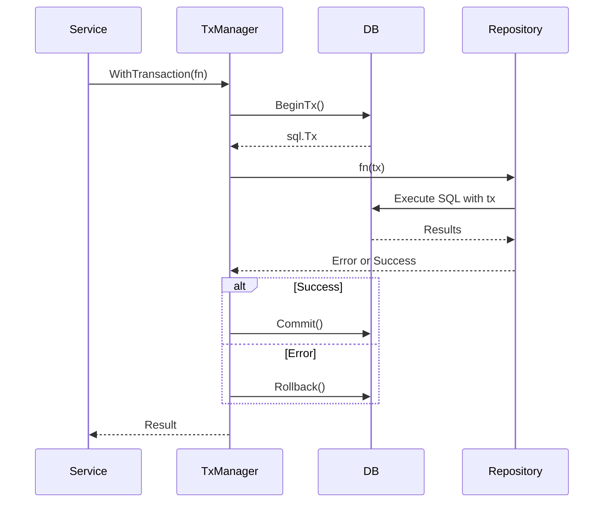

# Repository Pattern Implementation


## Table of Contents
1. [Introduction](#introduction)
2. [Project Structure](#project-structure)
3. [Core Components](#core-components)
4. [Architecture Overview](#architecture-overview)
5. [Detailed Component Analysis](#detailed-component-analysis)
6. [Transaction Management](#transaction-management)
7. [CRUD Operations and Batch Processing](#crud-operations-and-batch-processing)
8. [Query Composition and Data Consistency](#query-composition-and-data-consistency)
9. [Error Handling and Retry Mechanisms](#error-handling-and-retry-mechanisms)
10. [Extending the Repository and Performance Best Practices](#extending-the-repository-and-performance-best-practices)

## Introduction
The repository pattern in the Exim-Pilot system provides a clean abstraction layer between the application services and the underlying database. This documentation details how the repository encapsulates data access logic, supports transaction management, and enables consistent CRUD operations across various domain entities such as messages, recipients, and audit logs. The implementation ensures data integrity through atomic transactions and provides extensible interfaces for future enhancements.

## Project Structure
The project follows a layered architecture with clear separation of concerns. The `internal/database` package contains the core repository implementations, while service layers in other packages interact with these repositories to perform business operations. Key directories include:
- `cmd/`: Application entry points
- `internal/api/`: HTTP handlers and routing
- `internal/database/`: Data access layer including repositories and transaction management
- `internal/queue/`: Queue operation logic that uses repositories for persistence





**Diagram sources**
- [repository.go](file://internal/database/repository.go#L1-L300)
- [operations.go](file://internal/queue/operations.go#L1-L432)

**Section sources**
- [repository.go](file://internal/database/repository.go#L1-L300)
- [operations.go](file://internal/queue/operations.go#L1-L432)

## Core Components
The core components of the repository pattern implementation include:
- **Repository Interfaces**: Define standard CRUD operations for entities like Message, Recipient, and AuditLog
- **DB Wrapper**: Enhances `sql.DB` with additional utilities and connection configuration
- **Transaction Manager**: Coordinates transaction lifecycle with automatic rollback on error
- **Model Structures**: Define schema-mapped structs used throughout the data layer

These components work together to provide a consistent, testable, and maintainable data access strategy.

**Section sources**
- [repository.go](file://internal/database/repository.go#L1-L300)
- [models.go](file://internal/database/models.go#L1-L100)
- [connection.go](file://internal/database/connection.go#L1-L90)

## Architecture Overview
The repository pattern abstracts SQL operations behind Go interfaces, allowing services to interact with data without direct SQL knowledge. Each entity has its own repository (e.g., `MessageRepository`, `RecipientRepository`) that implements type-specific operations while sharing common patterns for error handling and transaction integration.


```mermaid
classDiagram
class Repository {
+GetDB() *DB
+CreateAuditLog(entry *AuditLog) error
+GetAuditLogs(filters interface{}) ([]*AuditLog, error)
}
class MessageRepository {
+Create(msg *Message) error
+GetByID(id string) (*Message, error)
+Update(msg *Message) error
+Delete(id string) error
+List(limit, offset int, status string) ([]Message, error)
+Count(status string) (int, error)
}
class RecipientRepository {
+Create(recipient *Recipient) error
+GetByMessageID(messageID string) ([]Recipient, error)
+Update(recipient *Recipient) error
}
class DeliveryAttemptRepository {
+Create(attempt *DeliveryAttempt) error
}
class TxRepository {
+tx *sql.Tx
}
Repository <|-- MessageRepository
Repository <|-- RecipientRepository
Repository <|-- DeliveryAttemptRepository
TxRepository <|-- MessageRepository
TxRepository <|-- RecipientRepository
```


**Diagram sources**
- [repository.go](file://internal/database/repository.go#L1-L300)
- [models.go](file://internal/database/models.go#L1-L100)

## Detailed Component Analysis

### Repository Pattern Implementation
The repository pattern is implemented through struct embedding and interface composition. The base `Repository` struct holds a database connection, while specialized repositories embed this base and add entity-specific methods.


```go
type Repository struct {
	db *DB
}

type MessageRepository struct {
	*Repository
}
```


This design allows shared functionality (like connection access) while enabling type-specific operations.

**Section sources**
- [repository.go](file://internal/database/repository.go#L1-L300)

#### CRUD Operations
The repository implements standard CRUD operations with consistent error handling and SQL parameterization to prevent injection attacks.





**Diagram sources**
- [repository.go](file://internal/database/repository.go#L75-L133)

### Transaction Management
The transaction system uses a functional approach where operations are passed as callbacks to ensure proper resource cleanup.





**Diagram sources**
- [transaction.go](file://internal/database/transaction.go#L1-L56)
- [repository.go](file://internal/database/repository.go#L1-L300)

## Transaction Management
The `TxManager` struct provides a `WithTransaction` method that accepts a function performing database operations. This method ensures that transactions are automatically committed on success or rolled back on error, including during panics via defer and recover.

Nested transactions are not supported in SQLite, so the implementation does not attempt to handle them. All operations within a transaction use the same `*sql.Tx` instance, ensuring isolation at the serializable level provided by SQLite.

Rollback strategies include:
- Immediate rollback on any error returned by the transaction function
- Panic recovery with rollback to maintain data consistency
- Error wrapping to preserve context while allowing caller inspection

**Section sources**
- [transaction.go](file://internal/database/transaction.go#L1-L56)
- [repository.go](file://internal/database/repository.go#L1-L300)

## CRUD Operations and Batch Processing
Common CRUD operations follow a consistent pattern across repositories:

- **Create**: Inserts a single record using parameterized queries
- **GetByID**: Retrieves a single entity by primary key
- **Update**: Modifies an existing record with optimistic concurrency
- **Delete**: Removes a record by ID
- **List**: Paginated retrieval with optional filtering
- **Count**: Returns total count for a given filter

Batch processing is implemented through bulk operations in the queue manager, which processes multiple message IDs and aggregates results:


```go
func (m *Manager) performBulkOperation(
    messageIDs []string,
    operation string,
    userID string,
    ipAddress string,
    operationFunc func(string, string, string) (*OperationResult, error),
) (*BulkOperationResult, error) {
    // Process each message and aggregate results
}
```


This pattern allows efficient processing while maintaining individual operation tracking.

**Section sources**
- [repository.go](file://internal/database/repository.go#L30-L299)
- [operations.go](file://internal/queue/operations.go#L300-L432)

## Query Composition and Data Consistency
Query composition follows a simple parameter-based approach rather than complex builder patterns. Filters are passed as interface{} and handled within repository methods with type assertions.

Data consistency is maintained through:
- Foreign key constraints enabled in SQLite
- Atomic transactions for related operations
- Audit logging of all queue operations
- Validation before database operations

For example, when updating message status, the system ensures referential integrity by validating message existence before update and logging the change in the audit trail.

**Section sources**
- [repository.go](file://internal/database/repository.go#L1-L300)
- [operations.go](file://internal/queue/operations.go#L1-L432)

## Error Handling and Retry Mechanisms
The repository implements robust error handling with:
- Wrapped errors using `%w` verb for context preservation
- Specific error types for different failure modes
- Non-fatal handling of audit logging failures
- Graceful degradation when database is unavailable

Retry mechanisms are not built into the repository layer but are handled at the service level. The system distinguishes between transient errors (which may warrant retry) and permanent errors (which should not be retried).

In the queue operations, if an audit log write fails, the primary operation still succeeds, ensuring that operational functionality is not blocked by logging issues.

**Section sources**
- [repository.go](file://internal/database/repository.go#L1-L300)
- [operations.go](file://internal/queue/operations.go#L1-L432)

## Extending the Repository and Performance Best Practices
To extend the repository with new query methods:
1. Add the method to the appropriate repository struct
2. Implement using parameterized queries
3. Ensure proper error wrapping
4. Add transaction support via `TxRepository` when needed

Performance best practices include:
- Using connection pooling with appropriate limits
- Employing WAL mode for SQLite to improve concurrency
- Implementing pagination for large result sets
- Avoiding N+1 query patterns through batch loading
- Monitoring query performance and adding indexes as needed

The current implementation already uses WAL mode (`_journal_mode=WAL`) and connection pooling with configurable limits, providing a solid foundation for performance at scale.

**Section sources**
- [connection.go](file://internal/database/connection.go#L1-L90)
- [repository.go](file://internal/database/repository.go#L1-L300)
- [transaction.go](file://internal/database/transaction.go#L1-L56)

**Referenced Files in This Document**   
- [repository.go](file://internal/database/repository.go#L1-L300)
- [transaction.go](file://internal/database/transaction.go#L1-L56)
- [connection.go](file://internal/database/connection.go#L1-L90)
- [operations.go](file://internal/queue/operations.go#L1-L432)
- [models.go](file://internal/database/models.go#L1-L100)