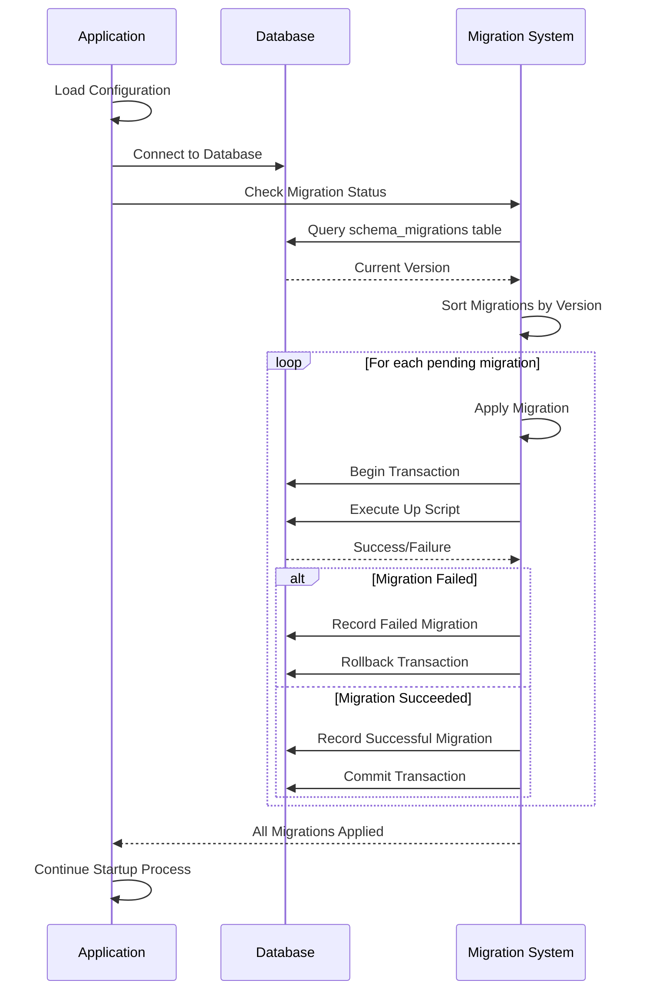
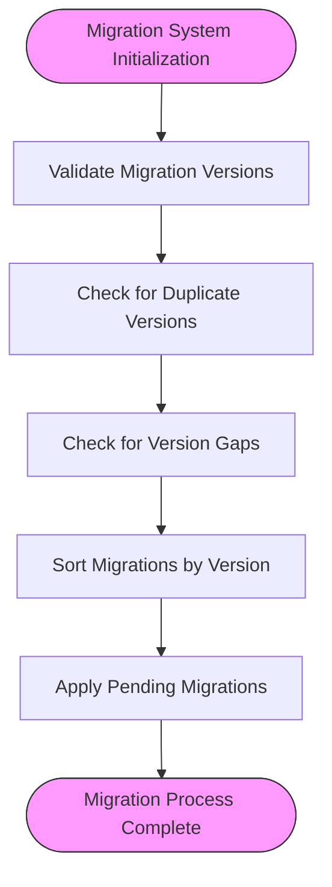
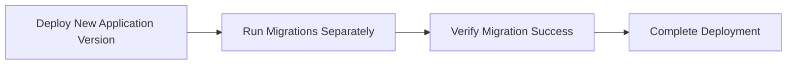

# Migrations System


## Table of Contents
1. [Introduction](#introduction)
2. [Migration Execution Process](#migration-execution-process)
3. [Migration Structure and Versioning](#migration-structure-and-versioning)
4. [Idempotency and Rollback Prevention](#idempotency-and-rollback-prevention)
5. [Schema Evolution Examples](#schema-evolution-examples)
6. [Testing Methodology](#testing-methodology)
7. [Zero-Downtime Deployment and Backup Requirements](#zero-downtime-deployment-and-backup-requirements)

## Introduction
The Migrations System in the Exim-Pilot application manages database schema changes through versioned migration scripts. These embedded scripts ensure consistent database state across deployments and environments. The system applies schema changes during application startup, tracks migration status, and provides tools for managing migrations. This documentation details the architecture, execution process, and best practices for the migration system.

## Migration Execution Process

The migration system executes during application startup to ensure the database schema is up-to-date before the application begins normal operations. The process is triggered in the main application entry point and follows a well-defined sequence.





**Diagram sources**
- [main.go](file://cmd/exim-pilot/main.go#L50-L97)
- [migrations.go](file://internal/database/migrations.go#L387-L441)

**Section sources**
- [main.go](file://cmd/exim-pilot/main.go#L50-L97)
- [migrations.go](file://internal/database/migrations.go#L387-L441)

## Migration Structure and Versioning

Migrations are defined as embedded Go structures within the `migrations.go` file, with each migration containing a version number, description, and SQL scripts for both forward (Up) and backward (Down) operations.

### Migration File Structure
Each migration follows a consistent structure with the following fields:

- **Version**: Integer representing the migration sequence
- **Description**: Human-readable description of the migration purpose
- **Up**: SQL script to apply the migration
- **Down**: SQL script to roll back the migration


```go
{
    Version:     2,
    Description: "Add indexes for performance",
    Up: `
CREATE INDEX IF NOT EXISTS idx_messages_timestamp ON messages(timestamp);
CREATE INDEX IF NOT EXISTS idx_messages_status ON messages(status);
-- Additional index creation statements
`,
    Down: `
DROP INDEX IF EXISTS idx_messages_timestamp;
DROP INDEX IF EXISTS idx_messages_status;
-- Additional index drop statements
`
}
```


### Naming Conventions and Dependencies
The system uses sequential integer versioning starting from 1, with no gaps allowed between versions. Migrations are applied in ascending order of version numbers, and the system validates that there are no duplicate versions or version gaps.





**Diagram sources**
- [migrations.go](file://internal/database/migrations.go#L649-L697)

**Section sources**
- [migrations.go](file://internal/database/migrations.go#L649-L697)

## Idempotency and Rollback Prevention

The migration system ensures idempotency through several mechanisms, preventing the same migration from being applied multiple times and ensuring data consistency.

### Idempotency Guarantees
The system tracks applied migrations in the `schema_migrations` table, which records each migration version and its success status. Before applying a migration, the system checks the current database version and only applies migrations with higher version numbers.


```go
// Get current version from database
currentVersion, err := getCurrentVersion(db)
if err != nil {
    return fmt.Errorf("failed to get current version: %w", err)
}

// Only apply migrations with version > currentVersion
for _, migration := range migrations {
    if migration.Version <= currentVersion {
        continue
    }
    // Apply migration
}
```


### Transaction Safety
Each migration is applied within a database transaction, ensuring atomicity. If any statement in the migration fails, the entire transaction is rolled back, leaving the database in its previous state.


```mermaid
sequenceDiagram
participant Migration as Migration System
participant DB as Database
Migration->>DB : Begin Transaction
loop For each SQL statement
Migration->>DB : Execute Statement
alt Statement Fails
DB-->>Migration : Error Response
Migration->>DB : Rollback Transaction
Migration->>DB : Record Failed Migration
break Migration Process
end
end
Migration->>DB : Record Successful Migration
Migration->>DB : Commit Transaction
```


**Diagram sources**
- [migrations.go](file://internal/database/migrations.go#L609-L654)

**Section sources**
- [migrations.go](file://internal/database/migrations.go#L609-L654)

## Schema Evolution Examples

The migration system has been used to evolve the database schema through several versions, demonstrating various types of schema changes.

### Adding Indexes for Performance
Migration version 2 added multiple indexes to improve query performance across key tables:


```sql
-- Indexes for messages table
CREATE INDEX IF NOT EXISTS idx_messages_timestamp ON messages(timestamp);
CREATE INDEX IF NOT EXISTS idx_messages_status ON messages(status);
CREATE INDEX IF NOT EXISTS idx_messages_sender ON messages(sender);

-- Indexes for recipients table
CREATE INDEX IF NOT EXISTS idx_recipients_message_id ON recipients(message_id);
CREATE INDEX IF NOT EXISTS idx_recipients_status ON recipients(status);
```


### Adding New Tables for Enhanced Functionality
Migration version 3 introduced new tables for message notes and tags, enabling operators to add troubleshooting notes and categorize messages:


```sql
-- Message notes table for operator notes
CREATE TABLE IF NOT EXISTS message_notes (
    id INTEGER PRIMARY KEY AUTOINCREMENT,
    message_id TEXT NOT NULL,
    user_id INTEGER NOT NULL,
    note TEXT NOT NULL,
    created_at DATETIME DEFAULT CURRENT_TIMESTAMP,
    FOREIGN KEY (message_id) REFERENCES messages(id),
    FOREIGN KEY (user_id) REFERENCES users(id)
);

-- Message tags table for categorization
CREATE TABLE IF NOT EXISTS message_tags (
    id INTEGER PRIMARY KEY AUTOINCREMENT,
    message_id TEXT NOT NULL,
    tag TEXT NOT NULL,
    user_id INTEGER NOT NULL,
    created_at DATETIME DEFAULT CURRENT_TIMESTAMP,
    FOREIGN KEY (message_id) REFERENCES messages(id),
    FOREIGN KEY (user_id) REFERENCES users(id)
);
```


### Modifying Existing Tables
Migration version 5 added a `created_at` column to the `audit_log` table to track when records were created:


```sql
-- Add created_at column to audit_log table
ALTER TABLE audit_log ADD COLUMN created_at DATETIME DEFAULT CURRENT_TIMESTAMP;

-- Update existing records to have created_at = timestamp
UPDATE audit_log SET created_at = timestamp WHERE created_at IS NULL;
```


**Section sources**
- [migrations.go](file://internal/database/migrations.go#L0-L732)

## Testing Methodology

The migration system includes comprehensive testing to ensure migration safety and data integrity preservation.

### Unit Testing Strategy
The system uses Go testing framework to validate migration functionality, with tests covering:

- Migration table initialization
- Individual migration application
- Batch migration processing
- Database initialization


```go
func TestApplyMigration(t *testing.T) {
    // Setup test database
    dbPath := "test_apply_migration.db"
    defer os.Remove(dbPath)
    
    config := &Config{Path: dbPath}
    db, err := Connect(config)
    if err != nil {
        t.Fatalf("Failed to connect to database: %v", err)
    }
    defer db.Close()
    
    // Initialize migration system
    manager := NewMigrationManager(db)
    if err := manager.InitMigrationTable(); err != nil {
        t.Fatalf("Failed to initialize migration table: %v", err)
    }
    
    // Define test migration
    migration := Migration{
        Version:     1,
        Description: "Test migration",
        Up:          "CREATE TABLE test_table (id INTEGER PRIMARY KEY);",
        Down:        "DROP TABLE test_table;",
    }
    
    // Apply migration
    if err := manager.ApplyMigration(migration); err != nil {
        t.Fatalf("Failed to apply migration: %v", err)
    }
    
    // Verify migration was recorded
    appliedVersions, err := manager.GetAppliedMigrations()
    if err != nil {
        t.Fatalf("Failed to get applied migrations: %v", err)
    }
    
    if len(appliedVersions) != 1 || appliedVersions[0] != 1 {
        t.Errorf("Expected migration version 1 to be applied, got %v", appliedVersions)
    }
    
    // Verify table was created
    var count int
    err = db.QueryRow("SELECT COUNT(*) FROM sqlite_master WHERE type='table' AND name='test_table'").Scan(&count)
    if err != nil {
        t.Fatalf("Failed to query for test table: %v", err)
    }
    
    if count != 1 {
        t.Errorf("Expected 1 test table, got %d", count)
    }
}
```


### Data Integrity Verification
Tests verify data integrity by:
1. Checking that migration records are properly stored
2. Verifying that database objects (tables, indexes) are created as expected
3. Confirming that data persists through migration operations
4. Validating that rollback operations properly remove database objects

**Section sources**
- [migrations_test.go](file://internal/database/migrations_test.go#L0-L190)

## Zero-Downtime Deployment and Backup Requirements

The migration system supports zero-downtime deployment considerations and includes backup requirements to ensure data safety.

### Zero-Downtime Deployment Considerations
While the codebase does not explicitly document zero-downtime deployment strategies, the migration design supports this goal through:

- Idempotent migration operations that can be safely retried
- Transactional execution that prevents partial schema changes
- Sequential versioning that ensures consistent application of changes
- The ability to check migration status before applying changes

The external migration tool (`exim-pilot-config`) allows administrators to check migration status and apply migrations independently of application startup, facilitating controlled deployment processes.





### Backup Requirements Before Migrations
The system includes configuration options for automated database backups before migrations, ensuring data protection:


```go
// DatabaseConfig holds database configuration
type DatabaseConfig struct {
    Path            string `yaml:"path" json:"path"`
    MaxOpenConns    int    `yaml:"max_open_conns" json:"max_open_conns"`
    MaxIdleConns    int    `yaml:"max_idle_conns" json:"max_idle_conns"`
    ConnMaxLifetime int    `yaml:"conn_max_lifetime" json:"conn_max_lifetime"`
    BackupEnabled   bool   `yaml:"backup_enabled" json:"backup_enabled"`
    BackupInterval  int    `yaml:"backup_interval" json:"backup_interval"`
    BackupPath      string `yaml:"backup_path" json:"backup_path"`
}
```


Default configuration values:
- **BackupEnabled**: true
- **BackupInterval**: 24 hours
- **BackupPath**: /opt/exim-pilot/backups

These settings ensure that database backups are automatically created, with a default retention of multiple backup files. Administrators should ensure sufficient disk space in the backup path and consider external backup solutions for production environments.

**Section sources**
- [config.go](file://internal/config/config.go#L44-L46)
- [config.go](file://internal/config/config.go#L119)

**Referenced Files in This Document**   
- [main.go](file://cmd/exim-pilot/main.go)
- [migrations.go](file://internal/database/migrations.go)
- [migrations_test.go](file://internal/database/migrations_test.go)
- [config.go](file://internal/config/config.go)
- [main.go](file://cmd/exim-pilot-config/main.go)