# Optimization & Retention


## Table of Contents
1. [Introduction](#introduction)
2. [Indexing Strategy for High-Frequency Queries](#indexing-strategy-for-high-frequency-queries)
3. [Data Retention Policy Implementation](#data-retention-policy-implementation)
4. [Background Jobs for Database Maintenance](#background-jobs-for-database-maintenance)
5. [Query Optimization Techniques](#query-optimization-techniques)
6. [Configuration Options for Tuning](#configuration-options-for-tuning)
7. [Performance Monitoring and Metrics](#performance-monitoring-and-metrics)

## Introduction
This document provides comprehensive documentation for the database optimization and data retention strategies implemented in the Exim-Pilot system. The system uses SQLite as its primary database and implements various optimization techniques to ensure high performance for message tracking, log analysis, and queue management operations. The documentation covers indexing strategies, data retention policies, background maintenance jobs, query optimization techniques, and configuration options for tuning system performance based on workload requirements.

## Indexing Strategy for High-Frequency Queries

The database implements a comprehensive indexing strategy optimized for high-frequency queries on message status, timestamps, and queue positions. The indexing approach combines single-column indexes for individual field filtering with composite indexes for common query patterns.


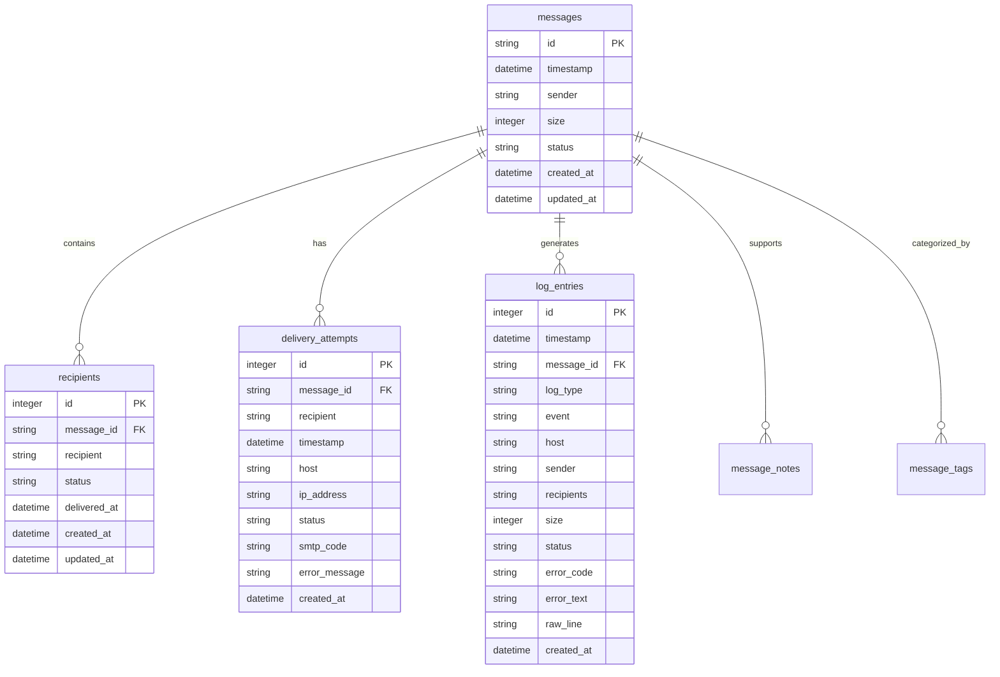


**Diagram sources**
- [schema.go](file://internal/database/schema.go#L1-L195)

### Message Table Indexing
The messages table is optimized with multiple indexes to support various query patterns:


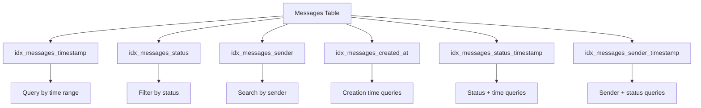


**Diagram sources**
- [schema.go](file://internal/database/schema.go#L74-L85)

The indexing strategy for the messages table includes:
- **Single-column indexes**: Created on timestamp, status, sender, and created_at fields to optimize queries filtering on individual attributes
- **Composite indexes**: Created on (status, timestamp) and (sender, timestamp) to optimize common query patterns that filter by status or sender and sort by timestamp
- **Timestamp optimization**: The idx_messages_timestamp index enables efficient time-based queries for message retrieval and reporting

### Recipients Table Indexing
The recipients table uses indexes optimized for message correlation and status tracking:


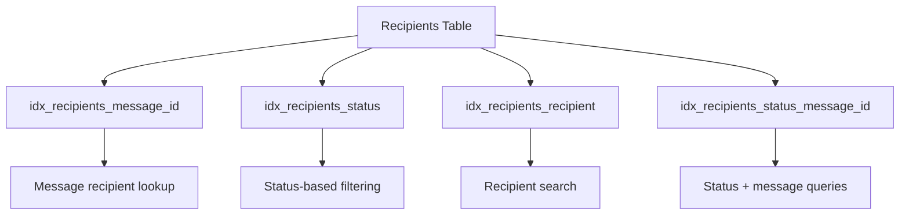


**Diagram sources**
- [schema.go](file://internal/database/schema.go#L86-L91)

Key indexing features for the recipients table:
- **Message ID index**: Enables fast lookup of all recipients for a specific message
- **Status index**: Optimizes queries filtering recipients by delivery status
- **Composite index**: Combines status and message_id for efficient queries that filter by both criteria

### Log Entries Indexing
The log_entries table implements comprehensive indexing for log search and analysis:


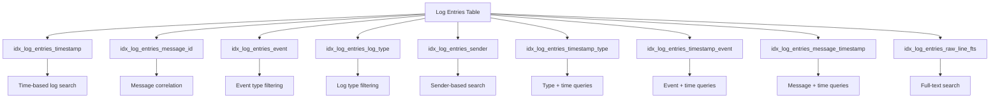


**Diagram sources**
- [schema.go](file://internal/database/schema.go#L97-L114)

The log_entries indexing strategy includes:
- **Timestamp index**: Optimizes time-range queries for log retrieval
- **Message ID index**: Enables correlation of log entries with specific messages
- **Event and log type indexes**: Support filtering by event type and log category
- **Composite indexes**: Combine timestamp with type, event, and message_id for common query patterns
- **Full-text search**: Implements FTS (Full-Text Search) on the raw_line field for text-based log searching

**Section sources**
- [schema.go](file://internal/database/schema.go#L74-L114)

## Data Retention Policy Implementation

The system implements a configurable data retention policy that automatically cleans up expired messages, logs, and audit entries based on predefined retention periods.

### Retention Configuration Structure
The retention policy is defined by the RetentionConfig struct which specifies retention periods for different data types:


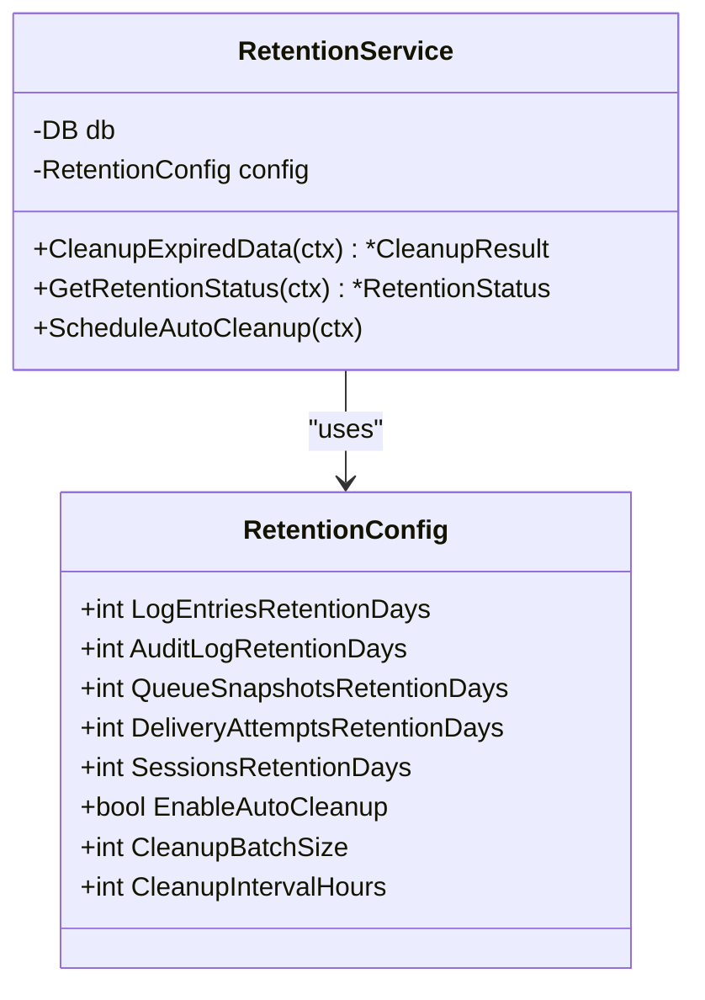


**Diagram sources**
- [retention.go](file://internal/database/retention.go#L10-L27)

The default retention configuration sets the following retention periods:
- **Log entries**: 90 days (3 months)
- **Audit log**: 365 days (1 year)
- **Queue snapshots**: 30 days (1 month)
- **Delivery attempts**: 180 days (6 months)
- **User sessions**: 7 days (1 week)

### Automated Cleanup Process
The automated cleanup process follows a systematic approach to remove expired data while minimizing database impact:


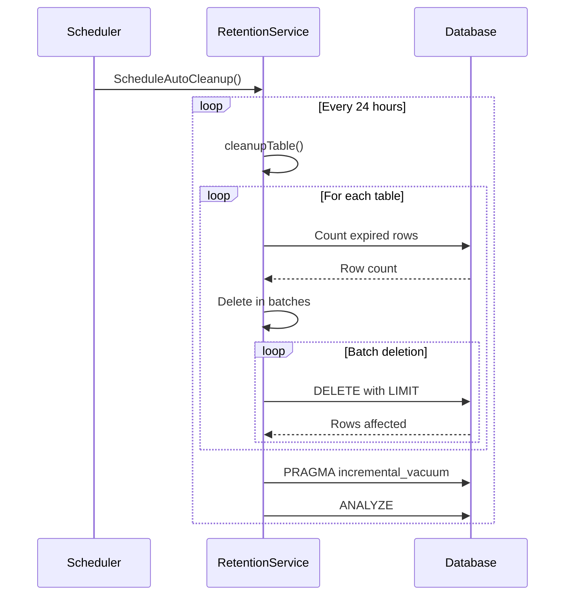


**Diagram sources**
- [retention.go](file://internal/database/retention.go#L100-L359)

The cleanup process includes the following key features:
- **Batch processing**: Deletes data in batches (default 1,000 rows) to avoid long-running transactions and excessive memory usage
- **Progressive deletion**: Uses the rowid to identify and delete specific rows, ensuring consistent batch processing
- **Transaction management**: Each batch deletion occurs within its own transaction to maintain data integrity
- **Inter-batch delays**: Includes a 10ms delay between batches to prevent overwhelming the database

### Cleanup Result Structure
The cleanup operation returns detailed results about the cleanup process:


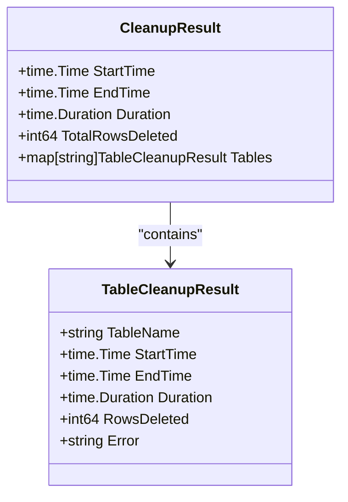


**Diagram sources**
- [retention.go](file://internal/database/retention.go#L300-L320)

**Section sources**
- [retention.go](file://internal/database/retention.go#L10-L359)

## Background Jobs for Database Maintenance

The system implements background jobs for vacuuming, analyzing, and defragmenting the SQLite database to maintain optimal performance.

### Database Optimization Service
The OptimizationService handles periodic database maintenance tasks:


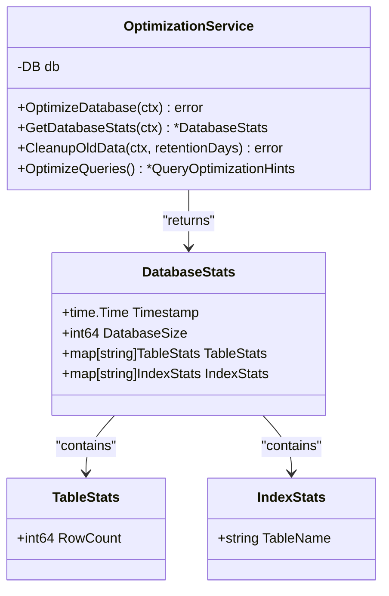


**Diagram sources**
- [optimization.go](file://internal/database/optimization.go#L10-L20)

### Optimization Workflow
The database optimization process follows a specific sequence of operations:


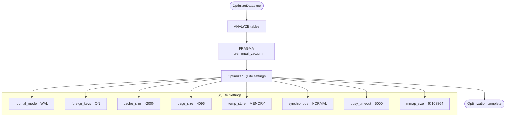


**Diagram sources**
- [optimization.go](file://internal/database/optimization.go#L30-L190)

The optimization workflow includes:
- **ANALYZE command**: Updates table statistics to help the query planner make better decisions
- **Incremental vacuum**: Reclaims unused space and defragments the database file without requiring exclusive access
- **SQLite pragma settings**: Configures optimal settings for performance and reliability

### SQLite Configuration Settings
The system configures SQLite with the following optimized settings:

| Setting | Value | Purpose |
|--------|-------|--------|
| journal_mode | WAL | Improves concurrency and reduces locking |
| foreign_keys | ON | Enforces referential integrity |
| cache_size | -2000 | Sets cache to approximately 2MB |
| page_size | 4096 | Optimizes for typical filesystem block size |
| temp_store | MEMORY | Stores temporary tables in memory |
| synchronous | NORMAL | Balances durability and performance |
| busy_timeout | 5000 | Sets 5-second timeout for busy database |
| mmap_size | 67108864 | Enables 64MB memory mapping for faster access |

**Section sources**
- [optimization.go](file://internal/database/optimization.go#L120-L190)

## Query Optimization Techniques

The system implements several query optimization techniques to improve performance for common operations.

### Optimized Query Patterns
The OptimizationService provides optimized query patterns for different use cases:


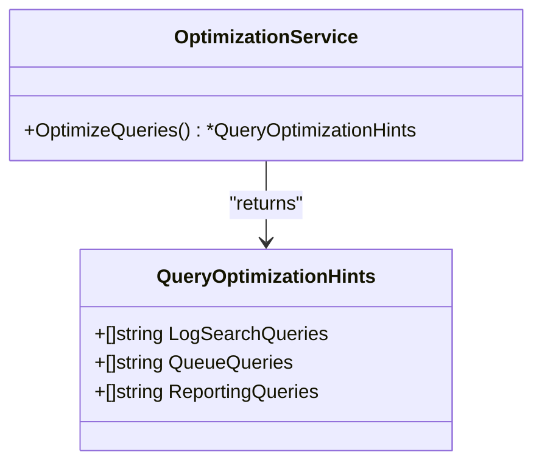


**Diagram sources**
- [optimization.go](file://internal/database/optimization.go#L241-L277)

### Log Search Queries
The system provides optimized queries for log search operations:


```sql
-- Use indexes for timestamp-based queries
SELECT * FROM log_entries 
WHERE timestamp BETWEEN ? AND ? 
ORDER BY timestamp DESC LIMIT ?

-- Use composite indexes for filtered searches
SELECT * FROM log_entries 
WHERE log_type = ? AND timestamp BETWEEN ? AND ? 
ORDER BY timestamp DESC LIMIT ?

-- Use message_id index for message correlation
SELECT * FROM log_entries 
WHERE message_id = ? 
ORDER BY timestamp ASC
```


These queries leverage the appropriate indexes:
- **Timestamp index**: For time-range queries
- **Composite timestamp-type index**: For filtered time-range queries
- **Message ID index**: For message correlation

### Queue Queries
The system optimizes queries for queue management operations:


```sql
-- Use status index for queue filtering
SELECT * FROM messages 
WHERE status IN (?, ?, ?) 
ORDER BY timestamp DESC LIMIT ?

-- Use composite index for sender-based queries
SELECT * FROM messages 
WHERE sender LIKE ? AND status = ? 
ORDER BY timestamp DESC LIMIT ?
```


These queries leverage:
- **Status index**: For filtering messages by status (queued, deferred, frozen)
- **Composite status-timestamp index**: For status filtering with timestamp ordering
- **Composite sender-timestamp index**: For sender-based queries with timestamp ordering

### Reporting Queries
The system provides optimized queries for reporting operations:


```sql
-- Use timestamp indexes for reporting
SELECT DATE(timestamp) as date, COUNT(*) as count 
FROM log_entries 
WHERE timestamp BETWEEN ? AND ? 
GROUP BY DATE(timestamp)

-- Use composite indexes for deliverability reports
SELECT status, COUNT(*) as count 
FROM delivery_attempts 
WHERE timestamp BETWEEN ? AND ? 
GROUP BY status
```


These reporting queries are optimized to:
- **Leverage timestamp indexes**: For efficient time-range filtering
- **Minimize data transfer**: By aggregating at the database level
- **Use appropriate grouping**: To generate summary statistics efficiently

**Section sources**
- [optimization.go](file://internal/database/optimization.go#L209-L277)
- [schema.go](file://internal/database/schema.go#L74-L114)

## Configuration Options for Tuning

The system provides various configuration options for tuning retention periods and optimization schedules based on system load.

### Retention Configuration Options
The RetentionConfig struct exposes several tunable parameters:


```go
type RetentionConfig struct {
    LogEntriesRetentionDays       int  // Days to retain log entries
    AuditLogRetentionDays         int  // Days to retain audit log
    QueueSnapshotsRetentionDays   int  // Days to retain queue snapshots
    DeliveryAttemptsRetentionDays int  // Days to retain delivery attempts
    SessionsRetentionDays         int  // Days to retain user sessions
    EnableAutoCleanup             bool // Whether to enable automatic cleanup
    CleanupBatchSize              int  // Number of rows to delete per batch
    CleanupIntervalHours          int  // Hours between automatic cleanup runs
}
```


These configuration options allow administrators to:
- **Adjust retention periods**: Based on storage capacity and compliance requirements
- **Control cleanup frequency**: Balance between storage reclamation and system load
- **Tune batch size**: Optimize cleanup performance based on available resources

### Database Connection Configuration
The database connection can be tuned through the Config struct:


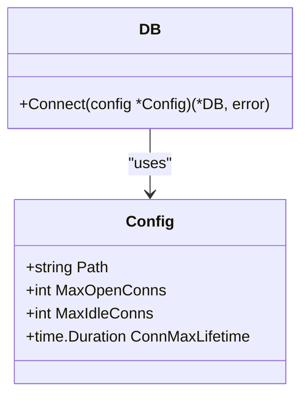


**Diagram sources**
- [connection.go](file://internal/database/connection.go#L10-L27)

The connection configuration options include:
- **MaxOpenConns**: Maximum number of open connections to the database (default: 25)
- **MaxIdleConns**: Maximum number of idle connections in the pool (default: 5)
- **ConnMaxLifetime**: Maximum amount of time a connection may be reused (default: 5 minutes)

### Performance Configuration
The system exposes performance configuration through API endpoints:


```json
{
  "retention": {
    "log_entries_retention_days": 90,
    "audit_log_retention_days": 365,
    "queue_snapshots_retention_days": 30,
    "delivery_attempts_retention_days": 180,
    "sessions_retention_days": 7,
    "enable_auto_cleanup": true,
    "cleanup_batch_size": 1000,
    "cleanup_interval_hours": 24
  },
  "optimization": {
    "auto_optimize_enabled": true,
    "optimization_interval": "24h",
    "vacuum_threshold": "10%",
    "analyze_threshold": "5%"
  },
  "caching": {
    "enabled": true,
    "max_memory": "100MB",
    "ttl": "5m",
    "cleanup_interval": "1h"
  }
}
```


This configuration allows for:
- **Dynamic tuning**: Adjust settings without restarting the application
- **Load-based optimization**: Configure different settings for peak and off-peak hours
- **Resource management**: Balance performance with system resource usage

**Section sources**
- [retention.go](file://internal/database/retention.go#L10-L27)
- [connection.go](file://internal/database/connection.go#L10-L27)
- [performance_handlers.go](file://internal/api/performance_handlers.go#L250-L272)

## Performance Monitoring and Metrics

The system provides comprehensive performance monitoring through API endpoints and metrics collection.

### Database Statistics Collection
The OptimizationService collects detailed database statistics:


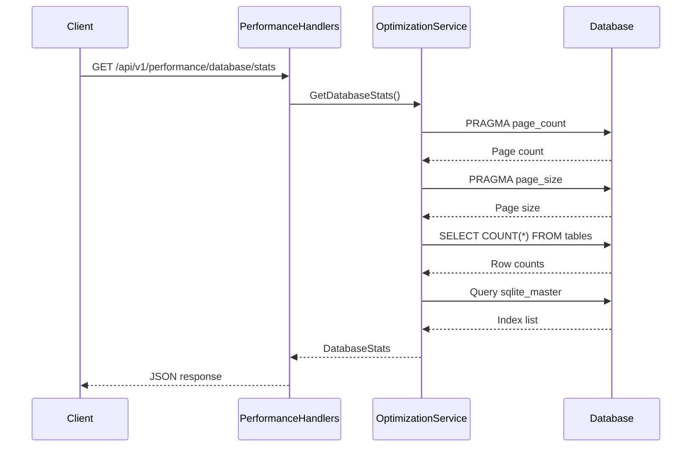


**Diagram sources**
- [optimization.go](file://internal/database/optimization.go#L190-L240)
- [performance_handlers.go](file://internal/api/performance_handlers.go#L40-L50)

The collected metrics include:
- **Database size**: Total size of the database file in bytes
- **Table statistics**: Row count for each major table
- **Index information**: List of all indexes in the database

### Performance Metrics Endpoint
The system combines database and retention metrics into a comprehensive performance endpoint:


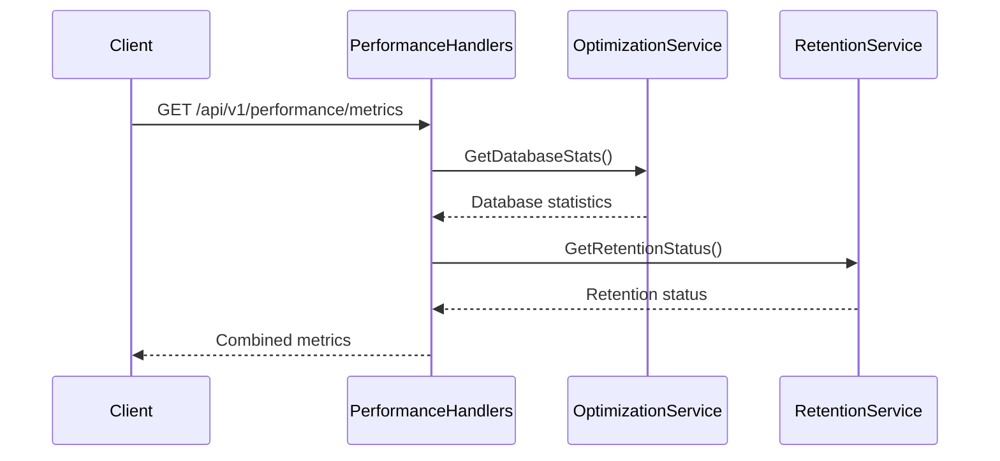


**Diagram sources**
- [performance_handlers.go](file://internal/api/performance_handlers.go#L130-L160)

The performance metrics endpoint returns a comprehensive view of system health, including:
- **Database statistics**: Size, table row counts, and index information
- **Retention status**: Current retention configuration and statistics for each table
- **System timestamp**: When the metrics were collected

### Real-World Usage Patterns
Based on the implementation and API usage patterns, the system demonstrates the following performance characteristics:

- **Index effectiveness**: The comprehensive indexing strategy ensures that high-frequency queries on message status, timestamps, and queue positions execute efficiently
- **Memory efficiency**: The use of incremental vacuum and WAL mode minimizes memory usage during maintenance operations
- **Scalability**: Batch processing of cleanup operations allows the system to handle large datasets without excessive resource consumption
- **Reliability**: The combination of foreign key constraints, transactional integrity, and regular ANALYZE operations ensures data consistency

The system is designed to handle typical email server workloads with thousands of messages per day, maintaining responsive performance for both real-time operations and historical analysis.

**Section sources**
- [optimization.go](file://internal/database/optimization.go#L190-L240)
- [performance_handlers.go](file://internal/api/performance_handlers.go#L40-L160)
- [retention.go](file://internal/database/retention.go#L240-L260)

**Referenced Files in This Document**   
- [optimization.go](file://internal/database/optimization.go)
- [schema.go](file://internal/database/schema.go)
- [retention.go](file://internal/database/retention.go)
- [performance_handlers.go](file://internal/api/performance_handlers.go)
- [connection.go](file://internal/database/connection.go)