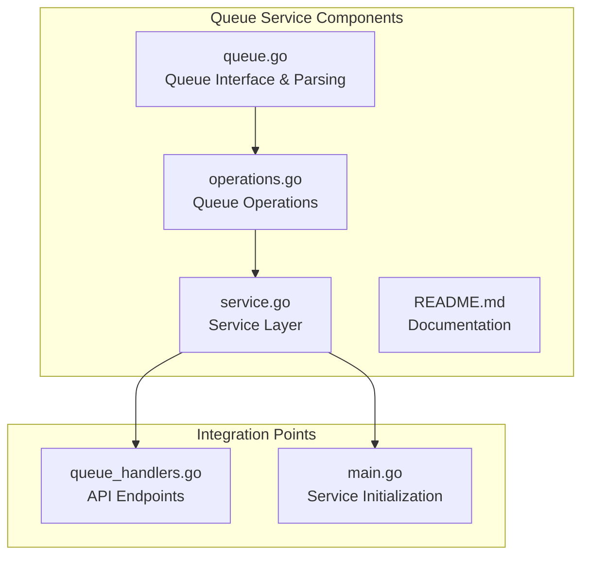
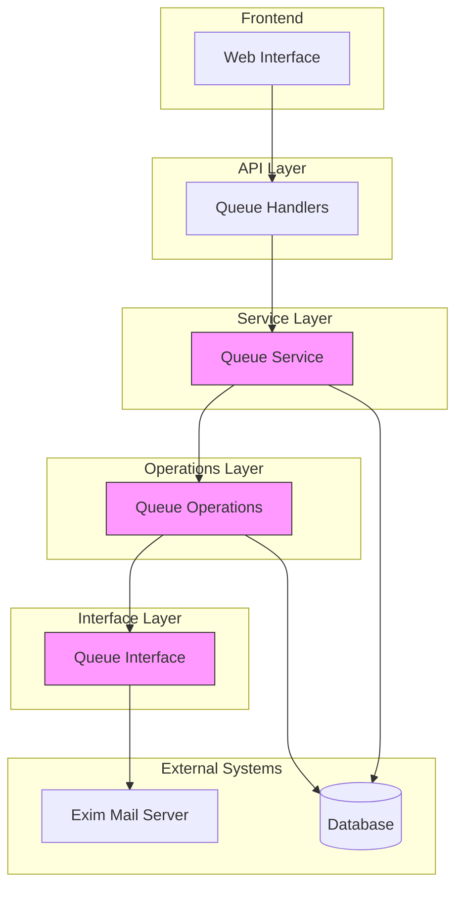
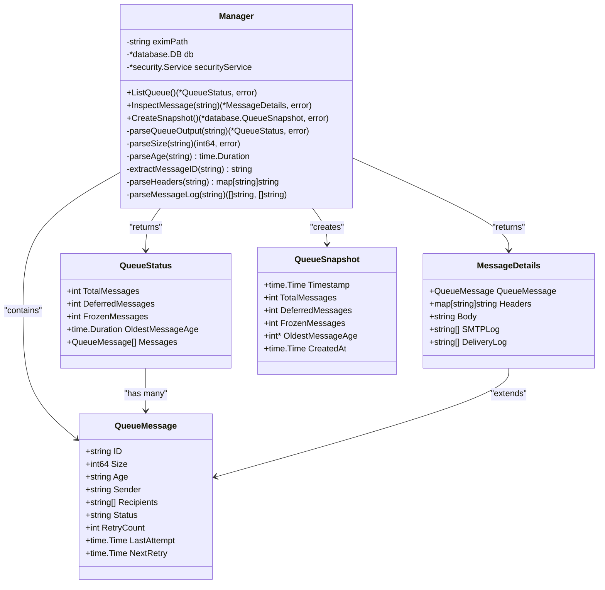
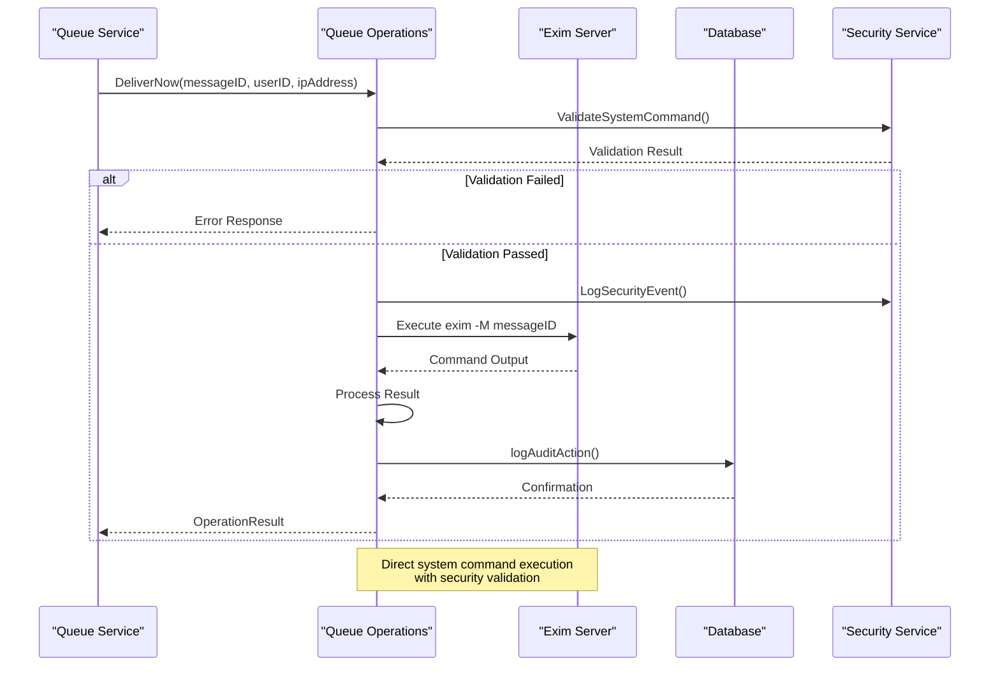
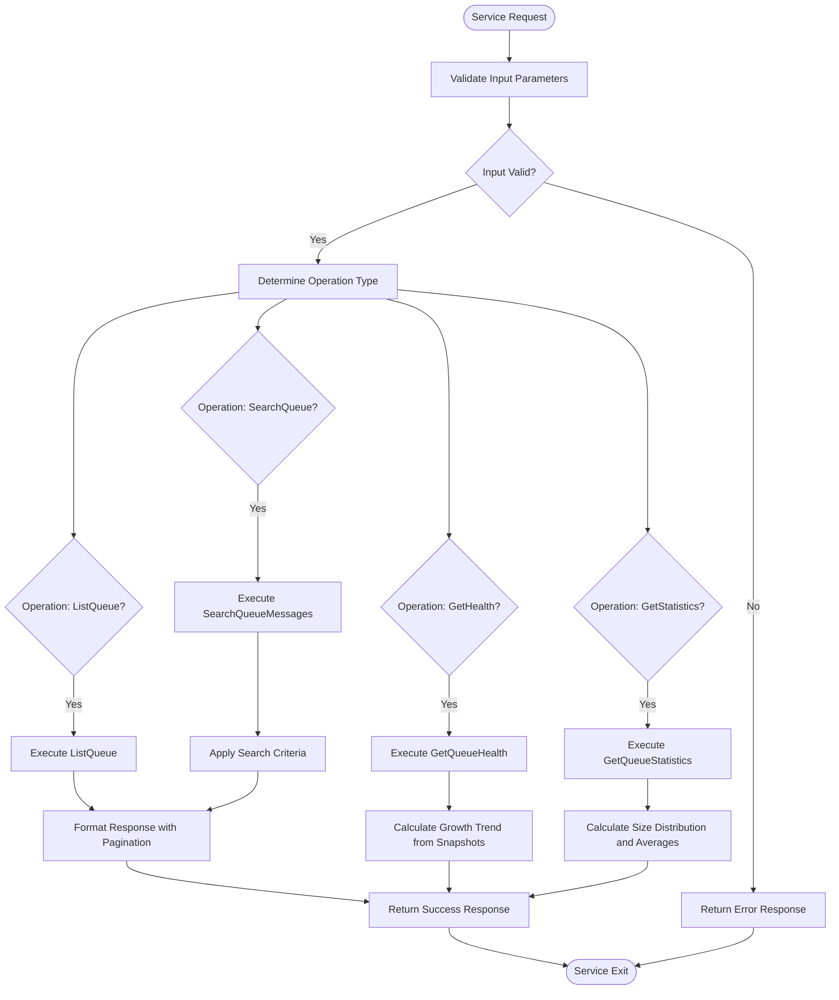
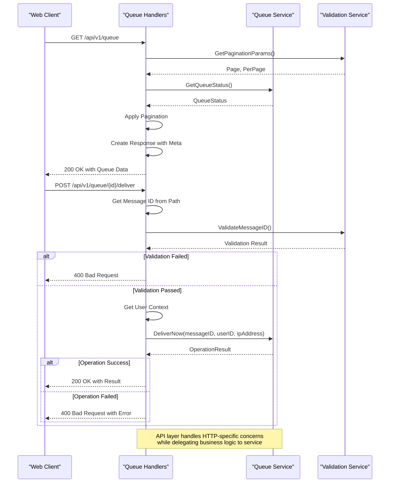
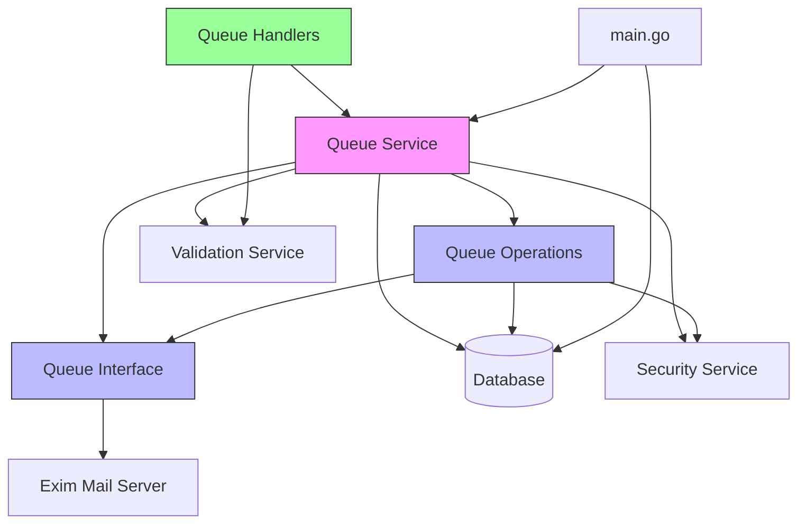

# Queue Service

## Table of Contents
1. [Introduction](#introduction)
2. [Project Structure](#project-structure)
3. [Core Components](#core-components)
4. [Architecture Overview](#architecture-overview)
5. [Detailed Component Analysis](#detailed-component-analysis)
6. [Dependency Analysis](#dependency-analysis)
7. [Performance Considerations](#performance-considerations)
8. [Troubleshooting Guide](#troubleshooting-guide)
9. [Conclusion](#conclusion)

## Introduction
The Queue Service is a critical component of the Exim Control Panel that provides comprehensive management capabilities for the Exim mail server queue. This service enables administrators to monitor, inspect, and manipulate messages in the mail queue through a well-defined API. The service integrates directly with the Exim mail server's spool directory, executing commands to perform operations like delivery, freezing, thawing, and deletion of messages. It also provides advanced features such as message search, health monitoring, and audit logging to ensure reliable and secure queue management.

## Project Structure
The queue service is organized within the internal/queue directory and consists of several key files that implement different aspects of queue management functionality. The structure follows a layered architecture with clear separation between interface, operations, and service layers.

**Diagram sources**
- [queue.go](file://internal/queue/queue.go)
- [operations.go](file://internal/queue/operations.go)
- [service.go](file://internal/queue/service.go)
- [queue_handlers.go](file://internal/api/queue_handlers.go)
- [main.go](file://cmd/exim-pilot/main.go)

**Section sources**
- [queue.go](file://internal/queue/queue.go)
- [operations.go](file://internal/queue/operations.go)
- [service.go](file://internal/queue/service.go)
- [README.md](file://internal/queue/README.md)

## Core Components
The queue service consists of three main components: the queue interface for interacting with Exim, the operations implementation for executing queue commands, and the service layer that provides a high-level API. These components work together to provide a robust queue management system that abstracts the complexity of direct Exim command execution.

**Section sources**
- [queue.go](file://internal/queue/queue.go#L1-L50)
- [operations.go](file://internal/queue/operations.go#L1-L50)
- [service.go](file://internal/queue/service.go#L1-L50)

## Architecture Overview
The queue service follows a layered architecture that separates concerns between interface implementation, business logic, and API exposure. The service interacts with the Exim mail server through command-line operations, parses the output into structured data, and provides a clean API for the web interface and other components.

**Diagram sources**
- [queue_handlers.go](file://internal/api/queue_handlers.go#L1-L50)
- [service.go](file://internal/queue/service.go#L1-L50)
- [operations.go](file://internal/queue/operations.go#L1-L50)
- [queue.go](file://internal/queue/queue.go#L1-L50)

## Detailed Component Analysis

### Queue Interface Analysis
The queue interface component is responsible for communicating with the Exim mail server and parsing its output into structured data. It implements the core functionality for listing the queue, inspecting individual messages, and creating snapshots of the queue state.

**Diagram sources**
- [queue.go](file://internal/queue/queue.go#L15-L100)

**Section sources**
- [queue.go](file://internal/queue/queue.go#L1-L398)

### Queue Operations Analysis
The operations component implements the functionality for performing actions on messages in the queue, including deliver, freeze, thaw, and delete operations. It also provides bulk operation capabilities and ensures proper audit logging for all actions.

**Diagram sources**
- [operations.go](file://internal/queue/operations.go#L1-L50)

**Section sources**
- [operations.go](file://internal/queue/operations.go#L1-L433)

### Service Layer Analysis
The service layer provides a high-level API for queue management, abstracting the complexity of the underlying operations and interface components. It adds additional functionality such as search, statistics, and health monitoring.

**Diagram sources**
- [service.go](file://internal/queue/service.go#L1-L50)

**Section sources**
- [service.go](file://internal/queue/service.go#L1-L312)

### API Integration Analysis
The queue service is exposed through REST API endpoints that handle HTTP requests and translate them into service method calls. The API layer handles authentication, input validation, and response formatting.

**Diagram sources**
- [queue_handlers.go](file://internal/api/queue_handlers.go#L1-L50)

**Section sources**
- [queue_handlers.go](file://internal/api/queue_handlers.go#L1-L396)

## Dependency Analysis
The queue service has well-defined dependencies on other components in the system, including the database for audit logging and snapshots, the security service for command validation, and the Exim mail server for actual queue operations.

**Diagram sources**
- [service.go](file://internal/queue/service.go#L1-L50)
- [operations.go](file://internal/queue/operations.go#L1-L50)
- [queue.go](file://internal/queue/queue.go#L1-L50)
- [queue_handlers.go](file://internal/api/queue_handlers.go#L1-L50)
- [main.go](file://cmd/exim-pilot/main.go#L1-L50)

**Section sources**
- [service.go](file://internal/queue/service.go#L1-L312)
- [operations.go](file://internal/queue/operations.go#L1-L433)
- [queue.go](file://internal/queue/queue.go#L1-L398)
- [queue_handlers.go](file://internal/api/queue_handlers.go#L1-L396)
- [main.go](file://cmd/exim-pilot/main.go#L1-L233)

## Performance Considerations
The queue service is designed with performance in mind, particularly when dealing with large queues. It uses efficient parsing algorithms that process output line by line without loading the entire queue into memory at once. For bulk operations, it processes messages sequentially but with minimal overhead between operations. The service also supports periodic snapshots that run in background goroutines, preventing them from blocking other operations. Database queries are optimized with appropriate indexing on frequently searched fields like message ID and timestamps.

## Troubleshooting Guide
When troubleshooting issues with the queue service, start by checking the following areas:

1. **Exim Command Execution**: Verify that the Exim binary path is correctly configured and that the service has permission to execute Exim commands.
2. **Database Connectivity**: Ensure the database is accessible and that the necessary tables (audit logs, queue snapshots) exist.
3. **Message ID Validation**: Confirm that message IDs are in the correct format (typically XXXXXX-XXXXXX-XX) when performing operations.
4. **Security Validation**: Check that the security service is properly configured to allow queue operations.
5. **Resource Limits**: Monitor system resources as large queues can consume significant memory during parsing.

Common error patterns include command execution failures (indicating permission or path issues), parsing errors (suggesting unexpected Exim output format), and database errors (pointing to connectivity or schema problems).

**Section sources**
- [operations.go](file://internal/queue/operations.go#L25-L50)
- [queue.go](file://internal/queue/queue.go#L25-L50)
- [service.go](file://internal/queue/service.go#L25-L50)

## Conclusion
The Queue Service provides a comprehensive solution for managing the Exim mail server queue through a well-structured API. It successfully abstracts the complexity of direct Exim command execution while providing rich functionality for monitoring and manipulating messages. The service's layered architecture ensures separation of concerns, making it maintainable and extensible. With features like audit logging, bulk operations, and health monitoring, it meets the requirements for a production-ready queue management system. The integration with the web interface through well-defined API endpoints enables a seamless user experience for administrators managing their mail queues.

**Referenced Files in This Document**   
- [queue.go](file://internal/queue/queue.go)
- [operations.go](file://internal/queue/operations.go)
- [service.go](file://internal/queue/service.go)
- [queue_handlers.go](file://internal/api/queue_handlers.go)
- [main.go](file://cmd/exim-pilot/main.go)
- [README.md](file://internal/queue/README.md)