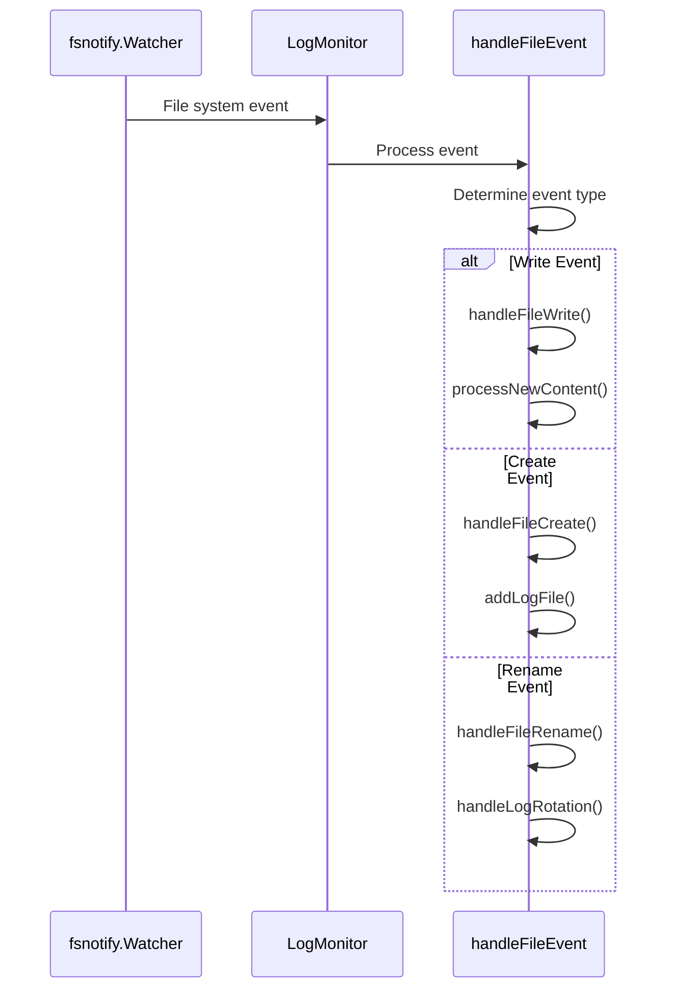
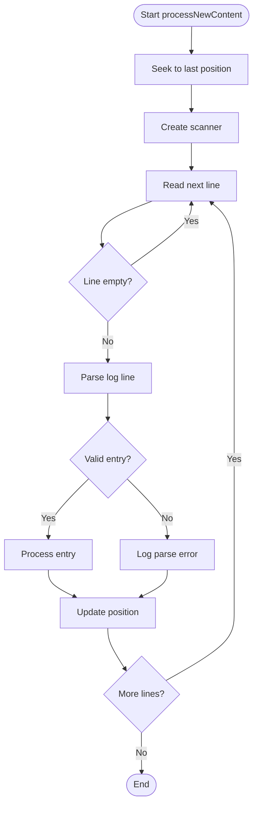
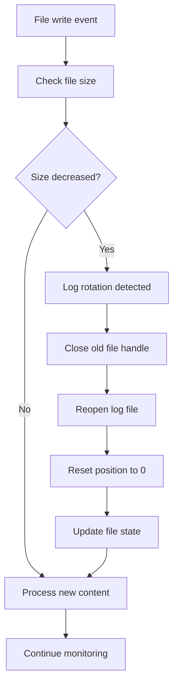
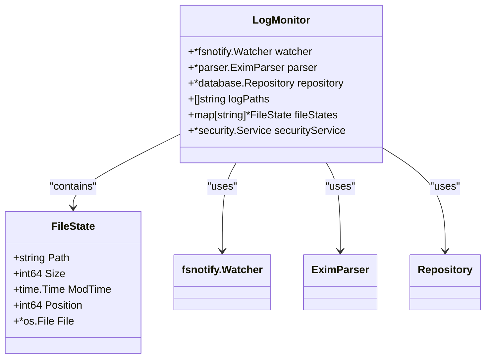
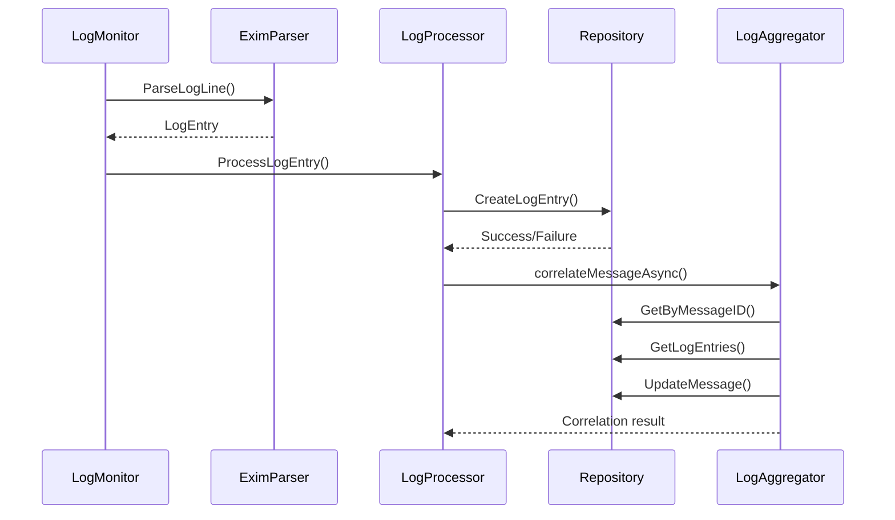
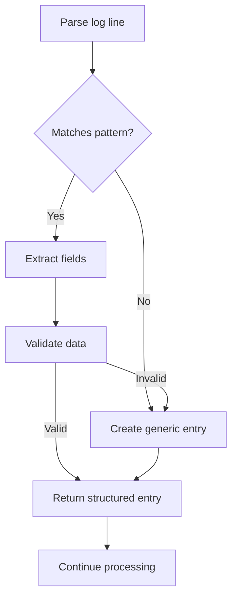

# Log Monitoring


## Table of Contents
1. [Log Monitoring](#log-monitoring)
2. [File System Watcher and Change Detection](#file-system-watcher-and-change-detection)
3. [Incremental Reading Mechanism](#incremental-reading-mechanism)
4. [File Rotation Handling](#file-rotation-handling)
5. [Offset Checkpointing](#offset-checkpointing)
6. [Integration with Log Processing Pipeline](#integration-with-log-processing-pipeline)
7. [Error Recovery for Corrupted Log Lines](#error-recovery-for-corrupted-log-lines)
8. [Performance Considerations](#performance-considerations)

## File System Watcher and Change Detection

The log monitoring system uses the `fsnotify` library to detect changes in Exim log files. The `LogMonitor` struct in `monitor.go` is responsible for setting up and managing file system watchers for specified log paths.

When the monitor starts, it initializes a file watcher and adds each configured log file path to the watch list. The system continuously listens for file system events through a goroutine running the `monitorLoop` method. This loop processes three types of events:

- **Write events**: Triggered when new content is written to a log file
- **Create events**: Detected when a new log file is created (e.g., after log rotation)
- **Rename events**: Occur when a log file is renamed during rotation





**Diagram sources**
- [monitor.go](file://internal/logmonitor/monitor.go#L392-L471)

**Section sources**
- [monitor.go](file://internal/logmonitor/monitor.go#L100-L150)

## Incremental Reading Mechanism

The log monitor implements an incremental reading mechanism to efficiently process only new log entries without reprocessing existing content. This is achieved through the `processNewContent` method, which reads from the last known position in each log file.

The system uses a `FileState` struct to track the reading position for each monitored file. When new content is detected, the monitor seeks to the stored position and reads only the new lines. This approach ensures that log entries are processed exactly once, even during high-throughput periods.





**Diagram sources**
- [monitor.go](file://internal/logmonitor/monitor.go#L392-L471)

**Section sources**
- [monitor.go](file://internal/logmonitor/monitor.go#L392-L471)

## File Rotation Handling

The system includes robust handling for log file rotation, a common scenario in mail servers where log files are periodically archived and new files created. The `handleLogRotation` method detects and responds to rotation events.

When a write event is detected, the monitor first checks if the file size has decreased, which indicates log rotation has occurred. If rotation is detected, the system:

1. Closes the handle to the rotated file
2. Reopens the original log file path
3. Resets the reading position to 0
4. Updates the file state with new size and modification time

The system also checks for rotated files (e.g., `mainlog.1`, `mainlog.2.gz`) through the `processRotatedFiles` method, allowing for potential processing of archived logs.





**Diagram sources**
- [monitor.go](file://internal/logmonitor/monitor.go#L300-L350)

**Section sources**
- [monitor.go](file://internal/logmonitor/monitor.go#L250-L350)

## Offset Checkpointing

The log monitoring system implements offset checkpointing through the `FileState` struct, which maintains persistent tracking of reading positions across restarts. The `Position` field in `FileState` stores the byte offset of the last processed log entry.

When the monitor starts, it initializes the position by seeking to the end of each log file, ensuring only new entries are processed. After processing new content, the system updates the position to the current file offset, effectively creating a checkpoint.

This mechanism ensures no log entries are missed during restarts or system failures. When the monitor restarts, it resumes from the last checkpointed position rather than reprocessing the entire file.





**Diagram sources**
- [monitor.go](file://internal/logmonitor/monitor.go#L36-L42)

**Section sources**
- [monitor.go](file://internal/logmonitor/monitor.go#L36-L42)

## Integration with Log Processing Pipeline

The log monitor integrates with the log processing pipeline through the `LogProcessor` interface. When a log entry is successfully parsed, it is passed to the configured processor for further analysis and storage.

The integration follows this flow:
1. Raw log line is parsed into a structured `LogEntry`
2. Parsed entry is passed to the `LogProcessor`
3. Processor stores the entry in the database and triggers correlation
4. Correlation service aggregates related entries into message timelines





**Diagram sources**
- [monitor.go](file://internal/logmonitor/monitor.go#L420-L430)
- [service.go](file://internal/logprocessor/service.go#L80-L100)

**Section sources**
- [monitor.go](file://internal/logmonitor/monitor.go#L420-L430)
- [service.go](file://internal/logprocessor/service.go#L80-L100)

## Error Recovery for Corrupted Log Lines

The system implements comprehensive error recovery strategies for corrupted or malformed log lines. The `EximParser` in `exim_parser.go` uses a multi-tiered approach to handle parsing errors:

1. **Regex pattern matching**: Multiple compiled regex patterns attempt to match different log formats
2. **Generic entry creation**: Unparsable lines are stored as generic entries with minimal structure
3. **Error tolerance**: The parser continues processing subsequent lines after encountering errors
4. **Limited error logging**: Only the first few errors are logged to prevent log spam

When a log line cannot be parsed by any specific pattern, the system creates a generic log entry using `createGenericLogEntry`, preserving the raw line and timestamp for later analysis.





**Diagram sources**
- [exim_parser.go](file://internal/parser/exim_parser.go#L100-L150)

**Section sources**
- [exim_parser.go](file://internal/parser/exim_parser.go#L100-L150)

## Performance Considerations

The log monitoring system includes several performance optimizations for handling large log files across multiple mail servers:

### Batch Processing
For historical log processing, the system uses batch processing with configurable batch sizes to reduce database transaction overhead:


```go
batchSize := 100
var logEntries []*database.LogEntry

// Accumulate entries
logEntries = append(logEntries, logEntry)

// Process in batches
if len(logEntries) >= batchSize {
    processBatchLogEntries(logEntries)
    logEntries = logEntries[:0]
}
```


### Buffer Management
The system increases scanner buffer sizes to handle large log lines efficiently:


```go
buf := make([]byte, 0, 64*1024)
scanner.Buffer(buf, 1024*1024)
```


### Concurrency and Resource Management
The monitor uses read-write mutexes to safely access shared state and implements proper resource cleanup in the `Stop` method.

### Retry Logic
For database operations, the system implements exponential backoff retry logic to handle transient failures:


```go
for i := 0; i < maxRetries; i++ {
    if err := m.repository.CreateLogEntry(m.ctx, entry); err != nil {
        time.Sleep(time.Millisecond * 100 * time.Duration(i+1))
        continue
    }
    return nil
}
```


These optimizations ensure the system can handle high-volume log streams while maintaining reliability and resource efficiency.

**Section sources**
- [monitor.go](file://internal/logmonitor/monitor.go#L200-L250)
- [monitor.go](file://internal/logmonitor/monitor.go#L600-L650)

**Referenced Files in This Document**   
- [monitor.go](file://internal/logmonitor/monitor.go)
- [exim_parser.go](file://internal/parser/exim_parser.go)
- [service.go](file://internal/logprocessor/service.go)
- [aggregator.go](file://internal/logprocessor/aggregator.go)
- [repository.go](file://internal/database/repository.go)
- [models.go](file://internal/database/models.go)