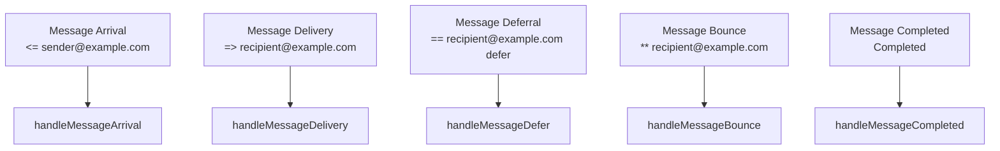
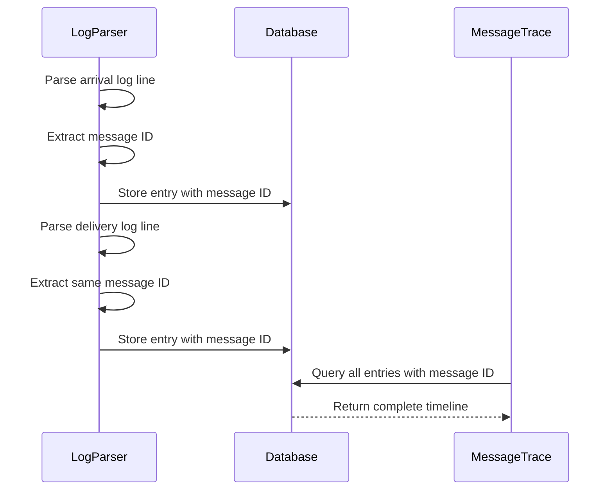
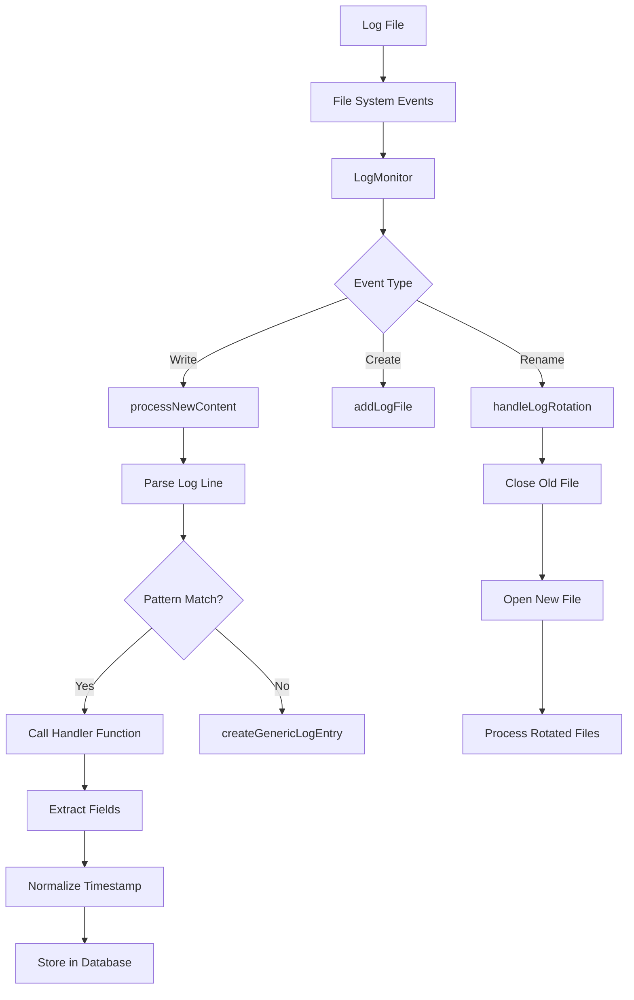

# Log Parsing


## Table of Contents
1. [Introduction](#introduction)
2. [Log Entry Structure](#log-entry-structure)
3. [Log Types and Event Classification](#log-types-and-event-classification)
4. [Parsing Logic and Regular Expression Patterns](#parsing-logic-and-regular-expression-patterns)
5. [Message ID Extraction and Correlation](#message-id-extraction-and-correlation)
6. [Timestamp Normalization](#timestamp-normalization)
7. [Handling Malformed Lines](#handling-malformed-lines)
8. [Performance Optimizations](#performance-optimizations)
9. [Log Monitoring and Processing Flow](#log-monitoring-and-processing-flow)
10. [Examples of Real Log Lines and Parsed Output](#examples-of-real-log-lines-and-parsed-output)

## Introduction
This document provides a comprehensive analysis of the Exim log parsing implementation within the exim-pilot system. The parser transforms raw Exim mail server log entries into structured data for storage, analysis, and visualization. It handles multiple log types including main, reject, and panic logs, extracting key information such as message IDs, timestamps, sender and recipient details, delivery status, and error information. The parsing system is designed for accuracy, performance, and resilience when processing high-volume log streams in real-time.

## Log Entry Structure
The parsed log data is stored in a structured format defined by the `LogEntry` struct, which captures all relevant information from Exim log lines.


```go
type LogEntry struct {
	ID           int64     `json:"id" db:"id"`
	Timestamp    time.Time `json:"timestamp" db:"timestamp"`
	MessageID    *string   `json:"message_id" db:"message_id"`
	LogType      string    `json:"log_type" db:"log_type"`
	Event        string    `json:"event" db:"event"`
	Host         *string   `json:"host" db:"host"`
	Sender       *string   `json:"sender" db:"sender"`
	Recipients   []string  `json:"recipients" db:"-"`
	RecipientsDB *string   `json:"-" db:"recipients"` // JSON string for database
	Size         *int64    `json:"size" db:"size"`
	Status       *string   `json:"status" db:"status"`
	ErrorCode    *string   `json:"error_code" db:"error_code"`
	ErrorText    *string   `json:"error_text" db:"error_text"`
	RawLine      string    `json:"raw_line" db:"raw_line"`
	CreatedAt    time.Time `json:"created_at" db:"created_at"`
}
```


The structure includes both direct fields and database-specific annotations for JSON serialization and database mapping. The `Recipients` field is stored as a JSON string in the database via the `RecipientsDB` field, while being presented as a slice in the application.

**Section sources**
- [models.go](file://internal/database/models.go#L70-L86)

## Log Types and Event Classification
The system categorizes log entries into three primary log types, each with specific event types that represent different mail server activities.

### Log Types
The parser distinguishes between different Exim log files based on their purpose:

- **Main**: General message processing events (arrival, delivery, deferral)
- **Reject**: Connection and message rejection events
- **Panic**: System errors and panic conditions

These are defined as constants:

```go
const (
	LogTypeMain   = "main"
	LogTypeReject = "reject"
	LogTypePanic  = "panic"
)
```


### Event Types
Each log type contains specific event types that classify the nature of the log entry:

- **Arrival**: Message received by the server
- **Delivery**: Message successfully delivered
- **Defer**: Temporary delivery failure
- **Bounce**: Permanent delivery failure
- **Reject**: Message or connection rejection
- **Panic**: System error or panic

These are defined as constants:

```go
const (
	EventArrival  = "arrival"
	EventDelivery = "delivery"
	EventDefer    = "defer"
	EventBounce   = "bounce"
	EventReject   = "reject"
	EventPanic    = "panic"
)
```


The event classification enables filtering, analysis, and visualization of mail flow patterns and issues.

**Section sources**
- [models.go](file://internal/database/models.go#L130-L144)

## Parsing Logic and Regular Expression Patterns
The Exim parser uses a pattern-based approach with compiled regular expressions to identify and extract information from different log line formats.

### Pattern Architecture
The `EximParser` struct maintains separate pattern lists for each log type:


```go
type EximParser struct {
	mainLogPatterns   []*LogPattern
	rejectLogPatterns []*LogPattern
	panicLogPatterns  []*LogPattern
}
```


Each `LogPattern` contains a compiled regular expression and a handler function:


```go
type LogPattern struct {
	Regex   *regexp.Regexp
	Handler func(matches []string, timestamp time.Time, rawLine string) *database.LogEntry
}
```


### Main Log Patterns
The main log patterns handle message processing events:





**Diagram sources**
- [exim_parser.go](file://internal/parser/exim_parser.go#L34-L58)

### Pattern Matching Process
The parsing process follows these steps:

1. Determine the appropriate pattern list based on log type
2. Iterate through patterns until a match is found
3. Extract the timestamp from the first capture group
4. Call the pattern's handler function with matches and timestamp
5. Return the structured log entry


```go
func (p *EximParser) ParseLogLine(line, logType string) (*database.LogEntry, error) {
	// Select pattern list based on log type
	var patterns []*LogPattern
	switch logType {
	case database.LogTypeMain:
		patterns = p.mainLogPatterns
	case database.LogTypeReject:
		patterns = p.rejectLogPatterns
	case database.LogTypePanic:
		patterns = p.panicLogPatterns
	default:
		return nil, fmt.Errorf("unknown log type: %s", logType)
	}

	// Try each pattern until one matches
	for _, pattern := range patterns {
		if matches := pattern.Regex.FindStringSubmatch(line); matches != nil {
			timestamp, err := p.parseTimestamp(matches[1])
			if err != nil {
				return nil, fmt.Errorf("failed to parse timestamp: %w", err)
			}
			entry := pattern.Handler(matches, timestamp, line)
			return entry, nil
		}
	}
	// Create generic entry if no pattern matches
	return p.createGenericLogEntry(line, logType)
}
```


**Section sources**
- [exim_parser.go](file://internal/parser/exim_parser.go#L89-L130)

## Message ID Extraction and Correlation
Message IDs are crucial for correlating related log entries across the mail delivery process.

### Message ID Format
Exim message IDs follow a specific format: `6 alphanumeric characters - 6 alphanumeric characters - 2 alphanumeric characters` (e.g., `1rABCD-123456-78`).

### Extraction Method
The parser provides a dedicated method to extract message IDs from any log line:


```go
func (p *EximParser) ExtractMessageID(line string) string {
	messageIDRegex := regexp.MustCompile(`\b([A-Za-z0-9]{6}-[A-Za-z0-9]{6}-[A-Za-z0-9]{2})\b`)
	matches := messageIDRegex.FindStringSubmatch(line)
	if len(matches) > 1 {
		return matches[1]
	}
	return ""
}
```


This method uses a word boundary pattern to ensure accurate extraction even when message IDs appear in error messages or other contexts.

### Correlation Usage
Message IDs enable tracking a message's journey through the system:
- Arrival: Message received with ID
- Processing: Multiple entries may reference the same ID
- Delivery/Deferral/Bounce: Final disposition with ID
- Completion: Message processing completed with ID

This allows the system to reconstruct the complete timeline for any message.





**Diagram sources**
- [exim_parser.go](file://internal/parser/exim_parser.go#L290-L299)
- [exim_parser_test.go](file://internal/parser/exim_parser_test.go#L146-L190)

## Timestamp Normalization
The parser converts Exim's timestamp format into a standardized `time.Time` object for consistent processing and storage.

### Timestamp Format
Exim logs use the format: `YYYY-MM-DD HH:MM:SS` (e.g., `2024-01-15 10:30:45`).

### Parsing Implementation
The parser uses Go's standard time parsing library:


```go
func (p *EximParser) parseTimestamp(timestampStr string) (time.Time, error) {
	return time.Parse("2006-01-02 15:04:05", timestampStr)
}
```


Note: Go uses a reference time `Mon Jan 2 15:04:05 MST 2006` (Unix time 1136239445) for format specification, where the digits represent the pattern to match.

### Error Handling
If timestamp parsing fails, the parser falls back to the current time, ensuring that log entries are not discarded due to timestamp issues:


```go
var timestamp time.Time
var err error

if len(matches) > 1 {
	timestamp, err = p.parseTimestamp(matches[1])
	if err != nil {
		timestamp = time.Now()
	}
} else {
	timestamp = time.Now()
}
```


This approach maintains data completeness while preserving temporal accuracy when possible.

**Section sources**
- [exim_parser.go](file://internal/parser/exim_parser.go#L131-L135)

## Handling Malformed Lines
The parser implements robust error handling for malformed or unrecognized log lines.

### Empty Line Handling
Empty lines are gracefully handled by returning `nil` without error:


```go
if strings.TrimSpace(line) == "" {
	return nil, nil
}
```


### Unknown Log Type
When an unrecognized log type is specified, the parser returns an error:


```go
default:
	return nil, fmt.Errorf("unknown log type: %s", logType)
```


### Unmatched Patterns
When no pattern matches a log line, the parser creates a generic log entry:


```go
func (p *EximParser) createGenericLogEntry(line, logType string) (*database.LogEntry, error) {
	// Extract timestamp if present, otherwise use current time
	timestampRegex := regexp.MustCompile(`^(\d{4}-\d{2}-\d{2} \d{2}:\d{2}:\d{2})`)
	matches := timestampRegex.FindStringSubmatch(line)

	var timestamp time.Time
	if len(matches) > 1 {
		timestamp, err = p.parseTimestamp(matches[1])
		if err != nil {
			timestamp = time.Now()
		}
	} else {
		timestamp = time.Now()
	}

	return &database.LogEntry{
		Timestamp: timestamp,
		LogType:   logType,
		Event:     "unknown",
		RawLine:   line,
		CreatedAt: time.Now(),
	}, nil
}
```


This ensures that no log data is lost, even if it cannot be fully parsed. The original raw line is preserved for debugging and analysis.

**Section sources**
- [exim_parser.go](file://internal/parser/exim_parser.go#L136-L162)

## Performance Optimizations
The parsing system incorporates several optimizations for high-speed processing and memory efficiency.

### Pre-compiled Regular Expressions
All regular expressions are compiled once during parser initialization:


```go
func (p *EximParser) initializePatterns() {
	p.mainLogPatterns = []*LogPattern{
		{
			Regex:   regexp.MustCompile(`^(\d{4}-\d{2}-\d{2} \d{2}:\d{2}:\d{2}) ([A-Za-z0-9-]+) <= ([^\s]+) H=([^\s]+) \[([^\]]+)\].*?S=(\d+)`),
			Handler: p.handleMessageArrival,
		},
		// ... other patterns
	}
}
```


This avoids the overhead of compiling regex patterns on each parse operation.

### Large Buffer Configuration
The log monitor configures large buffers to handle long log lines efficiently:


```go
// Increase buffer size for large log lines
buf := make([]byte, 0, 64*1024)
scanner.Buffer(buf, 1024*1024)
```


This prevents buffer overflow errors on log lines with extensive error messages or headers.

### Batch Processing
Historical log processing uses batching to improve database performance:


```go
batchSize := 100
var logEntries []*database.LogEntry

// Process in batches to improve performance
if len(logEntries) >= batchSize {
	if err := m.processBatchLogEntries(logEntries); err != nil {
		log.Printf("Failed to process batch of log entries: %v", err)
	}
	logEntries = logEntries[:0] // Reset slice
}
```


### Efficient String Handling
The parser minimizes string allocations by using pointers for optional fields:


```go
func stringPtr(s string) *string {
	if s == "" {
		return nil
	}
	return &s
}
```


This reduces memory usage by avoiding pointer indirection for empty values.

**Section sources**
- [monitor.go](file://internal/logmonitor/monitor.go#L358-L379)
- [exim_parser.go](file://internal/parser/exim_parser.go#L34-L58)

## Log Monitoring and Processing Flow
The system monitors log files in real-time and processes new entries through a coordinated workflow.





**Diagram sources**
- [monitor.go](file://internal/logmonitor/monitor.go#L200-L300)
- [exim_parser.go](file://internal/parser/exim_parser.go#L89-L130)

The `LogMonitor` watches for file system events and processes new content incrementally. It handles log rotation by detecting file truncation or renaming events and reopening files as needed. For each new log line, it delegates parsing to the `EximParser`, which applies the appropriate pattern and handler.

## Examples of Real Log Lines and Parsed Output
This section demonstrates the parsing process with real examples from the test suite.

### Message Arrival
**Raw Log Line:**

```
2024-01-15 10:30:45 1rABCD-123456-78 <= sender@example.com H=mail.example.com [192.168.1.1] P=esmtp S=1234
```


**Parsed Output:**

```json
{
	"timestamp": "2024-01-15T10:30:45Z",
	"message_id": "1rABCD-123456-78",
	"log_type": "main",
	"event": "arrival",
	"host": "mail.example.com",
	"sender": "sender@example.com",
	"size": 1234,
	"status": "received",
	"raw_line": "2024-01-15 10:30:45 1rABCD-123456-78 <= sender@example.com H=mail.example.com [192.168.1.1] P=esmtp S=1234"
}
```


### Message Delivery
**Raw Log Line:**

```
2024-01-15 10:31:00 1rABCD-123456-78 => recipient@example.com R=dnslookup T=remote_smtp H=mx.example.com [192.168.1.2]
```


**Parsed Output:**

```json
{
	"timestamp": "2024-01-15T10:31:00Z",
	"message_id": "1rABCD-123456-78",
	"log_type": "main",
	"event": "delivery",
	"host": "mx.example.com",
	"recipients": ["recipient@example.com"],
	"status": "delivered",
	"raw_line": "2024-01-15 10:31:00 1rABCD-123456-78 => recipient@example.com R=dnslookup T=remote_smtp H=mx.example.com [192.168.1.2]"
}
```


### Message Deferral
**Raw Log Line:**

```
2024-01-15 10:31:00 1rABCD-123456-78 == recipient@example.com R=dnslookup T=remote_smtp defer (-1): Connection refused
```


**Parsed Output:**

```json
{
	"timestamp": "2024-01-15T10:31:00Z",
	"message_id": "1rABCD-123456-78",
	"log_type": "main",
	"event": "defer",
	"recipients": ["recipient@example.com"],
	"status": "deferred",
	"error_code": "-1",
	"error_text": "Connection refused",
	"raw_line": "2024-01-15 10:31:00 1rABCD-123456-78 == recipient@example.com R=dnslookup T=remote_smtp defer (-1): Connection refused"
}
```


### Connection Rejection
**Raw Log Line:**

```
2024-01-15 10:30:45 rejected connection from [192.168.1.100]: (tcp wrappers)
```


**Parsed Output:**

```json
{
	"timestamp": "2024-01-15T10:30:45Z",
	"log_type": "reject",
	"event": "reject",
	"host": "192.168.1.100",
	"status": "rejected",
	"error_text": "(tcp wrappers)",
	"raw_line": "2024-01-15 10:30:45 rejected connection from [192.168.1.100]: (tcp wrappers)"
}
```


These examples demonstrate the parser's ability to extract structured information from various Exim log formats, enabling comprehensive mail server monitoring and analysis.

**Section sources**
- [exim_parser_test.go](file://internal/parser/exim_parser_test.go#L8-L145)

**Referenced Files in This Document**   
- [exim_parser.go](file://internal/parser/exim_parser.go)
- [exim_parser_test.go](file://internal/parser/exim_parser_test.go)
- [models.go](file://internal/database/models.go)
- [monitor.go](file://internal/logmonitor/monitor.go)