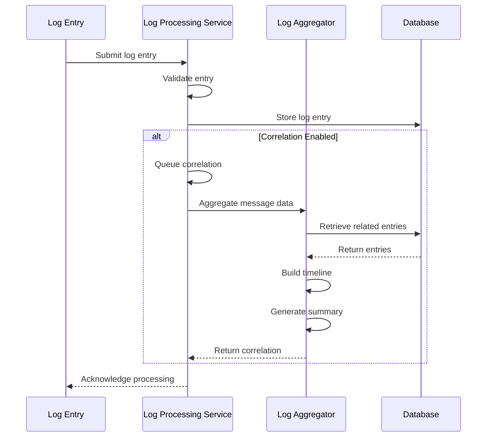
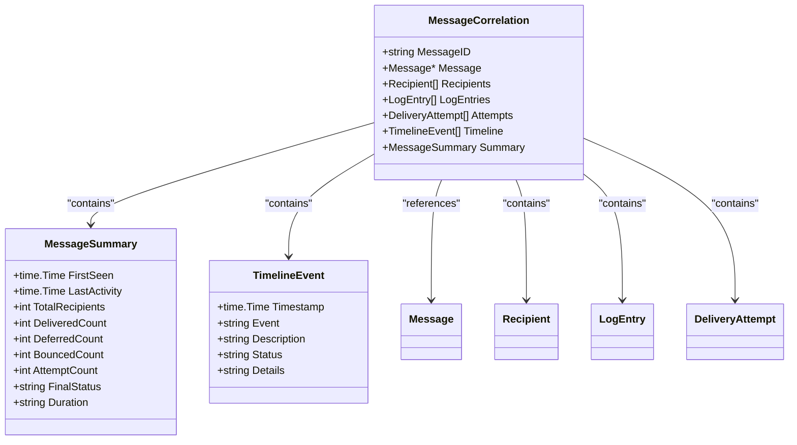
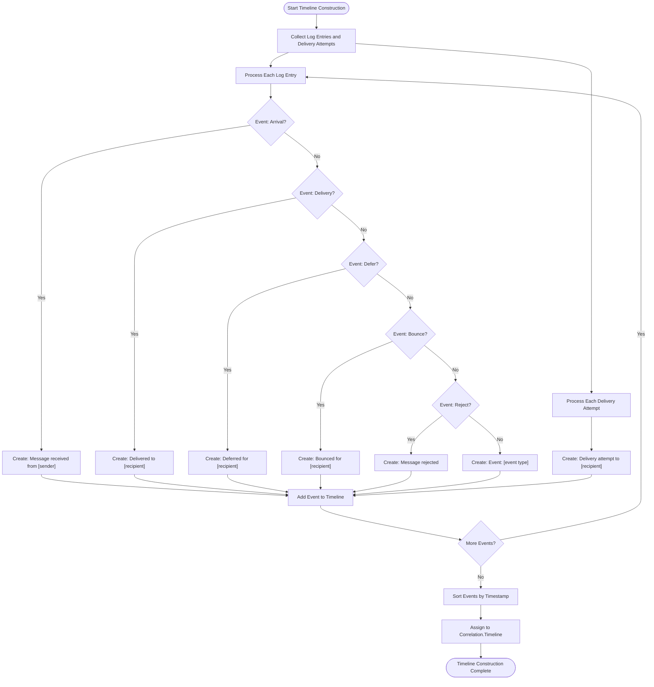
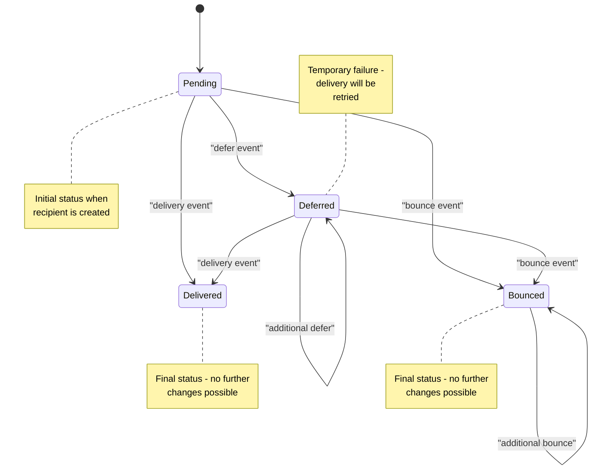
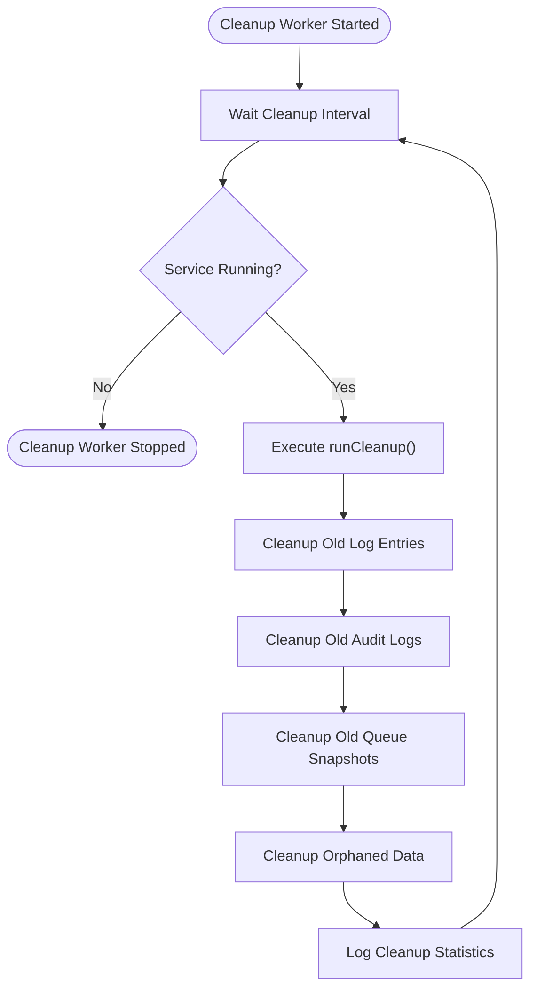
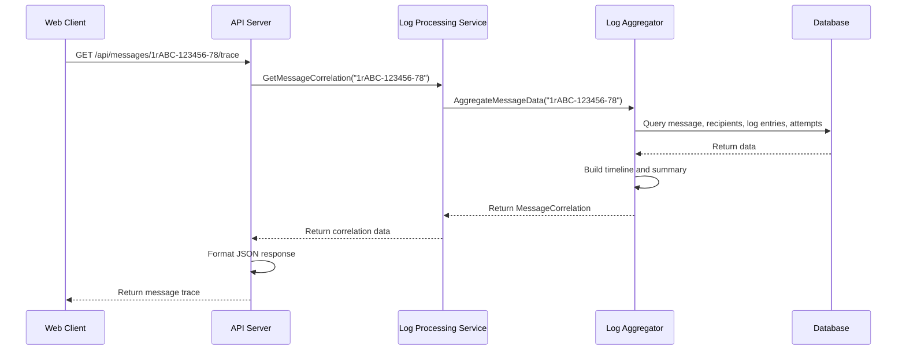

# Message Correlation


## Table of Contents
1. [Introduction](#introduction)
2. [Core Components](#core-components)
3. [Message Correlation Engine](#message-correlation-engine)
4. [In-Memory Aggregation Model](#in-memory-aggregation-model)
5. [Timeline Construction](#timeline-construction)
6. [Recipient-Level Status Tracking](#recipient-level-status-tracking)
7. [Memory Management and TTL Policies](#memory-management-and-ttl-policies)
8. [Database Integration](#database-integration)
9. [API Integration](#api-integration)

## Introduction
The Message Correlation system in Exim-Pilot is designed to transform raw log entries into coherent, actionable delivery timelines. This system groups individual log entries by message ID, creating comprehensive delivery histories that track the complete lifecycle of email messages through the system. The correlation engine processes log entries in real-time and batch modes, constructing detailed timelines that show message arrival, delivery attempts, deferrals, bounces, and final delivery status. This documentation provides a comprehensive overview of the message correlation architecture, data structures, processing logic, and integration points.

## Core Components
The message correlation system consists of several interconnected components that work together to process log entries and generate delivery timelines. The core components include the LogAggregator, which handles the correlation logic; the Service layer, which provides the interface for processing and retrieving correlated data; and the BackgroundService, which manages periodic processing tasks. These components work with the database models to store and retrieve message data, ensuring that all delivery events are properly tracked and correlated.

**Section sources**
- [aggregator.go](file://internal/logprocessor/aggregator.go#L1-L50)
- [service.go](file://internal/logprocessor/service.go#L1-L50)
- [background_service.go](file://internal/logprocessor/background_service.go#L1-L50)

## Message Correlation Engine
The message correlation engine is responsible for grouping log entries into coherent message delivery timelines using message IDs as the primary correlation key. When log entries are processed, they are grouped by their message ID, and all entries with the same message ID are aggregated into a single MessageCorrelation object. This object contains the complete history of the message, including all delivery attempts, recipient statuses, and timeline events.

The correlation process begins when log entries are received, either individually or in batches. Each log entry contains a message ID that links it to a specific message. The engine uses this message ID to group related entries and construct a comprehensive view of the message's delivery journey. The correlation is performed both synchronously when new log entries arrive and asynchronously through periodic background processing.





**Diagram sources**
- [service.go](file://internal/logprocessor/service.go#L150-L200)
- [aggregator.go](file://internal/logprocessor/aggregator.go#L150-L200)

**Section sources**
- [aggregator.go](file://internal/logprocessor/aggregator.go#L1-L150)
- [service.go](file://internal/logprocessor/service.go#L150-L200)

## In-Memory Aggregation Model
The in-memory aggregation model is implemented through the MessageCorrelation struct, which serves as the central data structure for storing correlated message data. This model aggregates various types of information related to a message, including the message metadata, recipient information, log entries, delivery attempts, and the constructed timeline.

The MessageCorrelation struct contains several key fields:
- **MessageID**: The unique identifier for the message
- **Message**: The message metadata (sender, timestamp, status)
- **Recipients**: The list of recipients and their delivery statuses
- **LogEntries**: All log entries associated with the message
- **Attempts**: Delivery attempts for the message
- **Timeline**: Chronologically ordered events in the message's delivery journey
- **Summary**: Aggregated statistics and final status

The aggregation process begins by retrieving all relevant data from the database based on the message ID. The LogAggregator first fetches the message record (if it exists), then retrieves all log entries, recipients, and delivery attempts associated with the message. These components are then combined into the MessageCorrelation structure, which serves as the foundation for timeline construction and summary generation.





**Diagram sources**
- [aggregator.go](file://internal/logprocessor/aggregator.go#L24-L54)

**Section sources**
- [aggregator.go](file://internal/logprocessor/aggregator.go#L24-L150)

## Timeline Construction
The delivery timeline is constructed by combining log entries and delivery attempts into a single chronological sequence of events. The buildTimeline method in the LogAggregator is responsible for this process, which involves extracting relevant information from log entries and delivery attempts, formatting it into TimelineEvent objects, and sorting all events by timestamp.

The timeline construction process follows these steps:
1. Process each log entry and convert it into a TimelineEvent with appropriate description and status
2. Process each delivery attempt and convert it into a TimelineEvent
3. Combine all events into a single list
4. Sort the events chronologically by timestamp
5. Assign the sorted events to the correlation's Timeline field

Each event type has specific formatting rules:
- **Arrival**: "Message received from [sender]" with size information
- **Delivery**: "Delivered to [recipient]" with host information
- **Defer**: "Deferred for [recipient]" with error details
- **Bounce**: "Bounced for [recipient]" with error details
- **Reject**: "Message rejected" with error details
- **Delivery Attempt**: "Delivery attempt to [recipient]" with host, IP, SMTP code, and error message

The timeline handles out-of-order log entries by sorting all events chronologically after they are collected. This ensures that the final timeline presents events in the correct temporal order, regardless of when the log entries were processed or stored.





**Diagram sources**
- [aggregator.go](file://internal/logprocessor/aggregator.go#L111-L149)

**Section sources**
- [aggregator.go](file://internal/logprocessor/aggregator.go#L111-L149)

## Recipient-Level Status Tracking
Recipient-level status tracking is implemented through the Recipient entity and its integration with the message correlation system. Each recipient has an individual status that reflects their specific delivery outcome: delivered, deferred, bounced, or pending. The system maintains this status by processing log entries that contain recipient information and updating the recipient records accordingly.

When log entries are processed, the system examines the recipients field in each entry and updates the status of the corresponding recipients. The status update follows specific rules:
- A delivery event sets the recipient status to "delivered" and records the delivery timestamp
- A defer event sets the status to "deferred" only if the current status is not "delivered"
- A bounce event sets the status to "bounced" regardless of previous status
- The first arrival event for a recipient creates a new recipient record with "pending" status

The system also tracks delivery attempts at the recipient level, creating DeliveryAttempt records for each delivery-related event. These attempts include detailed information such as the target host, IP address, SMTP response code, and error message, providing comprehensive insight into delivery challenges.

Recipient status is used to generate the message summary, which includes counts of delivered, deferred, and bounced recipients. This information helps determine the overall message status: "delivered" if all recipients succeeded, "bounced" if any recipient bounced, "deferred" if any recipient was deferred (and none bounced), or the message's stored status as a fallback.





**Diagram sources**
- [models.go](file://internal/database/models.go#L30-L45)
- [aggregator.go](file://internal/logprocessor/aggregator.go#L400-L450)

**Section sources**
- [models.go](file://internal/database/models.go#L30-L45)
- [aggregator.go](file://internal/logprocessor/aggregator.go#L400-L450)

## Memory Management and TTL Policies
Memory management and TTL (Time-to-Live) policies are implemented through the background service, which handles periodic cleanup of stale data. The system uses configurable retention policies to determine how long different types of data should be kept before being automatically removed.

The BackgroundService runs periodic cleanup tasks based on the following configuration:
- **LogRetentionDays**: Number of days to retain log entries (default: 90 days)
- **AuditRetentionDays**: Number of days to retain audit logs (default: 365 days)
- **SnapshotRetentionDays**: Number of days to retain queue snapshots (default: 30 days)

The cleanup process runs on a configurable interval (default: every 6 hours) and removes records older than the specified retention period. This ensures that the database does not grow indefinitely while maintaining sufficient historical data for troubleshooting and analysis.

In addition to time-based cleanup, the system also removes orphaned records that no longer have valid relationships:
- Recipients without corresponding messages
- Delivery attempts without corresponding messages
- Messages without any log entries (older than 7 days)

The cleanup process is batched to minimize database load, with a configurable batch size (default: 1,000 records per batch). This approach prevents long-running transactions and reduces the impact on system performance during cleanup operations.





**Diagram sources**
- [background_service.go](file://internal/logprocessor/background_service.go#L150-L250)

**Section sources**
- [background_service.go](file://internal/logprocessor/background_service.go#L150-L250)

## Database Integration
The message correlation system integrates with the database to store and retrieve message data, ensuring persistence and consistency across system restarts. The integration is implemented through repository patterns that provide a clean interface between the correlation logic and the underlying database.

Key database entities include:
- **messages**: Stores message metadata (ID, sender, timestamp, status)
- **recipients**: Tracks recipient-specific delivery status
- **delivery_attempts**: Records individual delivery attempts with detailed information
- **log_entries**: Stores raw log entries with message ID for correlation
- **audit_log**: Maintains audit records of system operations
- **queue_snapshots**: Captures periodic snapshots of the mail queue

The integration follows a two-phase approach:
1. **Real-time processing**: When new log entries arrive, they are immediately stored in the database and trigger asynchronous correlation
2. **Batch processing**: Periodic background tasks correlate log entries in batches, updating message and recipient records

The system uses database transactions to ensure data consistency when updating related records. For example, when processing a delivery event, the system updates the message status, recipient status, and creates a delivery attempt record within a single transaction to prevent partial updates.


```mermaid
erDiagram
MESSAGE ||--o{ RECIPIENT : "has"
MESSAGE ||--o{ DELIVERY_ATTEMPT : "has"
MESSAGE ||--o{ LOG_ENTRY : "has"
MESSAGE {
string id PK
datetime timestamp
string sender
int64? size
string status
datetime created_at
datetime updated_at
}
RECIPIENT {
int64 id PK
string message_id FK
string recipient
string status
datetime? delivered_at
datetime created_at
datetime updated_at
}
DELIVERY_ATTEMPT {
int64 id PK
string message_id FK
string recipient
datetime timestamp
string? host
string? ip_address
string status
string? smtp_code
string? error_message
datetime created_at
}
LOG_ENTRY {
int64 id PK
datetime timestamp
string? message_id FK
string log_type
string event
string? host
string? sender
string? recipients
int64? size
string? status
string? error_code
string? error_text
string raw_line
datetime created_at
}
```


**Diagram sources**
- [models.go](file://internal/database/models.go#L10-L100)
- [repository.go](file://internal/database/repository.go#L100-L200)

**Section sources**
- [models.go](file://internal/database/models.go#L10-L100)
- [repository.go](file://internal/database/repository.go#L100-L200)

## API Integration
The message correlation data is exposed through the API to support frontend components that display message delivery timelines and status information. The message_trace_handlers.go file contains the HTTP handlers that serve correlation data to the web interface.

The primary API endpoints for message correlation include:
- **GET /api/messages/{messageId}/trace**: Returns the complete message correlation data
- **GET /api/messages/{messageId}/timeline**: Returns only the delivery timeline events
- **GET /api/messages/{messageId}/recipients**: Returns recipient-level status information

These endpoints use the LogProcessingService to retrieve correlation data, which in turn uses the LogAggregator to construct the response. The API returns JSON responses that match the MessageCorrelation structure, allowing the frontend to render detailed delivery timelines, recipient status tables, and retry schedules.

The integration supports both real-time updates and historical analysis, enabling users to track message delivery as it happens or investigate past delivery issues. The API also includes search functionality that allows users to find messages based on various criteria, such as sender, recipient, time range, and event types.





**Diagram sources**
- [message_trace_handlers.go](file://internal/api/message_trace_handlers.go#L50-L100)
- [service.go](file://internal/logprocessor/service.go#L300-L350)

**Section sources**
- [message_trace_handlers.go](file://internal/api/message_trace_handlers.go#L50-L100)
- [service.go](file://internal/logprocessor/service.go#L300-L350)

**Referenced Files in This Document**   
- [aggregator.go](file://internal/logprocessor/aggregator.go)
- [service.go](file://internal/logprocessor/service.go)
- [background_service.go](file://internal/logprocessor/background_service.go)
- [models.go](file://internal/database/models.go)
- [message_trace_handlers.go](file://internal/api/message_trace_handlers.go)