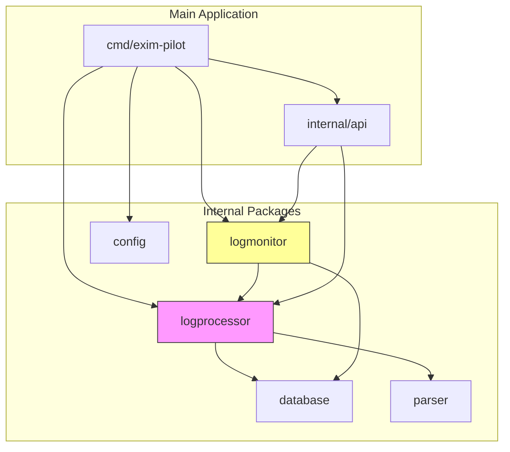
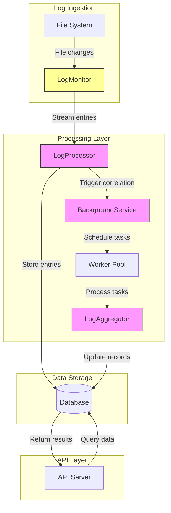
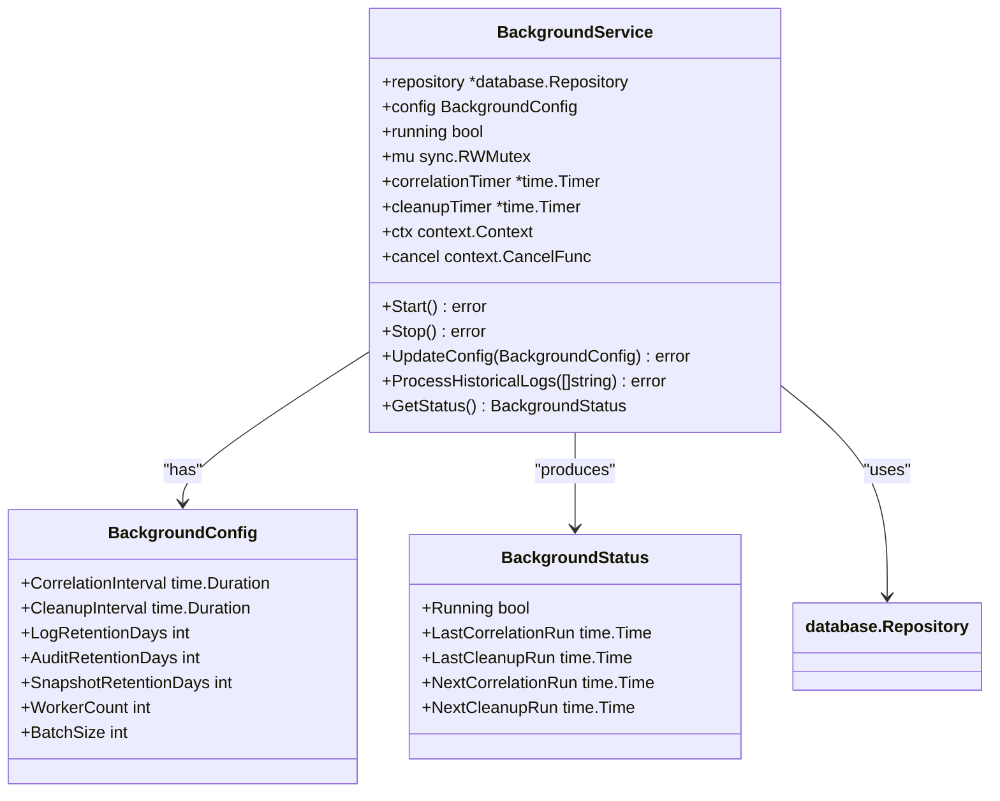
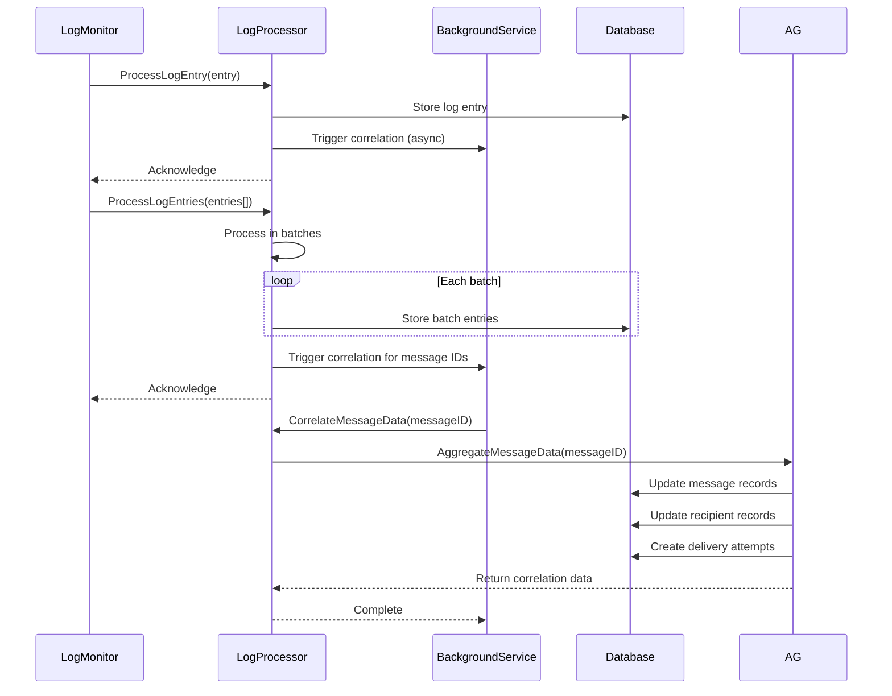
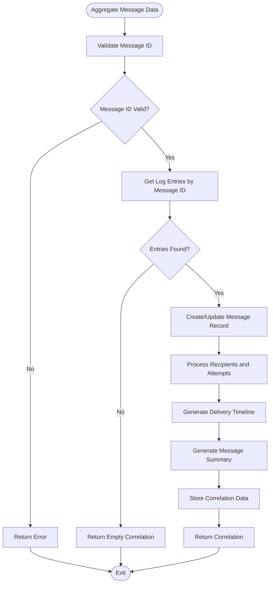
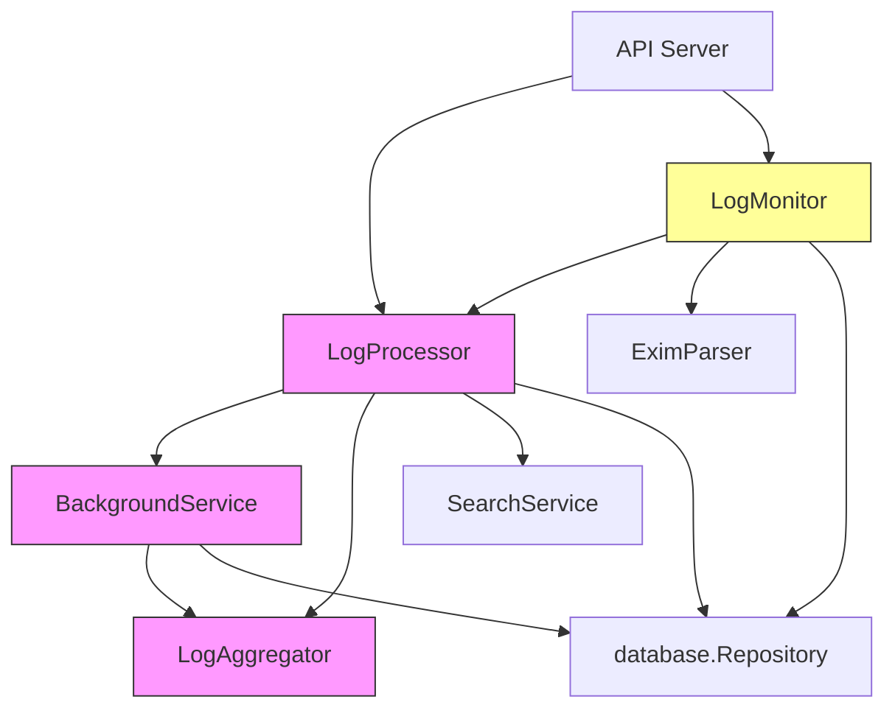

# Background Processing

## Table of Contents
1. [Introduction](#introduction)
2. [Project Structure](#project-structure)
3. [Core Components](#core-components)
4. [Architecture Overview](#architecture-overview)
5. [Detailed Component Analysis](#detailed-component-analysis)
6. [Dependency Analysis](#dependency-analysis)
7. [Performance Considerations](#performance-considerations)
8. [Troubleshooting Guide](#troubleshooting-guide)
9. [Conclusion](#conclusion)

## Introduction
The Background Processing system in Exim-Pilot is a critical component responsible for asynchronously processing log streams from Exim mail server logs. This system enables real-time monitoring, message correlation, and historical analysis of email delivery events. The architecture is designed to handle high-volume log data efficiently while maintaining system responsiveness through asynchronous processing and worker pooling. The system processes log entries to correlate message delivery attempts, update recipient statuses, generate delivery timelines, and maintain comprehensive message histories for traceability and reporting purposes.

## Project Structure
The background processing functionality is organized across multiple packages within the internal directory, with clear separation of concerns between monitoring, processing, and aggregation components. The core processing logic resides in the logprocessor package, while log monitoring is handled by a dedicated logmonitor package. Configuration is centralized in the config package, and integration with the API server occurs through well-defined service interfaces.

**Diagram sources**
- [main.go](file://cmd/exim-pilot/main.go)
- [background_service.go](file://internal/logprocessor/background_service.go)
- [monitor.go](file://internal/logmonitor/monitor.go)

**Section sources**
- [main.go](file://cmd/exim-pilot/main.go)
- [background_service.go](file://internal/logprocessor/background_service.go)

## Core Components
The background processing system consists of several core components that work together to ingest, process, and analyze log data. The LogMonitor component watches configured log files for changes and streams new entries to the processing system. The LogProcessor service coordinates between real-time processing and background tasks. The BackgroundService manages periodic tasks such as message correlation and data cleanup. The LogAggregator performs message correlation by grouping related log entries and creating comprehensive message histories. These components work in concert to transform raw log data into structured, queryable information for monitoring and analysis.

**Section sources**
- [service.go](file://internal/logprocessor/service.go#L1-L50)
- [background_service.go](file://internal/logprocessor/background_service.go#L1-L50)
- [aggregator.go](file://internal/logprocessor/aggregator.go#L1-L50)

## Architecture Overview
The background processing architecture follows a producer-consumer pattern with multiple processing stages. LogMonitor acts as the producer, detecting changes in log files and streaming new entries. The LogProcessor service acts as a coordinator, handling both immediate processing of individual entries and batch processing of multiple entries. The BackgroundService manages long-running tasks on a schedule, including periodic correlation of message data and cleanup of expired records. The system uses a worker pool model for handling background tasks, allowing for configurable concurrency based on system resources.

**Diagram sources**
- [monitor.go](file://internal/logmonitor/monitor.go#L1-L50)
- [service.go](file://internal/logprocessor/service.go#L1-L50)
- [background_service.go](file://internal/logprocessor/background_service.go#L1-L50)

## Detailed Component Analysis

### Background Service Analysis
The BackgroundService is a long-running service that processes log streams asynchronously through a worker pool model. It handles periodic tasks such as message correlation and data cleanup according to configurable intervals. The service uses a timer-based scheduling mechanism to execute tasks at regular intervals, with separate timers for correlation and cleanup operations.

**Diagram sources**
- [background_service.go](file://internal/logprocessor/background_service.go#L15-L45)

**Section sources**
- [background_service.go](file://internal/logprocessor/background_service.go#L1-L100)

### Log Processing Service Analysis
The LogProcessor service acts as the central coordinator for log processing operations, bridging real-time ingestion with background processing. It implements a task queuing mechanism that handles both individual log entries and batches of entries. The service supports graceful shutdown procedures through context cancellation and proper resource cleanup.

**Diagram sources**
- [service.go](file://internal/logprocessor/service.go#L50-L100)
- [aggregator.go](file://internal/logprocessor/aggregator.go#L50-L100)

**Section sources**
- [service.go](file://internal/logprocessor/service.go#L1-L200)

### Log Aggregator Analysis
The LogAggregator component performs message correlation by grouping log entries with the same message ID and creating comprehensive message histories. It processes log entries to determine message status, recipient delivery status, and delivery timelines. The aggregator also generates summary information for messages, including delivery statistics and timelines.

**Diagram sources**
- [aggregator.go](file://internal/logprocessor/aggregator.go#L150-L200)

**Section sources**
- [aggregator.go](file://internal/logprocessor/aggregator.go#L200-L500)

## Dependency Analysis
The background processing system has well-defined dependencies between components, with clear separation of concerns. The LogProcessor service depends on the database repository for data persistence and the BackgroundService for asynchronous task execution. The BackgroundService depends on the LogAggregator for message correlation logic. The LogMonitor depends on the LogProcessor to handle ingested log entries. Configuration is injected into components at initialization time, allowing for flexible deployment scenarios.

**Diagram sources**
- [service.go](file://internal/logprocessor/service.go#L1-L20)
- [background_service.go](file://internal/logprocessor/background_service.go#L1-L20)
- [aggregator.go](file://internal/logprocessor/aggregator.go#L1-L20)
- [monitor.go](file://internal/logmonitor/monitor.go#L1-L20)

**Section sources**
- [service.go](file://internal/logprocessor/service.go#L1-L50)
- [background_service.go](file://internal/logprocessor/background_service.go#L1-L50)

## Performance Considerations
The background processing system includes several configuration options for processing concurrency and resource limits. The worker pool size is configurable through the WorkerCount setting in BackgroundConfig, allowing administrators to tune the number of concurrent background tasks based on available system resources. Batch processing is used for efficient database operations, with the BatchSize parameter controlling the number of entries processed in each transaction. The system also implements backpressure handling through bounded worker pools and channel buffering, preventing resource exhaustion during periods of high log volume.

The system provides monitoring hooks for service health and throughput metrics through the GetServiceStatus method, which returns information about the running state, last activity, and background task scheduling. The retention system tracks data age and volume, providing insights into storage usage patterns. Performance metrics are exposed through API endpoints that can be integrated with external monitoring systems.

## Troubleshooting Guide
Common issues with the background processing system typically involve log file access permissions, database connectivity, or configuration errors. The system logs detailed information about startup, processing activities, and errors, which can be used to diagnose issues. When troubleshooting, first verify that the configured log paths exist and are readable by the application process. Check database connectivity and ensure that migrations have been applied successfully. Verify that the configuration file is properly formatted and that environment variables are correctly set if used.

For message correlation issues, check that log entries contain valid message IDs and that the parsing logic correctly extracts these IDs from log lines. If background tasks are not executing, verify that the correlation and cleanup intervals are properly configured and that the timers are active. Monitor system resource usage to ensure that the worker pool size is appropriate for the available CPU and memory resources.

**Section sources**
- [background_service.go](file://internal/logprocessor/background_service.go#L100-L150)
- [service.go](file://internal/logprocessor/service.go#L100-L150)
- [config.go](file://internal/config/config.go#L100-L150)

## Conclusion
The background processing system in Exim-Pilot provides a robust foundation for asynchronous log stream processing with comprehensive message correlation capabilities. The architecture effectively separates concerns between log monitoring, real-time processing, and background tasks, enabling scalable and maintainable code. The worker pool model and configurable concurrency settings allow the system to adapt to different deployment environments and load patterns. With its comprehensive monitoring hooks and graceful shutdown procedures, the system provides reliable operation in production environments while maintaining visibility into processing status and performance.

**Referenced Files in This Document**   
- [main.go](file://cmd/exim-pilot/main.go)
- [background_service.go](file://internal/logprocessor/background_service.go)
- [service.go](file://internal/logprocessor/service.go)
- [aggregator.go](file://internal/logprocessor/aggregator.go)
- [config.go](file://internal/config/config.go)
- [server.go](file://internal/api/server.go)
- [monitor.go](file://internal/logmonitor/monitor.go)