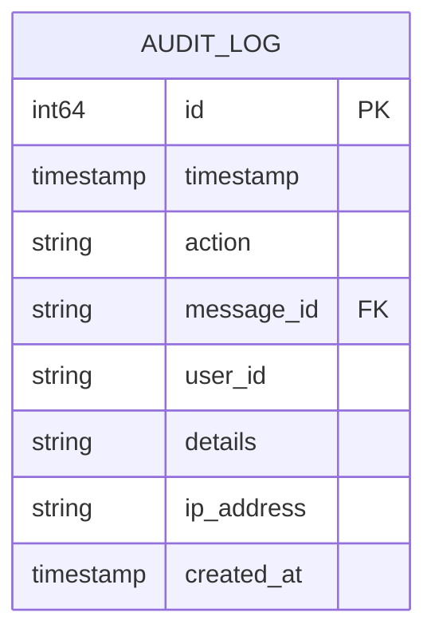
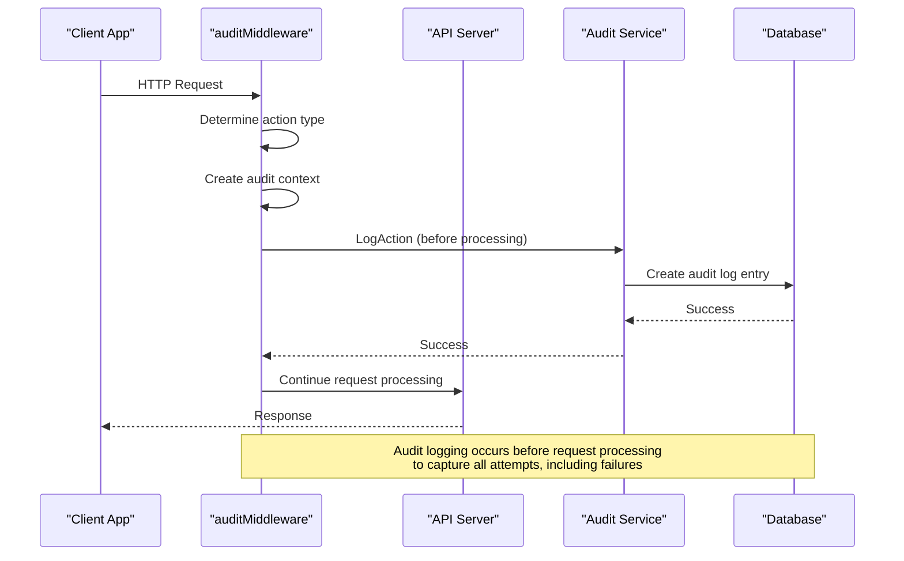
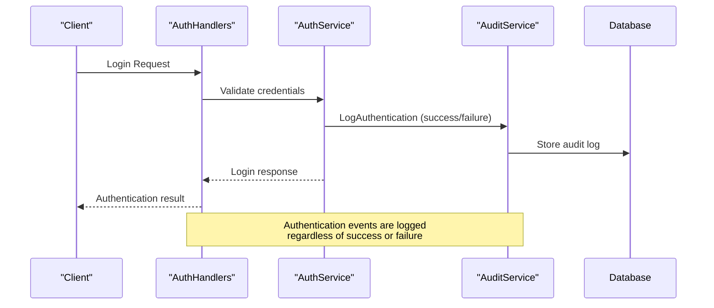
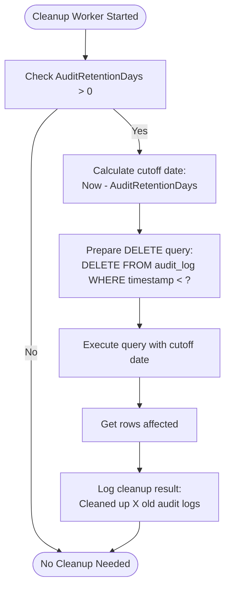
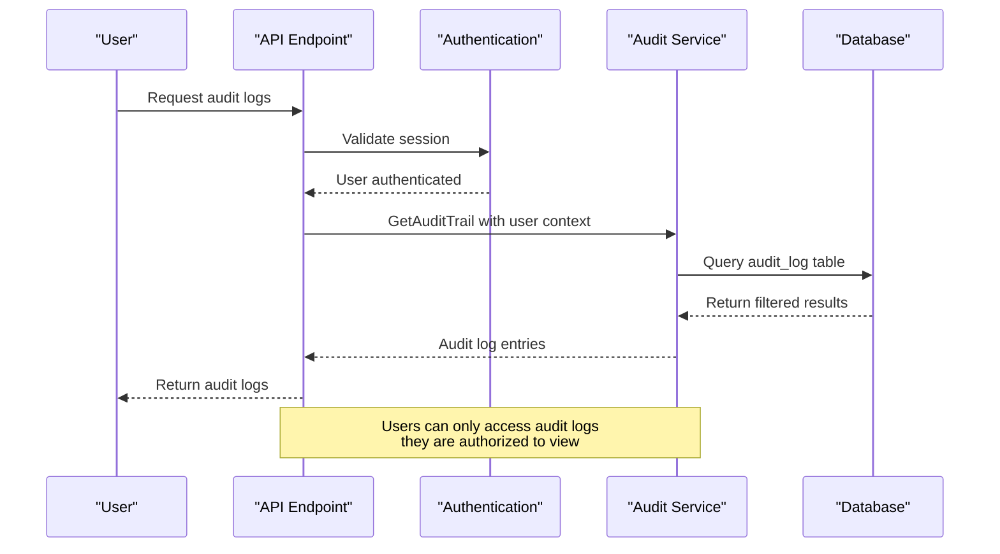

# Audit Logging


## Table of Contents
1. [Introduction](#introduction)
2. [Audit Log Data Model](#audit-log-data-model)
3. [Service Interface and Implementation](#service-interface-and-implementation)
4. [Integration with API Middleware](#integration-with-api-middleware)
5. [Log Retention and Storage Strategy](#log-retention-and-storage-strategy)
6. [Access Controls and Security](#access-controls-and-security)
7. [Example Audit Log Entries](#example-audit-log-entries)
8. [Security and Compliance Support](#security-and-compliance-support)

## Introduction
The audit logging system in Exim-Pilot provides comprehensive tracking of administrative actions and system events. This documentation details the design, implementation, and operational aspects of the audit trail capture mechanism. The system captures critical information about user activities, ensuring accountability and supporting security compliance requirements. The audit logs are immutable records stored in a relational database with configurable retention policies.

## Audit Log Data Model
The audit log data model is designed to capture essential information about administrative actions and system events. The model includes fields for timestamp, user identification, action type, target resource, and outcome.





**Diagram sources**
- [models.go](file://internal/database/models.go#L133-L142)

**Section sources**
- [models.go](file://internal/database/models.go#L133-L142)

The `AuditLog` struct in the database models defines the following fields:
- **ID**: Unique identifier for the audit log entry
- **Timestamp**: When the action occurred (UTC)
- **Action**: Type of administrative action performed
- **MessageID**: Reference to the message involved (if applicable)
- **UserID**: Identifier of the user who performed the action
- **Details**: JSON string containing additional action-specific information
- **IPAddress**: IP address from which the action was initiated
- **CreatedAt**: When the audit log entry was created

The data model supports flexible storage of action-specific details through the `Details` field, which contains serialized JSON with contextual information about each action.

## Service Interface and Implementation
The audit service provides a comprehensive interface for logging administrative actions and retrieving audit trails. The service is implemented as a Go struct with methods for different types of actions.


```mermaid
classDiagram
class AuditService {
+LogAction(ctx, action, messageID, auditCtx, details) error
+LogQueueOperation(ctx, operation, messageID, auditCtx, success, errorMsg) error
+LogBulkOperation(ctx, operation, messageIDs, auditCtx, successCount, failureCount, errors) error
+LogAuthentication(ctx, action, username, auditCtx, success, errorMsg) error
+LogMessageAccess(ctx, messageID, accessType, auditCtx) error
+LogSystemAccess(ctx, resourcePath, auditCtx, success, errorMsg) error
+GetAuditTrail(ctx, filters) []*AuditLog error
}
class AuditContext {
+UserID string
+IPAddress string
+UserAgent string
+RequestID string
}
class AuditDetails {
+MessageIDs []string
+Recipients []string
+Operation string
+Parameters map[string]interface{}
+Result string
+ErrorMessage string
+Duration time.Duration
+ResourcePath string
+PreviousValue interface{}
+NewValue interface{}
}
class ActionType {
+ActionQueueDeliver
+ActionQueueFreeze
+ActionQueueThaw
+ActionQueueDelete
+ActionBulkDeliver
+ActionBulkFreeze
+ActionBulkThaw
+ActionBulkDelete
+ActionLogin
+ActionLogout
+ActionMessageView
+ActionMessageContent
+ActionNoteCreate
+ActionNoteUpdate
+ActionNoteDelete
+ActionTagCreate
+ActionTagDelete
+ActionConfigChange
+ActionSystemAccess
}
AuditService --> AuditContext : "uses"
AuditService --> AuditDetails : "uses"
AuditService --> ActionType : "uses"
```


**Diagram sources**
- [service.go](file://internal/audit/service.go#L46-L78)
- [service.go](file://internal/audit/service.go#L100-L154)

**Section sources**
- [service.go](file://internal/audit/service.go#L1-L287)

The `Service` struct encapsulates the audit logging functionality with the following key methods:
- **LogAction**: Core method that logs an administrative action with context and details
- **LogQueueOperation**: Specialized method for queue management operations
- **LogBulkOperation**: Handles bulk queue operations with success/failure tracking
- **LogAuthentication**: Records authentication events (login/logout)
- **LogMessageAccess**: Tracks access to message content
- **LogSystemAccess**: Logs system-level access attempts
- **GetAuditTrail**: Retrieves audit log entries with filtering options

The service uses a repository pattern to interact with the database, ensuring separation of concerns and testability. All audit log entries are stored immutably, with no update operations allowed.

## Integration with API Middleware
The audit logging system is seamlessly integrated with the API middleware to automatically capture administrative actions. The integration occurs at the HTTP request level, ensuring comprehensive coverage of all administrative operations.





**Diagram sources**
- [middleware.go](file://internal/api/middleware.go#L175-L225)
- [service.go](file://internal/audit/service.go#L100-L115)

**Section sources**
- [middleware.go](file://internal/api/middleware.go#L175-L374)

The `auditMiddleware` function is a key integration point that:
1. Skips audit logging for read-only GET operations (unless specifically marked as auditable)
2. Extracts user context from the request
3. Creates an audit context with user ID, IP address, user agent, and request ID
4. Determines the action type based on the request path and method
5. Logs the action before processing the request to capture all attempts
6. Proceeds with normal request processing

The middleware automatically determines the action type by analyzing the request path and HTTP method. For example:
- POST requests to `/api/v1/queue/{id}/deliver` are logged as `queue_deliver` actions
- POST requests to `/api/v1/auth/login` are logged as `login` actions
- DELETE requests to `/api/v1/queue/{id}` are logged as `queue_delete` actions

Authentication events are also integrated with the audit system. The `auth_handlers.go` file shows how login and logout operations trigger audit logging:





**Diagram sources**
- [auth_handlers.go](file://internal/api/auth_handlers.go#L50-L90)
- [auth_handlers.go](file://internal/api/auth_handlers.go#L95-L135)

## Log Retention and Storage Strategy
The audit logging system implements a comprehensive retention and storage strategy to balance compliance requirements with storage efficiency.

### Retention Configuration
Retention policies are configured in the `config.example.yaml` file, which defines how long different types of data should be retained:


```yaml
retention:
  log_entries_days: 90         # Keep log entries for this many days
  audit_log_days: 365          # Keep audit log entries for this many days
  queue_snapshots_days: 30     # Keep queue snapshots for this many days
  delivery_attempt_days: 180   # Keep delivery attempts for this many days
  cleanup_interval: 24         # Run cleanup every N hours
```


**Section sources**
- [config.example.yaml](file://config/config.example.yaml#L65-L70)

### Cleanup Process
The background service handles periodic cleanup of old audit logs according to the configured retention policy:





**Diagram sources**
- [background_service.go](file://internal/logprocessor/background_service.go#L151-L202)

**Section sources**
- [background_service.go](file://internal/logprocessor/background_service.go#L150-L349)

The cleanup process runs periodically (default every 24 hours) and:
1. Calculates the cutoff date based on the `AuditRetentionDays` configuration
2. Executes a DELETE query to remove audit logs older than the cutoff date
3. Logs the number of records cleaned for monitoring purposes
4. Handles errors gracefully without stopping the cleanup process

The storage strategy uses SQLite as the primary storage backend, with audit logs stored in the `audit_log` table. The database schema is optimized for write performance and query efficiency, with indexes on key fields like timestamp and user ID.

## Access Controls and Security
The audit logging system implements robust access controls to ensure the integrity and confidentiality of audit data.

### Immutable Audit Records
Audit log entries are designed to be immutable:
- Records are only created, never updated or deleted (except during retention cleanup)
- The `CreateAuditLog` method in the repository layer only supports INSERT operations
- The database schema enforces data integrity through constraints

### Access Control Implementation
Access to audit logs is controlled through the application's authentication and authorization system:
- Only authenticated users can access audit log data
- The `GetAuditTrail` method requires a valid user context
- Audit log retrieval supports filtering by user ID, allowing users to view their own activity
- Administrative users can view all audit logs





**Diagram sources**
- [service.go](file://internal/audit/service.go#L244-L255)
- [repository.go](file://internal/database/repository.go#L490-L544)

**Section sources**
- [service.go](file://internal/audit/service.go#L244-L285)
- [repository.go](file://internal/database/repository.go#L490-L544)

The system also logs all access attempts to sensitive resources through the `LogSystemAccess` method, creating a meta-audit trail of who accessed audit data and when.

## Example Audit Log Entries
The audit logging system generates detailed entries for various system operations. Below are examples of audit log entries for different types of actions.

### Queue Operation Example
When a user delivers a message from the queue:


```json
{
  "timestamp": "2023-12-01T10:30:45Z",
  "action": "queue_deliver",
  "message_id": "1ABC23-DEF456-GH",
  "user_id": "12345",
  "details": {
    "message_ids": ["1ABC23-DEF456-GH"],
    "operation": "deliver",
    "resource_path": "/api/v1/queue/1ABC23-DEF456-GH/deliver",
    "parameters": {
      "method": "POST",
      "query": ""
    },
    "result": "success"
  },
  "ip_address": "192.168.1.100",
  "created_at": "2023-12-01T10:30:45Z"
}
```


### Bulk Operation Example
When a user performs a bulk operation on multiple messages:


```json
{
  "timestamp": "2023-12-01T11:15:20Z",
  "action": "bulk_deliver",
  "user_id": "12345",
  "details": {
    "message_ids": [
      "1ABC23-DEF456-GH",
      "2DEF34-GHI567-JK",
      "3GHI45-JKL678-MN"
    ],
    "operation": "deliver",
    "resource_path": "/api/v1/queue/bulk/deliver",
    "parameters": {
      "total_messages": 3,
      "success_count": 2,
      "failure_count": 1,
      "success_rate": 0.6666666666666666,
      "errors": ["Failed to deliver message 3GHI45-JKL678-MN: Connection timeout"]
    },
    "result": "partial_success"
  },
  "ip_address": "192.168.1.100",
  "created_at": "2023-12-01T11:15:20Z"
}
```


### Authentication Example
When a user logs in to the system:


```json
{
  "timestamp": "2023-12-01T09:00:15Z",
  "action": "login",
  "user_id": "12345",
  "details": {
    "username": "admin",
    "resource_path": "/api/v1/auth/login",
    "parameters": {
      "method": "POST",
      "query": ""
    },
    "result": "success"
  },
  "ip_address": "192.168.1.100",
  "created_at": "2023-12-01T09:00:15Z"
}
```


### Configuration Change Example
When a system configuration is modified:


```json
{
  "timestamp": "2023-12-01T14:20:30Z",
  "action": "config_change",
  "user_id": "12345",
  "details": {
    "resource_path": "/api/v1/config",
    "parameters": {
      "method": "PUT",
      "query": ""
    },
    "previous_value": {
      "server": {
        "port": 8080
      }
    },
    "new_value": {
      "server": {
        "port": 8443
      }
    },
    "result": "success"
  },
  "ip_address": "192.168.1.100",
  "created_at": "2023-12-01T14:20:30Z"
}
```


These examples demonstrate the comprehensive nature of the audit logging system, capturing not only what action was performed but also the context, outcome, and relevant parameters.

## Security and Compliance Support
The audit logging system in Exim-Pilot provides robust support for security and compliance requirements through several key features:

### Comprehensive Activity Tracking
The system captures a wide range of administrative actions, including:
- Queue management operations (deliver, freeze, thaw, delete)
- Bulk operations on multiple messages
- Authentication events (login, logout)
- Message access (view, content retrieval)
- Note and tag management
- System configuration changes
- System-level access attempts

This comprehensive tracking ensures that all significant administrative activities are recorded for accountability and forensic analysis.

### Immutable and Secure Storage
Audit logs are stored immutably in the database, with the following security features:
- Write-only operations ensure logs cannot be tampered with
- Database-level constraints enforce data integrity
- Regular system logging provides redundancy
- Configurable retention policies ensure compliance with data protection regulations

### Regulatory Compliance
The audit logging system supports compliance with various regulatory requirements:
- **GDPR**: User activity tracking supports data subject access requests and breach notification requirements
- **HIPAA**: Comprehensive logging of access to sensitive data helps demonstrate compliance with security rules
- **SOX**: Immutable audit trails of system changes support financial controls and reporting
- **PCI DSS**: Detailed logging of administrative actions helps meet requirement 10 for tracking and monitoring access

### Security Monitoring and Incident Response
The audit logs serve as a critical tool for security monitoring and incident response:
- Suspicious activity patterns can be detected through log analysis
- Forensic investigations can reconstruct the sequence of events during security incidents
- User behavior analytics can identify potential insider threats
- Compliance audits can verify that security policies are being followed

### Data Integrity Verification
The system includes mechanisms to verify the integrity of audit logs:
- The `ValidateAuditIntegrity` method provides a placeholder for sophisticated integrity checks
- Sequential numbering helps detect gaps in the audit trail
- Regular backups ensure data availability
- System logging provides an independent record of audit events

The combination of comprehensive logging, secure storage, and robust access controls makes the Exim-Pilot audit logging system a critical component for maintaining the security and compliance posture of the email infrastructure.

**Referenced Files in This Document**   
- [service.go](file://internal/audit/service.go)
- [models.go](file://internal/database/models.go)
- [middleware.go](file://internal/api/middleware.go)
- [config.example.yaml](file://config/config.example.yaml)
- [background_service.go](file://internal/logprocessor/background_service.go)
- [auth_handlers.go](file://internal/api/auth_handlers.go)
- [repository.go](file://internal/database/repository.go)