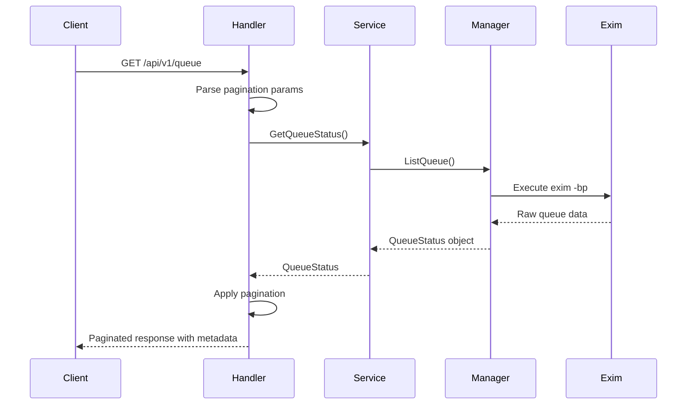
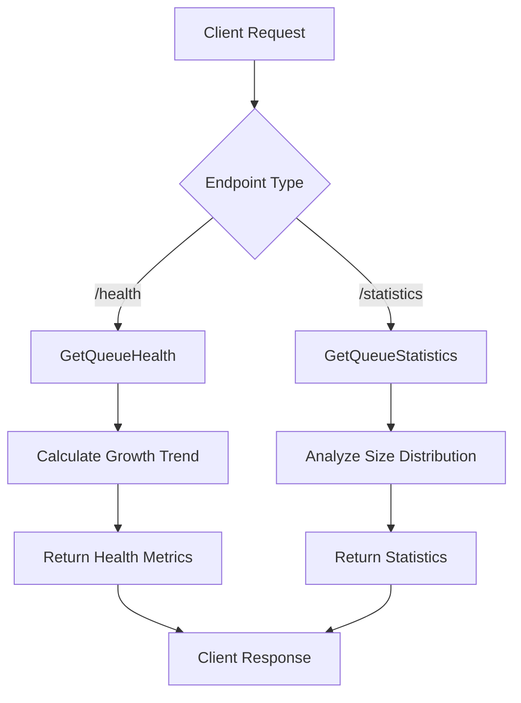
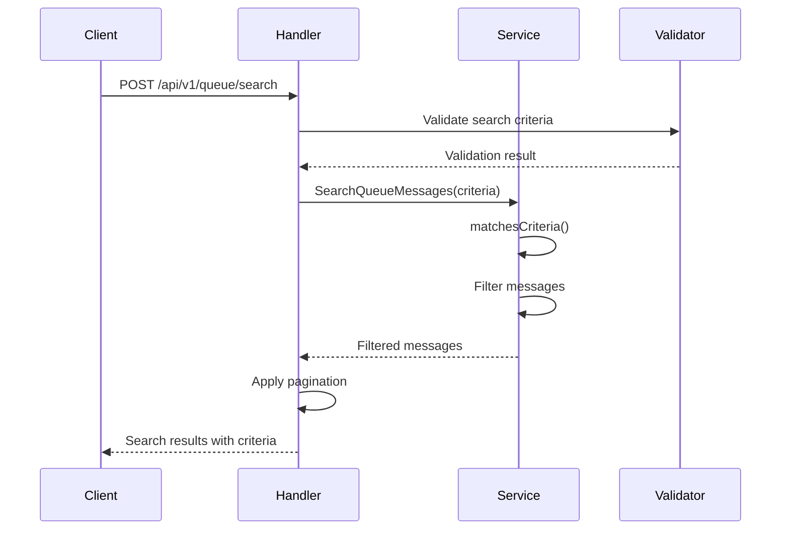
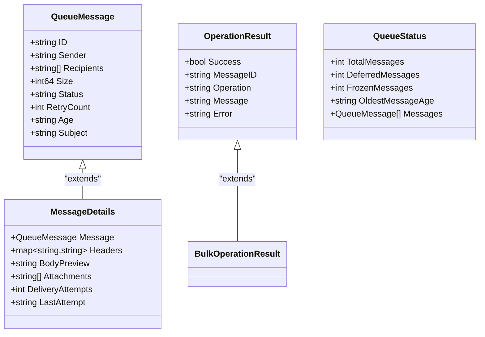
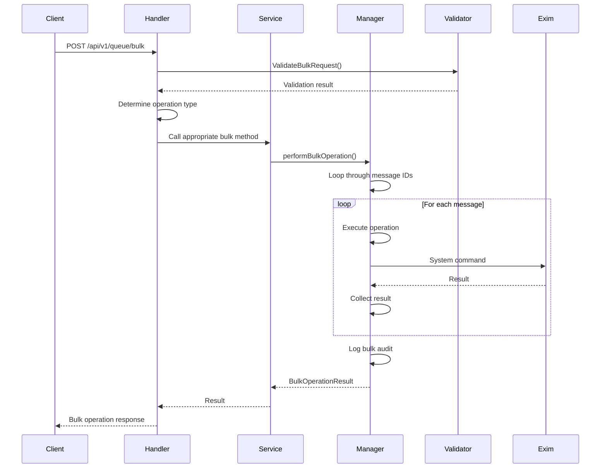
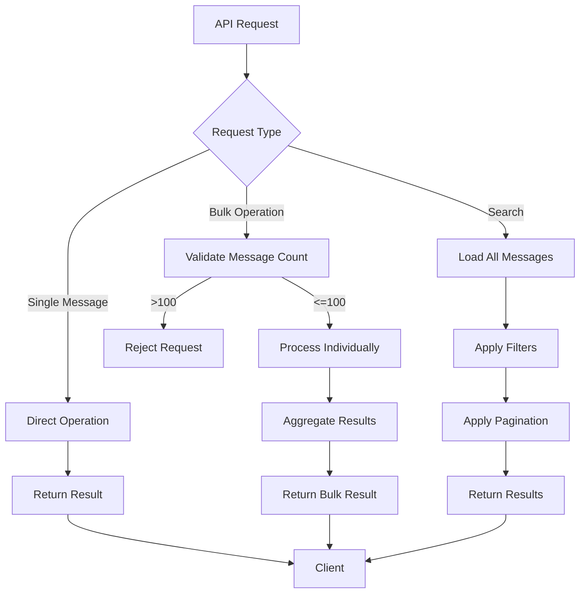
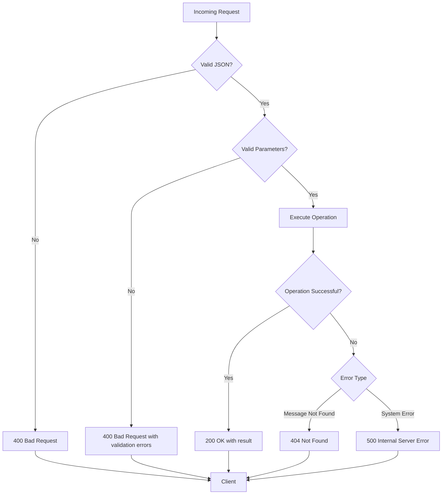

# Queue API


## Table of Contents
1. [Introduction](#introduction)
2. [Queue Management Endpoints](#queue-management-endpoints)
3. [Message Search Functionality](#message-search-functionality)
4. [Individual Message Operations](#individual-message-operations)
5. [Bulk Operations](#bulk-operations)
6. [Response Schemas](#response-schemas)
7. [Rate Limiting and Performance](#rate-limiting-and-performance)
8. [Common Workflows](#common-workflows)
9. [Error Handling](#error-handling)

## Introduction
The Queue API provides comprehensive management capabilities for email queue operations in the Exim mail server environment. This API enables administrators to monitor, search, and manipulate messages within the mail queue through a RESTful interface. The system supports listing messages with pagination, searching by various criteria, retrieving detailed message information, and performing actions such as delivery, freezing, thawing, and deletion both individually and in bulk.

The API is implemented in Go and follows a service-oriented architecture where HTTP handlers delegate to service layers that interact with the underlying Exim system and database. All operations are audited and logged for security and compliance purposes. The API endpoints are designed to support both direct administrative use and integration with frontend applications for queue management.

**Section sources**
- [queue_handlers.go](file://internal/api/queue_handlers.go#L1-L395)

## Queue Management Endpoints
The Queue API provides several endpoints for retrieving queue information with different levels of detail and filtering capabilities.

### List Messages with Pagination
The `GET /api/v1/queue` endpoint retrieves a paginated list of messages currently in the queue.

**Request Parameters**
- `page`: Page number (default: 1)
- `per_page`: Number of items per page (default: 50, maximum: 1000)

**Example Request**

```bash
curl -X GET "http://localhost:8080/api/v1/queue?page=1&per_page=20"
```


**Response Structure**

```json
{
  "messages": [
    {
      "id": "1a2b3c4d-5e6f",
      "sender": "user@example.com",
      "recipients": ["recipient@example.com"],
      "size": 1542,
      "status": "queued",
      "retry_count": 0,
      "age": "2h15m"
    }
  ],
  "total_messages": 150,
  "deferred_messages": 23,
  "frozen_messages": 5,
  "oldest_message_age": "4h30m"
}
```


This endpoint returns metadata about the queue state along with the paginated message list. The response includes counters for total messages, deferred messages, frozen messages, and the age of the oldest message in the queue.





**Diagram sources**
- [queue_handlers.go](file://internal/api/queue_handlers.go#L1-L395)
- [service.go](file://internal/queue/service.go#L1-L312)

**Section sources**
- [queue_handlers.go](file://internal/api/queue_handlers.go#L1-L395)

### Queue Health and Statistics
Additional endpoints provide detailed queue health metrics and statistics:

- `GET /api/v1/queue/health`: Returns queue health metrics including growth trends
- `GET /api/v1/queue/statistics`: Provides detailed statistics including size distribution and status breakdown





**Diagram sources**
- [service.go](file://internal/queue/service.go#L1-L312)

## Message Search Functionality
The Queue API provides robust search capabilities to locate messages based on various criteria.

### Search Endpoint
`POST /api/v1/queue/search` allows searching messages with complex filtering criteria.

**Request Body Structure**

```json
{
  "criteria": {
    "sender": "user@example.com",
    "recipient": "recipient@domain.com",
    "message_id": "1a2b3c4d",
    "status": "deferred",
    "min_size": 1024,
    "max_size": 102400,
    "min_retries": 1,
    "max_retries": 5
  },
  "page": 1,
  "per_page": 50
}
```


**Search Criteria Parameters**
- **sender**: Sender email address (supports partial match)
- **recipient**: Recipient email address (supports partial match)
- **message_id**: Message ID (supports partial match)
- **status**: Message status (queued, deferred, frozen)
- **min_size**: Minimum message size in bytes
- **max_size**: Maximum message size in bytes
- **min_retries**: Minimum retry count
- **max_retries**: Maximum retry count





**Diagram sources**
- [queue_handlers.go](file://internal/api/queue_handlers.go#L1-L395)
- [service.go](file://internal/queue/service.go#L1-L312)

**Section sources**
- [queue_handlers.go](file://internal/api/queue_handlers.go#L1-L395)
- [service.go](file://internal/queue/service.go#L1-L312)
- [validation.go](file://internal/validation/service.go#L250-L449)

## Individual Message Operations
The API supports various operations on individual messages through specific endpoints.

### Retrieve Message Details
`GET /api/v1/queue/{id}` retrieves detailed information about a specific message.

**Response Example**

```json
{
  "id": "1a2b3c4d-5e6f",
  "sender": "user@example.com",
  "recipients": ["recipient@example.com"],
  "size": 1542,
  "status": "queued",
  "retry_count": 0,
  "age": "2h15m",
  "subject": "Test Email Subject",
  "headers": {
    "from": "user@example.com",
    "to": "recipient@example.com",
    "date": "2023-01-15T10:30:00Z"
  },
  "body_preview": "This is the beginning of the email body..."
}
```


### Force Delivery
`POST /api/v1/queue/{id}/deliver` forces immediate delivery of a message.

**Response Example**

```json
{
  "success": true,
  "message_id": "1a2b3c4d-5e6f",
  "operation": "deliver_now",
  "message": "Delivery attempt initiated"
}
```


### Freeze Message
`POST /api/v1/queue/{id}/freeze` prevents a message from being delivered.

**Response Example**

```json
{
  "success": true,
  "message_id": "1a2b3c4d-5e6f",
  "operation": "freeze",
  "message": "Message frozen successfully"
}
```


### Thaw Message
`POST /api/v1/queue/{id}/thaw` releases a frozen message back into the delivery queue.

**Response Example**

```json
{
  "success": true,
  "message_id": "1a2b3c4d-5e6f",
  "operation": "thaw",
  "message": "Message thawed successfully"
}
```


### Delete Message
`DELETE /api/v1/queue/{id}` removes a message from the queue permanently.

**Response Example**

```json
{
  "success": true,
  "message_id": "1a2b3c4d-5e6f",
  "operation": "delete",
  "message": "Message deleted successfully"
}
```





**Diagram sources**
- [service.go](file://internal/queue/service.go#L1-L312)
- [operations.go](file://internal/queue/operations.go#L1-L433)

**Section sources**
- [queue_handlers.go](file://internal/api/queue_handlers.go#L1-L395)
- [operations.go](file://internal/queue/operations.go#L1-L433)

## Bulk Operations
The API supports bulk operations on multiple messages to improve efficiency for administrative tasks.

### Bulk Operations Endpoint
`POST /api/v1/queue/bulk` performs operations on multiple messages simultaneously.

**Request Body Structure**

```json
{
  "operation": "freeze",
  "message_ids": [
    "1a2b3c4d-5e6f",
    "2b3c4d5e-6f7a",
    "3c4d5e6f-7a8b"
  ]
}
```


**Supported Operations**
- `deliver`: Force delivery of messages
- `freeze`: Freeze messages to prevent delivery
- `thaw`: Thaw frozen messages
- `delete`: Delete messages from the queue

**Response Example**

```json
{
  "total_messages": 3,
  "successful_count": 2,
  "failed_count": 1,
  "operation": "freeze",
  "results": [
    {
      "success": true,
      "message_id": "1a2b3c4d-5e6f",
      "operation": "freeze",
      "message": "Message frozen successfully"
    },
    {
      "success": true,
      "message_id": "2b3c4d5e-6f7a",
      "operation": "freeze",
      "message": "Message frozen successfully"
    },
    {
      "success": false,
      "message_id": "3c4d5e6f-7a8b",
      "operation": "freeze",
      "error": "Message not found"
    }
  ]
}
```





**Diagram sources**
- [queue_handlers.go](file://internal/api/queue_handlers.go#L1-L395)
- [operations.go](file://internal/queue/operations.go#L1-L433)

**Section sources**
- [queue_handlers.go](file://internal/api/queue_handlers.go#L1-L395)
- [operations.go](file://internal/queue/operations.go#L1-L433)
- [validation.go](file://internal/validation/service.go#L250-L449)

## Response Schemas
The API uses consistent response schemas for success and error conditions.

### Success Response
All successful responses follow this structure:

```json
{
  "success": true,
  "data": { /* operation-specific data */ }
}
```


When pagination is involved, metadata is included:

```json
{
  "success": true,
  "data": { /* data */ },
  "meta": {
    "page": 1,
    "per_page": 50,
    "total": 150,
    "total_pages": 3
  }
}
```


### Error Response
Error responses follow this structure:

```json
{
  "success": false,
  "error": "Error description",
  "data": { /* validation errors or additional context */ }
}
```


### Validation Error Response
When input validation fails:

```json
{
  "success": false,
  "error": "Validation failed",
  "data": {
    "sender": ["Invalid email address format"],
    "message_ids[0]": ["Message ID cannot be empty"]
  }
}
```


**Section sources**
- [queue_handlers.go](file://internal/api/queue_handlers.go#L1-L395)
- [validation.go](file://internal/validation/service.go#L250-L449)

## Rate Limiting and Performance
The Queue API includes several performance considerations and limitations to ensure system stability.

### Database Performance
- Search operations load all messages into memory before filtering, which may impact performance with large queues
- Pagination is applied after filtering for search results
- The system creates periodic queue snapshots to enable historical analysis without impacting live queue operations

### Rate Limiting
- Bulk operations are limited to 100 messages per request to prevent system overload
- Pagination limits:
  - Maximum `per_page`: 1000 items
  - Maximum `page`: 10000
- Message ID validation prevents injection attacks and ensures valid Exim message IDs

### Optimization Recommendations
1. For large queues, use specific search criteria rather than retrieving all messages
2. Cache frequent queries when possible
3. Use bulk operations for administrative tasks affecting multiple messages
4. Monitor the growth trend metric to identify potential delivery issues





**Diagram sources**
- [queue_handlers.go](file://internal/api/queue_handlers.go#L1-L395)
- [operations.go](file://internal/queue/operations.go#L1-L433)

## Common Workflows
This section provides examples of common administrative workflows using curl commands.

### Drain a Frozen Queue

```bash
# First, search for frozen messages
curl -X POST "http://localhost:8080/api/v1/queue/search" \
  -H "Content-Type: application/json" \
  -d '{
    "criteria": {
      "status": "frozen"
    }
  }'

# Extract message IDs from response and thaw them in bulk
curl -X POST "http://localhost:8080/api/v1/queue/bulk" \
  -H "Content-Type: application/json" \
  -d '{
    "operation": "thaw",
    "message_ids": ["1a2b3c4d", "2b3c4d5e", "3c4d5e6f"]
  }'
```


### Retry Failed Messages

```bash
# Search for deferred messages with high retry counts
curl -X POST "http://localhost:8080/api/v1/queue/search" \
  -H "Content-Type: application/json" \
  -d '{
    "criteria": {
      "status": "deferred",
      "min_retries": 5
    }
  }'

# Force delivery of specific messages
curl -X POST "http://localhost:8080/api/v1/queue/1a2b3c4d/deliver"

# Or deliver multiple messages in bulk
curl -X POST "http://localhost:8080/api/v1/queue/bulk" \
  -H "Content-Type: application/json" \
  -d '{
    "operation": "deliver",
    "message_ids": ["1a2b3c4d", "2b3c4d5e"]
  }'
```


### Delete Spam Messages

```bash
# Search for messages from a spam sender
curl -X POST "http://localhost:8080/api/v1/queue/search" \
  -H "Content-Type: application/json" \
  -d '{
    "criteria": {
      "sender": "spammer@example.com"
    }
  }'

# Delete all matching messages
curl -X POST "http://localhost:8080/api/v1/queue/bulk" \
  -H "Content-Type: application/json" \
  -d '{
    "operation": "delete",
    "message_ids": ["1a2b3c4d", "2b3c4d5e", "3c4d5e6f"]
  }'
```


**Section sources**
- [queue_handlers.go](file://internal/api/queue_handlers.go#L1-L395)
- [operations.go](file://internal/queue/operations.go#L1-L433)

## Error Handling
The API implements comprehensive error handling for various failure scenarios.

### Common Error Responses
- **400 Bad Request**: Invalid parameters, malformed JSON, or validation errors
- **404 Not Found**: Message ID not found in the queue
- **500 Internal Server Error**: System errors during operation execution

### Validation Rules
The validation service enforces the following rules:

**Message ID Validation**
- Cannot be empty
- Must be at least 10 characters long
- Should match Exim message ID format

**Bulk Request Validation**
- Operation must be one of: deliver, freeze, thaw, delete
- Message IDs array must contain 1-100 items
- Each message ID must be valid

**Search Criteria Validation**
- Email addresses must be valid format
- Size limits must be positive integers
- Status must be one of: queued, deferred, frozen





**Diagram sources**
- [queue_handlers.go](file://internal/api/queue_handlers.go#L1-L395)
- [validation.go](file://internal/validation/service.go#L250-L449)

**Section sources**
- [queue_handlers.go](file://internal/api/queue_handlers.go#L1-L395)
- [validation.go](file://internal/validation/service.go#L250-L449)

**Referenced Files in This Document**   
- [queue_handlers.go](file://internal/api/queue_handlers.go#L1-L395)
- [service.go](file://internal/queue/service.go#L1-L312)
- [operations.go](file://internal/queue/operations.go#L1-L433)
- [validation.go](file://internal/validation/service.go#L250-L449)