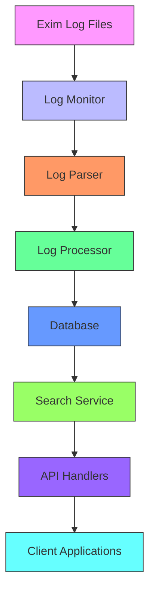
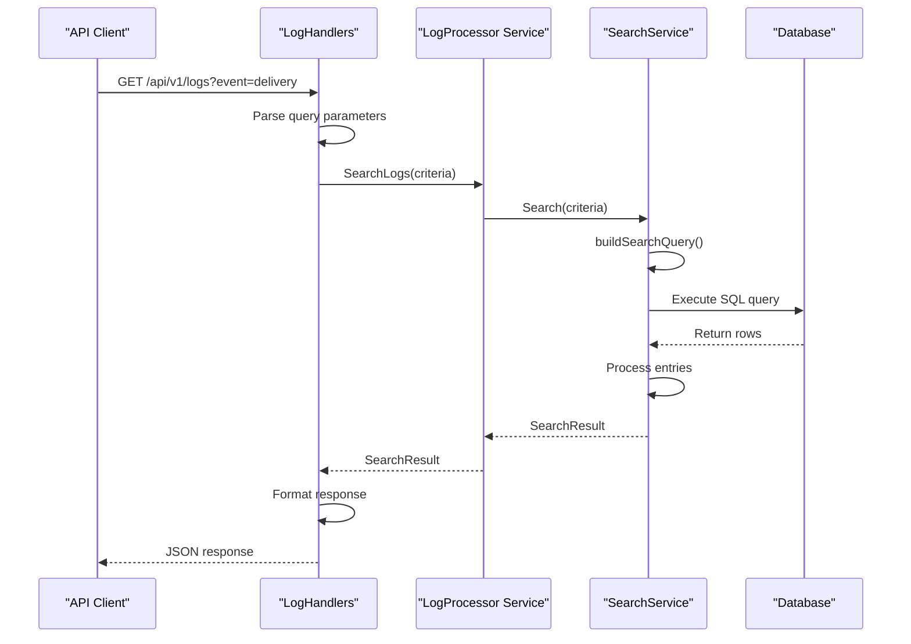

# Logs API


## Table of Contents
1. [Introduction](#introduction)
2. [Log Retrieval Endpoints](#log-retrieval-endpoints)
3. [Search Request Parameters](#search-request-parameters)
4. [Response Schema](#response-schema)
5. [Log Processing Integration](#log-processing-integration)
6. [Search Examples](#search-examples)
7. [Performance Considerations](#performance-considerations)
8. [Sample Responses](#sample-responses)

## Introduction
The Logs API provides comprehensive functionality for retrieving, searching, and analyzing email server log entries. The system processes Exim mail server logs, parses them into structured data, and enables powerful search capabilities with filtering, pagination, and correlation features. This documentation details the API endpoints, request parameters, response schemas, and underlying architecture that enables efficient log retrieval and analysis.

**Section sources**
- [log_handlers.go](file://internal/api/log_handlers.go#L1-L50)
- [service.go](file://internal/logprocessor/service.go#L1-L50)

## Log Retrieval Endpoints
The Logs API provides multiple endpoints for accessing log data with various filtering and search capabilities.

### List Log Entries
Retrieves parsed log entries with filtering and pagination.

**Endpoint**: `GET /api/v1/logs`

**Parameters**:
- **start_time**: Filter logs from this timestamp (RFC3339 format)
- **end_time**: Filter logs up to this timestamp (RFC3339 format)
- **message_id**: Filter by message ID
- **sender**: Filter by sender email address
- **log_type**: Filter by log type (main, reject, panic)
- **event**: Filter by event type (arrival, delivery, defer, bounce, reject, panic)
- **status**: Filter by status
- **host**: Filter by host or IP address
- **error_code**: Filter by error code
- **min_size**: Filter by minimum message size in bytes
- **max_size**: Filter by maximum message size in bytes
- **sort_by**: Field to sort by (default: timestamp)
- **sort_order**: Sort order (asc or desc, default: desc)
- **page**: Page number for pagination (default: 1)
- **per_page**: Number of results per page (default: 50, max: 1000)

**Example**: `GET /api/v1/logs?start_time=2023-01-01T00:00:00Z&end_time=2023-01-02T00:00:00Z&event=delivery&per_page=100`

### Advanced Log Search
Performs advanced search with complex criteria via POST request.

**Endpoint**: `POST /api/v1/logs/search`

**Request Body**:

```json
{
  "criteria": {
    "start_time": "2023-01-01T00:00:00Z",
    "end_time": "2023-01-02T00:00:00Z",
    "message_id": "1rABC-123456-78",
    "sender": "user@example.com",
    "recipients": ["recipient@example.com"],
    "log_types": ["main"],
    "events": ["delivery", "defer"],
    "status": "delivered",
    "keywords": ["timeout", "failed"],
    "error_code": "451",
    "host": "mail.example.com",
    "min_size": 1024,
    "max_size": 1048576,
    "sort_by": "timestamp",
    "sort_order": "desc"
  },
  "page": 1,
  "per_page": 100
}
```


### Real-time Log Tail
Provides WebSocket endpoint for real-time log streaming.

**Endpoint**: `GET /api/v1/logs/tail`

**Query Parameters**:
- **message_id**: Filter real-time logs by message ID
- **log_type**: Filter by log type
- **event**: Filter by event type
- **keywords**: Filter by keywords in log message

### Dashboard Metrics
Retrieves aggregated log statistics for dashboard display.

**Endpoint**: `GET /api/v1/dashboard`

**Parameters**:
- **start_time**: Start of time period (default: 24 hours ago)
- **end_time**: End of time period (default: now)

**Section sources**
- [log_handlers.go](file://internal/api/log_handlers.go#L52-L150)
- [log_handlers.go](file://internal/api/log_handlers.go#L152-L200)
- [log_handlers.go](file://internal/api/log_handlers.go#L202-L230)
- [log_handlers.go](file://internal/api/log_handlers.go#L232-L270)

## Search Request Parameters
The Logs API supports comprehensive search parameters for filtering and retrieving log entries.

### Time Range Filtering
Filter log entries by timestamp range.

**Parameters**:
- **start_time**: RFC3339 formatted timestamp to start from
- **end_time**: RFC3339 formatted timestamp to end at

**Example**: Retrieve logs from the last hour

```
GET /api/v1/logs?start_time=2023-01-01T12:00:00Z&end_time=2023-01-01T13:00:00Z
```


### Message Filtering
Filter logs by message attributes.

**Parameters**:
- **message_id**: Exact message ID to filter by
- **sender**: Sender email address (partial match)
- **recipients**: Recipient email address (partial match)

### Log Type and Event Filtering
Filter by log source and event type.

**Parameters**:
- **log_type**: Type of log (main, reject, panic)
- **event**: Event type (arrival, delivery, defer, bounce, reject, panic)
- **status**: Status of the operation

### Content and Error Filtering
Search within log content and error details.

**Parameters**:
- **keywords**: Keywords to search in raw log line or error text
- **error_code**: Error code to filter by
- **host**: Hostname or IP address to filter by

### Size Filtering
Filter by message size.

**Parameters**:
- **min_size**: Minimum message size in bytes
- **max_size**: Maximum message size in bytes

### Pagination and Sorting
Control result pagination and ordering.

**Parameters**:
- **page**: Page number (1-based)
- **per_page**: Number of results per page (1-1000)
- **sort_by**: Field to sort by (timestamp, message_id, size, etc.)
- **sort_order**: Sort direction (asc, desc)

**Section sources**
- [search.go](file://internal/logprocessor/search.go#L24-L55)
- [log_handlers.go](file://internal/api/log_handlers.go#L52-L150)

## Response Schema
The Logs API returns structured responses with log entries and metadata.

### Log Entry Structure
Each log entry contains parsed information from the original log line.


```json
{
  "id": 12345,
  "timestamp": "2023-01-01T12:34:56Z",
  "message_id": "1rABC-123456-78",
  "log_type": "main",
  "event": "delivery",
  "host": "mail.example.com",
  "sender": "sender@example.com",
  "recipients": ["recipient@example.com"],
  "size": 2048,
  "status": "delivered",
  "error_code": null,
  "error_text": null,
  "raw_line": "2023-01-01 12:34:56 1rABC-123456-78 => recipient@example.com R=example T=example H=mail.example.com [192.168.1.1]",
  "created_at": "2023-01-01T12:34:57Z"
}
```


**Fields**:
- **id**: Unique identifier for the log entry
- **timestamp**: When the event occurred
- **message_id**: Exim message ID
- **log_type**: Source of the log (main, reject, panic)
- **event**: Type of event (arrival, delivery, defer, bounce, reject, panic)
- **host**: Hostname or IP address involved
- **sender**: Sender email address
- **recipients**: Array of recipient email addresses
- **size**: Message size in bytes
- **status**: Operation status
- **error_code**: SMTP error code if applicable
- **error_text**: Error description if applicable
- **raw_line**: Original log line
- **created_at**: When the entry was stored in the database

### Search Result Structure
Search results include entries, metadata, and aggregations.


```json
{
  "success": true,
  "data": {
    "entries": [...],
    "search_time": "12.345ms",
    "aggregations": {
      "event_counts": {
        "delivery": 45,
        "defer": 5
      },
      "log_type_counts": {
        "main": 50
      },
      "status_counts": {
        "delivered": 45,
        "deferred": 5
      },
      "hourly_distribution": {
        "2023-01-01 12:00": 30,
        "2023-01-01 13:00": 20
      },
      "top_senders": [
        {
          "sender": "sender@example.com",
          "count": 50
        }
      ],
      "top_hosts": [
        {
          "host": "mail.example.com",
          "count": 50
        }
      ]
    }
  },
  "meta": {
    "page": 1,
    "per_page": 50,
    "total": 50,
    "total_pages": 1
  }
}
```


**Section sources**
- [models.go](file://internal/database/models.go#L70-L86)
- [search.go](file://internal/logprocessor/search.go#L66-L87)
- [response.go](file://internal/api/response.go#L3-L12)

## Log Processing Integration
The log retrieval system integrates multiple components to provide enriched log data.

### Architecture Overview




**Diagram sources**
- [logmonitor/monitor.go](file://internal/logmonitor/monitor.go)
- [parser/exim_parser.go](file://internal/parser/exim_parser.go)
- [logprocessor/service.go](file://internal/logprocessor/service.go)
- [database/models.go](file://internal/database/models.go)
- [logprocessor/search.go](file://internal/logprocessor/search.go)
- [log_handlers.go](file://internal/api/log_handlers.go)

### Log Parser Integration
The `EximParser` processes raw log lines and extracts structured data.





**Diagram sources**
- [log_handlers.go](file://internal/api/log_handlers.go#L52-L150)
- [service.go](file://internal/logprocessor/service.go#L200-L220)
- [search.go](file://internal/logprocessor/search.go#L100-L167)
- [models.go](file://internal/database/models.go#L70-L86)

### Data Flow
The log processing pipeline follows these steps:
1. Raw log lines are read from Exim log files
2. The `EximParser` processes each line using regex patterns
3. Parsed data is stored in the database as `LogEntry` objects
4. The `SearchService` provides query capabilities on stored data
5. API handlers expose search functionality to clients

**Section sources**
- [exim_parser.go](file://internal/parser/exim_parser.go#L1-L300)
- [service.go](file://internal/logprocessor/service.go#L1-L50)
- [search.go](file://internal/logprocessor/search.go#L1-L50)

## Search Examples
Practical examples of searching for specific log events.

### Searching for Delivery Failures
Find all delivery failures with timeout errors.

**Request**:

```
GET /api/v1/logs?event=defer&keywords=timeout&start_time=2023-01-01T00:00:00Z&end_time=2023-01-02T00:00:00Z
```


**Response**:

```json
{
  "success": true,
  "data": {
    "entries": [
      {
        "id": 1001,
        "timestamp": "2023-01-01T10:30:00Z",
        "message_id": "1rDEF-789012-34",
        "log_type": "main",
        "event": "defer",
        "host": "timeout.example.com",
        "sender": "sender@example.com",
        "recipients": ["recipient@example.com"],
        "size": 4096,
        "status": "deferred",
        "error_code": "451",
        "error_text": "Temporary failure: Connection timed out",
        "raw_line": "2023-01-01 10:30:00 1rDEF-789012-34 == recipient@example.com R=example T=example defer (451): Temporary failure: Connection timed out"
      }
    ],
    "search_time": "5.678ms",
    "aggregations": {
      "event_counts": {"defer": 1},
      "log_type_counts": {"main": 1},
      "status_counts": {"deferred": 1}
    }
  },
  "meta": {
    "page": 1,
    "per_page": 50,
    "total": 1,
    "total_pages": 1
  }
}
```


### Searching for Connection Timeouts
Identify connection timeout issues across multiple log entries.

**Request**:

```
GET /api/v1/logs?keywords=timeout&log_type=main&start_time=2023-01-01T00:00:00Z
```


**Response**:

```json
{
  "success": true,
  "data": {
    "entries": [
      {
        "id": 1002,
        "timestamp": "2023-01-01T11:15:30Z",
        "message_id": "1rGHI-345678-90",
        "log_type": "main",
        "event": "defer",
        "host": "slow-server.com",
        "sender": "sender2@example.com",
        "recipients": ["recipient2@example.com"],
        "size": 8192,
        "status": "deferred",
        "error_code": "451",
        "error_text": "Connection timed out during delivery attempt",
        "raw_line": "2023-01-01 11:15:30 1rGHI-345678-90 == recipient2@example.com R=example T=example defer (451): Connection timed out during delivery attempt"
      },
      {
        "id": 1003,
        "timestamp": "2023-01-01T11:16:45Z",
        "message_id": "1rJKL-901234-56",
        "log_type": "main",
        "event": "defer",
        "host": "unresponsive.com",
        "sender": "sender3@example.com",
        "recipients": ["recipient3@example.com"],
        "size": 2048,
        "status": "deferred",
        "error_code": "451",
        "error_text": "Timeout waiting for server response",
        "raw_line": "2023-01-01 11:16:45 1rJKL-901234-56 == recipient3@example.com R=example T=example defer (451): Timeout waiting for server response"
      }
    ],
    "search_time": "8.912ms",
    "aggregations": {
      "event_counts": {"defer": 2},
      "log_type_counts": {"main": 2},
      "status_counts": {"deferred": 2},
      "top_hosts": [
        {"host": "slow-server.com", "count": 1},
        {"host": "unresponsive.com", "count": 1}
      ]
    }
  },
  "meta": {
    "page": 1,
    "per_page": 50,
    "total": 2,
    "total_pages": 1
  }
}
```


**Section sources**
- [log_handlers.go](file://internal/api/log_handlers.go#L52-L150)
- [search.go](file://internal/logprocessor/search.go#L246-L300)
- [exim_parser.go](file://internal/parser/exim_parser.go#L1-L300)

## Performance Considerations
The Logs API includes several performance optimizations and considerations.

### Large Time Range Queries
Large time range queries can impact performance significantly. The system implements the following mitigations:

- **Indexing**: Database indexes on timestamp, message_id, and event fields
- **Pagination**: Results are paginated by default (50 entries per page)
- **Query Optimization**: The search service builds efficient SQL queries with proper WHERE clauses
- **Result Limits**: Maximum of 1000 entries per request to prevent memory issues

**Best Practices**:
- Use specific time ranges instead of broad date spans
- Apply additional filters (message_id, event, etc.) to narrow results
- Use pagination for large result sets
- Consider using the export endpoint for bulk data retrieval

### Caching Strategy
The system implements a multi-layer caching strategy for frequent searches:

- **Database Level**: SQLite query planner optimizes repeated queries
- **Application Level**: No explicit caching layer, but connection pooling improves performance
- **Client Level**: Clients should implement caching for frequently accessed data

The system is designed for real-time log analysis rather than heavy caching, prioritizing up-to-date information over cached results.

### Performance Monitoring
The log processor service includes performance monitoring:

- **Search Time Tracking**: Each search response includes search duration
- **Query Optimization**: Complex queries are optimized with proper indexing
- **Resource Limits**: Configuration options limit search result sizes and processing timeouts

**Section sources**
- [search.go](file://internal/logprocessor/search.go#L246-L300)
- [service.go](file://internal/logprocessor/service.go#L1-L50)
- [search.go](file://internal/logprocessor/search.go#L121-L167)

## Sample Responses
Examples of API responses showing message lifecycle traces.

### Message Lifecycle Trace
Response showing multiple log entries for a single message.


```json
{
  "success": true,
  "data": {
    "entries": [
      {
        "id": 2001,
        "timestamp": "2023-01-01T09:00:00Z",
        "message_id": "1rMNO-567890-12",
        "log_type": "main",
        "event": "arrival",
        "host": "inbound.example.com",
        "sender": "external@example.com",
        "recipients": ["internal@company.com"],
        "size": 16384,
        "status": "received",
        "error_code": null,
        "error_text": null,
        "raw_line": "2023-01-01 09:00:00 1rMNO-567890-12 <= external@example.com H=inbound.example.com [203.0.113.10] ... S=16384"
      },
      {
        "id": 2002,
        "timestamp": "2023-01-01T09:00:15Z",
        "message_id": "1rMNO-567890-12",
        "log_type": "main",
        "event": "delivery",
        "host": "internal-server.company.com",
        "sender": "external@example.com",
        "recipients": ["internal@company.com"],
        "size": 16384,
        "status": "delivered",
        "error_code": null,
        "error_text": null,
        "raw_line": "2023-01-01 09:00:15 1rMNO-567890-12 => internal@company.com R=local_user T=local_delivery H=internal-server.company.com [10.0.0.5]"
      },
      {
        "id": 2003,
        "timestamp": "2023-01-01T09:00:16Z",
        "message_id": "1rMNO-567890-12",
        "log_type": "main",
        "event": "completed",
        "host": null,
        "sender": null,
        "recipients": [],
        "size": null,
        "status": "completed",
        "error_code": null,
        "error_text": null,
        "raw_line": "2023-01-01 09:00:16 1rMNO-567890-12 Completed"
      }
    ],
    "search_time": "6.789ms",
    "aggregations": {
      "event_counts": {
        "arrival": 1,
        "delivery": 1,
        "completed": 1
      },
      "log_type_counts": {
        "main": 3
      },
      "status_counts": {
        "received": 1,
        "delivered": 1,
        "completed": 1
      }
    }
  },
  "meta": {
    "page": 1,
    "per_page": 50,
    "total": 3,
    "total_pages": 1
  }
}
```


### Error Pattern Analysis
Response showing aggregated data for error analysis.


```json
{
  "success": true,
  "data": {
    "entries": [
      {
        "id": 3001,
        "timestamp": "2023-01-01T14:30:00Z",
        "message_id": "1rPQR-123456-78",
        "log_type": "main",
        "event": "defer",
        "host": "problematic-server.com",
        "sender": "sender4@example.com",
        "recipients": ["recipient4@example.com"],
        "size": 4096,
        "status": "deferred",
        "error_code": "451",
        "error_text": "Temporary authentication failure",
        "raw_line": "2023-01-01 14:30:00 1rPQR-123456-78 == recipient4@example.com R=example T=example defer (451): Temporary authentication failure"
      },
      {
        "id": 3002,
        "timestamp": "2023-01-01T14:35:00Z",
        "message_id": "1rSTU-789012-34",
        "log_type": "main",
        "event": "defer",
        "host": "problematic-server.com",
        "sender": "sender5@example.com",
        "recipients": ["recipient5@example.com"],
        "size": 8192,
        "status": "deferred",
        "error_code": "451",
        "error_text": "Temporary authentication failure",
        "raw_line": "2023-01-01 14:35:00 1rSTU-789012-34 == recipient5@example.com R=example T=example defer (451): Temporary authentication failure"
      }
    ],
    "search_time": "7.456ms",
    "aggregations": {
      "event_counts": {
        "defer": 2
      },
      "log_type_counts": {
        "main": 2
      },
      "status_counts": {
        "deferred": 2
      },
      "hourly_distribution": {
        "2023-01-01 14:00": 2
      },
      "top_hosts": [
        {
          "host": "problematic-server.com",
          "count": 2
        }
      ],
      "top_senders": [
        {
          "sender": "sender4@example.com",
          "count": 1
        },
        {
          "sender": "sender5@example.com",
          "count": 1
        }
      ]
    }
  },
  "meta": {
    "page": 1,
    "per_page": 50,
    "total": 2,
    "total_pages": 1
  }
}
```


**Section sources**
- [models.go](file://internal/database/models.go#L70-L86)
- [search.go](file://internal/logprocessor/search.go#L121-L167)
- [log_handlers.go](file://internal/api/log_handlers.go#L52-L150)

**Referenced Files in This Document**   
- [log_handlers.go](file://internal/api/log_handlers.go)
- [search.go](file://internal/logprocessor/search.go)
- [service.go](file://internal/logprocessor/service.go)
- [models.go](file://internal/database/models.go)
- [response.go](file://internal/api/response.go)
- [utils.go](file://internal/api/utils.go)
- [exim_parser.go](file://internal/parser/exim_parser.go)