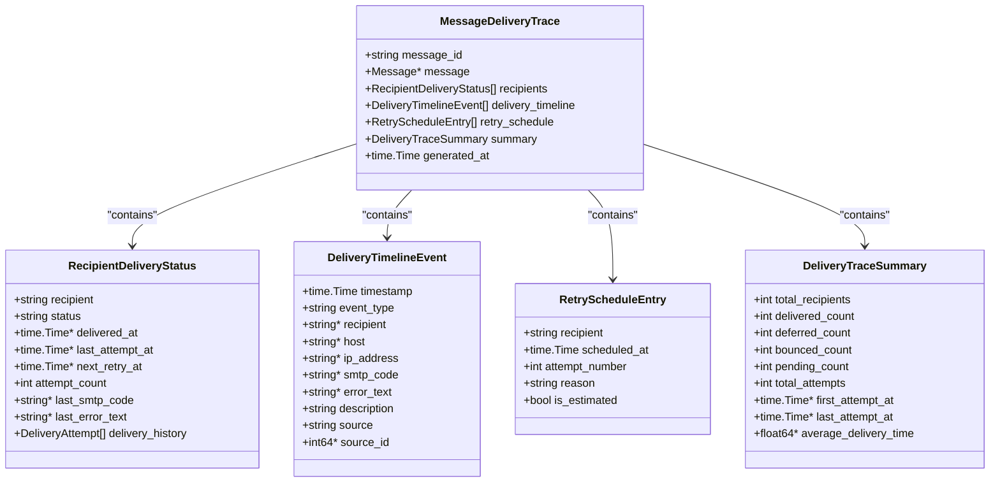

# Message Trace API


## Table of Contents
1. [Introduction](#introduction)
2. [Core Data Structures](#core-data-structures)
3. [API Endpoint: GET /api/v1/messages/{id}/delivery-trace](#api-endpoint-get-apiv1messagesiddelivery-trace)
4. [Message Trace Handlers Implementation](#message-trace-handlers-implementation)
5. [Response Structure and Examples](#response-structure-and-examples)
6. [Error Handling and Status Codes](#error-handling-and-status-codes)
7. [Performance Considerations](#performance-considerations)
8. [Related Endpoints](#related-endpoints)
9. [Frontend Integration](#frontend-integration)

## Introduction
The Message Trace API provides comprehensive delivery timeline visualization for email messages processed by the Exim mail server. This API enables users to trace the complete delivery history of a message, including delivery attempts, recipient statuses, retry schedules, and associated log entries. The system correlates data from multiple sources including the database and log files to reconstruct an accurate delivery history.

The API is implemented in Go and follows REST principles, providing structured JSON responses that can be consumed by frontend applications for visualization. The core functionality is located in the `message_trace_handlers.go` file, which orchestrates data retrieval from various repositories and services.

## Core Data Structures

The message tracing system uses several key data structures to represent delivery information:





**Diagram sources**
- [models.go](file://internal/database/models.go#L169-L226)

**Section sources**
- [models.go](file://internal/database/models.go#L169-L226)

## API Endpoint: GET /api/v1/messages/{id}/delivery-trace

The primary endpoint for message tracing provides a comprehensive view of a message's delivery history.

### Path Parameter Requirements
- **id**: The message ID to trace (required)
  - Must be a non-empty string
  - Length must be between 6 and 50 characters
  - Typically follows Exim message ID format (alphanumeric with hyphens)

### Request Details

```
GET /api/v1/messages/{message_id}/delivery-trace
Authorization: Bearer <token>
```


### Response Structure
The endpoint returns a `MessageDeliveryTrace` object with the following properties:

**MessageDeliveryTrace**
- **message_id**: Unique identifier of the message
- **message**: Basic message metadata (optional)
- **recipients**: Array of recipient delivery statuses
- **delivery_timeline**: Chronological array of delivery events
- **retry_schedule**: Future retry attempts scheduled
- **summary**: Aggregated delivery statistics
- **generated_at**: Timestamp when the trace was generated

Each component provides specific information about the message delivery process, enabling detailed analysis of delivery success, failures, and timing.

**Section sources**
- [message_trace_handlers.go](file://internal/api/message_trace_handlers.go#L38-L84)
- [models.go](file://internal/database/models.go#L169-L177)

## Message Trace Handlers Implementation

The `MessageTraceHandlers` struct in `message_trace_handlers.go` implements the core logic for message tracing. It coordinates data retrieval from multiple sources to construct a complete delivery history.


**Diagram sources**
- [message_trace_handlers.go](file://internal/api/message_trace_handlers.go#L38-L84)
- [repository.go](file://internal/database/repository.go)

The handler first validates the message ID format, then retrieves the comprehensive delivery trace from the repository. The repository correlates data from logs and database models to reconstruct the complete delivery history, including events from multiple sources.

**Section sources**
- [message_trace_handlers.go](file://internal/api/message_trace_handlers.go#L38-L84)
- [repository.go](file://internal/database/repository.go)

## Response Structure and Examples

### Successful Delivery Example

```json
{
  "message_id": "1a2b3c4d",
  "message": {
    "id": "1a2b3c4d",
    "timestamp": "2023-01-15T10:30:00Z",
    "sender": "sender@example.com",
    "size": 2048,
    "status": "delivered"
  },
  "recipients": [
    {
      "recipient": "user1@example.com",
      "status": "delivered",
      "delivered_at": "2023-01-15T10:31:25Z",
      "last_attempt_at": "2023-01-15T10:31:25Z",
      "attempt_count": 1,
      "delivery_history": [
        {
          "timestamp": "2023-01-15T10:31:25Z",
          "status": "success",
          "host": "mx1.example.com",
          "ip_address": "192.0.2.1",
          "smtp_code": "250",
          "error_text": null
        }
      ]
    }
  ],
  "delivery_timeline": [
    {
      "timestamp": "2023-01-15T10:30:00Z",
      "event_type": "arrival",
      "description": "Message received from sender",
      "source": "log",
      "source_id": 12345
    },
    {
      "timestamp": "2023-01-15T10:31:25Z",
      "event_type": "delivery",
      "recipient": "user1@example.com",
      "host": "mx1.example.com",
      "ip_address": "192.0.2.1",
      "smtp_code": "250",
      "description": "Message delivered successfully",
      "source": "log",
      "source_id": 12346
    }
  ],
  "retry_schedule": [],
  "summary": {
    "total_recipients": 1,
    "delivered_count": 1,
    "deferred_count": 0,
    "bounced_count": 0,
    "pending_count": 0,
    "total_attempts": 1,
    "first_attempt_at": "2023-01-15T10:31:25Z",
    "last_attempt_at": "2023-01-15T10:31:25Z",
    "average_delivery_time_seconds": 85
  },
  "generated_at": "2023-01-15T10:32:00Z"
}
```


### Permanent Failure Example

```json
{
  "message_id": "5e6f7g8h",
  "recipients": [
    {
      "recipient": "invalid@domain.com",
      "status": "bounced",
      "last_attempt_at": "2023-01-15T11:45:30Z",
      "attempt_count": 3,
      "last_smtp_code": "550",
      "last_error_text": "User unknown",
      "delivery_history": [
        {
          "timestamp": "2023-01-15T11:30:00Z",
          "status": "failed",
          "host": "mx1.target.com",
          "ip_address": "198.51.100.1",
          "smtp_code": "450",
          "error_text": "Too many connections"
        },
        {
          "timestamp": "2023-01-15T11:40:00Z",
          "status": "failed",
          "host": "mx1.target.com",
          "ip_address": "198.51.100.1",
          "smtp_code": "421",
          "error_text": "Service not available"
        },
        {
          "timestamp": "2023-01-15T11:45:30Z",
          "status": "failed",
          "host": "mx1.target.com",
          "ip_address": "198.51.100.1",
          "smtp_code": "550",
          "error_text": "User unknown"
        }
      ]
    }
  ],
  "delivery_timeline": [
    {
      "timestamp": "2023-01-15T11:30:00Z",
      "event_type": "attempt",
      "recipient": "invalid@domain.com",
      "host": "mx1.target.com",
      "smtp_code": "450",
      "error_text": "Too many connections",
      "description": "Delivery attempt failed - temporary error",
      "source": "log"
    },
    {
      "timestamp": "2023-01-15T11:40:00Z",
      "event_type": "attempt",
      "recipient": "invalid@domain.com",
      "host": "mx1.target.com",
      "smtp_code": "421",
      "error_text": "Service not available",
      "description": "Delivery attempt failed - service unavailable",
      "source": "log"
    },
    {
      "timestamp": "2023-01-15T11:45:30Z",
      "event_type": "bounce",
      "recipient": "invalid@domain.com",
      "host": "mx1.target.com",
      "smtp_code": "550",
      "error_text": "User unknown",
      "description": "Delivery failed permanently - recipient unknown",
      "source": "log"
    }
  ],
  "retry_schedule": [],
  "summary": {
    "total_recipients": 1,
    "delivered_count": 0,
    "deferred_count": 0,
    "bounced_count": 1,
    "pending_count": 0,
    "total_attempts": 3,
    "first_attempt_at": "2023-01-15T11:30:00Z",
    "last_attempt_at": "2023-01-15T11:45:30Z"
  },
  "generated_at": "2023-01-15T11:46:00Z"
}
```


### Temporary Deferral Example

```json
{
  "message_id": "9i0j1k2l",
  "recipients": [
    {
      "recipient": "user@busy-server.com",
      "status": "deferred",
      "last_attempt_at": "2023-01-15T12:15:00Z",
      "next_retry_at": "2023-01-15T12:45:00Z",
      "attempt_count": 2,
      "last_smtp_code": "421",
      "last_error_text": "Too many connections",
      "delivery_history": [
        {
          "timestamp": "2023-01-15T12:00:00Z",
          "status": "failed",
          "host": "mx1.busy.com",
          "ip_address": "203.0.113.1",
          "smtp_code": "421",
          "error_text": "Too many connections"
        },
        {
          "timestamp": "2023-01-15T12:15:00Z",
          "status": "failed",
          "host": "mx1.busy.com",
          "ip_address": "203.0.113.1",
          "smtp_code": "421",
          "error_text": "Too many connections"
        }
      ]
    }
  ],
  "delivery_timeline": [
    {
      "timestamp": "2023-01-15T12:00:00Z",
      "event_type": "attempt",
      "recipient": "user@busy-server.com",
      "host": "mx1.busy.com",
      "smtp_code": "421",
      "error_text": "Too many connections",
      "description": "Delivery attempt failed - server too busy",
      "source": "log"
    },
    {
      "timestamp": "2023-01-15T12:15:00Z",
      "event_type": "attempt",
      "recipient": "user@busy-server.com",
      "host": "mx1.busy.com",
      "smtp_code": "421",
      "error_text": "Too many connections",
      "description": "Delivery attempt failed - server still busy",
      "source": "log"
    }
  ],
  "retry_schedule": [
    {
      "recipient": "user@busy-server.com",
      "scheduled_at": "2023-01-15T12:45:00Z",
      "attempt_number": 3,
      "reason": "temporary failure",
      "is_estimated": false
    },
    {
      "recipient": "user@busy-server.com",
      "scheduled_at": "2023-01-15T13:45:00Z",
      "attempt_number": 4,
      "reason": "temporary failure",
      "is_estimated": true
    }
  ],
  "summary": {
    "total_recipients": 1,
    "delivered_count": 0,
    "deferred_count": 1,
    "bounced_count": 0,
    "pending_count": 0,
    "total_attempts": 2,
    "first_attempt_at": "2023-01-15T12:00:00Z",
    "last_attempt_at": "2023-01-15T12:15:00Z"
  },
  "generated_at": "2023-01-15T12:16:00Z"
}
```


**Section sources**
- [message_trace_handlers.go](file://internal/api/message_trace_handlers.go)
- [models.go](file://internal/database/models.go)

## Error Handling and Status Codes

The API implements comprehensive error handling with appropriate HTTP status codes:

| Status Code | Scenario | Response Body |
|-------------|---------|---------------|
| 200 OK | Successful retrieval | Message delivery trace |
| 400 Bad Request | Invalid message ID format or missing ID | {"error": "Message ID is required"} |
| 404 Not Found | Message not found in system | {"error": "Message not found"} |
| 500 Internal Server Error | Database or processing error | {"error": "Failed to generate delivery trace: [details]"} |

The error handling is implemented in the `handleMessageDeliveryTrace` method, which validates the message ID format and handles different error scenarios appropriately:


```go
// handleMessageDeliveryTrace handles GET /api/v1/messages/{id}/delivery-trace - Enhanced message delivery tracing
func (h *MessageTraceHandlers) handleMessageDeliveryTrace(w http.ResponseWriter, r *http.Request) {
	messageID := GetPathParam(r, "id")
	if messageID == "" {
		WriteBadRequestResponse(w, "Message ID is required")
		return
	}

	// Validate message ID format
	if err := h.validateMessageID(messageID); err != nil {
		WriteBadRequestResponse(w, "Invalid message ID format: "+err.Error())
		return
	}

	// Get comprehensive delivery trace
	trace, err := h.traceRepository.GetMessageDeliveryTrace(messageID)
	if err != nil {
		if strings.Contains(err.Error(), "not found") {
			WriteNotFoundResponse(w, "Message not found")
		} else {
			WriteInternalErrorResponse(w, "Failed to generate delivery trace: "+err.Error())
		}
		return
	}

	WriteSuccessResponse(w, trace)
}
```


**Section sources**
- [message_trace_handlers.go](file://internal/api/message_trace_handlers.go#L38-L84)

## Performance Considerations

Messages with extensive retry histories can impact API performance due to the volume of data that must be retrieved and processed. The system implements several optimizations:

1. **Database Indexing**: Critical fields are indexed to speed up queries
2. **Data Correlation**: The repository efficiently correlates data from multiple tables
3. **Caching**: Frequently accessed traces may be cached to reduce database load
4. **Pagination**: For messages with very long histories, pagination could be implemented

For messages with hundreds of retry attempts, the response size can become substantial. The system should monitor response times and consider implementing:
- Response size limits
- Optional field selection
- Asynchronous trace generation for complex cases

The `calculateDeliveryStatistics` method demonstrates efficient processing by calculating statistics in a single pass through the timeline data:


```go
// calculateDeliveryStatistics calculates additional delivery statistics
func (h *MessageTraceHandlers) calculateDeliveryStatistics(trace *database.MessageDeliveryTrace) map[string]interface{} {
	stats := map[string]interface{}{
		"summary": trace.Summary,
	}

	// Calculate timeline statistics
	eventCounts := make(map[string]int)
	sourceCounts := make(map[string]int)

	for _, event := range trace.DeliveryTimeline {
		eventCounts[event.EventType]++
		sourceCounts[event.Source]++
	}
	// ... rest of implementation
}
```


**Section sources**
- [message_trace_handlers.go](file://internal/api/message_trace_handlers.go#L380-L436)

## Related Endpoints

The message tracing system includes several related endpoints that provide specialized views of delivery data:


```mermaid
graph TD
A[GET /api/v1/messages/{id}/delivery-trace] --> B[GET /api/v1/messages/{id}/timeline]
A --> C[GET /api/v1/messages/{id}/retry-schedule]
A --> D[GET /api/v1/messages/{id}/recipients/{recipient}/history]
A --> E[GET /api/v1/messages/{id}/threaded-timeline]
A --> F[GET /api/v1/messages/{id}/delivery-stats]
A --> G[GET /api/v1/messages/{id}/content]
A --> H[GET /api/v1/messages/{id}/notes]
A --> I[GET /api/v1/messages/{id}/tags]
```


**Diagram sources**
- [server.go](file://internal/api/server.go#L183-L204)

These endpoints include:
- **/timeline**: Filtered delivery timeline with optional query parameters
- **/retry-schedule**: Visualization of retry attempts
- **/recipients/{recipient}/history**: Per-recipient delivery history
- **/threaded-timeline**: Threaded view of delivery events
- **/delivery-stats**: Aggregated delivery statistics
- **/content**: Safe message content preview
- **/notes**: Message notes management
- **/tags**: Message tags management

**Section sources**
- [server.go](file://internal/api/server.go#L183-L204)
- [message_trace_handlers.go](file://internal/api/message_trace_handlers.go)

## Frontend Integration

The frontend components in the web application consume the message trace API to provide a user-friendly interface for viewing delivery information:


**Diagram sources**
- [MessageTrace.tsx](file://web/src/components/MessageTrace/MessageTrace.tsx)
- [ThreadedTimeline.tsx](file://web/src/components/MessageTrace/ThreadedTimeline.tsx)
- [NotesAndTags.tsx](file://web/src/components/MessageTrace/NotesAndTags.tsx)

The `MessageTrace` component orchestrates the display of different aspects of the message trace through tabbed navigation, while specialized components handle the rendering of specific data types like the threaded timeline or recipient status.

**Section sources**
- [MessageTrace.tsx](file://web/src/components/MessageTrace/MessageTrace.tsx#L285-L339)
- [ThreadedTimeline.tsx](file://web/src/components/MessageTrace/ThreadedTimeline.tsx)
- [NotesAndTags.tsx](file://web/src/components/MessageTrace/NotesAndTags.tsx)

**Referenced Files in This Document**   
- [message_trace_handlers.go](file://internal/api/message_trace_handlers.go)
- [models.go](file://internal/database/models.go)
- [MessageTrace.tsx](file://web/src/components/MessageTrace/MessageTrace.tsx)
- [ThreadedTimeline.tsx](file://web/src/components/MessageTrace/ThreadedTimeline.tsx)
- [NotesAndTags.tsx](file://web/src/components/MessageTrace/NotesAndTags.tsx)
- [repository.go](file://internal/database/repository.go)
- [server.go](file://internal/api/server.go)