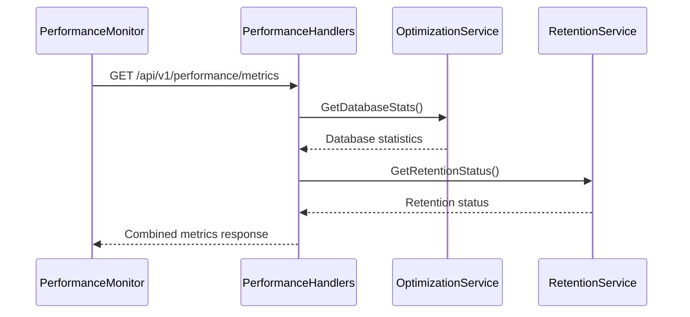
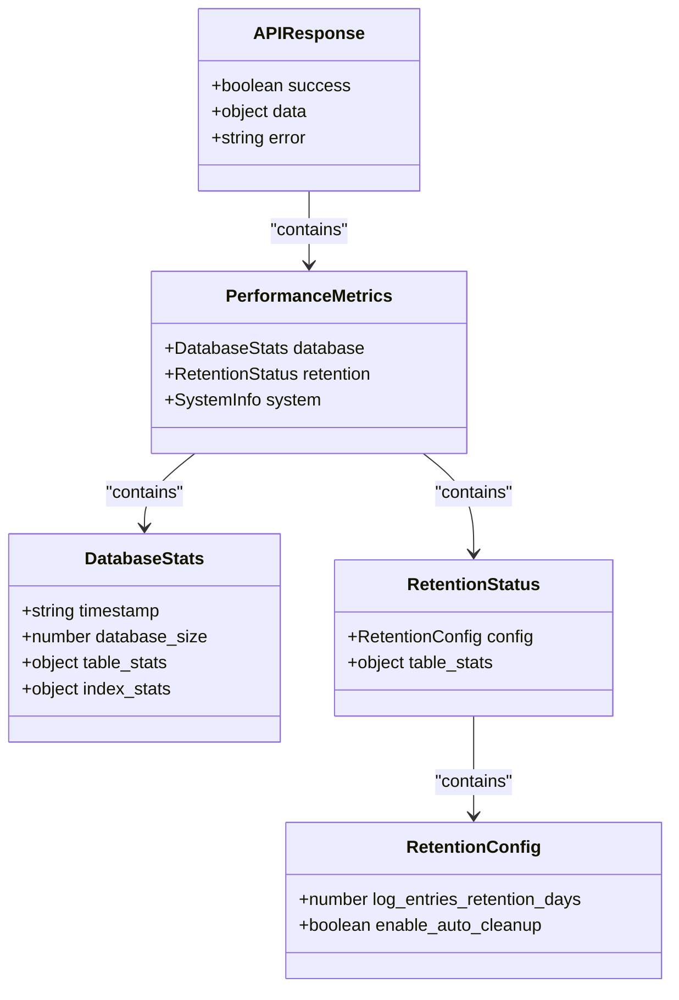
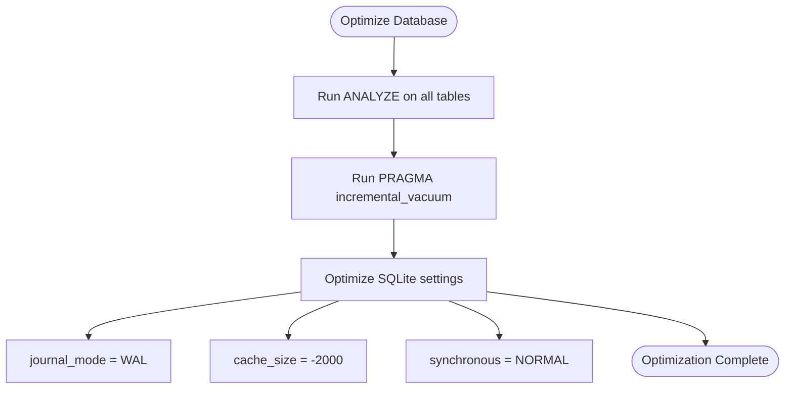
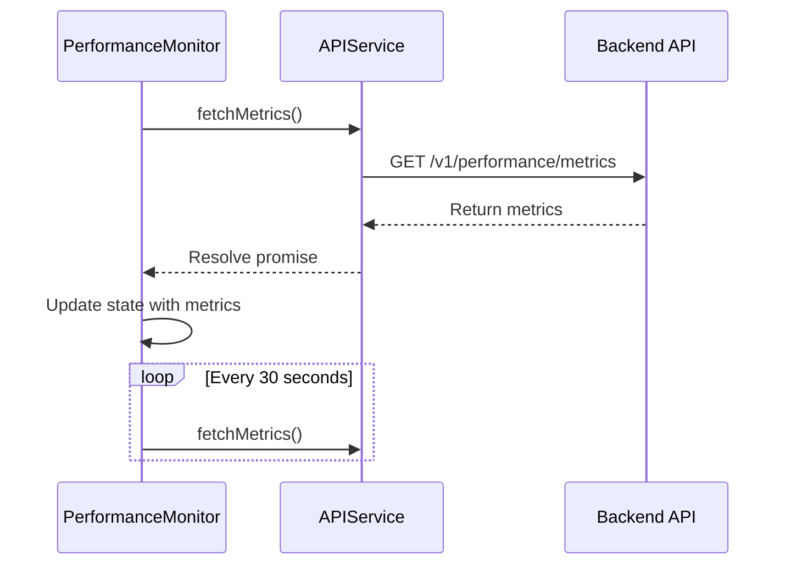

# Performance API


## Table of Contents
1. [Introduction](#introduction)
2. [Performance Monitoring API Endpoints](#performance-monitoring-api-endpoints)
3. [Response Format and Data Structure](#response-format-and-data-structure)
4. [Metric Collection and Optimization](#metric-collection-and-optimization)
5. [Frontend Integration and Dashboard Behavior](#frontend-integration-and-dashboard-behavior)
6. [Caching and Refresh Policies](#caching-and-refresh-policies)

## Introduction
The Performance API provides system health metrics for monitoring the health and efficiency of the Exim-Pilot system. It exposes endpoints for retrieving database statistics, retention status, and performance metrics that reflect the current state of the system. These endpoints are consumed by the frontend PerformanceMonitor component to display real-time insights into database size, table row counts, index usage, and data retention compliance. The API leverages backend services to collect metrics from the database layer and applies optimizations such as VACUUM and ANALYZE operations to maintain optimal performance.

**Section sources**
- [performance_handlers.go](file://internal/api/performance_handlers.go#L1-L273)
- [PerformanceMonitor.tsx](file://web/src/components/Performance/PerformanceMonitor.tsx#L38-L356)

## Performance Monitoring API Endpoints
The performance monitoring API provides several endpoints for retrieving system health metrics and triggering optimization tasks.

### GET /api/v1/performance/metrics
Retrieves comprehensive performance metrics including database statistics and retention status.

**Query Parameters**: None  
**Response**: 200 OK with performance metrics object

### GET /api/v1/performance/database/stats
Returns detailed database statistics such as file size, table row counts, and index information.

**Query Parameters**: None  
**Response**: 200 OK with database statistics object

### POST /api/v1/performance/database/optimize
Triggers database optimization procedures including VACUUM and ANALYZE operations.

**Request Body**: Empty JSON object  
**Response**: 200 OK with success message

### GET /api/v1/performance/retention/status
Retrieves current data retention policies and status for all data types.

**Query Parameters**: None  
**Response**: 200 OK with retention status object

### POST /api/v1/performance/retention/cleanup
Initiates cleanup of expired data based on configured retention policies.

**Request Body**: Empty JSON object  
**Response**: 200 OK with cleanup result summary

### GET /api/v1/performance/database/query-hints
Provides optimized query patterns for common operations.

**Query Parameters**: None  
**Response**: 200 OK with query optimization hints





**Diagram sources**
- [performance_handlers.go](file://internal/api/performance_handlers.go#L150-L180)
- [optimization.go](file://internal/database/optimization.go#L150-L180)
- [retention.go](file://internal/database/retention.go#L250-L280)

**Section sources**
- [performance_handlers.go](file://internal/api/performance_handlers.go#L150-L180)
- [optimization.go](file://internal/database/optimization.go#L150-L180)
- [retention.go](file://internal/database/retention.go#L250-L280)

## Response Format and Data Structure
All performance API endpoints return a standardized JSON response structure that conforms to the APIResponse format defined in the response utility.

### Standard Response Structure

```json
{
  "success": true,
  "data": { /* endpoint-specific data */ },
  "error": null
}
```


### Performance Metrics Response
The `/api/v1/performance/metrics` endpoint returns a composite object containing database and retention metrics:


```json
{
  "success": true,
  "data": {
    "database": {
      "timestamp": "2023-12-05T10:30:00Z",
      "database_size": 20971520,
      "table_stats": {
        "messages": { "row_count": 1500 },
        "log_entries": { "row_count": 8500 }
      },
      "index_stats": {
        "idx_messages_status": { "table_name": "messages" }
      }
    },
    "retention": {
      "config": {
        "log_entries_retention_days": 90,
        "enable_auto_cleanup": true
      },
      "table_stats": {
        "log_entries": {
          "table_name": "log_entries",
          "retention_days": 90,
          "total_rows": 8500,
          "expired_rows": 120,
          "oldest_record": "2023-01-01T00:00:00Z"
        }
      }
    },
    "system": {
      "timestamp": "2023-12-05T10:30:00Z"
    }
  }
}
```


### Type Definitions
The frontend defines TypeScript interfaces that mirror the backend response structure:


```typescript
interface DatabaseStats {
  timestamp: string;
  database_size: number;
  table_stats: Record<string, { row_count: number }>;
  index_stats: Record<string, { table_name: string }>;
}

interface RetentionStatus {
  config: {
    log_entries_retention_days: number;
    enable_auto_cleanup: boolean;
  };
  table_stats: Record<string, {
    table_name: string;
    retention_days: number;
    total_rows: number;
    expired_rows: number;
    oldest_record?: string;
  }>;
}

interface PerformanceMetrics {
  database: DatabaseStats;
  retention: RetentionStatus;
  system: { timestamp: string };
}
```





**Diagram sources**
- [response.go](file://internal/api/response.go#L3-L20)
- [PerformanceMonitor.tsx](file://web/src/components/Performance/PerformanceMonitor.tsx#L3-L35)

**Section sources**
- [response.go](file://internal/api/response.go#L3-L20)
- [PerformanceMonitor.tsx](file://web/src/components/Performance/PerformanceMonitor.tsx#L3-L35)

## Metric Collection and Optimization
The performance monitoring system collects metrics from various system components through dedicated services that interface directly with the database.

### Database Statistics Collection
The `OptimizationService` retrieves database statistics by executing PRAGMA commands and counting rows in key tables:

- **Database Size**: Calculated as `page_count * page_size`
- **Table Statistics**: Row counts from messages, log_entries, and other core tables
- **Index Information**: List of all non-system indexes

### Retention Status Collection
The `RetentionService` gathers retention information by:
1. Reading the current retention configuration
2. Querying each table for total and expired row counts
3. Determining the oldest and newest record timestamps

### Optimization Procedures
The system implements several optimization techniques:





**Diagram sources**
- [optimization.go](file://internal/database/optimization.go#L50-L100)

**Section sources**
- [optimization.go](file://internal/database/optimization.go#L50-L100)
- [retention.go](file://internal/database/retention.go#L200-L230)

## Frontend Integration and Dashboard Behavior
The PerformanceMonitor component in the frontend consumes the performance API endpoints to provide a real-time monitoring dashboard.

### API Communication
The component uses the `apiService` singleton to make HTTP requests:


```typescript
const response = await apiService.get('/v1/performance/metrics');
```


The `APIService` class handles request formatting, JSON parsing, and error handling, ensuring consistent communication with the backend.

### Component Lifecycle
The PerformanceMonitor implements the following behavior:
- Fetches metrics on component mount
- Sets up a 30-second interval for automatic refresh
- Provides buttons to trigger database optimization and data cleanup
- Displays loading states and error messages appropriately

### User Interface Features
The dashboard displays:
- Database size, table count, index count, and total rows in summary cards
- Detailed table statistics in a tabular format
- Data retention status with expired row counts highlighted
- Auto-cleanup configuration status





**Diagram sources**
- [PerformanceMonitor.tsx](file://web/src/components/Performance/PerformanceMonitor.tsx#L38-L356)
- [api.ts](file://web/src/services/api.ts#L2-L116)

**Section sources**
- [PerformanceMonitor.tsx](file://web/src/components/Performance/PerformanceMonitor.tsx#L38-L356)
- [api.ts](file://web/src/services/api.ts#L2-L116)

## Caching and Refresh Policies
The performance monitoring system implements specific caching and refresh policies to balance data freshness with system performance.

### Backend Caching
While the current implementation does not include explicit response caching, the database optimization service leverages SQLite's built-in caching mechanisms:
- **WAL mode** for improved concurrency
- **Memory-based temporary tables** via temp_store=MEMORY
- **2MB cache size** configured through cache_size pragma

### Frontend Refresh Strategy
The PerformanceMonitor component implements a polling strategy:
- **Initial Load**: Metrics are fetched immediately when the component mounts
- **Automatic Refresh**: Polls the API every 30 seconds using setInterval
- **Manual Refresh**: Available through error recovery and action completion

### Recommended Dashboard Intervals
Based on the implementation, the recommended refresh intervals are:
- **Production Dashboards**: 30-60 seconds (current implementation)
- **Real-time Monitoring**: 15 seconds (could be configured)
- **Resource-constrained environments**: 60-120 seconds

The 30-second interval strikes a balance between providing timely updates and minimizing database load from frequent metric collection queries.

**Section sources**
- [PerformanceMonitor.tsx](file://web/src/components/Performance/PerformanceMonitor.tsx#L38-L356)
- [optimization.go](file://internal/database/optimization.go#L10-L278)

**Referenced Files in This Document**   
- [performance_handlers.go](file://internal/api/performance_handlers.go)
- [optimization.go](file://internal/database/optimization.go)
- [retention.go](file://internal/database/retention.go)
- [response.go](file://internal/api/response.go)
- [PerformanceMonitor.tsx](file://web/src/components/Performance/PerformanceMonitor.tsx)
- [api.ts](file://web/src/services/api.ts)