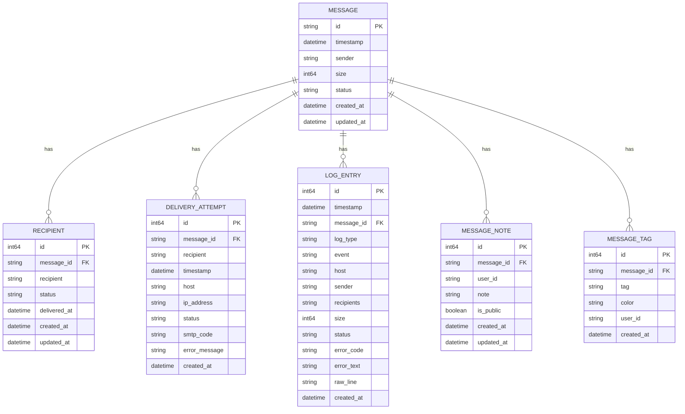
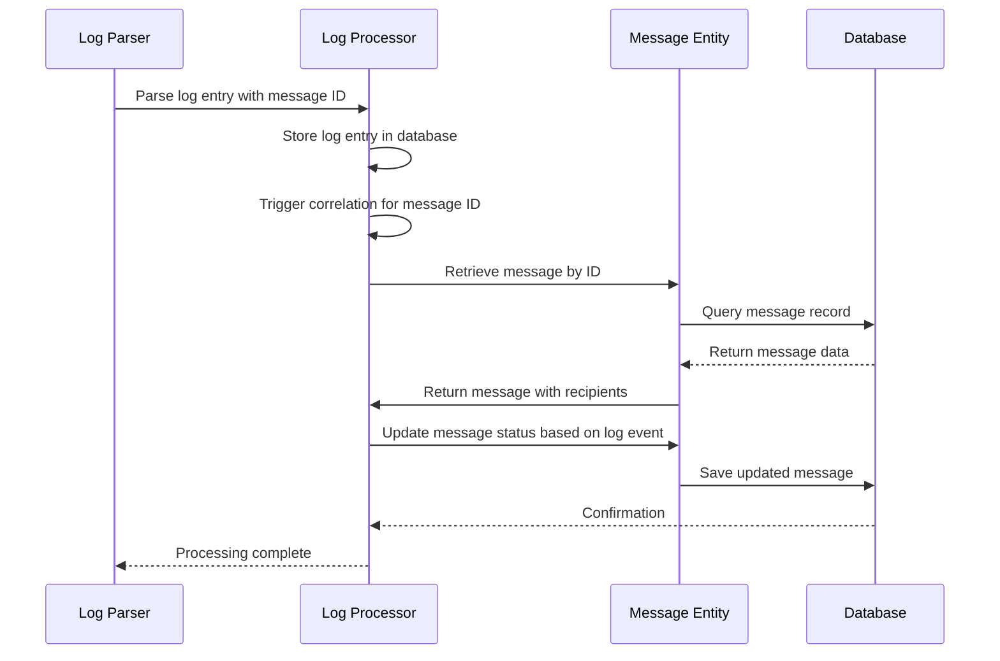

# Message Entity


## Table of Contents
1. [Message Entity Overview](#message-entity-overview)
2. [Field Definitions](#field-definitions)
3. [Primary Key and Indexes](#primary-key-and-indexes)
4. [Relationships](#relationships)
5. [Status Lifecycle](#status-lifecycle)
6. [Sample Data](#sample-data)
7. [Data Validation](#data-validation)
8. [Integration with Queue Service](#integration-with-queue-service)
9. [Integration with Log Processor](#integration-with-log-processor)
10. [Data Model Diagram](#data-model-diagram)

## Message Entity Overview

The Message entity serves as the central record for email tracking within the Exim-Pilot system. It represents a mail message in the system and contains essential metadata for monitoring, managing, and analyzing email delivery. The entity is designed to track the complete lifecycle of a message from receipt through delivery or failure.

The Message entity is implemented as a Go struct in the database package and corresponds to a SQL table in the application's database schema. It works in conjunction with related entities such as Recipient and DeliveryAttempt to provide comprehensive message tracking capabilities.

**Section sources**
- [models.go](file://internal/database/models.go#L1-L30)
- [schema.go](file://internal/database/schema.go#L2-L10)

## Field Definitions

The Message entity contains the following fields:

**ID**: `string` - The unique identifier for the message, corresponding to the Exim message ID format (e.g., "1ABC23-DEF456-GH"). This field serves as the primary key.

**Timestamp**: `time.Time` - The timestamp when the message was received by the system, representing the initial arrival time.

**Sender**: `string` - The email address of the message sender, stored as a plain text string.

**Size**: `*int64` - A pointer to an integer representing the size of the message in bytes. This field is optional and may be null if the size is unknown.

**Status**: `string` - The current status of the message in the delivery process. Valid values are defined by constants in the system.

**CreatedAt**: `time.Time` - The timestamp when the message record was created in the database.

**UpdatedAt**: `time.Time` - The timestamp when the message record was last updated in the database, automatically maintained by the system.

**Section sources**
- [models.go](file://internal/database/models.go#L3-L14)

## Primary Key and Indexes

The Message entity has a well-defined primary key and indexing strategy to optimize query performance:

**Primary Key**: The `id` field serves as the primary key for the messages table, ensuring each message has a unique identifier.

**Indexes**:
- `idx_messages_status`: Index on the `status` column to optimize queries filtering by message status
- `idx_messages_timestamp`: Index on the `timestamp` column to optimize time-based queries
- `idx_messages_sender`: Index on the `sender` column to optimize sender-based searches
- `idx_messages_created_at`: Index on the `created_at` column for creation time queries
- `idx_messages_status_timestamp`: Composite index on `status` and `timestamp` for combined status and time range queries
- `idx_messages_sender_timestamp`: Composite index on `sender` and `timestamp` for sender and time range queries

These indexes are specifically designed to support common query patterns used in the application's user interface and API endpoints, particularly for filtering messages by status, sender, and time ranges.

**Section sources**
- [schema.go](file://internal/database/schema.go#L4-L25)

## Relationships

The Message entity maintains several important relationships with other entities in the system:

**Recipients**: One-to-many relationship with the Recipient entity. Each message can have multiple recipients, with each recipient having their own delivery status and timeline. This relationship is enforced by a foreign key constraint from the recipients table to the messages table.

**DeliveryAttempts**: One-to-many relationship with the DeliveryAttempt entity. Each message can have multiple delivery attempts, particularly for deferred messages that are retried over time. This allows tracking of the complete delivery history for each message.

**LogEntries**: One-to-many relationship with the LogEntry entity. Multiple log entries can be associated with a single message, providing a detailed audit trail of all events related to the message.

**MessageNotes**: One-to-many relationship with the MessageNote entity, allowing operators to add notes to messages for tracking purposes.

**MessageTags**: One-to-many relationship with the MessageTag entity, enabling categorization and tagging of messages.

These relationships enable the system to provide comprehensive message tracing and analytics capabilities, showing not just the message itself but its complete delivery context.





**Diagram sources**
- [models.go](file://internal/database/models.go#L1-L30)
- [schema.go](file://internal/database/schema.go#L2-L10)

## Status Lifecycle

The Message entity supports a comprehensive status lifecycle that tracks the message through various stages of processing:

**StatusReceived** = "received": The message has been received by the system but not yet processed for delivery.

**StatusQueued** = "queued": The message is in the delivery queue and awaiting processing.

**StatusDelivered** = "delivered": The message has been successfully delivered to all recipients.

**StatusDeferred** = "deferred": Delivery attempts are being made, but some or all recipients are temporarily unavailable.

**StatusBounced** = "bounced": The message could not be delivered and has been returned to the sender.

**StatusFrozen** = "frozen": The message has been frozen by an administrator and will not be processed for delivery.

These status values are defined as constants in the system and are validated during creation and updates. The status field is critical for queue management, reporting, and user interface displays, allowing administrators to quickly identify messages that require attention.

**Section sources**
- [models.go](file://internal/database/models.go#L16-L23)

## Sample Data

The following examples illustrate different message states within the system:

**Queued Message**:

```json
{
  "id": "1ABC23-DEF456-GH",
  "timestamp": "2023-06-15T10:30:00Z",
  "sender": "user@example.com",
  "size": 15320,
  "status": "queued",
  "created_at": "2023-06-15T10:30:00Z",
  "updated_at": "2023-06-15T10:30:00Z"
}
```


**Delivered Message**:

```json
{
  "id": "2XYZ78-IJK901-MN",
  "timestamp": "2023-06-15T09:15:00Z",
  "sender": "notifications@service.com",
  "size": 8745,
  "status": "delivered",
  "created_at": "2023-06-15T09:15:00Z",
  "updated_at": "2023-06-15T09:22:30Z"
}
```


**Failed Message**:

```json
{
  "id": "3PQR45-STU678-VW",
  "timestamp": "2023-06-15T11:45:00Z",
  "sender": "admin@company.org",
  "size": 22100,
  "status": "bounced",
  "created_at": "2023-06-15T11:45:00Z",
  "updated_at": "2023-06-15T12:15:20Z"
}
```


These sample records demonstrate how the Message entity captures the essential information needed to track messages through their lifecycle, with timestamps showing the progression from creation to final status.

**Section sources**
- [models.go](file://internal/database/models.go#L1-L30)

## Data Validation

The system implements comprehensive data validation rules for the Message entity during creation and updates:

**Message ID Validation**: The message ID must follow the Exim format of XXXXXX-YYYYYY-ZZ where X, Y, and Z are base-62 characters. The validation uses a regular expression pattern `^[0-9A-Za-z]{6}-[0-9A-Za-z]{6}-[0-9A-Za-z]{2}$` to ensure proper format.

**Sender Validation**: The sender field must contain a valid email address format, validated using Go's mail.ParseAddress function. The email address must not exceed 320 characters (RFC 5321 limit).

**Status Validation**: The status field must be one of the predefined valid values: "received", "queued", "delivered", "deferred", "bounced", or "frozen". This validation is enforced by a CHECK constraint in the database and validated in the application layer.

**Size Validation**: The size field, when present, must be a positive integer representing the message size in bytes.

These validation rules are implemented in the validation service and are applied consistently across the application, ensuring data integrity and preventing invalid data from being stored in the system.

**Section sources**
- [service.go](file://internal/validation/service.go#L99-L156)
- [schema.go](file://internal/database/schema.go#L6)

## Integration with Queue Service

The Message entity integrates closely with the queue service to maintain accurate state and enable queue management operations:

The queue service uses the Message entity to retrieve the current queue status, including message counts by status and detailed message information. When queue operations are performed (deliver, freeze, thaw, delete), the queue service updates the corresponding Message records in the database.

The service also creates queue snapshots that reference Message entities to track historical queue states. These snapshots capture metrics like total messages, deferred messages, and the age of the oldest message, providing valuable insights into queue performance over time.

Queue operations are logged in the audit trail with references to the affected Message entities, creating a complete audit history of all administrative actions taken on messages.

**Section sources**
- [service.go](file://internal/queue/service.go#L1-L312)
- [operations.go](file://internal/queue/operations.go#L1-L433)

## Integration with Log Processor

The Message entity plays a central role in the log processing system, serving as the anchor point for message correlation:

The log processor service processes raw log entries and correlates them with Message entities using the message ID. When a log entry containing a message ID is processed, the log processor triggers correlation to update the corresponding Message entity and its related records.

This integration enables the system to build a complete delivery timeline for each message by aggregating log entries, delivery attempts, and recipient statuses. The log processor also handles bulk correlation, processing multiple message IDs efficiently to maintain up-to-date message states.

The Message entity's timestamp field is particularly important for this integration, as it allows the system to establish the chronological relationship between log events and message processing.





**Diagram sources**
- [service.go](file://internal/logprocessor/service.go#L1-L344)
- [models.go](file://internal/database/models.go#L1-L30)

## Data Model Diagram

The following entity relationship diagram illustrates the Message entity and its relationships with other core entities in the system:


**Diagram sources**
- [models.go](file://internal/database/models.go#L1-L30)
- [schema.go](file://internal/database/schema.go#L2-L10)

**Referenced Files in This Document**   
- [models.go](file://internal/database/models.go)
- [schema.go](file://internal/database/schema.go)
- [service.go](file://internal/logprocessor/service.go)
- [service.go](file://internal/queue/service.go)
- [service.go](file://internal/validation/service.go)