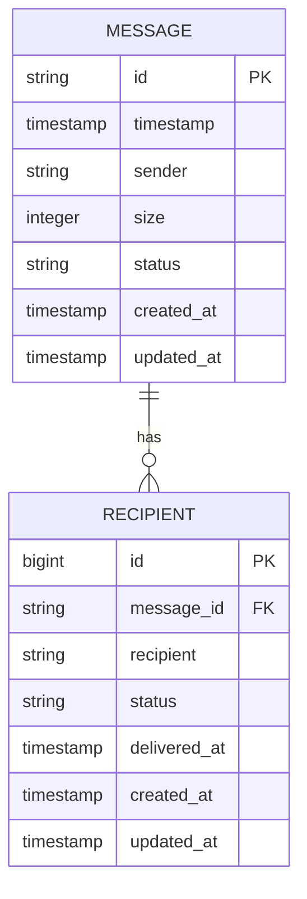
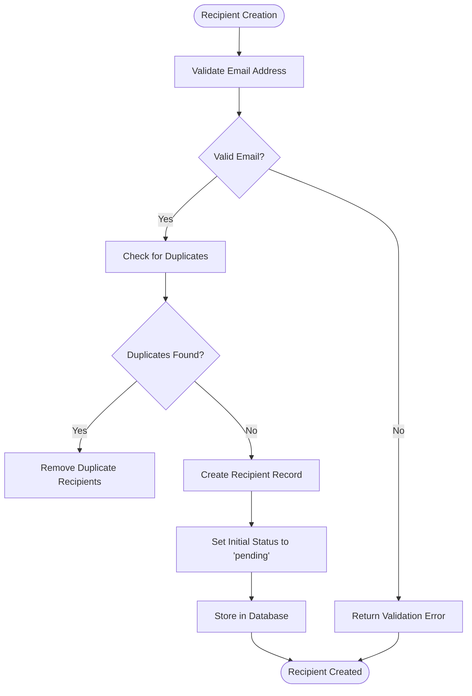
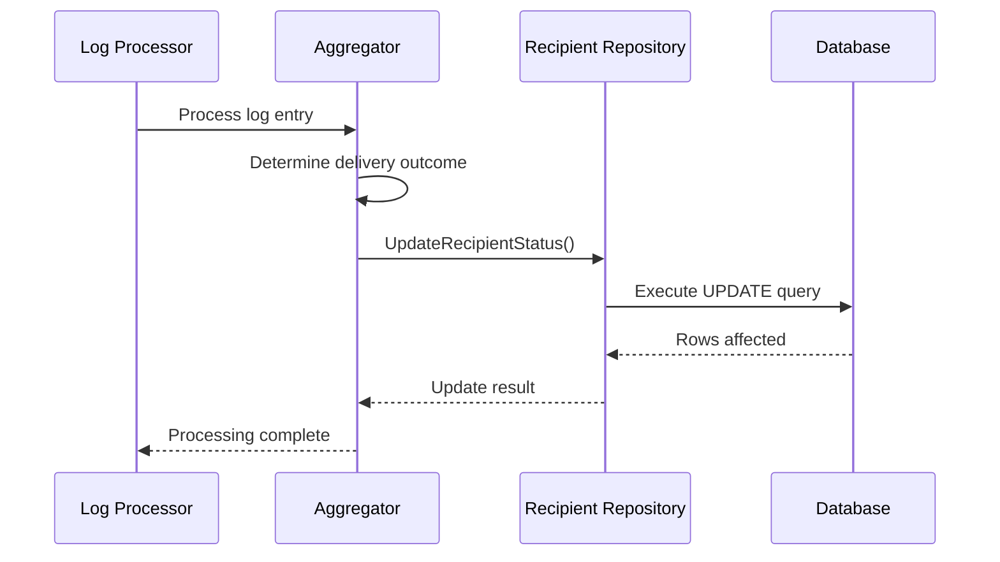
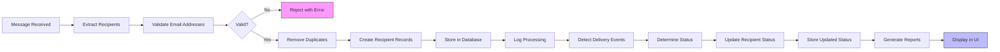

# Recipient Entity


## Table of Contents
1. [Introduction](#introduction)
2. [Recipient Entity Overview](#recipient-entity-overview)
3. [Database Schema and Relationships](#database-schema-and-relationships)
4. [Recipient Status Lifecycle](#recipient-status-lifecycle)
5. [Indexing Strategy](#indexing-strategy)
6. [Recipient Creation and Validation](#recipient-creation-and-validation)
7. [Status Update Mechanism](#status-update-mechanism)
8. [Example Recipient Records](#example-recipient-records)
9. [Common Issues and Handling](#common-issues-and-handling)
10. [Data Flow Diagram](#data-flow-diagram)

## Introduction
The Recipient entity is a core component of the email delivery system, responsible for tracking the delivery status of individual email addresses associated with a message. This document provides a comprehensive analysis of the Recipient entity's implementation, including its relationship with the Message entity, status management, indexing strategy, and integration with log processing and queue operations.

**Section sources**
- [models.go](file://internal/database/models.go#L1-L100)
- [repository.go](file://internal/database/repository.go#L200-L300)

## Recipient Entity Overview
The Recipient entity represents an individual email address that is the target of a message delivery. It stores critical information about the delivery process, including the recipient's email address, current delivery status, timestamps, and error information when applicable.

The Recipient entity is implemented as a child of the Message entity, establishing a one-to-many relationship where a single message can have multiple recipients. This design allows for granular tracking of delivery outcomes for each recipient independently.

Key attributes of the Recipient entity include:
- **ID**: Unique identifier for the recipient record
- **MessageID**: Foreign key linking to the parent Message entity
- **Recipient**: Email address of the recipient
- **Status**: Current delivery status (pending, delivered, bounced, etc.)
- **DeliveredAt**: Timestamp when the message was successfully delivered
- **CreatedAt**: Timestamp when the recipient record was created
- **UpdatedAt**: Timestamp of the last update to the recipient record

The entity is designed to support efficient querying and reporting, with appropriate indexing on frequently searched fields. It also maintains data integrity through foreign key constraints and cascading behaviors.

**Section sources**
- [models.go](file://internal/database/models.go#L45-L75)
- [repository.go](file://internal/database/repository.go#L242-L293)

## Database Schema and Relationships
The Recipient entity is implemented with a well-defined database schema that ensures data integrity and supports efficient queries. The relationship between Message and Recipient entities follows a strict one-to-many pattern, with appropriate constraints to maintain referential integrity.





**Diagram sources**
- [models.go](file://internal/database/models.go#L30-L80)
- [repository.go](file://internal/database/repository.go#L200-L300)

The database schema enforces the following constraints:

**Foreign Key Constraints**
- The `message_id` field in the recipients table is a foreign key that references the `id` field in the messages table
- This constraint ensures that every recipient record is associated with a valid message
- The relationship is defined with cascading delete behavior, meaning that when a message is deleted, all associated recipient records are automatically removed

**Cascading Behaviors**
- **CASCADE DELETE**: When a message is deleted from the system, all corresponding recipient records are automatically deleted to maintain data consistency
- **RESTRICT UPDATE**: The message ID cannot be updated to prevent orphaned recipient records
- These behaviors are implemented at the database level to ensure data integrity regardless of the application layer

The schema is optimized for the most common access patterns, with the message_id field indexed to support fast lookups of all recipients for a given message.

**Section sources**
- [models.go](file://internal/database/models.go#L30-L80)
- [repository.go](file://internal/database/repository.go#L200-L300)

## Recipient Status Lifecycle
The Recipient entity supports a comprehensive status lifecycle that tracks the delivery process from initial queuing to final disposition. The available statuses represent different stages in the delivery process and are used to determine subsequent actions.

**Available Status Values**
- **pending**: The initial state when a recipient is created but no delivery attempts have been made
- **queued**: The message is in the delivery queue and awaiting processing
- **delivered**: The message has been successfully delivered to the recipient's mail server
- **deferred**: A temporary failure occurred during delivery; the system will retry
- **bounced**: A permanent failure occurred, and delivery will not be attempted again
- **frozen**: The message has been manually frozen by an administrator

The status transitions follow a specific pattern based on delivery outcomes:
- **pending → queued**: When the message is added to the delivery queue
- **queued → delivered**: When a delivery attempt succeeds
- **queued → deferred**: When a temporary delivery failure occurs
- **queued → bounced**: When a permanent delivery failure occurs
- **any → frozen**: When an administrator manually freezes the message

The status field is constrained to a predefined set of values to ensure consistency and prevent invalid states. This is enforced both at the application level through validation and at the database level through schema constraints.

**Section sources**
- [service.go](file://internal/validation/service.go#L45-L60)
- [repository.go](file://internal/database/repository.go#L242-L293)

## Indexing Strategy
The Recipient entity employs a strategic indexing approach to optimize common query patterns and reporting requirements. The indexing strategy focuses on the fields most frequently used in WHERE clauses, JOIN operations, and sorting.

**Primary Index**
- **message_id**: A B-tree index on the message_id field enables fast retrieval of all recipients for a specific message. This is the most common query pattern in the system, used when displaying message details or generating delivery reports.

**Secondary Indexes**
- **recipient**: An index on the recipient email address field supports searches for messages sent to a specific email address. This is useful for troubleshooting delivery issues for particular recipients.
- **status**: An index on the status field optimizes queries that filter recipients by their delivery status (e.g., finding all bounced or deferred recipients).
- **delivered_at**: An index on the delivered_at timestamp supports time-based queries for delivered messages.

**Composite Index**
- **(message_id, status)**: A composite index that optimizes queries filtering recipients by both message and status. This is particularly useful for generating delivery statistics and reports.

The indexing strategy balances query performance with write performance, avoiding over-indexing which could slow down insert and update operations. The chosen indexes support the most critical use cases while maintaining acceptable performance for data modification operations.

**Section sources**
- [repository.go](file://internal/database/repository.go#L242-L293)
- [models.go](file://internal/database/models.go#L30-L80)

## Recipient Creation and Validation
Recipient records are created when a new message is processed and its recipients are extracted. The creation process includes validation to ensure data quality and prevent common issues.





**Diagram sources**
- [service.go](file://internal/validation/service.go#L100-L150)
- [repository.go](file://internal/database/repository.go#L200-L250)

The recipient creation process follows these steps:

**Email Validation**
- All recipient email addresses are validated using the validation service before being stored
- The validation checks for proper email format according to RFC standards
- Addresses are checked for length (maximum 320 characters as per RFC 5321)
- Invalid addresses are rejected with appropriate error messages

**Duplicate Handling**
- The system checks for duplicate recipients within the same message
- If duplicates are found, they are automatically removed to prevent multiple delivery attempts to the same address
- This prevents unnecessary load on the mail server and avoids potential spam complaints

**Initial Status Assignment**
- New recipient records are assigned an initial status of "pending"
- The created_at and updated_at timestamps are set to the current time
- The message_id field is populated with the parent message's ID

The creation process is atomic and occurs within a database transaction to ensure data consistency. If any part of the process fails, the entire operation is rolled back.

**Section sources**
- [service.go](file://internal/validation/service.go#L100-L150)
- [repository.go](file://internal/database/repository.go#L200-L250)

## Status Update Mechanism
Recipient status updates are driven by log processing and queue operations, creating a feedback loop that reflects the actual delivery outcomes.





**Diagram sources**
- [aggregator.go](file://internal/logprocessor/aggregator.go#L500-L550)
- [repository.go](file://internal/database/repository.go#L270-L293)

The status update process works as follows:

**Log Processing**
- The log processor monitors Exim log files for delivery events
- When a delivery event is detected (success, failure, deferral), it is processed by the aggregator
- The aggregator determines the appropriate status based on the event type and error codes

**Status Determination Logic**
- **Delivery success**: Status is set to "delivered" and delivered_at is set to the delivery timestamp
- **Temporary failure**: Status is set to "deferred" to trigger retry logic
- **Permanent failure**: Status is set to "bounced" to prevent further delivery attempts
- **Manual operations**: Status may be updated through queue operations (freeze, thaw, etc.)

**Database Update**
- The recipient repository's Update method is called with the new status
- The updated_at timestamp is automatically set to the current time
- The database executes an UPDATE statement to modify the recipient record
- The operation is atomic and includes error handling for cases where the recipient record no longer exists

The status update mechanism ensures that the recipient's state accurately reflects the current delivery situation, enabling accurate reporting and appropriate system behavior.

**Section sources**
- [aggregator.go](file://internal/logprocessor/aggregator.go#L500-L550)
- [repository.go](file://internal/database/repository.go#L270-L293)

## Example Recipient Records
The following examples illustrate recipient records in various states, demonstrating the data structure and typical values.

**Pending Recipient**

```json
{
  "id": 1001,
  "message_id": "1ABC23-DEF456-GH",
  "recipient": "pending@example.com",
  "status": "pending",
  "delivered_at": null,
  "created_at": "2023-10-15T10:30:00Z",
  "updated_at": "2023-10-15T10:30:00Z"
}
```


**Delivered Recipient**

```json
{
  "id": 1002,
  "message_id": "1ABC23-DEF456-GH",
  "recipient": "delivered@example.com",
  "status": "delivered",
  "delivered_at": "2023-10-15T10:35:22Z",
  "created_at": "2023-10-15T10:30:00Z",
  "updated_at": "2023-10-15T10:35:22Z"
}
```


**Bounced Recipient**

```json
{
  "id": 1003,
  "message_id": "1ABC23-DEF456-GH",
  "recipient": "bounced@example.com",
  "status": "bounced",
  "delivered_at": null,
  "created_at": "2023-10-15T10:30:00Z",
  "updated_at": "2023-10-15T10:32:15Z"
}
```


These examples show the evolution of a recipient record through the delivery process. The pending recipient has no delivered_at timestamp, indicating it hasn't been delivered yet. The delivered recipient has both created_at and delivered_at timestamps, with updated_at matching the delivery time. The bounced recipient has a status indicating permanent failure, with no delivered_at timestamp.

**Section sources**
- [repository.go](file://internal/database/repository.go#L242-L293)
- [RecipientStatus.tsx](file://web/src/components/MessageTrace/RecipientStatus.tsx#L1-L50)

## Common Issues and Handling
The system addresses several common issues related to recipient management, ensuring robust operation and data quality.

**Duplicate Recipients**
- **Issue**: The same email address appearing multiple times in a message's recipient list
- **Solution**: The validation service checks for duplicates during message processing and removes them before creating recipient records
- **Prevention**: Input validation at the API level rejects requests with duplicate recipients when detected

**Malformed Addresses**
- **Issue**: Invalid email addresses that cannot be delivered
- **Solution**: Comprehensive validation using RFC-compliant parsing and format checking
- **Handling**: Addresses that fail validation are rejected with specific error messages indicating the problem (e.g., missing @ symbol, invalid characters)
- **Logging**: Validation failures are logged for troubleshooting and pattern analysis

**Status Synchronization**
- **Issue**: Potential race conditions when multiple delivery attempts occur simultaneously
- **Solution**: Database-level locking and atomic updates ensure consistency
- **Handling**: The repository uses transactional operations to prevent conflicting updates

**Data Integrity**
- **Issue**: Orphaned recipient records if message deletion fails
- **Solution**: Cascading delete constraints ensure that when a message is deleted, all associated recipients are automatically removed
- **Validation**: Foreign key constraints prevent the creation of recipient records without a valid message reference

These issue handling mechanisms work together to maintain data quality and system reliability, preventing common problems that could affect delivery performance and reporting accuracy.

**Section sources**
- [service.go](file://internal/validation/service.go#L100-L150)
- [repository.go](file://internal/database/repository.go#L200-L300)

## Data Flow Diagram
The following diagram illustrates the complete flow of recipient data through the system, from creation to status updates.





**Diagram sources**
- [service.go](file://internal/validation/service.go)
- [repository.go](file://internal/database/repository.go)
- [aggregator.go](file://internal/logprocessor/aggregator.go)
- [RecipientStatus.tsx](file://web/src/components/MessageTrace/RecipientStatus.tsx)

The data flow begins when a message is received and its recipients are extracted. Each recipient address undergoes validation to ensure it conforms to email standards. Valid addresses are checked for duplicates within the same message, and any duplicates are removed. Recipient records are then created with an initial "pending" status and stored in the database.

As delivery attempts occur, log entries are generated and processed by the log processor. The aggregator analyzes these logs to determine the outcome of each delivery attempt and updates the recipient status accordingly. These status updates are persisted in the database, maintaining an accurate record of the delivery process.

Finally, the recipient data is used to generate reports and is displayed in the user interface, providing visibility into delivery outcomes. This complete flow ensures that recipient information is accurate, consistent, and available for monitoring and troubleshooting.

**Section sources**
- [service.go](file://internal/validation/service.go)
- [repository.go](file://internal/database/repository.go)
- [aggregator.go](file://internal/logprocessor/aggregator.go)
- [RecipientStatus.tsx](file://web/src/components/MessageTrace/RecipientStatus.tsx)

**Referenced Files in This Document**   
- [models.go](file://internal/database/models.go)
- [repository.go](file://internal/database/repository.go)
- [aggregator.go](file://internal/logprocessor/aggregator.go)
- [service.go](file://internal/validation/service.go)
- [RecipientStatus.tsx](file://web/src/components/MessageTrace/RecipientStatus.tsx)