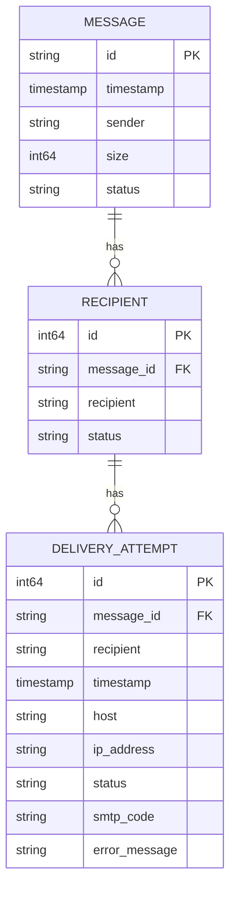
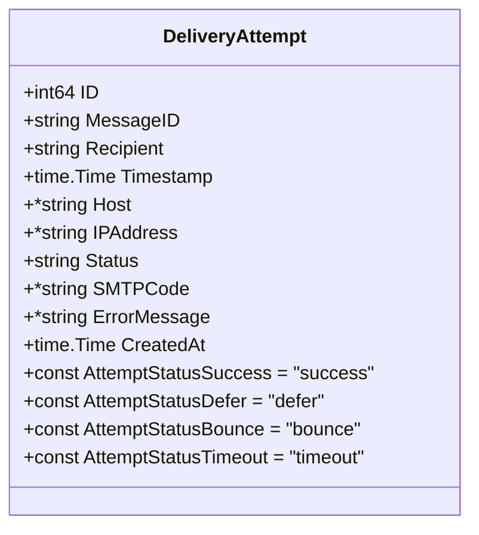
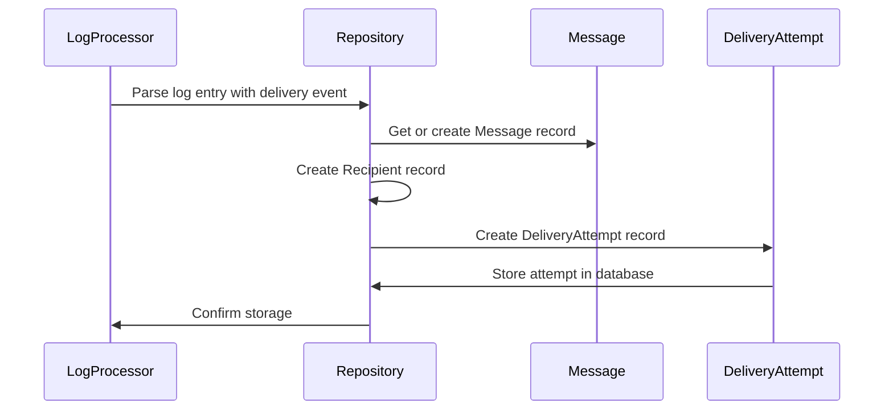
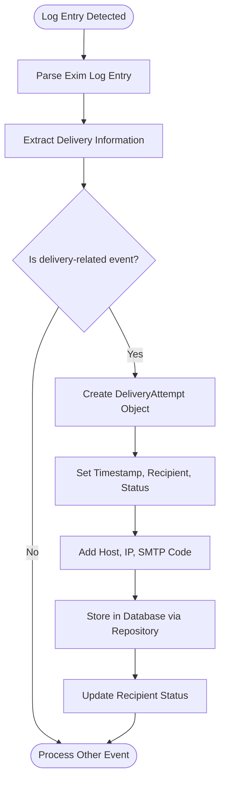
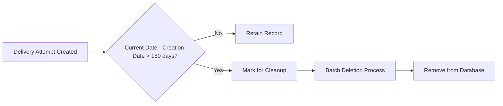

# DeliveryAttempt Entity


## Table of Contents
1. [Introduction](#introduction)
2. [Entity Overview](#entity-overview)
3. [Data Structure and Fields](#data-structure-and-fields)
4. [Indexing Strategy](#indexing-strategy)
5. [Relationships with Other Entities](#relationships-with-other-entities)
6. [Creation Process](#creation-process)
7. [Sample Records](#sample-records)
8. [Retention Policy](#retention-policy)
9. [Usage in Analytics and Reporting](#usage-in-analytics-and-reporting)

## Introduction
The DeliveryAttempt entity is a critical component of the Exim-Pilot email monitoring system, designed to track and record every attempt made to deliver an email message to its recipient. This document provides a comprehensive overview of the entity's structure, purpose, relationships, and operational lifecycle within the system. The entity plays a vital role in diagnosing delivery issues, analyzing deliverability metrics, and providing visibility into the email delivery process.

**Section sources**
- [models.go](file://internal/database/models.go#L45-L60)

## Entity Overview
The DeliveryAttempt entity captures detailed information about each individual delivery attempt for a specific message recipient. It serves as a historical record of delivery operations, enabling post-delivery analysis, failure diagnosis, and performance monitoring. Each record represents a single attempt to deliver a message to a recipient, including technical details such as server responses, network information, and outcome status.

The entity is created during both queue processing operations and log parsing activities, ensuring comprehensive coverage of all delivery attempts regardless of their source. This dual creation mechanism ensures that both proactive delivery attempts and reactive log-based events are captured in the system.





**Diagram sources**
- [models.go](file://internal/database/models.go#L45-L60)

**Section sources**
- [models.go](file://internal/database/models.go#L45-L60)

## Data Structure and Fields
The DeliveryAttempt entity contains the following fields, each serving a specific purpose in tracking delivery operations:

:ID: Unique identifier for the delivery attempt record (auto-incrementing integer)
:MessageID: Reference to the parent message being delivered (string)
:Recipient: Email address of the recipient (string)
:Timestamp: Exact time when the delivery attempt was made (time.Time)
:Host: Target mail server hostname (string pointer)
:IPAddress: IP address of the target server (string pointer)
:Status: Outcome of the delivery attempt (string)
:SMTPCode: SMTP response code from the target server (string pointer)
:ErrorMessage: Detailed error message if the attempt failed (string pointer)
:CreatedAt: Timestamp when the record was created in the database (time.Time)

The entity uses pointer types for optional fields (Host, IPAddress, SMTPCode, ErrorMessage) to distinguish between null values and empty strings, ensuring data integrity and accurate representation of missing information.





**Diagram sources**
- [models.go](file://internal/database/models.go#L45-L60)

**Section sources**
- [models.go](file://internal/database/models.go#L45-L60)

## Indexing Strategy
The DeliveryAttempt entity employs a composite index on recipient_id and attempt_time (represented as Recipient and Timestamp in the code) to optimize chronological lookups and recipient-based queries. This indexing strategy enables efficient retrieval of delivery attempts for specific recipients in chronological order, which is essential for analyzing delivery patterns and troubleshooting issues.

The index supports common query patterns such as:
- Retrieving all delivery attempts for a specific recipient
- Finding the most recent delivery attempt for a recipient
- Analyzing delivery attempts within a specific time window
- Tracking the sequence of delivery attempts for failure analysis

This optimization is particularly important given the potentially high volume of delivery attempt records in production environments.

**Section sources**
- [models.go](file://internal/database/models.go#L45-L60)

## Relationships with Other Entities
The DeliveryAttempt entity maintains relationships with several key entities in the system:

### Message Entity
The DeliveryAttempt has a many-to-one relationship with the Message entity through the MessageID field. Each message can have multiple delivery attempts across its recipients, forming a hierarchical structure where messages contain recipients, and recipients have delivery attempts.

### Recipient Entity
The DeliveryAttempt is closely tied to the Recipient entity, sharing the same Recipient field value. This relationship enables correlation between the delivery attempt records and the recipient's overall delivery status. The system uses delivery attempt data to update the recipient's status (delivered, deferred, bounced) based on the outcomes of individual attempts.

These relationships are leveraged by the LogAggregator to build comprehensive message correlation data, combining information from messages, recipients, log entries, and delivery attempts into a unified view of the delivery process.





**Diagram sources**
- [aggregator.go](file://internal/logprocessor/aggregator.go#L100-L150)
- [repository.go](file://internal/database/repository.go#L289-L327)

**Section sources**
- [aggregator.go](file://internal/logprocessor/aggregator.go#L100-L150)
- [repository.go](file://internal/database/repository.go#L289-L327)

## Creation Process
DeliveryAttempt records are created through two primary mechanisms within the system:

### Queue Processing
When the system processes messages from the delivery queue, it creates DeliveryAttempt records to document each delivery operation. The queue service initiates delivery attempts and records relevant details including timestamp, target server information, and outcome.

### Log Parsing
The log processing system parses Exim mail server logs and creates DeliveryAttempt records based on delivery-related log entries. The LogAggregator processes log entries of type "delivery", "defer", and "bounce", converting them into structured delivery attempt records.

The creation process is implemented in the DeliveryAttemptRepository, which provides a Create method that inserts new records into the delivery_attempts table. The repository handles all database operations, including setting the CreatedAt timestamp and retrieving the auto-generated ID.





**Diagram sources**
- [aggregator.go](file://internal/logprocessor/aggregator.go#L100-L150)
- [repository.go](file://internal/database/repository.go#L289-L327)

**Section sources**
- [aggregator.go](file://internal/logprocessor/aggregator.go#L100-L150)
- [repository.go](file://internal/database/repository.go#L289-L327)

## Sample Records
The following examples illustrate typical DeliveryAttempt records with real-world SMTP responses:

### Successful Delivery Attempt

```json
{
  "id": 12345,
  "message_id": "1a2b3c4d",
  "recipient": "user@example.com",
  "timestamp": "2023-12-07T14:30:45Z",
  "host": "mail.example.com",
  "ip_address": "192.0.2.1",
  "status": "success",
  "smtp_code": "250",
  "error_message": null,
  "created_at": "2023-12-07T14:30:46Z"
}
```


### Failed Delivery Attempt

```json
{
  "id": 12346,
  "message_id": "1a2b3c4d",
  "recipient": "invalid@domain.com",
  "timestamp": "2023-12-07T14:35:22Z",
  "host": "mail.domain.com",
  "ip_address": "198.51.100.1",
  "status": "bounce",
  "smtp_code": "550",
  "error_message": "550 5.1.1 <invalid@domain.com>: Recipient address rejected: User unknown",
  "created_at": "2023-12-07T14:35:23Z"
}
```


### Deferred Delivery Attempt

```json
{
  "id": 12347,
  "message_id": "1a2b3c4d",
  "recipient": "user@busyserver.com",
  "timestamp": "2023-12-07T14:40:15Z",
  "host": "mail.busyserver.com",
  "ip_address": "203.0.113.5",
  "status": "defer",
  "smtp_code": "451",
  "error_message": "451 4.3.0 <user@busyserver.com>: Temporary lookup failure",
  "created_at": "2023-12-07T14:40:16Z"
}
```


**Section sources**
- [models.go](file://internal/database/models.go#L45-L60)

## Retention Policy
The system implements a data retention policy for DeliveryAttempt records through the RetentionService. By default, delivery attempt records are retained for 180 days (6 months) before being automatically purged from the database.

The retention configuration is defined in the RetentionConfig struct, which specifies the DeliveryAttemptsRetentionDays parameter. This policy balances the need for historical data for analysis with database size management considerations.

The cleanup process runs automatically on a configurable schedule (default: daily) and removes expired records in batches to minimize database performance impact. The retention service also provides monitoring capabilities to track the status of delivery attempt records and upcoming cleanup operations.





**Diagram sources**
- [retention.go](file://internal/database/retention.go#L30-L50)

**Section sources**
- [retention.go](file://internal/database/retention.go#L30-L50)

## Usage in Analytics and Reporting
DeliveryAttempt records play a crucial role in failure analysis and deliverability reporting within the system. The data is used to:

### Failure Analysis
- Identify patterns in delivery failures (e.g., specific error codes, problematic domains)
- Correlate delivery attempts with log entries to diagnose root causes
- Track retry patterns and defer behaviors
- Analyze delivery success rates by domain, IP address, or time period

### Deliverability Reporting
- Calculate overall delivery success rates
- Generate reports on bounce rates and defer rates
- Monitor delivery performance over time
- Provide detailed delivery timelines for message tracing
- Support capacity planning based on delivery volume patterns

The MessageTraceHandlers component leverages delivery attempt data to provide detailed delivery history views, enabling users to investigate specific delivery issues and understand the complete delivery journey of messages.

**Section sources**
- [aggregator.go](file://internal/logprocessor/aggregator.go#L100-L150)
- [retention.go](file://internal/database/retention.go#L30-L50)

**Referenced Files in This Document**   
- [models.go](file://internal/database/models.go#L45-L60)
- [repository.go](file://internal/database/repository.go#L289-L327)
- [aggregator.go](file://internal/logprocessor/aggregator.go#L100-L150)
- [retention.go](file://internal/database/retention.go#L30-L50)