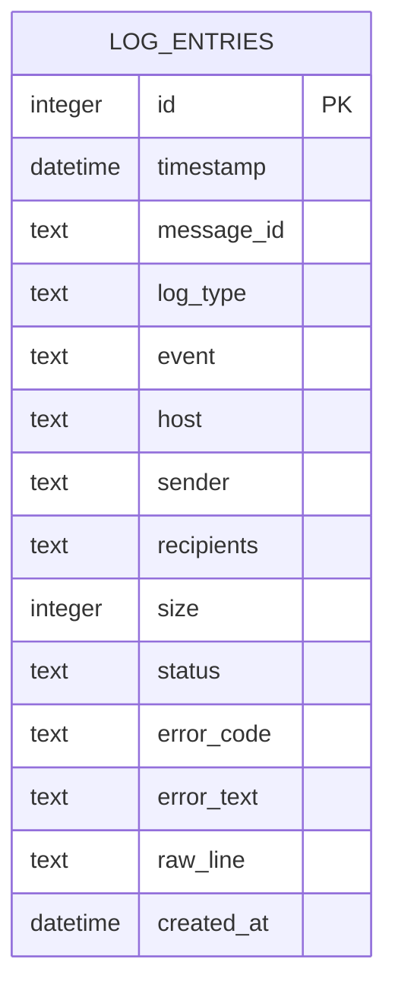
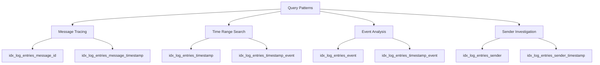
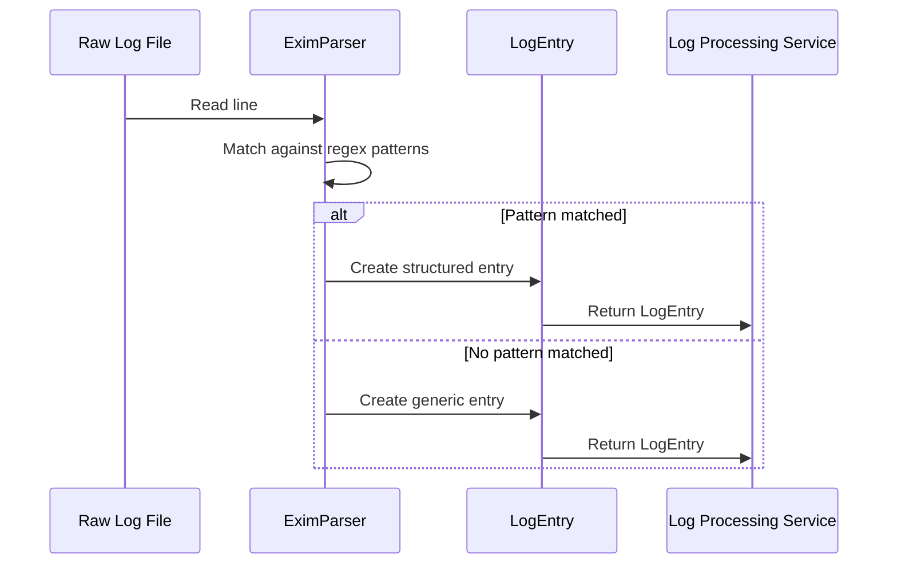
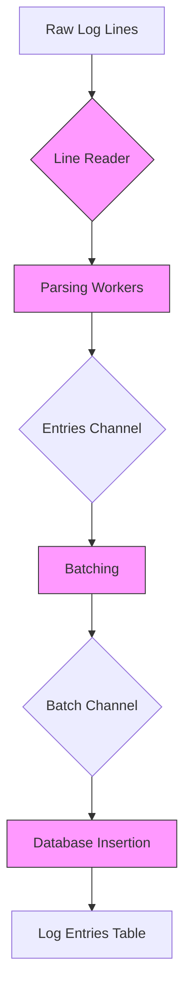
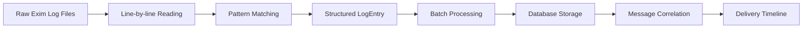
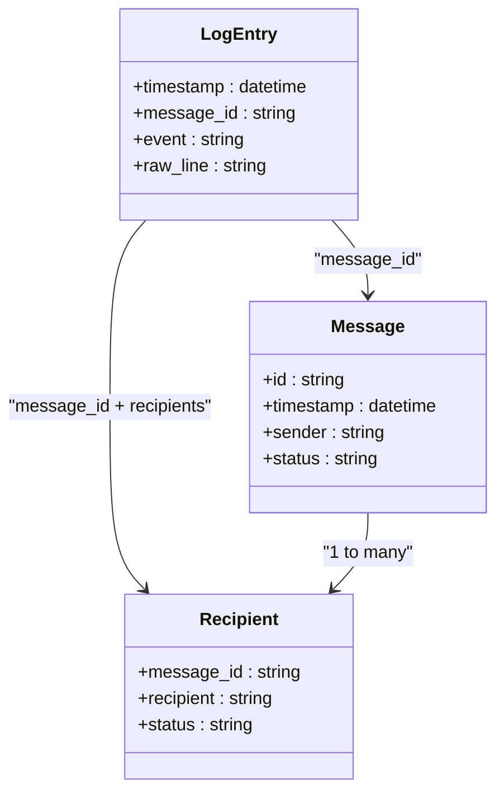
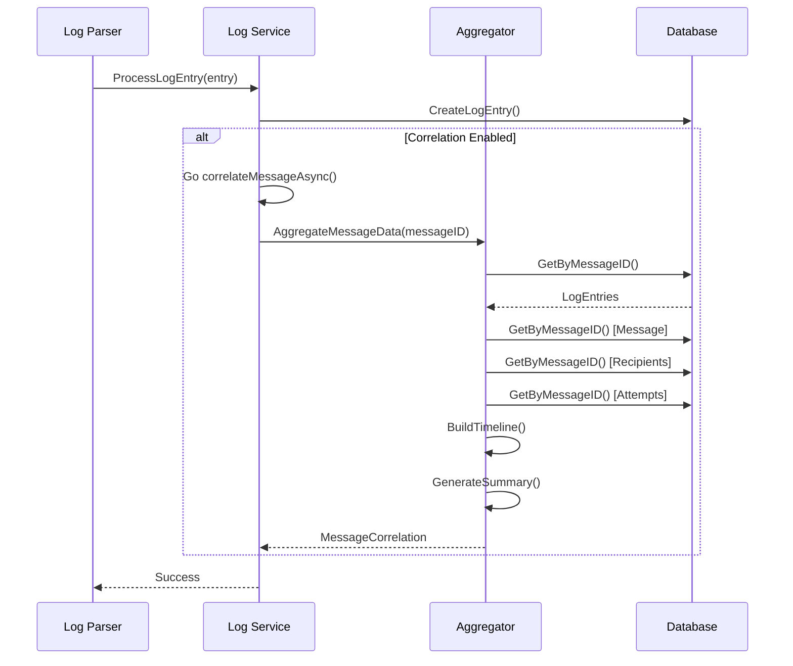

# LogEntry Entity


## Table of Contents
1. [Introduction](#introduction)
2. [LogEntry Data Model](#logentry-data-model)
3. [Indexing Strategy](#indexing-strategy)
4. [Log Processing Pipeline](#log-processing-pipeline)
5. [Event Types and Examples](#event-types-and-examples)
6. [Data Lifecycle and Correlation](#data-lifecycle-and-correlation)
7. [Message Tracing Workflow](#message-tracing-workflow)
8. [Conclusion](#conclusion)

## Introduction
The LogEntry entity serves as the fundamental data structure for storing parsed Exim mail server log records in the exim-pilot system. It transforms raw, unstructured log lines into a standardized format that enables efficient searching, correlation, and analysis of email delivery events. This document provides a comprehensive overview of the LogEntry entity, covering its data model, indexing strategy, processing pipeline, and role in message tracing and delivery debugging.

**Section sources**
- [exim_parser.go](file://internal/parser/exim_parser.go#L1-L300)
- [schema.go](file://internal/database/schema.go#L1-L196)

## LogEntry Data Model
The LogEntry entity represents a single parsed event from Exim mail server logs, capturing essential information about email message processing. The data model is designed to preserve both structured data for querying and the original raw log line for debugging.

### Core Fields
The LogEntry structure contains the following key fields:

- **Timestamp**: The exact time when the log event occurred, parsed from the log line
- **MessageID**: The unique identifier for the email message (e.g., "1rABC-123456-78")
- **Event**: The type of event (arrival, delivery, defer, bounce, reject, etc.)
- **LogType**: The source log file type (main, reject, panic)
- **RawLine**: The complete original log line before parsing
- **CreatedAt**: Database timestamp when the entry was stored

### Additional Contextual Fields
Depending on the event type, additional contextual information is captured:

- **Host**: The hostname or IP address involved in the transaction
- **Sender**: The email address of the message sender
- **Recipients**: Array of recipient email addresses involved in the event
- **Size**: The size of the message in bytes
- **Status**: The status code or state associated with the event
- **ErrorCode**: Specific error code if applicable
- **ErrorText**: Human-readable error message or reason





**Diagram sources**
- [schema.go](file://internal/database/schema.go#L1-L196)

**Section sources**
- [schema.go](file://internal/database/schema.go#L1-L196)
- [exim_parser.go](file://internal/parser/exim_parser.go#L1-L300)

## Indexing Strategy
The indexing strategy for the LogEntry table is optimized for fast message tracing and log correlation, supporting the most common query patterns used in email delivery analysis.

### Primary Indexes
Two primary indexes form the foundation of efficient querying:

- **idx_log_entries_message_id**: Single-column index on message_id for direct message lookups
- **idx_log_entries_timestamp**: Single-column index on timestamp for time-range queries

### Composite Indexes
Composite indexes are strategically created to optimize common combined queries:

- **idx_log_entries_message_timestamp**: Composite index on (message_id, timestamp) for retrieving message history in chronological order
- **idx_log_entries_timestamp_event**: Composite index on (timestamp, event) for analyzing event patterns over time
- **idx_log_entries_timestamp_type**: Composite index on (timestamp, log_type) for filtering by time and log source

### Search Optimization
Additional indexes support specific search use cases:

- **idx_log_entries_event**: For filtering by specific event types
- **idx_log_entries_log_type**: For filtering by log source type
- **idx_log_entries_sender**: For sender-based searches
- **idx_log_entries_raw_line_fts**: Full-text search index on raw_line for debugging and pattern discovery





**Diagram sources**
- [schema.go](file://internal/database/schema.go#L1-L196)

**Section sources**
- [schema.go](file://internal/database/schema.go#L1-L196)

## Log Processing Pipeline
The log processing pipeline transforms raw Exim log files into structured LogEntry entities through a multi-stage process that ensures data integrity and efficient storage.

### Parsing Stage
The parsing stage is handled by the EximParser, which uses regular expressions to extract structured data from raw log lines:





**Diagram sources**
- [exim_parser.go](file://internal/parser/exim_parser.go#L1-L300)

### Processing and Storage
The log processing service handles the ingestion and storage of parsed LogEntry entities:





**Diagram sources**
- [service.go](file://internal/logprocessor/service.go#L1-L344)
- [streaming.go](file://internal/logprocessor/streaming.go#L75-L337)

**Section sources**
- [service.go](file://internal/logprocessor/service.go#L1-L344)
- [exim_parser.go](file://internal/parser/exim_parser.go#L1-L300)

## Event Types and Examples
The LogEntry entity captures various types of email delivery events, each representing a specific stage in the message processing lifecycle.

### Message Arrival
Indicates when a message is received by the mail server.


```go
// Example: Message arrival
LogEntry{
    Timestamp: parseTime("2024-01-15 10:30:45"),
    MessageID: ptr("1rABC-123456-78"),
    Event:     "arrival",
    Host:      ptr("mail.example.com"),
    Sender:    ptr("sender@example.com"),
    Size:      ptr(15240),
    Status:    ptr("received"),
}
```


### Message Delivery
Indicates successful delivery of a message to a recipient.


```go
// Example: Message delivery
LogEntry{
    Timestamp:  parseTime("2024-01-15 10:31:20"),
    MessageID:  ptr("1rABC-123456-78"),
    Event:      "delivery",
    Host:       ptr("recipient-server.com"),
    Recipients: []string{"recipient@example.com"},
    Status:     ptr("delivered"),
}
```


### Message Deferral
Indicates a temporary failure in delivering a message.


```go
// Example: Message deferral
LogEntry{
    Timestamp:  parseTime("2024-01-15 10:32:15"),
    MessageID:  ptr("1rABC-123456-78"),
    Event:      "defer",
    Recipients: []string{"recipient@example.com"},
    Status:     ptr("deferred"),
    ErrorCode:  ptr("4.2.1"),
    ErrorText:  ptr("Mailbox temporarily unavailable"),
}
```


### Message Bounce
Indicates a permanent failure in delivering a message.


```go
// Example: Message bounce
LogEntry{
    Timestamp:  parseTime("2024-01-15 10:35:30"),
    MessageID:  ptr("1rABC-123456-78"),
    Event:      "bounce",
    Recipients: []string{"recipient@example.com"},
    Status:     ptr("bounced"),
    ErrorText:  ptr("User unknown"),
}
```


### Message Rejection
Indicates that a message was rejected during SMTP conversation.


```go
// Example: Message rejection
LogEntry{
    Timestamp:  parseTime("2024-01-15 10:29:10"),
    Event:      "reject",
    Host:       ptr("192.168.1.100"),
    Recipients: []string{"recipient@example.com"},
    Status:     ptr("rejected"),
    ErrorText:  ptr("Spam score too high"),
}
```


**Section sources**
- [exim_parser.go](file://internal/parser/exim_parser.go#L1-L300)

## Data Lifecycle and Correlation
The LogEntry entity plays a central role in the data lifecycle from raw log ingestion to structured storage and message correlation.

### Data Ingestion Flow
The data lifecycle begins with raw log files and progresses through several stages:





**Diagram sources**
- [streaming.go](file://internal/logprocessor/streaming.go#L75-L337)

### Correlation with Message and Recipient Entities
LogEntry entities are linked to Message and Recipient entities through the message ID, enabling comprehensive message tracing:





**Diagram sources**
- [aggregator.go](file://internal/logprocessor/aggregator.go#L1-L538)
- [schema.go](file://internal/database/schema.go#L1-L196)

**Section sources**
- [aggregator.go](file://internal/logprocessor/aggregator.go#L1-L538)
- [repository.go](file://internal/database/repository.go#L366-L450)

## Message Tracing Workflow
The LogEntry entity enables detailed message tracing by correlating all events related to a specific message ID.

### Correlation Process
When a LogEntry is processed, the system automatically triggers correlation if enabled:





**Diagram sources**
- [service.go](file://internal/logprocessor/service.go#L87-L135)
- [aggregator.go](file://internal/logprocessor/aggregator.go#L1-L538)

### Debugging Delivery Issues
The structured LogEntry data is essential for debugging email delivery problems:

1. **Identify message by ID**: Query all LogEntry records with the same message_id
2. **Analyze event sequence**: Examine the chronological order of events
3. **Trace delivery attempts**: Follow the delivery, defer, and bounce events
4. **Examine error details**: Review error codes and text for specific failures
5. **Correlate with recipients**: Link log events to specific recipient statuses

This workflow allows administrators to quickly diagnose issues such as temporary deferrals, permanent bounces, or rejection reasons, significantly reducing troubleshooting time for email delivery problems.

**Section sources**
- [aggregator.go](file://internal/logprocessor/aggregator.go#L1-L538)
- [service.go](file://internal/logprocessor/service.go#L87-L135)

## Conclusion
The LogEntry entity is a critical component of the exim-pilot system, serving as the foundation for email delivery monitoring and troubleshooting. By transforming raw Exim log data into structured entries with optimized indexing, it enables efficient message tracing and log correlation. The entity's design supports the full lifecycle of log data from ingestion through parsing, storage, and analysis. When combined with the message correlation system, LogEntry records provide comprehensive visibility into email delivery processes, making it easier to diagnose and resolve delivery issues. The indexing strategy focused on message_id and timestamp ensures fast queries for the most common use cases, while the rich set of event types captures the complete spectrum of email processing events.

**Referenced Files in This Document**   
- [exim_parser.go](file://internal/parser/exim_parser.go#L1-L300)
- [schema.go](file://internal/database/schema.go#L1-L196)
- [service.go](file://internal/logprocessor/service.go#L1-L344)
- [aggregator.go](file://internal/logprocessor/aggregator.go#L1-L538)
- [repository.go](file://internal/database/repository.go#L366-L450)