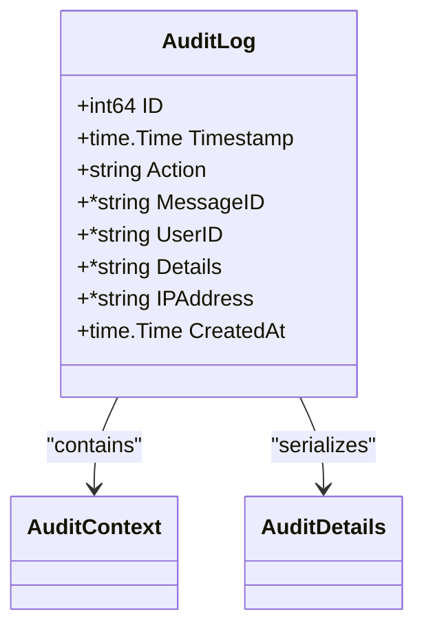
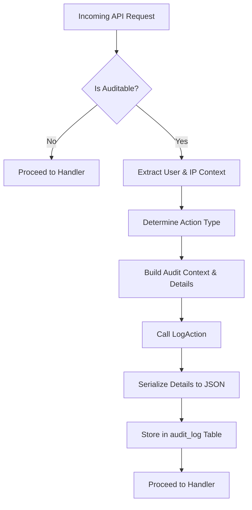
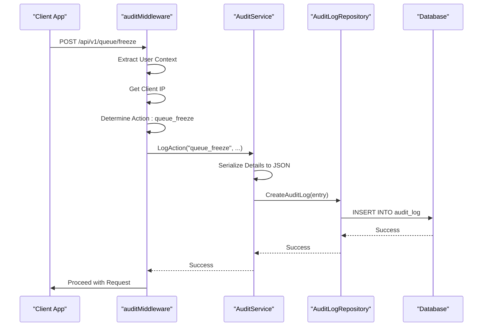

# AuditLog Entity


## Table of Contents
1. [Introduction](#introduction)
2. [AuditLog Entity Overview](#auditlog-entity-overview)
3. [Core Fields and Structure](#core-fields-and-structure)
4. [Audit Logging Mechanism](#audit-logging-mechanism)
5. [Critical Audit Events](#critical-audit-events)
6. [Security and Access Controls](#security-and-access-controls)
7. [Retention and Immutability](#retention-and-immutability)
8. [Sequence Diagram: Audit Log Creation Flow](#sequence-diagram-audit-log-creation-flow)

## Introduction
The **AuditLog** entity is a critical component of the Exim-Pilot system, designed to provide a tamper-proof record of all administrative actions performed within the application. It ensures accountability, supports compliance, and enables forensic analysis by capturing detailed information about user activities such as login attempts, queue operations, and configuration changes. This document provides a comprehensive overview of the AuditLog entity, its implementation, and operational behavior.

## AuditLog Entity Overview
The **AuditLog** entity serves as the foundation for tracking administrative actions across the Exim-Pilot platform. It is automatically populated whenever a user performs a privileged operation through the API. The logs are immutable and stored securely in the database, forming an essential part of the system's security and compliance framework.

The audit logging system is triggered via middleware that intercepts authenticated API requests, determines the appropriate action type, and records the event before the request is processed. This ensures that even failed or unauthorized attempts are captured for security monitoring.

**Section sources**
- [service.go](file://internal/audit/service.go#L0-L287)
- [middleware.go](file://internal/api/middleware.go#L170-L369)

## Core Fields and Structure
The **AuditLog** struct, defined in `models.go`, contains the following key fields:

| Field | Type | Description |
|------|------|-------------|
| **ID** | `int64` | Unique identifier for the audit log entry |
| **Timestamp** | `time.Time` | UTC timestamp when the action occurred |
| **Action** | `string` | Type of administrative action performed |
| **MessageID** | `*string` | Optional message ID associated with the action |
| **UserID** | `*string` | Identifier of the user who performed the action |
| **Details** | `*string` | JSON-encoded additional context about the action |
| **IPAddress** | `*string` | IP address from which the request originated |
| **CreatedAt** | `time.Time` | Timestamp when the audit record was created |

These fields are mapped to the `audit_log` database table and are designed to support efficient querying and reporting.





**Diagram sources**
- [models.go](file://internal/database/models.go#L0-L199)
- [service.go](file://internal/audit/service.go#L0-L287)

**Section sources**
- [models.go](file://internal/database/models.go#L0-L199)

## Audit Logging Mechanism
Audit entries are created through the **audit service** when authenticated API calls are made. The process begins in the `auditMiddleware` function within the API server, which wraps all relevant HTTP handlers.

When a request is received:
1. The middleware checks if the endpoint and method require auditing.
2. It extracts user context, IP address, and request metadata.
3. It determines the appropriate `ActionType` based on the URL path and HTTP method.
4. It constructs an `AuditContext` and `AuditDetails` object.
5. It invokes the `LogAction` method of the audit service to persist the entry.

The `LogAction` method serializes the details into JSON and stores the record via the database repository. This ensures consistent formatting and prevents direct manipulation of audit data.





**Diagram sources**
- [middleware.go](file://internal/api/middleware.go#L170-L369)
- [service.go](file://internal/audit/service.go#L0-L287)

**Section sources**
- [middleware.go](file://internal/api/middleware.go#L170-L369)
- [service.go](file://internal/audit/service.go#L0-L287)

## Critical Audit Events
The system defines several critical audit event types that represent high-impact administrative actions. These include:

- **Bulk Message Deletion**: Triggered when multiple messages are removed from the queue. Logged as `bulk_delete` with details on success/failure counts.
- **System Configuration Updates**: Captured as `config_change`, including previous and new values when available.
- **Queue Freeze/Thaw Operations**: Recorded as `queue_freeze` or `queue_thaw`, indicating control over message delivery.
- **Manual Delivery Triggers**: Logged as `deliver_now` when an operator forces immediate delivery.
- **Authentication Events**: `login` and `logout` actions are always audited, regardless of success.

For example, a bulk deletion of 50 messages with 48 successful deletions and 2 failures would generate an audit entry with:
- **Action**: `bulk_delete`
- **Details**: 
  
```json
  {
    "operation": "delete",
    "total_messages": 50,
    "success_count": 48,
    "failure_count": 2,
    "success_rate": 0.96,
    "result": "partial_success",
    "errors": ["Message M123 not found", "Permission denied for M456"]
  }
  ```


**Section sources**
- [service.go](file://internal/audit/service.go#L0-L287)

## Security and Access Controls
Access to audit data is strictly controlled to prevent tampering and unauthorized viewing. Key security measures include:

- **Immutable Records**: Once written, audit logs cannot be modified or deleted through any application interface.
- **Role-Based Access**: Only users with administrative privileges can view audit logs via the API or UI.
- **IP and User Tracking**: Every entry includes the user ID and originating IP address, enabling traceability.
- **Request ID Correlation**: Each audit entry includes a unique `RequestID`, allowing correlation with server logs for forensic analysis.

The system also logs access attempts to audit data itself, creating a meta-audit trail for sensitive operations.

**Section sources**
- [service.go](file://internal/audit/service.go#L0-L287)
- [middleware.go](file://internal/api/middleware.go#L170-L369)

## Retention and Immutability
Audit logs are designed to be **immutable** and are retained for a configurable period, typically 365 days, to meet compliance requirements. The database schema enforces write-once semantics, and no update or delete operations are exposed through the repository layer.

Older audit records can be archived or purged automatically by background jobs, but only after the retention period has expired. This ensures that historical data remains available for audits and investigations while managing storage growth.

The immutability is enforced at both the application and database levels:
- Application logic only allows creation via `CreateAuditLog`.
- Database constraints prevent direct modification of existing entries.

**Section sources**
- [repository.go](file://internal/database/repository.go#L400-L599)
- [service.go](file://internal/audit/service.go#L0-L287)

## Sequence Diagram: Audit Log Creation Flow
The following sequence diagram illustrates how an audit log entry is created when a user performs a queue operation.





**Diagram sources**
- [middleware.go](file://internal/api/middleware.go#L170-L369)
- [service.go](file://internal/audit/service.go#L0-L287)
- [repository.go](file://internal/database/repository.go#L400-L599)

**Section sources**
- [middleware.go](file://internal/api/middleware.go#L170-L369)
- [service.go](file://internal/audit/service.go#L0-L287)
- [repository.go](file://internal/database/repository.go#L400-L599)

**Referenced Files in This Document**   
- [service.go](file://internal/audit/service.go#L0-L287)
- [middleware.go](file://internal/api/middleware.go#L170-L369)
- [repository.go](file://internal/database/repository.go#L400-L599)
- [models.go](file://internal/database/models.go#L0-L199)