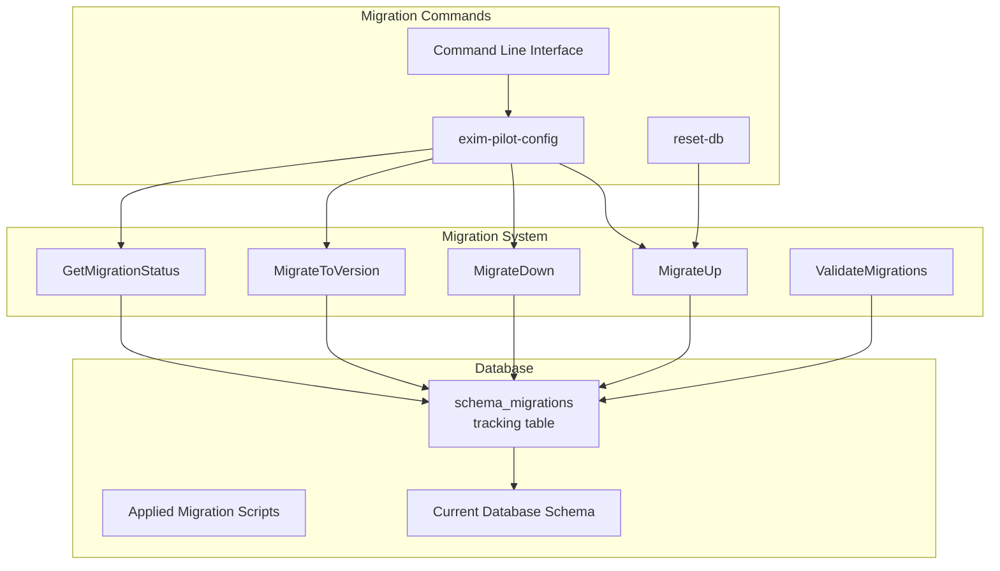
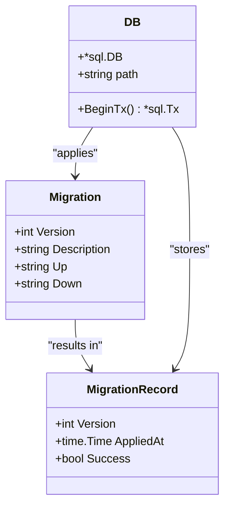
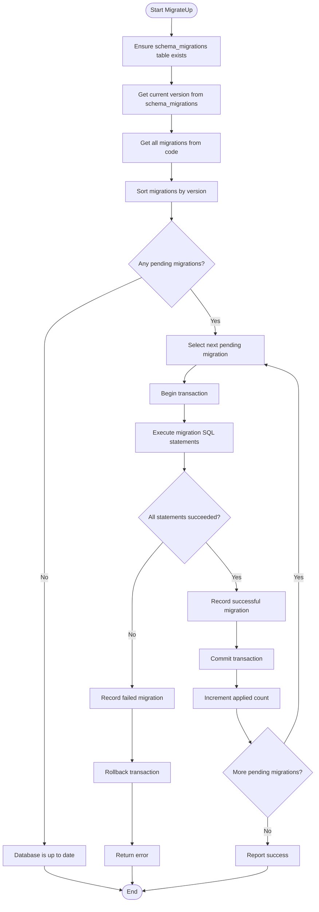
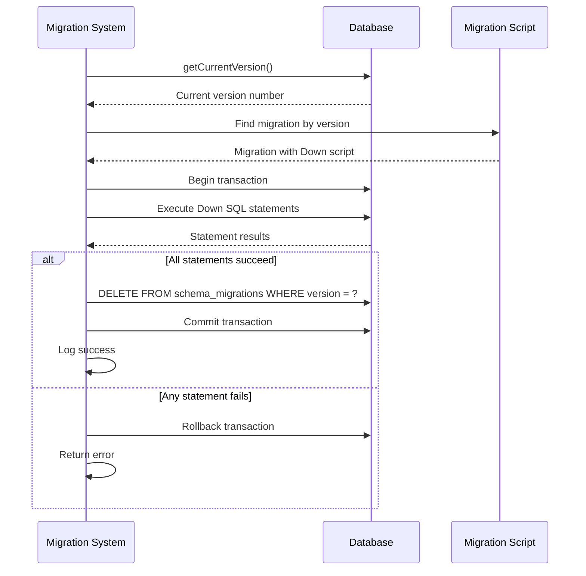

# Schema Migrations


## Table of Contents
1. [Introduction](#introduction)
2. [Migration System Overview](#migration-system-overview)
3. [Migration Structure and Versioning](#migration-structure-and-versioning)
4. [Migration Execution Process](#migration-execution-process)
5. [Migration Examples](#migration-examples)
6. [Rollback Procedures](#rollback-procedures)
7. [Safety Checks and Validation](#safety-checks-and-validation)
8. [Adding New Migrations](#adding-new-migrations)
9. [Testing Migrations](#testing-migrations)
10. [Best Practices](#best-practices)

## Introduction
The Exim Pilot application implements a robust database schema migration system to manage incremental changes to the database structure over time. This system ensures that all database instances across different environments (development, staging, production) maintain consistent schema versions and can be reliably upgraded or downgraded as needed. The migration system is built into the application's core database package and provides both programmatic and command-line interfaces for managing schema changes.

**Section sources**
- [migrations.go](file://internal/database/migrations.go#L1-L50)

## Migration System Overview





**Diagram sources**
- [migrations.go](file://internal/database/migrations.go#L1-L50)
- [main.go](file://cmd/exim-pilot-config/main.go#L1-L50)

**Section sources**
- [migrations.go](file://internal/database/migrations.go#L1-L100)
- [main.go](file://cmd/exim-pilot-config/main.go#L1-L100)

## Migration Structure and Versioning

The migration system uses a structured approach to version control database schema changes. Each migration is represented by a `Migration` struct containing four key fields:

- **Version**: Integer representing the migration sequence number
- **Description**: Human-readable description of the migration purpose
- **Up**: SQL statements to apply the migration forward
- **Down**: SQL statements to roll back the migration

Migrations are stored as code within the `GetMigrations()` function in `migrations.go`, ensuring they are version-controlled alongside the application code. The system enforces sequential versioning starting from 1 with no gaps, and validates that all migrations have non-empty descriptions and up scripts.

The system tracks applied migrations in a dedicated `schema_migrations` table with the following structure:
- **version**: Primary key storing the migration version number
- **applied_at**: Timestamp when the migration was applied
- **success**: Boolean indicating whether the migration succeeded





**Diagram sources**
- [migrations.go](file://internal/database/migrations.go#L11-L23)

**Section sources**
- [migrations.go](file://internal/database/migrations.go#L11-L50)

## Migration Execution Process

The migration execution process follows a transactional approach to ensure data integrity. When applying a migration, the system:

1. Begins a database transaction
2. Executes each SQL statement in the migration's Up script
3. Records the migration in the schema_migrations table upon success
4. Commits the transaction
5. Returns an error and rolls back if any statement fails

The `MigrateUp` function orchestrates the application of pending migrations by:
- Ensuring the schema_migrations table exists
- Determining the current database version
- Applying all migrations with versions higher than the current version
- Processing migrations in ascending order





**Diagram sources**
- [migrations.go](file://internal/database/migrations.go#L370-L415)

**Section sources**
- [migrations.go](file://internal/database/migrations.go#L370-L415)

## Migration Examples

The system includes several example migrations that demonstrate common schema evolution patterns:

### Initial Schema Creation (Version 1)
The first migration creates all core tables for the application:
- **messages**: Tracks all email messages
- **recipients**: Stores message recipients
- **delivery_attempts**: Records delivery attempts
- **log_entries**: Stores searchable log history
- **audit_log**: Tracks administrative actions
- **queue_snapshots**: Maintains historical queue metrics
- **users**: Manages authentication users
- **sessions**: Handles user sessions

### Adding Indexes (Version 2)
This migration improves query performance by adding indexes to frequently queried columns:

```sql
CREATE INDEX IF NOT EXISTS idx_messages_timestamp ON messages(timestamp);
CREATE INDEX IF NOT EXISTS idx_messages_status ON messages(status);
CREATE INDEX IF NOT EXISTS idx_recipients_message_id ON recipients(message_id);
-- Additional indexes for other tables
```


### Adding Message Notes and Tags (Version 3)
This migration extends the message tracking capability:

```sql
CREATE TABLE IF NOT EXISTS message_notes (
    id INTEGER PRIMARY KEY AUTOINCREMENT,
    message_id TEXT NOT NULL,
    user_id INTEGER NOT NULL,
    note TEXT NOT NULL,
    created_at DATETIME DEFAULT CURRENT_TIMESTAMP,
    FOREIGN KEY (message_id) REFERENCES messages(id),
    FOREIGN KEY (user_id) REFERENCES users(id)
);

CREATE TABLE IF NOT EXISTS message_tags (
    id INTEGER PRIMARY KEY AUTOINCREMENT,
    message_id TEXT NOT NULL,
    tag TEXT NOT NULL,
    user_id INTEGER NOT NULL,
    created_at DATETIME DEFAULT CURRENT_TIMESTAMP,
    FOREIGN KEY (message_id) REFERENCES messages(id),
    FOREIGN KEY (user_id) REFERENCES users(id)
);
```


### Schema Column Renaming (Version 6)
This migration corrects column naming inconsistencies:

```sql
ALTER TABLE users RENAME COLUMN active TO is_active;
ALTER TABLE users RENAME COLUMN last_login TO last_login_at;
ALTER TABLE recipients ADD COLUMN created_at DATETIME DEFAULT CURRENT_TIMESTAMP;
ALTER TABLE recipients ADD COLUMN updated_at DATETIME DEFAULT CURRENT_TIMESTAMP;
```


**Section sources**
- [migrations.go](file://internal/database/migrations.go#L57-L369)

## Rollback Procedures

The migration system supports rollback operations through the `MigrateDown` and `MigrateToVersion` functions. Rollbacks are implemented using the Down SQL scripts defined in each migration.

### Rolling Back the Last Migration
The `MigrateDown` function:
1. Retrieves the current database version
2. Finds the corresponding migration in the code
3. Begins a transaction
4. Executes the Down SQL statements
5. Removes the migration record from schema_migrations
6. Commits the transaction





**Diagram sources**
- [migrations.go](file://internal/database/migrations.go#L418-L482)

**Section sources**
- [migrations.go](file://internal/database/migrations.go#L418-L482)

### Migrating to a Specific Version
The `MigrateToVersion` function allows targeting a specific schema version:
- If the target version is higher: applies pending migrations sequentially
- If the target version is lower: rolls back migrations sequentially until reaching the target

This function is particularly useful for testing and debugging migration scripts in staging environments.

## Safety Checks and Validation

The migration system incorporates several safety mechanisms to prevent common errors:

### Migration Validation
The `ValidateMigrations` function performs static analysis of all migration scripts before execution:
- Checks for duplicate version numbers
- Ensures no version gaps exist in the sequence
- Validates that all migrations have non-empty descriptions and Up scripts


```go
func ValidateMigrations() error {
    migrations := GetMigrations()
    
    // Check for duplicate versions
    versions := make(map[int]bool)
    for _, migration := range migrations {
        if versions[migration.Version] {
            return fmt.Errorf("duplicate migration version: %d", migration.Version)
        }
        versions[migration.Version] = true
        
        // Validate migration content
        if migration.Up == "" {
            return fmt.Errorf("migration %d has empty up script", migration.Version)
        }
        
        if migration.Description == "" {
            return fmt.Errorf("migration %d has empty description", migration.Version)
        }
    }
    
    // Check for version gaps
    sort.Slice(migrations, func(i, j int) bool {
        return migrations[i].Version < migrations[j].Version
    })
    
    for i, migration := range migrations {
        expectedVersion := i + 1
        if migration.Version != expectedVersion {
            return fmt.Errorf("migration version gap: expected %d, got %d", expectedVersion, migration.Version)
        }
    }
    
    return nil
}
```


### Transactional Execution
All migrations are executed within database transactions, ensuring atomicity. If any SQL statement fails, the entire migration is rolled back, leaving the database in its previous state.

### Idempotent Operations
Migration scripts use `IF NOT EXISTS` and `IF EXISTS` clauses to make operations idempotent, allowing safe re-execution if needed.

**Section sources**
- [migrations.go](file://internal/database/migrations.go#L649-L697)

## Adding New Migrations

To add a new migration when introducing features or modifying data models:

1. Use the `CreateMigration` helper function to generate a new migration template:

```go
func CreateMigration(description string) Migration {
    // Get the next version number
    migrations := GetMigrations()
    nextVersion := 1
    for _, migration := range migrations {
        if migration.Version >= nextVersion {
            nextVersion = migration.Version + 1
        }
    }
    
    return Migration{
        Version:     nextVersion,
        Description: description,
        Up:          "-- Add your up migration here\n",
        Down:        "-- Add your down migration here\n",
    }
}
```


2. Add the new migration to the `GetMigrations()` function in the correct version sequence
3. Implement the Up script with forward migration SQL
4. Implement the Down script with rollback SQL
5. Test the migration thoroughly in a staging environment

The system automatically assigns the next sequential version number and ensures the migration is properly integrated into the migration sequence.

**Section sources**
- [migrations.go](file://internal/database/migrations.go#L699-L732)

## Testing Migrations

The migration system includes comprehensive testing capabilities:

### Unit Tests
The `migrations_test.go` file contains tests that verify:
- Migration table initialization
- Individual migration application
- Complete migration sequences
- Rollback functionality


```go
func TestMigrate(t *testing.T) {
    manager := NewMigrationManager(db)
    
    migrations := []Migration{
        {
            Version:     1,
            Description: "First migration",
            Up:          "CREATE TABLE table1 (id INTEGER PRIMARY KEY);",
            Down:        "DROP TABLE table1;",
        },
        {
            Version:     2,
            Description: "Second migration",
            Up:          "CREATE TABLE table2 (id INTEGER PRIMARY KEY);",
            Down:        "DROP TABLE table2;",
        },
    }
    
    if err := manager.Migrate(migrations); err != nil {
        t.Fatalf("Failed to migrate: %v", err)
    }
    
    // Verify both migrations were applied
    appliedVersions, err := manager.GetAppliedMigrations()
    if err != nil {
        t.Fatalf("Failed to get applied migrations: %v", err)
    }
    
    if len(appliedVersions) != 2 {
        t.Errorf("Expected 2 applied migrations, got %d", len(appliedVersions))
    }
}
```


### Integration Testing
The `reset-db` command provides a complete integration test by:
1. Removing the existing database
2. Creating a fresh database
3. Running all migrations from scratch
4. Creating the default admin user

This ensures that the complete migration sequence works correctly from an empty state.

**Section sources**
- [migrations_test.go](file://internal/database/migrations_test.go#L96-L145)
- [main.go](file://cmd/reset-db/main.go#L1-L80)

## Best Practices

### Writing Backward-Compatible Migrations
When modifying existing tables:
- Add new columns with default values to avoid breaking existing code
- Use `ALTER TABLE ... ADD COLUMN` rather than recreating tables
- For column renames, add the new column first, migrate data, then remove the old column in a subsequent migration
- Avoid dropping columns in the same migration that adds new functionality

### Testing in Staging Environments
Always test migrations in a staging environment that mirrors production:
- Use a copy of production data to test performance impact
- Verify that application functionality works with the new schema
- Test rollback procedures to ensure they work correctly
- Monitor database performance during migration execution

### Handling SQLite Limitations
Since the application uses SQLite, be aware of its limitations:
- No support for `DROP COLUMN` - instead, recreate the table if necessary
- Limited ALTER TABLE capabilities - prefer additive changes
- Use transactions to ensure atomicity of complex schema changes
- For complex changes, consider creating a new table, copying data, and renaming

### Migration Script Guidelines
- Keep migrations small and focused on a single logical change
- Include descriptive comments in SQL scripts
- Use IF EXISTS/IF NOT EXISTS clauses for idempotency
- Test down migrations thoroughly
- Document any data migration or transformation logic
- Consider the impact on existing data and application code

**Section sources**
- [migrations.go](file://internal/database/migrations.go#L1-L732)
- [main.go](file://cmd/exim-pilot-config/main.go#L1-L343)
- [main.go](file://cmd/reset-db/main.go#L1-L80)

**Referenced Files in This Document**   
- [migrations.go](file://internal/database/migrations.go)
- [connection.go](file://internal/database/connection.go)
- [main.go](file://cmd/exim-pilot-config/main.go)
- [main.go](file://cmd/reset-db/main.go)
- [migrations_test.go](file://internal/database/migrations_test.go)