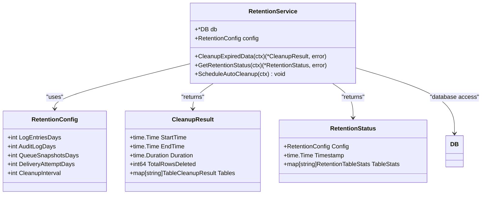
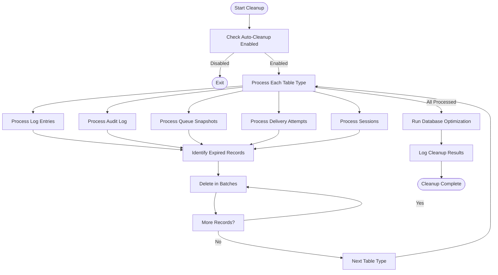
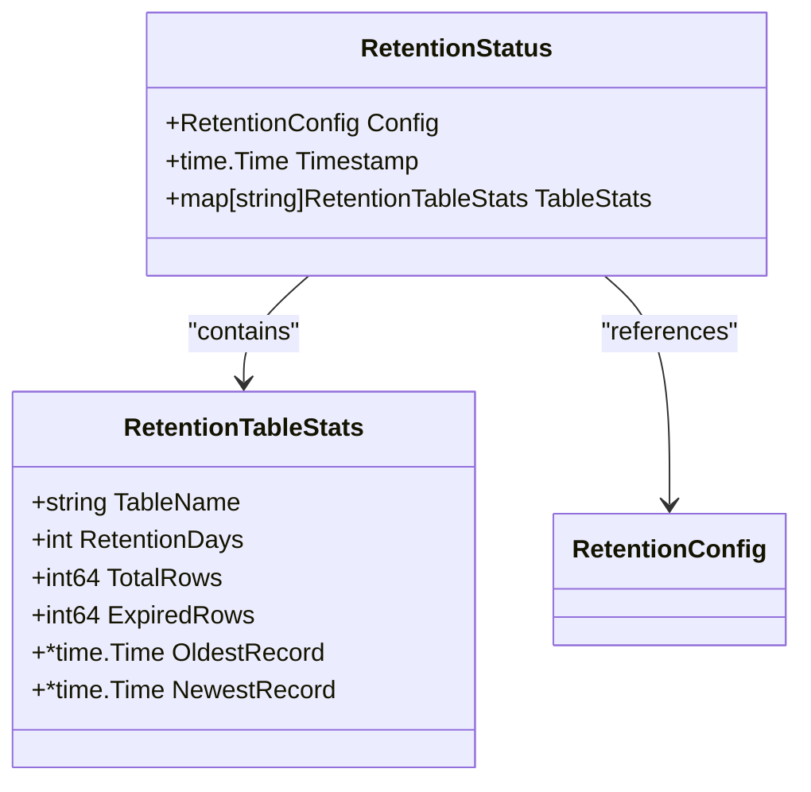

# Data Retention Policies


## Table of Contents
1. [Introduction](#introduction)
2. [Retention Configuration](#retention-configuration)
3. [Retention Service Implementation](#retention-service-implementation)
4. [Background Cleanup Process](#background-cleanup-process)
5. [Retention Status Monitoring](#retention-status-monitoring)
6. [Configuration Examples](#configuration-examples)
7. [Compliance and Reporting Considerations](#compliance-and-reporting-considerations)

## Introduction
The Exim-Pilot system implements comprehensive data retention policies to manage database size while maintaining necessary historical data for troubleshooting, reporting, and compliance purposes. The system provides configurable retention periods for different entity types, with a background service that periodically purges expired records. This documentation details the retention configuration options, implementation architecture, and operational considerations for managing data lifecycle in the system.

**Section sources**
- [retention.go](file://internal/database/retention.go#L0-L360)
- [config.example.yaml](file://config/config.example.yaml#L0-L77)

## Retention Configuration
Data retention policies are configured through the system configuration file, allowing administrators to define how long different types of data should be preserved before automatic cleanup.

### Configuration Options
The retention configuration includes the following key parameters:

**Retention Configuration Parameters**
- **log_entries_days**: Number of days to retain log entries (default: 90)
- **audit_log_days**: Number of days to retain audit log entries (default: 365)
- **queue_snapshots_days**: Number of days to retain queue snapshots (default: 30)
- **delivery_attempt_days**: Number of days to retain delivery attempt records (default: 180)
- **cleanup_interval**: Frequency of cleanup operations in hours (default: 24)

### Default Retention Values
The system provides sensible default retention periods for different data types based on typical operational requirements:


```yaml
retention:
  log_entries_days: 90         # Keep log entries for this many days
  audit_log_days: 365          # Keep audit log entries for this many days
  queue_snapshots_days: 30     # Keep queue snapshots for this many days
  delivery_attempt_days: 180   # Keep delivery attempts for this many days
  cleanup_interval: 24         # Run cleanup every N hours
```


These defaults balance the need for historical data with database size management:
- **Log entries**: 90 days (3 months) for general troubleshooting
- **Audit log**: 365 days (1 year) for security and compliance
- **Queue snapshots**: 30 days (1 month) for performance analysis
- **Delivery attempts**: 180 days (6 months) for delivery issue investigation

**Section sources**
- [config.example.yaml](file://config/config.example.yaml#L65-L71)
- [config.go](file://internal/config/config.go#L278-L283)

## Retention Service Implementation
The retention functionality is implemented as a dedicated service that manages the lifecycle of data based on configured policies.

### Core Components
The retention service consists of several key components that work together to enforce data retention policies:





**Diagram sources**
- [retention.go](file://internal/database/retention.go#L7-L359)

**Section sources**
- [retention.go](file://internal/database/retention.go#L7-L359)

## Background Cleanup Process
The system includes a background service that automatically purges expired records according to the configured retention policies.

### Cleanup Workflow
The cleanup process follows a systematic approach to remove expired data while minimizing impact on system performance:





**Diagram sources**
- [retention.go](file://internal/database/retention.go#L112-L225)

**Section sources**
- [retention.go](file://internal/database/retention.go#L112-L225)

### Batch Processing
To prevent long-running transactions and minimize database lock contention, the cleanup process uses batch deletion:

- **Batch size**: Configurable via `CleanupBatchSize` (default: 1000 rows)
- **Processing**: Records are deleted in batches with a 10ms delay between batches
- **Transaction management**: Each batch is processed within its own transaction

This approach ensures that the cleanup process remains responsive and doesn't block other database operations.

## Retention Status Monitoring
The system provides comprehensive monitoring capabilities to track retention status and cleanup operations.

### Status Information
The retention service exposes detailed status information through the `GetRetentionStatus` method, which returns statistics for each data type:





**Diagram sources**
- [retention.go](file://internal/database/retention.go#L335-L358)

The status includes:
- **Total rows**: Current count of records in the table
- **Expired rows**: Count of records that have exceeded retention period
- **Oldest record**: Timestamp of the oldest record in the table
- **Newest record**: Timestamp of the newest record in the table

### Cleanup Results
After each cleanup operation, detailed results are returned and logged:

- **Start time**: When the cleanup process started
- **End time**: When the cleanup process completed
- **Duration**: Total time taken for cleanup
- **Rows deleted**: Total number of records removed
- **Per-table results**: Detailed statistics for each table processed

**Section sources**
- [retention.go](file://internal/database/retention.go#L300-L358)

## Configuration Examples
The following examples demonstrate how to configure retention policies for different deployment scenarios.

### High-Volume Production Environment
In high-volume production environments, shorter retention periods may be necessary to manage database size:


```yaml
retention:
  log_entries_days: 30         # Reduce from 90 to 30 days
  audit_log_days: 365          # Maintain 1 year for compliance
  queue_snapshots_days: 14     # Reduce from 30 to 14 days
  delivery_attempt_days: 90    # Reduce from 180 to 90 days
  cleanup_interval: 12         # Run cleanup every 12 hours instead of 24
```


This configuration reduces storage requirements while maintaining essential data for troubleshooting and compliance.

### Development and Testing Instance
For development and testing instances, longer retention periods can be used to facilitate debugging:


```yaml
retention:
  log_entries_days: 180        # Extend from 90 to 180 days
  audit_log_days: 730          # Extend from 365 to 2 years
  queue_snapshots_days: 60     # Extend from 30 to 60 days
  delivery_attempt_days: 365   # Extend from 180 to 1 year
  cleanup_interval: 48         # Run cleanup every 48 hours
```


This configuration preserves more historical data for debugging complex issues and testing reporting features.

**Section sources**
- [config.example.yaml](file://config/config.example.yaml#L65-L71)
- [retention.go](file://internal/database/retention.go#L35-L74)

## Compliance and Reporting Considerations
Data retention policies have significant implications for compliance, reporting accuracy, and troubleshooting capabilities.

### Impact on Reporting Accuracy
Retention settings directly affect the time range available for reporting:

- **Shorter retention periods**: Limit historical analysis capabilities
- **Longer retention periods**: Enable trend analysis over extended periods
- **Critical metrics**: Ensure retention periods cover required reporting windows

For example, if monthly reports require 13 months of data for year-over-year comparisons, the audit log retention should be at least 400 days.

### Troubleshooting Capabilities
Retention policies impact the ability to diagnose issues:

- **Log entries**: Should cover the typical incident investigation window
- **Delivery attempts**: Should exceed the maximum message retry period
- **Queue snapshots**: Should capture sufficient history for performance analysis

### Compliance Requirements
Different regulatory frameworks may impose specific retention requirements:

- **GDPR**: Requires consideration of data minimization principles
- **HIPAA**: May require specific retention periods for audit logs
- **SOX**: Often requires 7-year retention for financial records

When adjusting policies for regulatory requirements, consider:
- Documenting the rationale for retention periods
- Implementing appropriate data protection measures
- Establishing procedures for data destruction verification
- Maintaining audit trails of retention policy changes

**Section sources**
- [retention.go](file://internal/database/retention.go#L0-L360)
- [config.example.yaml](file://config/config.example.yaml#L65-L71)

**Referenced Files in This Document**   
- [retention.go](file://internal/database/retention.go)
- [config.example.yaml](file://config/config.example.yaml)
- [config.go](file://internal/config/config.go)