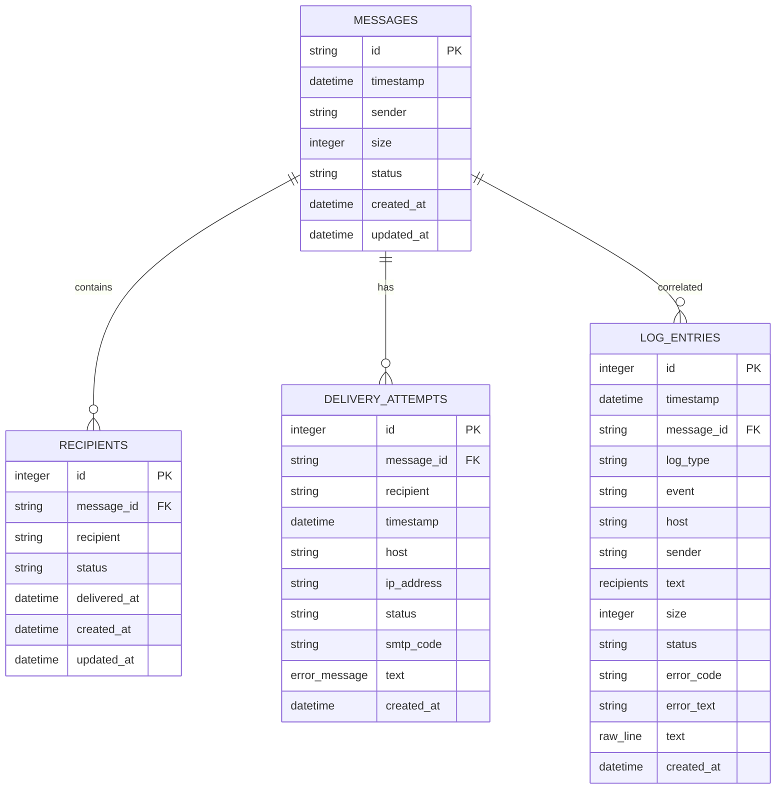
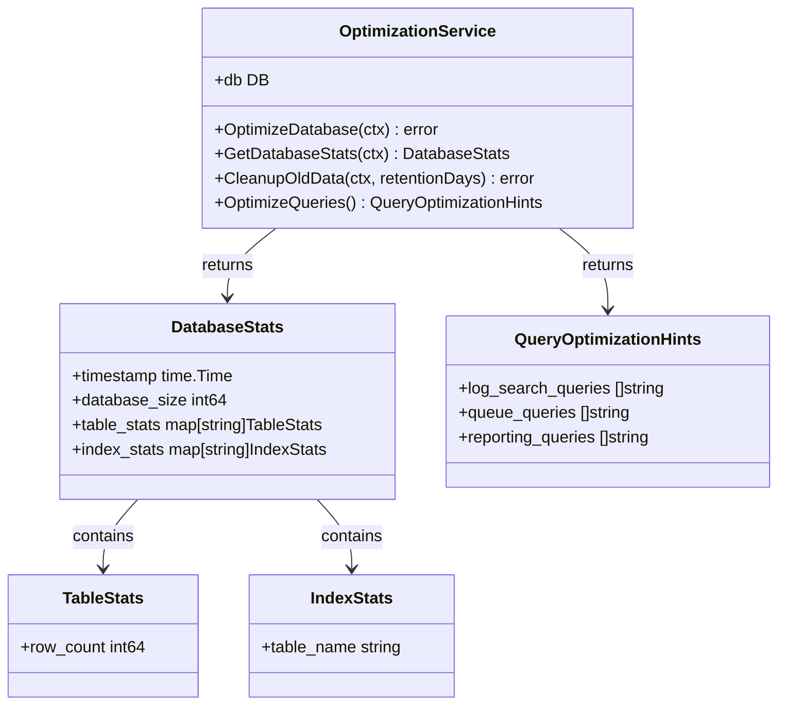
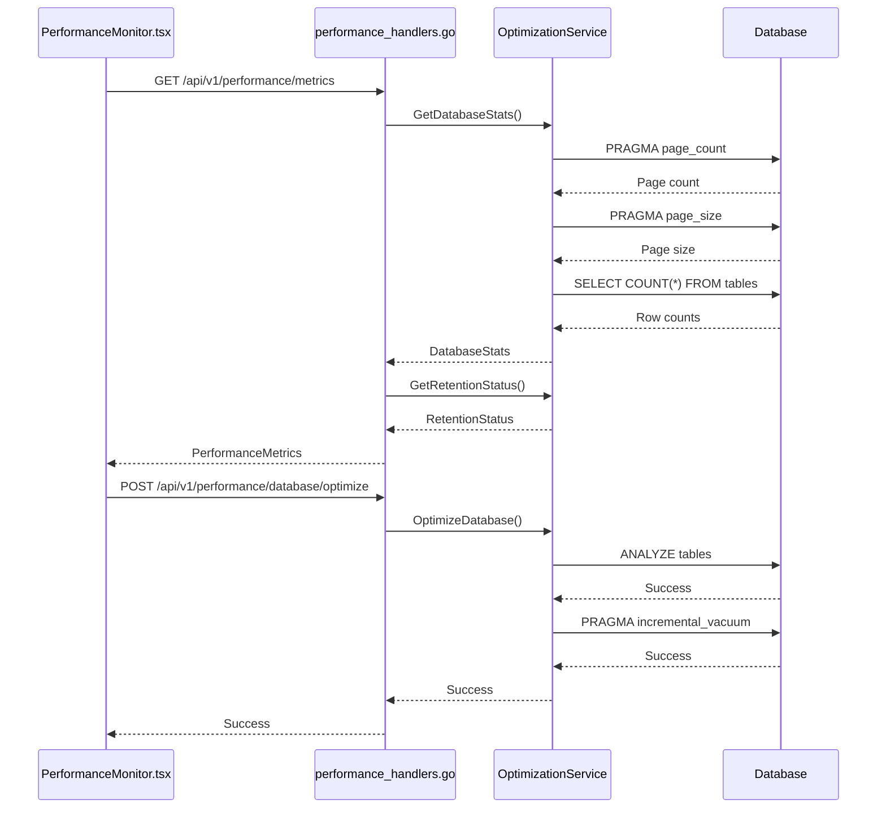

# Query Optimization and Indexing


## Table of Contents
1. [Introduction](#introduction)
2. [Indexing Strategy](#indexing-strategy)
3. [Query Patterns and Index Utilization](#query-patterns-and-index-utilization)
4. [Database Optimization Techniques](#database-optimization-techniques)
5. [Performance Monitoring and Metrics](#performance-monitoring-and-metrics)
6. [Query Optimization Recommendations](#query-optimization-recommendations)
7. [Monitoring and Maintenance](#monitoring-and-maintenance)

## Introduction
The exim-pilot system implements a comprehensive database optimization strategy to maintain high performance across various features including queue management, message tracing, and reporting. The system uses SQLite as its primary database and employs a multi-layered approach to query optimization through strategic indexing, query pattern design, and periodic database maintenance. This document details the indexing strategy, query patterns, optimization techniques, and performance monitoring capabilities that ensure efficient database operations even with large datasets.

## Indexing Strategy
The database schema is designed with extensive indexing on frequently queried fields to optimize performance for common access patterns. Indexes are created on message status, recipient status, timestamps, senders, and message IDs across multiple tables.





**Diagram sources**
- [schema.go](file://internal/database/schema.go#L10-L195)

**Section sources**
- [schema.go](file://internal/database/schema.go#L10-L195)
- [migrations.go](file://internal/database/migrations.go#L140-L200)

### Single-Column Indexes
The system implements single-column indexes on the most frequently filtered fields:

- **Messages table**: `idx_messages_timestamp`, `idx_messages_status`, `idx_messages_sender`
- **Recipients table**: `idx_recipients_message_id`, `idx_recipients_status`, `idx_recipients_recipient`
- **Delivery attempts table**: `idx_delivery_attempts_message_id`, `idx_delivery_attempts_timestamp`, `idx_delivery_attempts_status`
- **Log entries table**: `idx_log_entries_timestamp`, `idx_log_entries_message_id`, `idx_log_entries_event`, `idx_log_entries_log_type`, `idx_log_entries_sender`

These indexes accelerate queries that filter by specific status values, timestamps, senders, or message IDs.

### Composite Indexes
For queries that commonly filter on multiple criteria simultaneously, composite indexes are implemented:

- `idx_messages_status_timestamp`: Optimizes queries filtering by status and time range
- `idx_messages_sender_timestamp`: Accelerates sender-based queries within time windows
- `idx_recipients_status_message_id`: Optimizes status-based recipient queries
- `idx_delivery_attempts_message_recipient`: Speeds up delivery attempt lookups by message and recipient
- `idx_delivery_attempts_timestamp_status`: Optimizes time-based filtering with status constraints
- `idx_log_entries_timestamp_type`: Accelerates log searches by time and log type
- `idx_log_entries_timestamp_event`: Optimizes event-based log searches within time ranges
- `idx_log_entries_message_timestamp`: Speeds up message correlation queries with time ordering

### Full-Text Search Index
The system includes a full-text search index on the raw log line content to enable efficient text-based searching:

- `idx_log_entries_raw_line_fts`: Enables fast text search across log entry content

This index supports the log search functionality, allowing users to find specific log entries based on text patterns in the raw log data.

## Query Patterns and Index Utilization
The repository layer implements specific query patterns that leverage the indexing strategy to optimize performance for different features.

```mermaid
flowchart TD
QueueListing["Queue Listing Feature"] --> Q1["SELECT * FROM messages WHERE status IN (?, ?, ?) ORDER BY timestamp DESC LIMIT ?"]
MessageTracing["Message Tracing Feature"] --> M1["SELECT * FROM messages WHERE id = ?"]
MessageTracing --> M2["SELECT * FROM recipients WHERE message_id = ? ORDER BY id"]
MessageTracing --> M3["SELECT * FROM delivery_attempts WHERE message_id = ? ORDER BY timestamp"]
MessageTracing --> M4["SELECT * FROM log_entries WHERE message_id = ? ORDER BY timestamp"]
Reporting["Reporting Feature"] --> R1["SELECT DATE(timestamp) as date, COUNT(*) as count FROM log_entries WHERE timestamp BETWEEN ? AND ? GROUP BY DATE(timestamp)"]
Reporting --> R2["SELECT status, COUNT(*) as count FROM delivery_attempts WHERE timestamp BETWEEN ? AND ? GROUP BY status"]
LogSearch["Log Search Feature"] --> L1["SELECT * FROM log_entries WHERE timestamp BETWEEN ? AND ? ORDER BY timestamp DESC LIMIT ?"]
LogSearch --> L2["SELECT * FROM log_entries WHERE log_type = ? AND timestamp BETWEEN ? AND ? ORDER BY timestamp DESC LIMIT ?"]
LogSearch --> L3["SELECT * FROM log_entries WHERE message_id = ? ORDER BY timestamp ASC"]
```





**Diagram sources**
- [repository.go](file://internal/database/repository.go#L0-L799)
- [models.go](file://internal/database/models.go#L0-L340)

**Section sources**
- [repository.go](file://internal/database/repository.go#L0-L799)
- [models.go](file://internal/database/models.go#L0-L340)

### Queue Listing Queries
The queue listing feature uses queries that filter messages by status and order by timestamp. The query pattern leverages the composite index `idx_messages_status_timestamp`:


```sql
SELECT * FROM messages WHERE status IN (?, ?, ?) ORDER BY timestamp DESC LIMIT ?
```


Additional queries support sender-based filtering, utilizing the `idx_messages_sender_timestamp` composite index:


```sql
SELECT * FROM messages WHERE sender LIKE ? AND status = ? ORDER BY timestamp DESC LIMIT ?
```


These queries are optimized for the common use case of viewing messages by status (queued, deferred, frozen) or searching by sender within specific status categories.

### Message Tracing Queries
The message tracing feature requires retrieving comprehensive information about a specific message and its delivery history. This involves multiple queries that leverage various indexes:

1. Message lookup by ID using the primary key:

```sql
SELECT id, timestamp, sender, size, status, created_at, updated_at FROM messages WHERE id = ?
```


2. Recipients retrieval using the message_id index:

```sql
SELECT id, message_id, recipient, status, delivered_at, created_at, updated_at FROM recipients WHERE message_id = ? ORDER BY id
```


3. Delivery attempts retrieval using the message_id index:

```sql
SELECT id, message_id, recipient, timestamp, host, ip_address, status, smtp_code, error_message, created_at FROM delivery_attempts WHERE message_id = ? ORDER BY timestamp
```


4. Log entries retrieval using the message_id index:

```sql
SELECT id, timestamp, message_id, log_type, event, host, sender, recipients, size, status, error_code, error_text, raw_line, created_at FROM log_entries WHERE message_id = ? ORDER BY timestamp
```


These queries are executed in sequence to build a complete delivery trace, with each query optimized through appropriate indexing.

### Reporting Queries
The reporting feature uses aggregation queries that analyze data over time periods. These queries leverage timestamp indexes for efficient range scanning:

1. Volume reporting by date:

```sql
SELECT DATE(timestamp) as date, COUNT(*) as count FROM log_entries WHERE timestamp BETWEEN ? AND ? GROUP BY DATE(timestamp)
```


2. Deliverability reporting by status:

```sql
SELECT status, COUNT(*) as count FROM delivery_attempts WHERE timestamp BETWEEN ? AND ? GROUP BY status
```


3. Queue statistics:

```sql
SELECT status, COUNT(*) as count FROM messages GROUP BY status
```


These queries are optimized for time-based aggregations, using the timestamp indexes to efficiently scan the required date ranges.

### Log Search Queries
The log search feature supports various search patterns that leverage different indexes:

1. Time-based log retrieval:

```sql
SELECT * FROM log_entries WHERE timestamp BETWEEN ? AND ? ORDER BY timestamp DESC LIMIT ?
```


2. Filtered log searches by log type and time:

```sql
SELECT * FROM log_entries WHERE log_type = ? AND timestamp BETWEEN ? AND ? ORDER BY timestamp DESC LIMIT ?
```


3. Message correlation by message ID:

```sql
SELECT * FROM log_entries WHERE message_id = ? ORDER BY timestamp ASC
```


4. Sender-based log searches:

```sql
SELECT * FROM log_entries WHERE sender = ? AND timestamp BETWEEN ? AND ? ORDER BY timestamp DESC LIMIT ?
```


These queries utilize the composite indexes on timestamp with log type, event, and sender to optimize search performance.

## Database Optimization Techniques
The system implements several optimization techniques in the repository layer to maintain database performance.





**Diagram sources**
- [optimization.go](file://internal/database/optimization.go#L0-L278)

**Section sources**
- [optimization.go](file://internal/database/optimization.go#L0-L278)

### Connection Pooling and Configuration
The system optimizes SQLite settings for better performance through PRAGMA configurations:

- **WAL mode**: Enables Write-Ahead Logging for improved concurrency
- **Cache size**: Configured to 2MB (-2000 pages) to reduce disk I/O
- **Page size**: Set to 4096 bytes for optimal I/O performance
- **Temporary storage**: Uses memory for temporary tables to speed up operations
- **Synchronous mode**: Set to NORMAL for WAL mode, balancing durability and performance
- **Busy timeout**: Configured to 5000ms to handle contention gracefully
- **Memory mapping**: Set to 64MB to improve read performance

These settings are applied when the database connection is established, optimizing the database engine for the application's access patterns.

### Batch Operations
While the current implementation focuses on individual operations, the repository pattern is designed to support batch operations. The query structure and indexing strategy enable efficient batch processing when needed:

- Parameterized queries support batch execution
- Indexes on frequently filtered fields enable efficient batch lookups
- Transaction support allows grouping multiple operations

Future enhancements could implement explicit batch operations for bulk message processing, recipient updates, or log ingestion.

### Query Optimization
The OptimizationService provides query optimization hints for common use cases:


```go
func (s *OptimizationService) OptimizeQueries() *QueryOptimizationHints {
	return &QueryOptimizationHints{
		LogSearchQueries: []string{
			"SELECT * FROM log_entries WHERE timestamp BETWEEN ? AND ? ORDER BY timestamp DESC LIMIT ?",
			"SELECT * FROM log_entries WHERE log_type = ? AND timestamp BETWEEN ? AND ? ORDER BY timestamp DESC LIMIT ?",
			"SELECT * FROM log_entries WHERE message_id = ? ORDER BY timestamp ASC",
		},
		QueueQueries: []string{
			"SELECT * FROM messages WHERE status IN (?, ?, ?) ORDER BY timestamp DESC LIMIT ?",
			"SELECT * FROM messages WHERE sender LIKE ? AND status = ? ORDER BY timestamp DESC LIMIT ?",
		},
		ReportingQueries: []string{
			"SELECT DATE(timestamp) as date, COUNT(*) as count FROM log_entries WHERE timestamp BETWEEN ? AND ? GROUP BY DATE(timestamp)",
			"SELECT status, COUNT(*) as count FROM delivery_attempts WHERE timestamp BETWEEN ? AND ? GROUP BY status",
		},
	}
}
```


These optimized query patterns are designed to leverage the indexing strategy for maximum performance.

## Performance Monitoring and Metrics
The system provides comprehensive performance monitoring through API endpoints and a dedicated frontend component.





**Diagram sources**
- [performance_handlers.go](file://internal/api/performance_handlers.go#L0-L273)
- [PerformanceMonitor.tsx](file://web/src/components/Performance/PerformanceMonitor.tsx#L0-L356)

**Section sources**
- [performance_handlers.go](file://internal/api/performance_handlers.go#L0-L273)
- [PerformanceMonitor.tsx](file://web/src/components/Performance/PerformanceMonitor.tsx#L0-L356)

### Database Statistics
The system exposes detailed database statistics through the `/api/v1/performance/database/stats` endpoint:

- **Database size**: Calculated from page count and page size
- **Table statistics**: Row counts for each table
- **Index statistics**: List of indexes and their associated tables
- **Timestamp**: When the statistics were collected

These metrics are displayed in the Performance Monitor frontend component, showing database size, table counts, index counts, and total row count.

### Performance Metrics Endpoint
The `/api/v1/performance/metrics` endpoint combines database statistics with retention status to provide a comprehensive view of system performance:


```go
func (h *PerformanceHandlers) handlePerformanceMetrics(w http.ResponseWriter, r *http.Request) {
	// Get database stats
	dbStats, err := h.optimizationService.GetDatabaseStats(r.Context())
	
	// Get retention status
	retentionStatus, err := h.retentionService.GetRetentionStatus(r.Context())
	
	// Combine metrics
	metrics := map[string]interface{}{
		"database":  dbStats,
		"retention": retentionStatus,
		"system": map[string]interface{}{
			"timestamp": dbStats.Timestamp,
		},
	}
	
	WriteSuccessResponse(w, metrics)
}
```


### Optimization Operations
The system provides API endpoints to perform database optimization operations:

- **Database optimization**: POST `/api/v1/performance/database/optimize` runs ANALYZE and VACUUM operations
- **Data cleanup**: POST `/api/v1/performance/retention/cleanup` removes expired data based on retention policies
- **Batch optimization**: POST `/api/v1/performance/batch/optimize` performs multiple optimization tasks

These operations are accessible through the Performance Monitor frontend, allowing administrators to maintain database performance.

## Query Optimization Recommendations
Based on the analysis of the current implementation, the following query optimization recommendations are provided:

### Existing Optimization Strengths
The system demonstrates several strong optimization practices:

1. **Comprehensive indexing**: Extensive use of single-column and composite indexes on frequently queried fields
2. **Query pattern alignment**: Query patterns are designed to leverage available indexes
3. **Database configuration**: SQLite is configured for optimal performance with appropriate PRAGMA settings
4. **Performance monitoring**: Comprehensive metrics and optimization tools are provided
5. **Retention policies**: Data cleanup based on retention policies prevents unbounded growth

### Recommended Index Additions
To further optimize performance, consider adding the following indexes:

1. **Messages table**: `idx_messages_created_at_status` on (created_at, status) for queries filtering by creation time and status
2. **Recipients table**: `idx_recipients_message_status` on (message_id, status) for faster status filtering within messages
3. **Delivery attempts table**: `idx_delivery_attempts_message_status` on (message_id, status) for delivery status analysis
4. **Log entries table**: `idx_log_entries_sender_status` on (sender, status) for sender-based status analysis

These additional indexes would support more complex filtering scenarios while maintaining good performance.

### Query Pattern Improvements
Consider the following query pattern improvements:

1. **Use covering indexes**: Include frequently accessed columns in indexes to avoid table lookups
2. **Implement query caching**: Cache frequent query results to reduce database load
3. **Add query timeouts**: Prevent long-running queries from impacting system performance
4. **Implement pagination**: Ensure all list queries support proper pagination to limit result sets

## Monitoring and Maintenance
The system provides tools for monitoring slow queries and maintaining database performance.

### Slow Query Monitoring
While the current implementation doesn't include explicit slow query logging, SQLite can be configured to log queries exceeding a certain threshold:


```sql
PRAGMA vdbe_trace = ON;
PRAGMA vdbe_listing = ON;
```


Future enhancements could implement application-level query timing to identify and log slow queries.

### Index Management
The system should implement regular index maintenance:

1. **Monitor index usage**: Track which indexes are actually used by queries
2. **Remove unused indexes**: Drop indexes that are not providing benefit to reduce overhead
3. **Review index effectiveness**: Regularly analyze query performance to ensure indexes are effective

### Performance Testing
The system includes a performance testing framework that can be used to measure query execution time improvements:


```go
func (h *PerformanceHandlers) handlePerformanceTest(w http.ResponseWriter, r *http.Request) {
	// Placeholder for performance testing
	// In a production system, you would implement actual performance tests
	result := map[string]interface{}{
		"test_type":   request.TestType,
		"duration":    request.Duration,
		"concurrency": request.Concurrency,
		"sample_size": request.SampleSize,
		"message":     "Performance test would be implemented here",
		"note":        "This would include latency, throughput, and error rate measurements",
	}
}
```


This framework can be extended to measure the impact of new indexes or query optimizations.

### Adding New Indexes
When adding new indexes, follow this process:

1. **Identify the query pattern**: Determine the specific query that needs optimization
2. **Analyze the execution plan**: Use EXPLAIN QUERY PLAN to understand how SQLite executes the query
3. **Design the index**: Create an index that supports the query pattern, considering composite indexes for multiple filter conditions
4. **Test the performance**: Measure query execution time before and after adding the index
5. **Monitor the impact**: Track database performance and size to ensure the index provides net benefit

The indexing strategy should be reviewed periodically based on actual query patterns and performance requirements.

**Referenced Files in This Document**   
- [schema.go](file://internal/database/schema.go)
- [migrations.go](file://internal/database/migrations.go)
- [optimization.go](file://internal/database/optimization.go)
- [repository.go](file://internal/database/repository.go)
- [models.go](file://internal/database/models.go)
- [performance_handlers.go](file://internal/api/performance_handlers.go)
- [PerformanceMonitor.tsx](file://web/src/components/Performance/PerformanceMonitor.tsx)