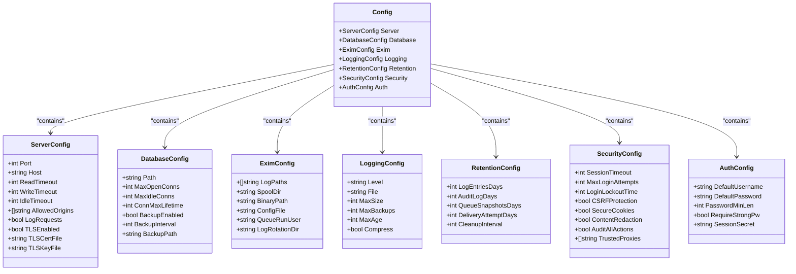
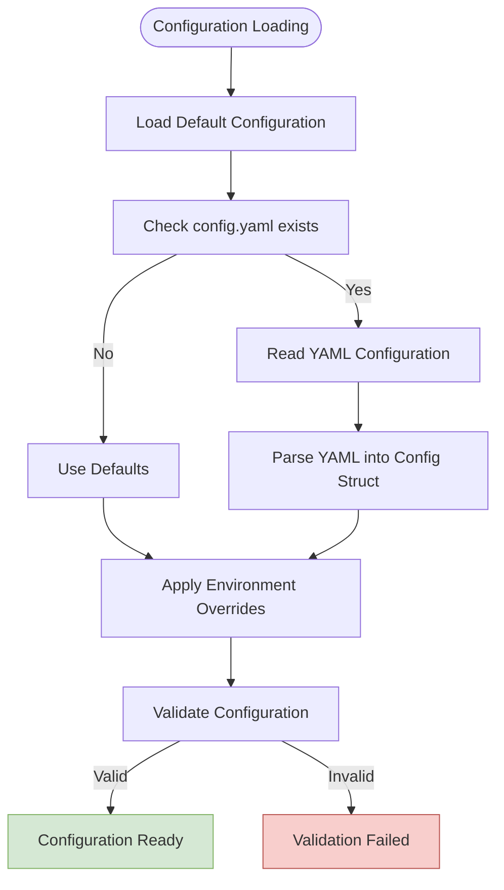
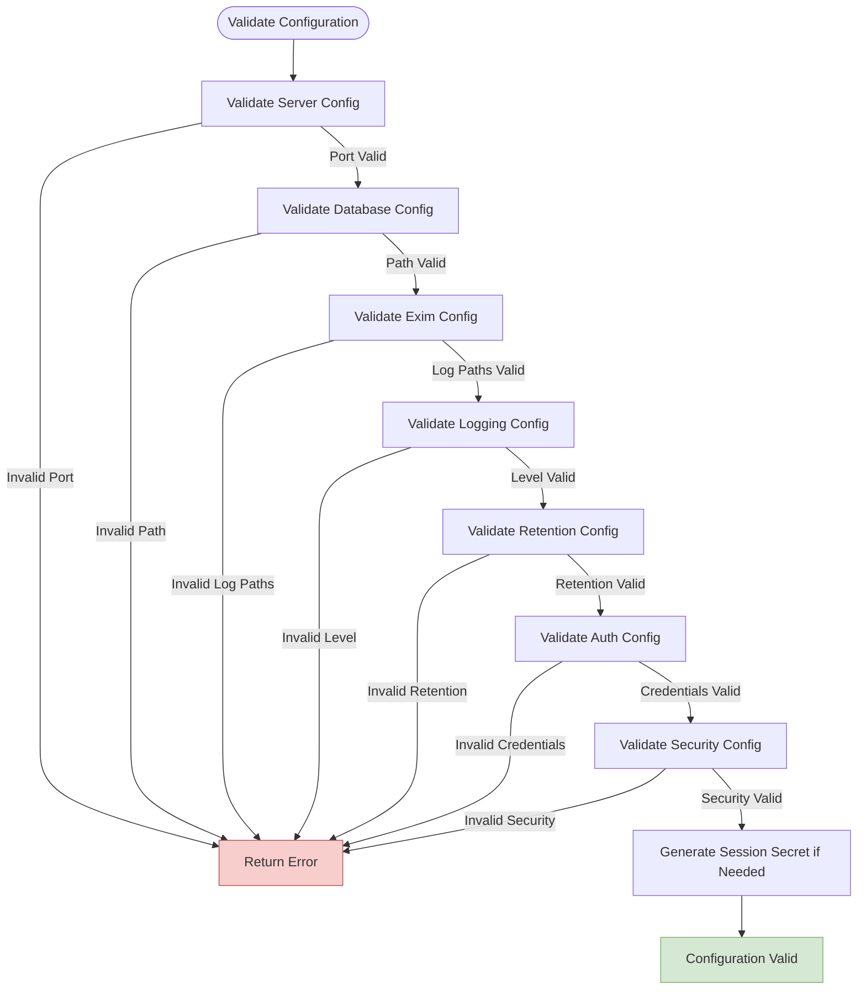
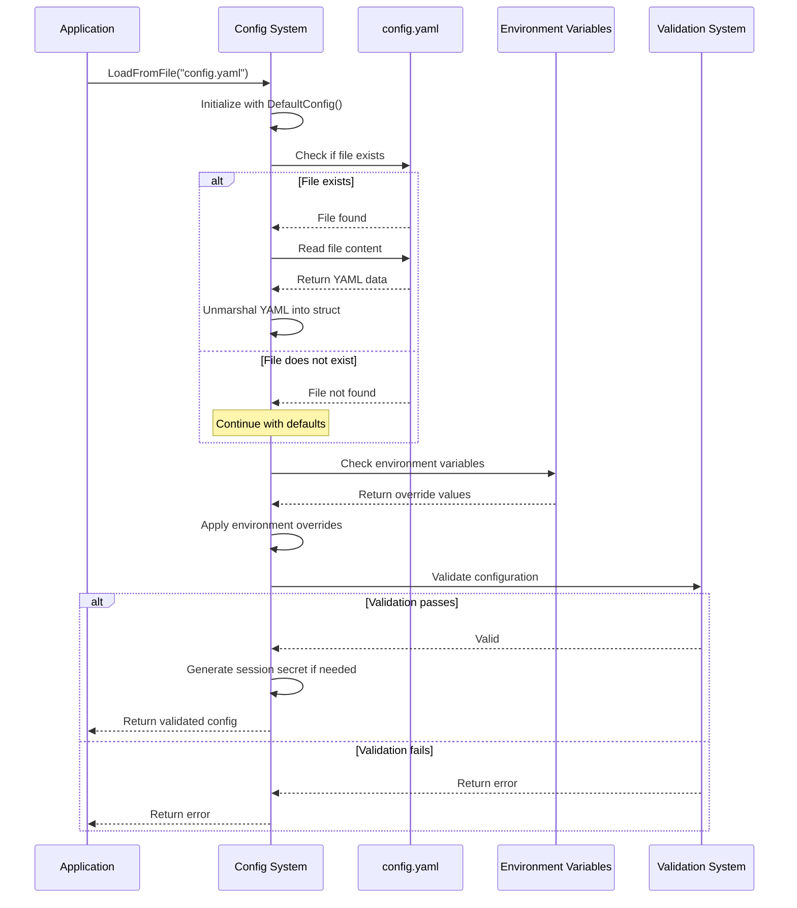

# Configuration File Reference

## Table of Contents
1. [Configuration File Reference](#configuration-file-reference)
2. [Configuration Structure Overview](#configuration-structure-overview)
3. [Server Configuration](#server-configuration)
4. [Database Configuration](#database-configuration)
5. [Exim Integration Configuration](#exim-integration-configuration)
6. [Logging Configuration](#logging-configuration)
7. [Data Retention Policies](#data-retention-policies)
8. [Security Configuration](#security-configuration)
9. [Authentication Settings](#authentication-settings)
10. [Environment Variable Overrides](#environment-variable-overrides)
11. [Configuration Validation Rules](#configuration-validation-rules)
12. [Configuration Loading Process](#configuration-loading-process)

## Configuration Structure Overview

The `config.example.yaml` file provides a comprehensive configuration structure for the Exim Pilot application, organized into logical sections that map directly to the internal Go `Config` struct. The configuration follows a hierarchical YAML structure with top-level sections for server, database, Exim integration, logging, retention, security, and authentication settings.

**Diagram sources**
- [config.go](file://internal/config/config.go#L37-L62)

**Section sources**
- [config.example.yaml](file://config/config.example.yaml)
- [config.go](file://internal/config/config.go)

## Server Configuration

The server configuration section controls the HTTP server behavior, including network binding, timeouts, and security settings.

### port
- **Data Type**: integer
- **Default Value**: 8080
- **Valid Range**: 1-65535
- **Required**: Yes
- **Functional Impact**: Specifies the TCP port on which the HTTP server listens. Values outside the valid range will cause configuration validation to fail.
- **Go Struct Field**: `ServerConfig.Port`
- **Environment Variable**: `EXIM_PILOT_PORT`

### host
- **Data Type**: string
- **Default Value**: "0.0.0.0"
- **Valid Values**: Valid IP address or hostname
- **Required**: Yes
- **Functional Impact**: Determines the network interface to bind to. "0.0.0.0" binds to all interfaces, while specific IP addresses restrict binding to that interface only.
- **Go Struct Field**: `ServerConfig.Host`
- **Environment Variable**: `EXIM_PILOT_HOST`

### read_timeout
- **Data Type**: integer
- **Default Value**: 15
- **Valid Range**: Any positive integer
- **Required**: No (uses default if not specified)
- **Functional Impact**: Sets the maximum duration (in seconds) for reading the entire request including body. Helps prevent slow client attacks.
- **Go Struct Field**: `ServerConfig.ReadTimeout`
- **Environment Variable**: `EXIM_PILOT_READ_TIMEOUT`

### write_timeout
- **Data Type**: integer
- **Default Value**: 15
- **Valid Range**: Any positive integer
- **Required**: No (uses default if not specified)
- **Functional Impact**: Sets the maximum duration (in seconds) for writing the response. Prevents hanging responses from consuming server resources.
- **Go Struct Field**: `ServerConfig.WriteTimeout`
- **Environment Variable**: `EXIM_PILOT_WRITE_TIMEOUT`

### idle_timeout
- **Data Type**: integer
- **Default Value**: 60
- **Valid Range**: Any positive integer
- **Required**: No (uses default if not specified)
- **Functional Impact**: Controls the maximum idle time (in seconds) for keep-alive connections. Helps manage connection pool resources.
- **Go Struct Field**: `ServerConfig.IdleTimeout`

### allowed_origins
- **Data Type**: array of strings
- **Default Value**: ["*"]
- **Valid Values**: Domain names, IP addresses, or "*" for wildcard
- **Required**: No (uses default if not specified)
- **Functional Impact**: Configures CORS (Cross-Origin Resource Sharing) policy. In production, specific domains should be listed instead of using "*" for security reasons.
- **Go Struct Field**: `ServerConfig.AllowedOrigins`
- **Environment Variable**: `EXIM_PILOT_ALLOWED_ORIGINS` (comma-separated)

### log_requests
- **Data Type**: boolean
- **Default Value**: true
- **Valid Values**: true, false
- **Required**: No (uses default if not specified)
- **Functional Impact**: Enables or disables HTTP request logging. When enabled, all incoming requests are logged at the configured log level.
- **Go Struct Field**: `ServerConfig.LogRequests`

### tls_enabled
- **Data Type**: boolean
- **Default Value**: false
- **Valid Values**: true, false
- **Required**: No (uses default if not specified)
- **Functional Impact**: Enables HTTPS/TLS encryption. When enabled, both `tls_cert_file` and `tls_key_file` must be specified and valid.
- **Go Struct Field**: `ServerConfig.TLSEnabled`
- **Environment Variable**: `EXIM_PILOT_TLS_ENABLED`

### tls_cert_file
- **Data Type**: string
- **Default Value**: ""
- **Valid Values**: Path to a valid PEM-encoded X.509 certificate
- **Required**: Conditionally (required when `tls_enabled` is true)
- **Functional Impact**: Specifies the path to the TLS certificate file. The file must exist and be readable by the application.
- **Go Struct Field**: `ServerConfig.TLSCertFile`
- **Environment Variable**: `EXIM_PILOT_TLS_CERT`

### tls_key_file
- **Data Type**: string
- **Default Value**: ""
- **Valid Values**: Path to a valid PEM-encoded private key
- **Required**: Conditionally (required when `tls_enabled` is true)
- **Functional Impact**: Specifies the path to the TLS private key file. The file must exist, be readable, and match the certificate.
- **Go Struct Field**: `ServerConfig.TLSKeyFile`
- **Environment Variable**: `EXIM_PILOT_TLS_KEY`

**Section sources**
- [config.example.yaml](file://config/config.example.yaml)
- [config.go](file://internal/config/config.go#L37-L62)

## Database Configuration

The database configuration section manages SQLite database connection settings, pooling, and backup operations.

### path
- **Data Type**: string
- **Default Value**: "data/exim-pilot.db"
- **Valid Values**: Valid file system path
- **Required**: Yes
- **Functional Impact**: Specifies the file path for the SQLite database. The parent directory will be created if it doesn't exist. An empty value will cause validation to fail.
- **Go Struct Field**: `DatabaseConfig.Path`
- **Environment Variable**: `EXIM_PILOT_DB_PATH`

### max_open_conns
- **Data Type**: integer
- **Default Value**: 25
- **Valid Range**: 1 or higher
- **Required**: No (uses default if not specified)
- **Functional Impact**: Sets the maximum number of open connections to the database, including idle connections. Must be at least 1; values less than 1 will cause validation to fail.
- **Go Struct Field**: `DatabaseConfig.MaxOpenConns`
- **Environment Variable**: `EXIM_PILOT_DB_MAX_CONNS`

### max_idle_conns
- **Data Type**: integer
- **Default Value**: 5
- **Valid Range**: 0 or higher
- **Required**: No (uses default if not specified)
- **Functional Impact**: Controls the maximum number of connections in the idle connection pool. Negative values are not allowed and will cause validation to fail.
- **Go Struct Field**: `DatabaseConfig.MaxIdleConns`

### conn_max_lifetime
- **Data Type**: integer
- **Default Value**: 5
- **Valid Range**: Any positive integer
- **Required**: No (uses default if not specified)
- **Functional Impact**: Sets the maximum amount of time (in minutes) that a connection may be reused before being closed. Helps prevent connection staleness in long-running applications.
- **Go Struct Field**: `DatabaseConfig.ConnMaxLifetime`
- **Helper Method**: `GetDatabaseConnMaxLifetime()` returns this value as a `time.Duration`

### backup_enabled
- **Data Type**: boolean
- **Default Value**: true
- **Valid Values**: true, false
- **Required**: No (uses default if not specified)
- **Functional Impact**: Enables or disables automatic database backups. When enabled, backups are performed according to the `backup_interval`.
- **Go Struct Field**: `DatabaseConfig.BackupEnabled`

### backup_interval
- **Data Type**: integer
- **Default Value**: 24
- **Valid Range**: Any positive integer
- **Required**: No (uses default if not specified)
- **Functional Impact**: Specifies how often (in hours) to perform database backups when `backup_enabled` is true.
- **Go Struct Field**: `DatabaseConfig.BackupInterval`
- **Helper Method**: `GetBackupInterval()` returns this value as a `time.Duration`

### backup_path
- **Data Type**: string
- **Default Value**: "backups"
- **Valid Values**: Valid directory path
- **Required**: No (uses default if not specified)
- **Functional Impact**: Defines the directory where database backup files are stored. The directory will be created if it doesn't exist.
- **Go Struct Field**: `DatabaseConfig.BackupPath`

**Section sources**
- [config.example.yaml](file://config/config.example.yaml)
- [config.go](file://internal/config/config.go#L64-L77)

## Exim Integration Configuration

This section configures the integration with the Exim mail transfer agent, including log monitoring and system command execution.

### log_paths
- **Data Type**: array of strings
- **Default Value**: ["/var/log/exim4/mainlog", "/var/log/exim4/rejectlog", "/var/log/exim4/paniclog"]
- **Valid Values**: Valid file system paths to Exim log files
- **Required**: Yes (at least one path must be specified)
- **Functional Impact**: Lists the Exim log files to monitor for message tracking and analysis. The application will tail these files for real-time log processing. An empty array will cause validation to fail.
- **Go Struct Field**: `EximConfig.LogPaths`
- **Environment Variable**: `EXIM_PILOT_LOG_PATHS` (comma-separated)

### spool_dir
- **Data Type**: string
- **Default Value**: "/var/spool/exim4"
- **Valid Values**: Valid directory path
- **Required**: Yes
- **Functional Impact**: Specifies the Exim spool directory where message files are stored. This path is used for queue management operations and message inspection. An empty value will cause validation to fail.
- **Go Struct Field**: `EximConfig.SpoolDir`
- **Environment Variable**: `EXIM_PILOT_SPOOL_DIR`

### binary_path
- **Data Type**: string
- **Default Value**: "/usr/sbin/exim4"
- **Valid Values**: Path to the Exim binary executable
- **Required**: Yes
- **Functional Impact**: Defines the path to the Exim binary used for executing Exim commands (e.g., queue management). The file must exist and be executable. An empty value or non-existent file will cause validation to fail.
- **Go Struct Field**: `EximConfig.BinaryPath`
- **Environment Variable**: `EXIM_PILOT_BINARY_PATH`

### config_file
- **Data Type**: string
- **Default Value**: "/etc/exim4/exim4.conf"
- **Valid Values**: Path to the Exim configuration file
- **Required**: No
- **Functional Impact**: Points to the main Exim configuration file. This is used for reference and display purposes in the UI, but does not affect application functionality.
- **Go Struct Field**: `EximConfig.ConfigFile`

### queue_run_user
- **Data Type**: string
- **Default Value**: "Debian-exim"
- **Valid Values**: Valid system username
- **Required**: No (uses default if not specified)
- **Functional Impact**: Specifies the system user that runs Exim queue operations. This is used for permission checking and command execution context.
- **Go Struct Field**: `EximConfig.QueueRunUser`

### log_rotation_dir
- **Data Type**: string
- **Default Value**: "/var/log/exim4"
- **Valid Values**: Valid directory path
- **Required**: No (uses default if not specified)
- **Functional Impact**: Indicates the directory where rotated Exim logs are stored. This helps the application locate historical log data for message tracing.
- **Go Struct Field**: `EximConfig.LogRotationDir`

**Section sources**
- [config.example.yaml](file://config/config.example.yaml)
- [config.go](file://internal/config/config.go#L79-L92)

## Logging Configuration

This section controls the application's logging behavior, including output destination, rotation, and formatting.

### level
- **Data Type**: string
- **Default Value**: "info"
- **Valid Values**: "debug", "info", "warn", "error", "fatal"
- **Required**: No (uses default if not specified)
- **Functional Impact**: Sets the minimum log level to record. "debug" captures the most detailed information, while "fatal" only records critical failures. Invalid values will cause validation to fail.
- **Go Struct Field**: `LoggingConfig.Level`
- **Environment Variable**: `EXIM_PILOT_LOG_LEVEL`

### file
- **Data Type**: string
- **Default Value**: "logs/exim-pilot.log"
- **Valid Values**: Valid file path or empty string
- **Required**: No (uses default if not specified)
- **Functional Impact**: Specifies the log file path. If empty, logs are written to stdout only. If a path is provided, the parent directory will be created if it doesn't exist.
- **Go Struct Field**: `LoggingConfig.File`
- **Environment Variable**: `EXIM_PILOT_LOG_FILE`

### max_size
- **Data Type**: integer
- **Default Value**: 100
- **Valid Range**: Any positive integer
- **Required**: No (uses default if not specified)
- **Functional Impact**: Sets the maximum size (in MB) of the log file before rotation occurs. When the log file reaches this size, it is rotated and compressed (if compression is enabled).
- **Go Struct Field**: `LoggingConfig.MaxSize`

### max_backups
- **Data Type**: integer
- **Default Value**: 5
- **Valid Range**: Any positive integer
- **Required**: No (uses default if not specified)
- **Functional Impact**: Controls the number of rotated log files to retain. When the maximum is reached, the oldest log file is deleted during rotation.
- **Go Struct Field**: `LoggingConfig.MaxBackups`

### max_age
- **Data Type**: integer
- **Default Value**: 30
- **Valid Range**: Any positive integer
- **Required**: No (uses default if not specified)
- **Functional Impact**: Specifies the maximum age (in days) for log files. Log files older than this duration are deleted during rotation, regardless of the backup count.
- **Go Struct Field**: `LoggingConfig.MaxAge`

### compress
- **Data Type**: boolean
- **Default Value**: true
- **Valid Values**: true, false
- **Required**: No (uses default if not specified)
- **Functional Impact**: Enables or disables compression of rotated log files. When enabled, rotated logs are compressed using gzip to save disk space.
- **Go Struct Field**: `LoggingConfig.Compress`

**Section sources**
- [config.example.yaml](file://config/config.example.yaml)
- [config.go](file://internal/config/config.go#L94-L104)

## Data Retention Policies

This section defines how long various types of data are retained before being automatically cleaned up.

### log_entries_days
- **Data Type**: integer
- **Default Value**: 90
- **Valid Range**: 1 or higher
- **Required**: No (uses default if not specified)
- **Functional Impact**: Sets the number of days to retain Exim log entries in the database. Entries older than this duration are deleted during cleanup operations. Values less than 1 will cause validation to fail.
- **Go Struct Field**: `RetentionConfig.LogEntriesDays`

### audit_log_days
- **Data Type**: integer
- **Default Value**: 365
- **Valid Range**: 1 or higher
- **Required**: No (uses default if not specified)
- **Functional Impact**: Specifies how many days to retain audit log entries that record administrative actions. This is important for security and compliance purposes. Values less than 1 will cause validation to fail.
- **Go Struct Field**: `RetentionConfig.AuditLogDays`

### queue_snapshots_days
- **Data Type**: integer
- **Default Value**: 30
- **Valid Range**: 1 or higher
- **Required**: No (uses default if not specified)
- **Functional Impact**: Determines how long queue snapshot data is retained. Queue snapshots capture the state of the mail queue at specific points in time for historical analysis.
- **Go Struct Field**: `RetentionConfig.QueueSnapshotsDays`

### delivery_attempt_days
- **Data Type**: integer
- **Default Value**: 180
- **Valid Range**: 1 or higher
- **Required**: No (uses default if not specified)
- **Functional Impact**: Sets the retention period for delivery attempt records, which track the history of delivery attempts for messages.
- **Go Struct Field**: `RetentionConfig.DeliveryAttemptDays`

### cleanup_interval
- **Data Type**: integer
- **Default Value**: 24
- **Valid Range**: Any positive integer
- **Required**: No (uses default if not specified)
- **Functional Impact**: Specifies how often (in hours) the cleanup process runs to remove expired data according to the retention policies.
- **Go Struct Field**: `RetentionConfig.CleanupInterval`
- **Helper Method**: `GetCleanupInterval()` returns this value as a `time.Duration`

**Section sources**
- [config.example.yaml](file://config/config.example.yaml)
- [config.go](file://internal/config/config.go#L106-L116)

## Security Configuration

This section controls various security-related settings for the application.

### session_timeout
- **Data Type**: integer
- **Default Value**: 60
- **Valid Range**: 1 or higher
- **Required**: No (uses default if not specified)
- **Functional Impact**: Sets the session timeout duration (in minutes) after which inactive user sessions expire. Values less than 1 will cause validation to fail.
- **Go Struct Field**: `SecurityConfig.SessionTimeout`
- **Environment Variable**: `EXIM_PILOT_SESSION_TIMEOUT`
- **Helper Method**: `GetSessionTimeout()` returns this value as a `time.Duration`

### max_login_attempts
- **Data Type**: integer
- **Default Value**: 5
- **Valid Range**: 1 or higher
- **Required**: No (uses default if not specified)
- **Functional Impact**: Specifies the maximum number of failed login attempts allowed from a single IP address before lockout. Values less than 1 will cause validation to fail.
- **Go Struct Field**: `SecurityConfig.MaxLoginAttempts`

### login_lockout_time
- **Data Type**: integer
- **Default Value**: 15
- **Valid Range**: Any positive integer
- **Required**: No (uses default if not specified)
- **Functional Impact**: Sets the duration (in minutes) that an IP address is locked out after exceeding the maximum login attempts.
- **Go Struct Field**: `SecurityConfig.LoginLockoutTime`
- **Helper Method**: `GetLoginLockoutTime()` returns this value as a `time.Duration`

### csrf_protection
- **Data Type**: boolean
- **Default Value**: true
- **Valid Values**: true, false
- **Required**: No (uses default if not specified)
- **Functional Impact**: Enables or disables CSRF (Cross-Site Request Forgery) protection for web forms and API endpoints. Should be enabled in production environments.
- **Go Struct Field**: `SecurityConfig.CSRFProtection`

### secure_cookies
- **Data Type**: boolean
- **Default Value**: true
- **Valid Values**: true, false
- **Required**: No (uses default if not specified)
- **Functional Impact**: When enabled, session cookies are marked as secure, meaning they are only sent over HTTPS connections. Should only be enabled when TLS is enabled.
- **Go Struct Field**: `SecurityConfig.SecureCookies`
- **Environment Variable**: `EXIM_PILOT_SECURE_COOKIES`

### content_redaction
- **Data Type**: boolean
- **Default Value**: true
- **Valid Values**: true, false
- **Required**: No (uses default if not specified)
- **Functional Impact**: Enables redaction of sensitive content (such as email addresses and message content) in logs and the user interface for security purposes.
- **Go Struct Field**: `SecurityConfig.ContentRedaction`

### audit_all_actions
- **Data Type**: boolean
- **Default Value**: true
- **Valid Values**: true, false
- **Required**: No (uses default if not specified)
- **Functional Impact**: When enabled, all administrative actions are recorded in the audit log for security and compliance purposes.
- **Go Struct Field**: `SecurityConfig.AuditAllActions`

### trusted_proxies
- **Data Type**: array of strings
- **Default Value**: []
- **Valid Values**: IP addresses or CIDR ranges
- **Required**: No (uses default if not specified)
- **Functional Impact**: Lists trusted proxy servers that are allowed to forward client IP addresses. This is used for accurate IP tracking when the application is behind a reverse proxy.
- **Go Struct Field**: `SecurityConfig.TrustedProxies`

**Section sources**
- [config.example.yaml](file://config/config.example.yaml)
- [config.go](file://internal/config/config.go#L118-L135)

## Authentication Settings

This section configures the application's authentication system, including default credentials and password policies.

### default_username
- **Data Type**: string
- **Default Value**: "admin"
- **Valid Values**: Non-empty string
- **Required**: Yes
- **Functional Impact**: Sets the default administrator username. This cannot be empty and will cause validation to fail if not provided.
- **Go Struct Field**: `AuthConfig.DefaultUsername`
- **Environment Variable**: `EXIM_PILOT_ADMIN_USER`

### default_password
- **Data Type**: string
- **Default Value**: "admin123"
- **Valid Values**: Non-empty string
- **Required**: Yes
- **Functional Impact**: Sets the default administrator password. This cannot be empty and will cause validation to fail if not provided. **IMPORTANT**: This should be changed immediately in production environments.
- **Go Struct Field**: `AuthConfig.DefaultPassword`
- **Environment Variable**: `EXIM_PILOT_ADMIN_PASSWORD`

### password_min_length
- **Data Type**: integer
- **Default Value**: 8
- **Valid Range**: 4 or higher
- **Required**: No (uses default if not specified)
- **Functional Impact**: Sets the minimum length requirement for user passwords. Values less than 4 will cause validation to fail.
- **Go Struct Field**: `AuthConfig.PasswordMinLen`

### require_strong_password
- **Data Type**: boolean
- **Default Value**: true
- **Valid Values**: true, false
- **Required**: No (uses default if not specified)
- **Functional Impact**: When enabled, enforces strong password requirements (typically including uppercase, lowercase, numbers, and special characters).
- **Go Struct Field**: `AuthConfig.RequireStrongPw`

### session_secret
- **Data Type**: string
- **Default Value**: "" (auto-generated)
- **Valid Values**: Cryptographically secure random string
- **Required**: No
- **Functional Impact**: Used to sign session cookies for security. If not provided, a random secret is auto-generated on application startup. For production deployments, a fixed secret should be provided to maintain session consistency across restarts.
- **Go Struct Field**: `AuthConfig.SessionSecret`
- **Environment Variable**: `EXIM_PILOT_SESSION_SECRET`
- **Auto-generation**: When empty, `generateSessionSecret()` creates a timestamp-based secret

**Section sources**
- [config.example.yaml](file://config/config.example.yaml)
- [config.go](file://internal/config/config.go#L137-L150)

## Environment Variable Overrides

All configuration values can be overridden using environment variables, which take precedence over values in the YAML configuration file. This allows for flexible configuration in containerized and cloud environments.

**Diagram sources**
- [config.go](file://internal/config/config.go#L169-L197)

**Section sources**
- [config.go](file://internal/config/config.go#L200-L296)
- [main.go](file://cmd/exim-pilot-config/main.go)

The following environment variables are supported:

- **EXIM_PILOT_PORT**: Overrides server port
- **EXIM_PILOT_HOST**: Overrides server host
- **EXIM_PILOT_READ_TIMEOUT**: Overrides request read timeout
- **EXIM_PILOT_WRITE_TIMEOUT**: Overrides response write timeout
- **EXIM_PILOT_ALLOWED_ORIGINS**: Overrides CORS allowed origins (comma-separated)
- **EXIM_PILOT_TLS_ENABLED**: Enables/disables TLS (set to "true" or "false")
- **EXIM_PILOT_TLS_CERT**: Overrides TLS certificate file path
- **EXIM_PILOT_TLS_KEY**: Overrides TLS key file path
- **EXIM_PILOT_DB_PATH**: Overrides database file path
- **EXIM_PILOT_DB_MAX_CONNS**: Overrides maximum database connections
- **EXIM_PILOT_LOG_PATHS**: Overrides Exim log file paths (comma-separated)
- **EXIM_PILOT_SPOOL_DIR**: Overrides Exim spool directory
- **EXIM_PILOT_BINARY_PATH**: Overrides Exim binary path
- **EXIM_PILOT_LOG_LEVEL**: Overrides application log level
- **EXIM_PILOT_LOG_FILE**: Overrides log file path
- **EXIM_PILOT_ADMIN_USER**: Overrides default admin username
- **EXIM_PILOT_ADMIN_PASSWORD**: Overrides default admin password
- **EXIM_PILOT_SESSION_SECRET**: Overrides session secret
- **EXIM_PILOT_SESSION_TIMEOUT**: Overrides session timeout (minutes)
- **EXIM_PILOT_SECURE_COOKIES**: Overrides secure cookies setting (set to "true" or "false")

## Configuration Validation Rules

The application performs comprehensive validation of the configuration to ensure all settings are correct and secure before startup.

**Diagram sources**
- [config.go](file://internal/config/config.go#L299-L419)

**Section sources**
- [config.go](file://internal/config/config.go#L299-L419)

Key validation rules include:

- **Server Port**: Must be between 1 and 65535
- **Server Host**: Cannot be empty
- **TLS Configuration**: If TLS is enabled, both certificate and key files must be specified and exist
- **Database Path**: Cannot be empty, and the parent directory must be writable
- **Database Connections**: `max_open_conns` must be at least 1, `max_idle_conns` cannot be negative
- **Exim Configuration**: At least one log path must be specified, all paths must be non-empty, and the binary must exist
- **Logging Level**: Must be one of: debug, info, warn, error, fatal
- **Retention Policies**: All retention periods must be at least 1 day
- **Authentication**: Username and password cannot be empty, minimum password length must be at least 4
- **Security**: Session timeout and max login attempts must be at least 1

If validation fails, the application will not start and will provide detailed error messages indicating the specific configuration issues.

## Configuration Loading Process

The configuration loading process follows a specific order of operations to ensure consistent and predictable behavior:

1. Load default configuration values from `DefaultConfig()`
2. Check if the configuration file exists
3. If the file exists, read and parse the YAML content, merging it with defaults
4. Apply environment variable overrides
5. Validate the final configuration
6. Auto-generate session secret if not provided
7. Return the validated configuration

**Diagram sources**
- [config.go](file://internal/config/config.go#L169-L197)

**Section sources**
- [config.go](file://internal/config/config.go#L169-L197)

The process ensures that configuration is always valid before the application proceeds with startup, preventing runtime errors due to misconfiguration. Environment variables take precedence over file configuration, allowing for flexible deployment scenarios.

**Referenced Files in This Document**   
- [config.example.yaml](file://config/config.example.yaml)
- [config.go](file://internal/config/config.go)
- [main.go](file://cmd/exim-pilot-config/main.go)