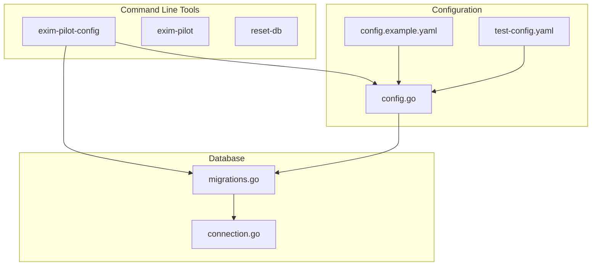
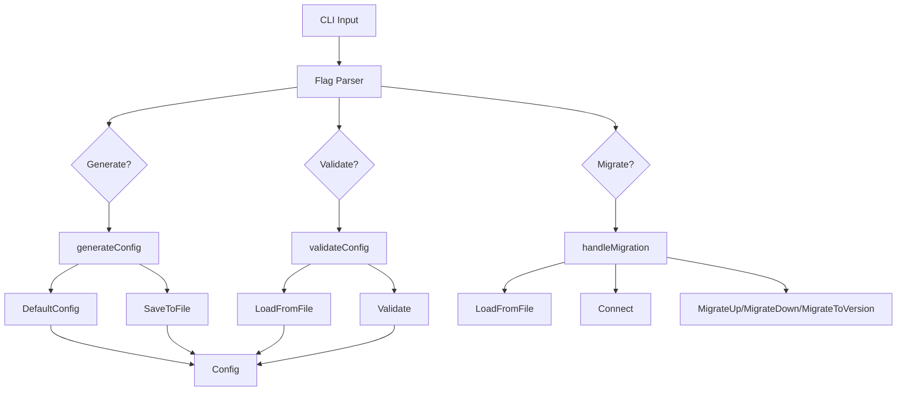
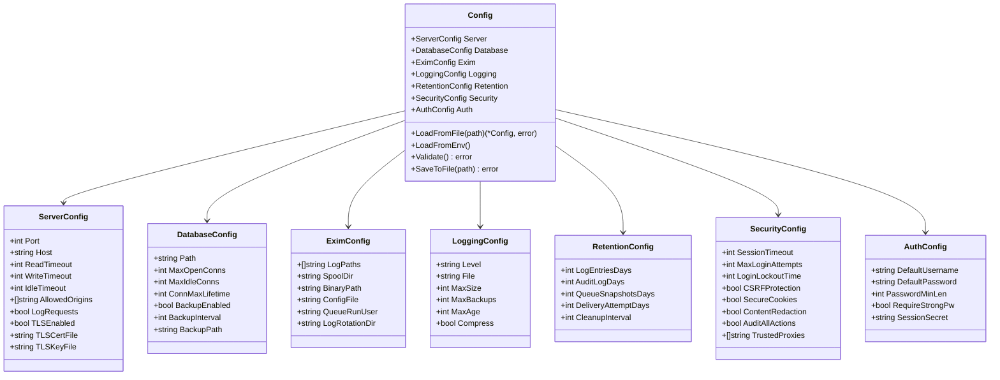
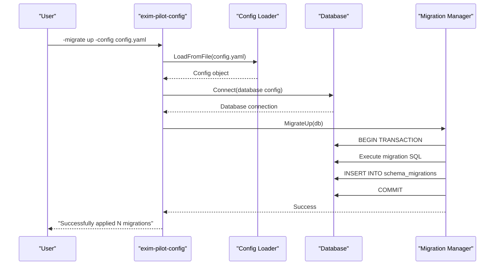
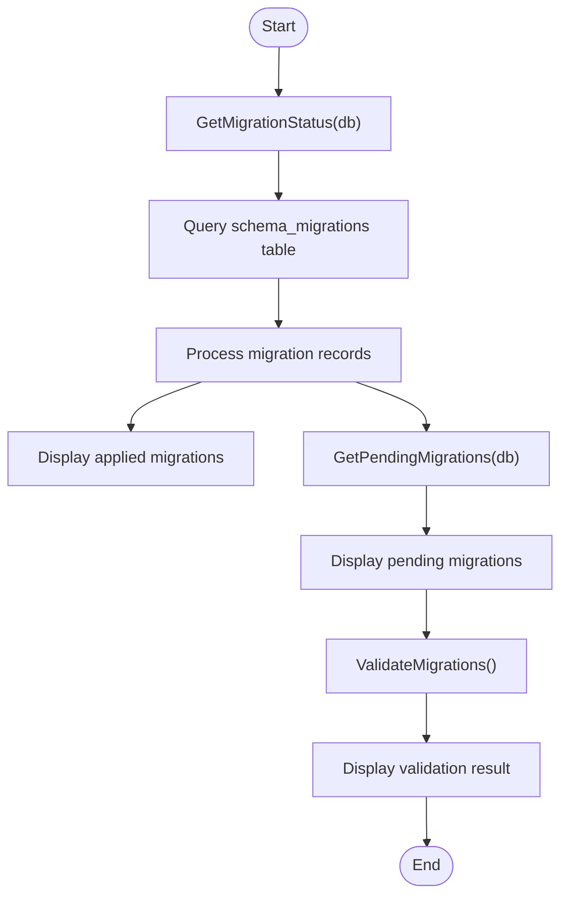
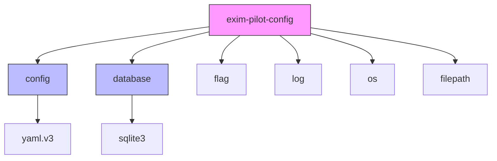

# Configuration Management Tool

## Table of Contents
1. [Introduction](#introduction)
2. [Project Structure](#project-structure)
3. [Core Components](#core-components)
4. [Architecture Overview](#architecture-overview)
5. [Detailed Component Analysis](#detailed-component-analysis)
6. [Dependency Analysis](#dependency-analysis)
7. [Performance Considerations](#performance-considerations)
8. [Troubleshooting Guide](#troubleshooting-guide)
9. [Conclusion](#conclusion)

## Introduction
The **exim-pilot-config** CLI tool is a configuration management utility designed for the Exim Control Panel application. It enables users to generate, validate, and manage configuration files, as well as perform database schema migrations. This tool ensures that the application is properly configured before deployment and maintains data integrity through versioned database migrations. It supports environment variable overrides, file-based configuration, and interactive prompts for safety during generation.

The tool is essential for system administrators and DevOps engineers who deploy and maintain the Exim Pilot system. It provides a reliable way to initialize configurations, verify their correctness, and manage database evolution across different environments.

## Project Structure
The project follows a standard Go application structure with clear separation of concerns. The `cmd/` directory contains executable commands, including `exim-pilot-config`, which is responsible for configuration and database management. The `internal/` directory houses core application logic, with dedicated packages for configuration, database operations, API handlers, and validation.

Key directories:
- `cmd/exim-pilot-config/`: CLI tool entry point
- `internal/config/`: Configuration structure and validation
- `internal/database/`: Database connection and migration logic
- `config/`: Example and test configuration files
- `web/`: Frontend application code

**Diagram sources**
- [cmd/exim-pilot-config/main.go](file://cmd/exim-pilot-config/main.go)
- [internal/config/config.go](file://internal/config/config.go)
- [internal/database/migrations.go](file://internal/database/migrations.go)
- [config/config.example.yaml](file://config/config.example.yaml)

**Section sources**
- [cmd/exim-pilot-config/main.go](file://cmd/exim-pilot-config/main.go#L1-L344)
- [internal/config/config.go](file://internal/config/config.go#L1-L480)

## Core Components
The core components of the **exim-pilot-config** tool include:
- **Configuration Management**: Handles loading, validating, and saving YAML configuration files.
- **Database Migration System**: Manages schema changes through versioned migrations.
- **CLI Interface**: Provides command-line flags for generate, validate, and migrate operations.

The configuration system supports default values, environment variable overrides, and comprehensive validation. The migration system ensures database schema consistency across deployments and supports up, down, and status operations.

**Section sources**
- [cmd/exim-pilot-config/main.go](file://cmd/exim-pilot-config/main.go#L1-L344)
- [internal/config/config.go](file://internal/config/config.go#L1-L480)
- [internal/database/migrations.go](file://internal/database/migrations.go#L1-L733)

## Architecture Overview
The **exim-pilot-config** tool follows a modular architecture where each component has a single responsibility. The CLI parser routes commands to appropriate handlers, which interact with the configuration and database modules.

**Diagram sources**
- [cmd/exim-pilot-config/main.go](file://cmd/exim-pilot-config/main.go#L1-L344)
- [internal/config/config.go](file://internal/config/config.go#L1-L480)

## Detailed Component Analysis

### Configuration Management System
The configuration system is built around the `Config` struct, which defines all application settings in a hierarchical structure. It supports loading from YAML files and environment variables, with built-in validation.

#### Configuration Structure

**Diagram sources**
- [internal/config/config.go](file://internal/config/config.go#L1-L480)

**Section sources**
- [internal/config/config.go](file://internal/config/config.go#L1-L480)

### Database Migration System
The database migration system manages schema evolution through versioned SQL scripts. Each migration includes an "up" script for applying changes and a "down" script for rolling them back.

#### Migration Workflow

**Diagram sources**
- [cmd/exim-pilot-config/main.go](file://cmd/exim-pilot-config/main.go#L240-L287)
- [internal/database/migrations.go](file://internal/database/migrations.go#L387-L441)

#### Migration Status Flow

**Diagram sources**
- [cmd/exim-pilot-config/main.go](file://cmd/exim-pilot-config/main.go#L283-L342)
- [internal/database/migrations.go](file://internal/database/migrations.go#L570-L610)

## Dependency Analysis
The **exim-pilot-config** tool depends on several internal packages to function:

The tool has no external dependencies beyond standard Go libraries and the YAML parser. All business logic is contained within the `internal/` package, ensuring encapsulation and maintainability.

**Diagram sources**
- [cmd/exim-pilot-config/main.go](file://cmd/exim-pilot-config/main.go#L1-L344)
- [go.mod](file://go.mod)

**Section sources**
- [cmd/exim-pilot-config/main.go](file://cmd/exim-pilot-config/main.go#L1-L344)
- [internal/config/config.go](file://internal/config/config.go#L1-L480)
- [internal/database/migrations.go](file://internal/database/migrations.go#L1-L733)

## Performance Considerations
The configuration tool is designed for infrequent, administrative use rather than high-performance operation. However, it includes several optimizations:
- **Lazy loading**: Configuration is only loaded when needed.
- **Batch operations**: Database migrations are executed in transactions.
- **Efficient validation**: File system checks are performed only when necessary.
- **Minimal memory usage**: Configuration is loaded once and processed in place.

The tool avoids unnecessary I/O operations and uses efficient data structures for migration tracking.

## Troubleshooting Guide
Common issues and their solutions:

### Configuration Generation Issues
**Problem**: "Configuration file already exists" prompt appears.
**Solution**: Confirm overwrite with 'y' or specify a different path using `-config`.

**Problem**: "Failed to save configuration" error.
**Solution**: Ensure the target directory exists and has write permissions (0755 recommended).

### Configuration Validation Issues
**Problem**: "Exim binary not found" warning.
**Solution**: Verify the `exim.binary_path` setting points to the correct Exim binary.

**Problem**: "TLS enabled but cert or key file not specified" error.
**Solution**: Set `server.tls_enabled` to false or provide valid `tls_cert_file` and `tls_key_file` paths.

### Database Migration Issues
**Problem**: "failed to connect to database" error.
**Solution**: Ensure the database directory exists and the path is correct.

**Problem**: "migration version gap" error.
**Solution**: Do not skip migration versions; apply them sequentially.

**Problem**: "duplicate migration version" error.
**Solution**: Check the `GetMigrations()` function for duplicate version numbers.

**Section sources**
- [cmd/exim-pilot-config/main.go](file://cmd/exim-pilot-config/main.go#L150-L200)
- [internal/config/config.go](file://internal/config/config.go#L300-L400)
- [internal/database/migrations.go](file://internal/database/migrations.go#L649-L697)

## Conclusion
The **exim-pilot-config** CLI tool provides a robust solution for managing application configuration and database schema evolution. Its design emphasizes safety, validation, and ease of use. The tool integrates seamlessly with the main application, ensuring that configuration changes are properly validated before deployment. With support for environment variables, file-based configuration, and database migrations, it offers flexibility for various deployment scenarios.

Key strengths include comprehensive validation, interactive generation, and detailed status reporting. The tool is essential for maintaining system integrity and should be used as part of any deployment workflow for the Exim Pilot system.

**Referenced Files in This Document**   
- [cmd/exim-pilot-config/main.go](file://cmd/exim-pilot-config/main.go)
- [internal/config/config.go](file://internal/config/config.go)
- [config/config.example.yaml](file://config/config.example.yaml)
- [config/test-config.yaml](file://config/test-config.yaml)
- [internal/database/migrations.go](file://internal/database/migrations.go)