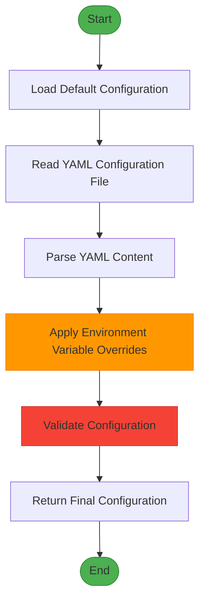

# Environment Variables and Overrides


## Table of Contents
1. [Environment Variables and Configuration Overrides](#environment-variables-and-configuration-overrides)
2. [Naming Convention for Environment Variables](#naming-convention-for-environment-variables)
3. [Supported Overrideable Parameters](#supported-overrideable-parameters)
4. [Precedence Order: Environment Variables vs YAML](#precedence-order-environment-variables-vs-yaml)
5. [Practical Examples for Different Environments](#practical-examples-for-different-environments)
6. [Security Guidance for Sensitive Data](#security-guidance-for-sensitive-data)

## Environment Variables and Configuration Overrides

The Exim-Pilot application supports configuration through both YAML files and environment variables. This dual approach allows for flexible deployment across different environments while maintaining secure handling of sensitive information. Environment variables can override values defined in the YAML configuration file, enabling dynamic configuration without modifying configuration files.

This mechanism is particularly useful in containerized environments, CI/CD pipelines, and multi-environment deployments where configuration values differ between development, staging, and production environments.

**Section sources**
- [config.go](file://internal/config/config.go#L158-L298)
- [main.go](file://cmd/exim-pilot/main.go#L159-L231)

## Naming Convention for Environment Variables

All environment variables in Exim-Pilot follow a consistent naming convention:

- **Prefix**: All environment variables are prefixed with `EXIM_PILOT_`
- **Uppercase**: All variable names use uppercase letters
- **Underscore Separation**: Words are separated by underscores
- **Direct Mapping**: Variable names directly correspond to configuration parameters in the YAML file

For example:
- `EXIM_PILOT_PORT` maps to `server.port` in YAML
- `EXIM_PILOT_DB_PATH` maps to `database.path` in YAML
- `EXIM_PILOT_LOG_LEVEL` maps to `logging.level` in YAML

This naming convention ensures predictability and makes it easy to determine the environment variable name for any configuration parameter.

**Section sources**
- [config.go](file://internal/config/config.go#L202-L298)
- [config.example.yaml](file://config/config.example.yaml#L52-L76)

## Supported Overrideable Parameters

The following configuration parameters can be overridden using environment variables:

### Server Configuration
- **EXIM_PILOT_PORT**: Server port number
- **EXIM_PILOT_HOST**: Server host address
- **EXIM_PILOT_READ_TIMEOUT**: Read timeout in seconds
- **EXIM_PILOT_WRITE_TIMEOUT**: Write timeout in seconds
- **EXIM_PILOT_ALLOWED_ORIGINS**: Comma-separated list of allowed origins for CORS
- **EXIM_PILOT_TLS_ENABLED**: Enable or disable TLS (true/false)
- **EXIM_PILOT_TLS_CERT**: Path to TLS certificate file
- **EXIM_PILOT_TLS_KEY**: Path to TLS key file

### Database Configuration
- **EXIM_PILOT_DB_PATH**: Path to the SQLite database file
- **EXIM_PILOT_DB_MAX_CONNS**: Maximum number of database connections

### Exim Configuration
- **EXIM_PILOT_LOG_PATHS**: Comma-separated list of Exim log file paths
- **EXIM_PILOT_SPOOL_DIR**: Path to the Exim spool directory
- **EXIM_PILOT_BINARY_PATH**: Path to the Exim binary

### Logging Configuration
- **EXIM_PILOT_LOG_LEVEL**: Logging level (debug, info, warn, error)
- **EXIM_PILOT_LOG_FILE**: Path to the application log file

### Authentication Configuration
- **EXIM_PILOT_ADMIN_USER**: Default admin username
- **EXIM_PILOT_ADMIN_PASSWORD**: Default admin password
- **EXIM_PILOT_SESSION_SECRET**: Session secret for authentication

### Security Configuration
- **EXIM_PILOT_SESSION_TIMEOUT**: Session timeout in minutes
- **EXIM_PILOT_SECURE_COOKIES**: Enable secure cookies (true/false)

**Section sources**
- [config.go](file://internal/config/config.go#L202-L298)
- [config.example.yaml](file://config/config.example.yaml#L52-L76)

## Precedence Order: Environment Variables vs YAML

Environment variables take precedence over YAML configuration values. The configuration loading process follows this sequence:

1. Load default configuration values
2. Read and parse the YAML configuration file
3. Apply environment variable overrides
4. Validate the final configuration

This precedence order is implemented in the `LoadFromFile` function in `config.go`:





**Diagram sources**
- [config.go](file://internal/config/config.go#L158-L208)

The key code that implements this precedence is:


```go
// LoadFromFile loads configuration from a YAML file
func LoadFromFile(path string) (*Config, error) {
    config := DefaultConfig()

    // Read and parse YAML file
    if err := yaml.Unmarshal(data, config); err != nil {
        return config, fmt.Errorf("failed to parse configuration file: %w", err)
    }

    // Load environment overrides (takes precedence)
    config.LoadFromEnv()

    // Validate configuration
    if err := config.Validate(); err != nil {
        return config, fmt.Errorf("configuration validation failed: %w", err)
    }

    return config, nil
}
```


This ensures that environment variables always override values from the YAML file, allowing for environment-specific configuration without modifying configuration files.

**Section sources**
- [config.go](file://internal/config/config.go#L158-L208)

## Practical Examples for Different Environments

### Development Environment

```bash
# Set development-specific configuration
export EXIM_PILOT_PORT=3000
export EXIM_PILOT_HOST="localhost"
export EXIM_PILOT_LOG_LEVEL=debug
export EXIM_PILOT_DB_PATH="./data/dev.db"
export EXIM_PILOT_ADMIN_PASSWORD="dev-password-123"
export EXIM_PILOT_TLS_ENABLED=false

# Start the application
./exim-pilot -config ./config/config.yaml
```


### Staging Environment

```bash
# Set staging-specific configuration
export EXIM_PILOT_PORT=8080
export EXIM_PILOT_HOST="0.0.0.0"
export EXIM_PILOT_LOG_LEVEL=info
export EXIM_PILOT_DB_PATH="/opt/exim-pilot/data/staging.db"
export EXIM_PILOT_LOG_FILE="/opt/exim-pilot/logs/staging.log"
export EXIM_PILOT_ALLOWED_ORIGINS="https://staging.example.com,https://admin.staging.example.com"
export EXIM_PILOT_ADMIN_PASSWORD=$(cat /run/secrets/admin_password)
export EXIM_PILOT_SESSION_SECRET=$(cat /run/secrets/session_secret)
export EXIM_PILOT_TLS_ENABLED=true
export EXIM_PILOT_TLS_CERT="/etc/ssl/certs/staging.crt"
export EXIM_PILOT_TLS_KEY="/etc/ssl/private/staging.key"

# Start the application
./exim-pilot -config /opt/exim-pilot/config/config.yaml
```


### Production Environment

```bash
# Source environment variables from secure file
source /opt/exim-pilot/config/production.env

# Or set them directly (typically done in systemd service or container)
export EXIM_PILOT_PORT=443
export EXIM_PILOT_HOST="0.0.0.0"
export EXIM_PILOT_LOG_LEVEL=warn
export EXIM_PILOT_DB_PATH="/opt/exim-pilot/data/production.db"
export EXIM_PILOT_LOG_FILE="/opt/exim-pilot/logs/production.log"
export EXIM_PILOT_ALLOWED_ORIGINS="https://mail.example.com,https://admin.example.com"
export EXIM_PILOT_ADMIN_PASSWORD=$(cat /run/secrets/prod_admin_password)
export EXIM_PILOT_SESSION_SECRET=$(cat /run/secrets/prod_session_secret)
export EXIM_PILOT_SESSION_TIMEOUT=60
export EXIM_PILOT_SECURE_COOKIES=true
export EXIM_PILOT_TLS_ENABLED=true
export EXIM_PILOT_TLS_CERT="/etc/letsencrypt/live/example.com/fullchain.pem"
export EXIM_PILOT_TLS_KEY="/etc/letsencrypt/live/example.com/privkey.pem"
export EXIM_PILOT_LOG_PATHS="/var/log/exim4/mainlog,/var/log/exim4/rejectlog"

# Start the application
./exim-pilot -config /opt/exim-pilot/config/config.yaml
```


### Docker Container Example

```dockerfile
# Dockerfile
FROM alpine:latest

COPY exim-pilot /usr/local/bin/
COPY config.yaml /opt/exim-pilot/config/

ENV EXIM_PILOT_PORT=8080
ENV EXIM_PILOT_HOST=0.0.0.0
ENV EXIM_PILOT_LOG_LEVEL=info
ENV EXIM_PILOT_DB_PATH=/data/exim-pilot.db
ENV EXIM_PILOT_LOG_FILE=/logs/exim-pilot.log

VOLUME ["/data", "/logs", "/var/log/exim4"]

EXPOSE 8080

CMD ["exim-pilot", "-config", "/opt/exim-pilot/config/config.yaml"]
```


```yaml
# docker-compose.yml
version: '3.8'
services:
  exim-pilot:
    build: .
    ports:
      - "8080:8080"
    environment:
      - EXIM_PILOT_PORT=8080
      - EXIM_PILOT_HOST=0.0.0.0
      - EXIM_PILOT_LOG_LEVEL=info
      - EXIM_PILOT_DB_PATH=/data/exim-pilot.db
      - EXIM_PILOT_LOG_FILE=/logs/exim-pilot.log
      - EXIM_PILOT_ALLOWED_ORIGINS=http://localhost:3000
      - EXIM_PILOT_ADMIN_PASSWORD=${ADMIN_PASSWORD}
      - EXIM_PILOT_SESSION_SECRET=${SESSION_SECRET}
      - EXIM_PILOT_TLS_ENABLED=false
    volumes:
      - ./data:/data
      - ./logs:/logs
      - /var/log/exim4:/var/log/exim4:ro
    restart: unless-stopped
```


**Section sources**
- [deployments/README.md](file://deployments/README.md#L63-L124)
- [config.example.yaml](file://config/config.example.yaml#L52-L76)

## Security Guidance for Sensitive Data

### Best Practices for Using Environment Variables

1. **Use Environment Variables for Sensitive Data**: Store passwords, API keys, and secrets in environment variables rather than in configuration files.

2. **Avoid Hardcoding Secrets**: Never commit sensitive information to version control.

3. **Use Secure Secret Management**: In production, use secret management systems (e.g., Hashicorp Vault, AWS Secrets Manager) to populate environment variables.

4. **Restrict File Permissions**: Ensure configuration files containing sensitive data have restrictive permissions (e.g., 600 or 640).

5. **Use .env Files Carefully**: If using `.env` files, ensure they are included in `.gitignore` and have appropriate file permissions.

### Protection Against Accidental Exposure

The application includes several safeguards to prevent accidental exposure of sensitive information:

1. **Log Redaction**: The configuration includes a `content_redaction` option that redacts sensitive content in logs and UI.

2. **Secure Defaults**: Security-sensitive options default to secure values:
   - `secure_cookies: true` (requires HTTPS)
   - `csrf_protection: true`
   - `audit_all_actions: true`

3. **Validation**: The configuration validation ensures that sensitive fields are not empty:
   
```go
   // Validate auth configuration
   if c.Auth.DefaultPassword == "" {
       return fmt.Errorf("default password cannot be empty")
   }
   ```


### Environment-Specific Security Recommendations

**Development**
- Use strong but non-production passwords
- Enable debug logging for troubleshooting
- Disable TLS for convenience
- Regularly rotate development credentials

**Staging**
- Use passwords with similar strength to production
- Enable TLS with test certificates
- Restrict access to authorized team members
- Monitor for unauthorized access attempts

**Production**
- Store secrets in secure secret management systems
- Use environment variables populated at runtime
- Enable TLS with valid certificates
- Set `secure_cookies: true`
- Implement regular secret rotation
- Monitor and audit all access to sensitive configuration

### Example: Secure Production Setup


```bash
# DO NOT do this - exposes secrets in command history
export EXIM_PILOT_ADMIN_PASSWORD="mysecretpassword"
./exim-pilot -config config.yaml

# DO this instead - reads from secure source
export EXIM_PILOT_ADMIN_PASSWORD=$(cat /run/secrets/admin_password)
export EXIM_PILOT_SESSION_SECRET=$(cat /run/secrets/session_secret)
./exim-pilot -config config.yaml

# Or use a secure .env file with proper permissions
chmod 600 /opt/exim-pilot/config/production.env
source /opt/exim-pilot/config/production.env
./exim-pilot -config config.yaml
```


The application also provides warnings when using default or weak passwords:


```go
if password == "admin123" {
    log.Println("SECURITY WARNING: Please change the default password after first login!")
}
```


This ensures that administrators are alerted to potential security issues during setup.

**Section sources**
- [main.go](file://cmd/exim-pilot/main.go#L211-L231)
- [config.go](file://internal/config/config.go#L378-L428)
- [deployments/README.md](file://deployments/README.md#L63-L124)

**Referenced Files in This Document**   
- [config.go](file://internal/config/config.go#L158-L298)
- [main.go](file://cmd/exim-pilot/main.go#L159-L231)
- [config.example.yaml](file://config/config.example.yaml#L52-L76)
- [deployments/README.md](file://deployments/README.md#L63-L124)