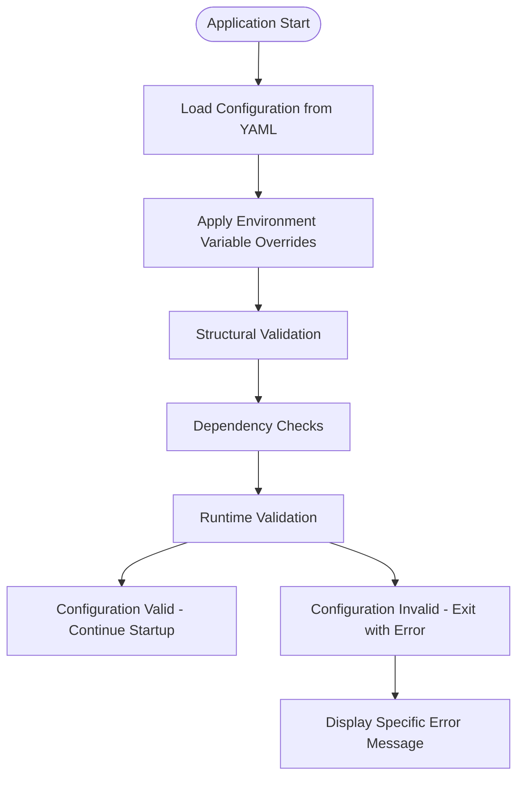
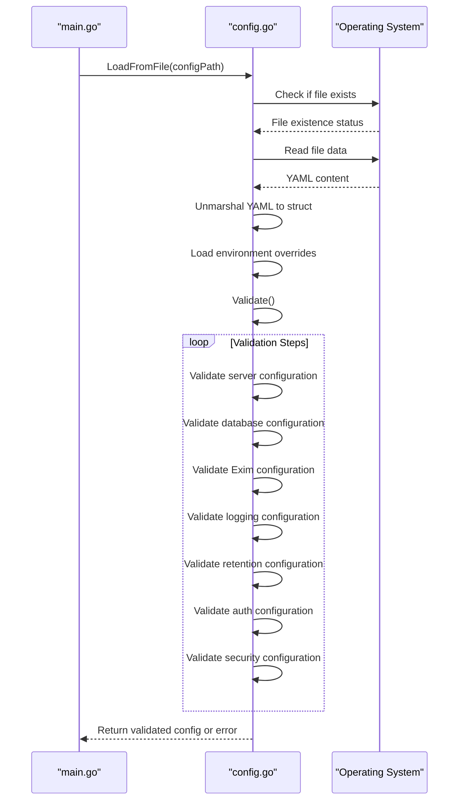
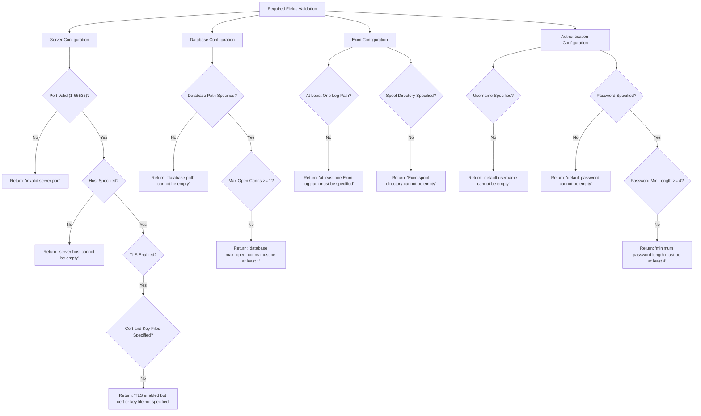
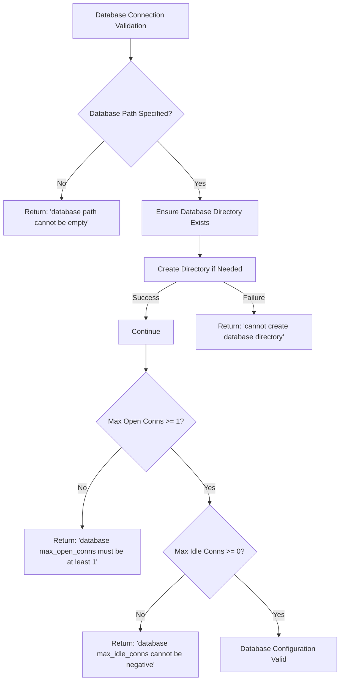
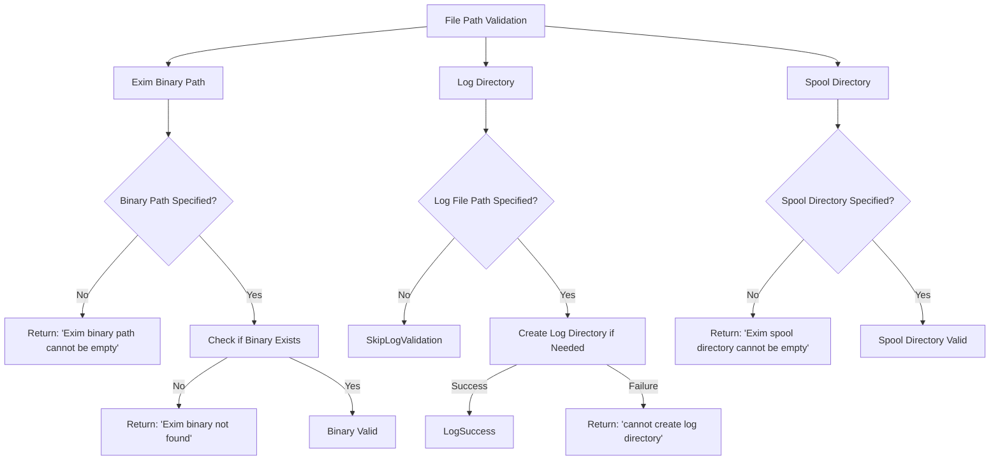
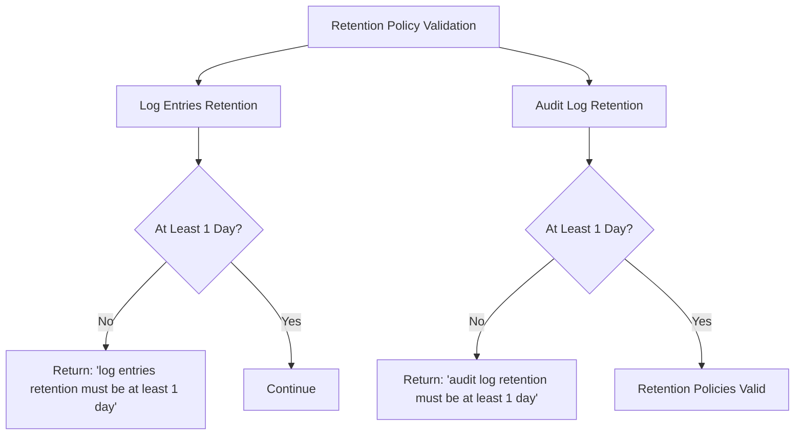
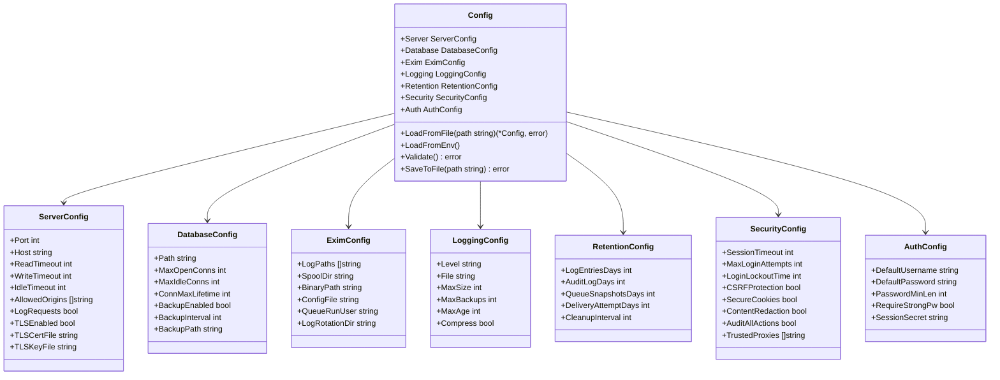

# Configuration Validation and Error Handling

## Table of Contents
1. [Introduction](#introduction)
2. [Configuration Validation Process](#configuration-validation-process)
3. [Validation Sequence](#validation-sequence)
4. [Required Fields Validation](#required-fields-validation)
5. [Database Connection Validation](#database-connection-validation)
6. [File Path Validation](#file-path-validation)
7. [Retention Policy Validation](#retention-policy-validation)
8. [Error Messages and Troubleshooting](#error-messages-and-troubleshooting)
9. [Common Configuration Errors](#common-configuration-errors)
10. [Validation Architecture](#validation-architecture)

## Introduction
The Exim-Pilot application implements a comprehensive configuration validation system that ensures the application starts with a valid and secure configuration. This document details the configuration validation process that occurs during application startup, covering validation of required fields, database connection parameters, file paths, and retention policies. The validation system prevents runtime failures by catching configuration issues early and providing clear error messages to guide troubleshooting.

**Section sources**
- [config.go](file://internal/config/config.go#L1-L480)
- [main.go](file://cmd/exim-pilot/main.go#L1-L233)

## Configuration Validation Process
The configuration validation process is a critical component of the Exim-Pilot application startup sequence. It ensures that all configuration parameters are valid, required fields are present, and system dependencies are accessible before the application begins normal operations. The validation process follows a structured approach that checks configuration integrity at multiple levels.

The validation system is implemented in the `internal/config/config.go` file, which contains the `Config` struct and its associated validation methods. When the application starts, it loads the configuration from a YAML file, applies environment variable overrides, and then performs comprehensive validation before proceeding with initialization.

**Diagram sources**
- [config.go](file://internal/config/config.go#L169-L197)
- [main.go](file://cmd/exim-pilot/main.go#L45-L50)

**Section sources**
- [config.go](file://internal/config/config.go#L1-L480)

## Validation Sequence
The configuration validation follows a specific sequence during application startup, ensuring that each aspect of the configuration is validated in a logical order. The sequence begins with file parsing and progresses through structural validation, dependency checks, and runtime validation.

The validation sequence is initiated in the `LoadFromFile` function in `internal/config/config.go`, which orchestrates the entire validation process:

1. **File Parsing**: The configuration file is read and parsed from YAML format into the Config struct
2. **Structural Validation**: Required fields are checked for presence and basic validity
3. **Dependency Checks**: External dependencies like files and directories are verified
4. **Runtime Validation**: Values are checked against acceptable ranges and system constraints

**Diagram sources**
- [config.go](file://internal/config/config.go#L169-L197)
- [main.go](file://cmd/exim-pilot/main.go#L45-L50)

**Section sources**
- [config.go](file://internal/config/config.go#L169-L197)

## Required Fields Validation
The configuration validation system performs thorough checks on required fields across all configuration sections. These validations ensure that essential parameters are present and properly configured before the application starts.

The required fields validation covers multiple configuration sections:

### Server Configuration
- **Port**: Must be between 1 and 65535
- **Host**: Cannot be empty
- **TLS Configuration**: When TLS is enabled, both certificate and key files must be specified

### Database Configuration
- **Path**: Database file path cannot be empty
- **Connection Limits**: Maximum open connections must be at least 1, idle connections cannot be negative

### Exim Configuration
- **Log Paths**: At least one Exim log path must be specified
- **Spool Directory**: Cannot be empty
- **Binary Path**: Cannot be empty and the binary must exist

### Authentication Configuration
- **Default Username**: Cannot be empty
- **Default Password**: Cannot be empty
- **Password Minimum Length**: Must be at least 4 characters

**Diagram sources**
- [config.go](file://internal/config/config.go#L299-L419)

**Section sources**
- [config.go](file://internal/config/config.go#L299-L419)

## Database Connection Validation
The database connection validation ensures that the application can properly connect to and use the database. This validation occurs during the startup sequence and includes both configuration checks and runtime verifications.

The validation process for database connections includes:

1. **Path Validation**: The database path must be specified and the directory must be creatable
2. **Connection Parameters**: Maximum open and idle connections are validated for acceptable values
3. **Directory Creation**: The system attempts to create the database directory if it doesn't exist
4. **File Accessibility**: The application verifies it can access the database file location

When validating the database configuration, the system first checks that the database path is not empty. It then ensures the directory containing the database file exists or can be created. This is important because the application needs write permissions to this directory to create and modify the database file.

**Diagram sources**
- [config.go](file://internal/config/config.go#L310-L320)

**Section sources**
- [config.go](file://internal/config/config.go#L310-L320)

## File Path Validation
The file path validation system ensures that all required files and directories exist and are accessible by the application. This validation is critical for the proper functioning of the Exim-Pilot application, as it depends on several external files and directories.

The file path validation covers the following components:

### Exim Binary Validation
The system validates that the Exim binary path is specified and that the binary exists at the specified location. This is essential because the application needs to execute Exim commands to manage the mail queue.

### Log Directory Validation
The application validates that the log file directory exists or can be created. If a log file path is specified, the system attempts to create the directory structure if it doesn't already exist.

### Spool Directory Validation
The Exim spool directory is validated to ensure it exists and is accessible. This directory contains the mail queue and is critical for the application's functionality.

**Diagram sources**
- [config.go](file://internal/config/config.go#L322-L348)

**Section sources**
- [config.go](file://internal/config/config.go#L322-L348)

## Retention Policy Validation
The retention policy validation ensures that data retention values are within acceptable ranges and make logical sense. This validation prevents configuration errors that could lead to excessive data storage or premature data deletion.

The retention policy validation covers the following parameters:

- **Log Entries Days**: Must be at least 1 day
- **Audit Log Days**: Must be at least 1 day
- **Queue Snapshots Days**: No minimum validation in code
- **Delivery Attempt Days**: No minimum validation in code
- **Cleanup Interval**: No minimum validation in code

The validation ensures that retention periods are reasonable and prevents configuration errors that could lead to data loss or excessive storage consumption. The system requires that log entries and audit logs be retained for at least one day, which prevents accidental configuration of zero-day retention.

**Diagram sources**
- [config.go](file://internal/config/config.go#L378-L386)

**Section sources**
- [config.go](file://internal/config/config.go#L378-L386)

## Error Messages and Troubleshooting
The configuration validation system provides detailed error messages that help administrators identify and resolve configuration issues. These error messages are designed to be specific and actionable, guiding users toward appropriate solutions.

### Error Message Examples
- **Server Configuration Errors**:
  - "invalid server port: [value]" - The port number is outside the valid range (1-65535)
  - "server host cannot be empty" - The server host is not specified
  - "TLS enabled but cert or key file not specified" - TLS is enabled but certificate or key file is missing
  - "TLS cert file not found: [path]" - The specified TLS certificate file does not exist
  - "TLS key file not found: [path]" - The specified TLS key file does not exist

- **Database Configuration Errors**:
  - "database path cannot be empty" - The database path is not specified
  - "cannot create database directory [path]: [error]" - The system cannot create the database directory
  - "database max_open_conns must be at least 1" - The maximum open connections is less than 1
  - "database max_idle_conns cannot be negative" - The maximum idle connections is negative

- **Exim Configuration Errors**:
  - "at least one Exim log path must be specified" - No log paths are configured
  - "Exim log path cannot be empty" - A log path is empty
  - "Exim spool directory cannot be empty" - The spool directory is not specified
  - "Exim binary path cannot be empty" - The Exim binary path is not specified
  - "Exim binary not found: [path]" - The Exim binary does not exist at the specified path

- **Logging Configuration Errors**:
  - "invalid log level: [level]" - The specified log level is not valid
  - "cannot create log directory [path]: [error]" - The system cannot create the log directory

- **Retention Configuration Errors**:
  - "log entries retention must be at least 1 day" - Log entries retention is less than 1 day
  - "audit log retention must be at least 1 day" - Audit log retention is less than 1 day

- **Authentication Configuration Errors**:
  - "default username cannot be empty" - The default username is not specified
  - "default password cannot be empty" - The default password is not specified
  - "minimum password length must be at least 4" - The minimum password length is less than 4

- **Security Configuration Errors**:
  - "session timeout must be at least 1 minute" - The session timeout is less than 1 minute
  - "max login attempts must be at least 1" - The maximum login attempts is less than 1

### Troubleshooting Guidance
When encountering configuration validation errors, administrators should:

1. **Review the Error Message**: Carefully read the error message to understand the specific issue
2. **Check the Configuration File**: Open the configuration file and locate the problematic setting
3. **Verify File and Directory Permissions**: Ensure that the application has appropriate read/write permissions for all specified files and directories
4. **Validate File Paths**: Confirm that all file paths are correct and that the files exist
5. **Check Value Ranges**: Ensure that numeric values are within acceptable ranges
6. **Test Configuration Changes**: After making changes, restart the application to test if the validation passes

**Section sources**
- [config.go](file://internal/config/config.go#L299-L419)

## Common Configuration Errors
This section documents common configuration errors and their solutions based on the validation rules implemented in the application.

### Incorrect Permissions
**Error**: "cannot create log directory [path]: permission denied"
**Cause**: The application does not have write permissions to create the log directory
**Solution**: 
1. Ensure the parent directory exists
2. Grant write permissions to the application user for the directory
3. Alternatively, specify a different log file path where the application has write access

### Unreachable Database
**Error**: "cannot create database directory [path]: permission denied"
**Cause**: The application cannot create the database directory due to permission issues
**Solution**:
1. Create the database directory manually with appropriate permissions
2. Change the database path to a location where the application has write access
3. Run the application with sufficient privileges (not recommended for production)

### Missing Exim Binary
**Error**: "Exim binary not found: [path]"
**Cause**: The Exim binary does not exist at the specified path
**Solution**:
1. Verify the correct path to the Exim binary on your system (typically /usr/sbin/exim4 or /usr/sbin/exim)
2. Update the binary_path configuration parameter with the correct path
3. Install Exim if it is not already installed on the system

### Invalid Log Level
**Error**: "invalid log level: [level]"
**Cause**: The specified log level is not one of the supported values
**Solution**:
1. Change the log level to one of the supported values: debug, info, warn, error, fatal
2. Refer to the configuration example for correct syntax

### Empty Required Fields
**Error**: Various "cannot be empty" errors
**Cause**: Required configuration fields are missing or empty
**Solution**:
1. Review the configuration example file to identify all required fields
2. Ensure all required fields are populated with appropriate values
3. Pay special attention to server, database, Exim, and authentication sections

### Port Configuration Issues
**Error**: "invalid server port: [value]"
**Cause**: The port number is outside the valid range
**Solution**:
1. Use a port number between 1 and 65535
2. For production systems, use ports 80 (HTTP) or 443 (HTTPS)
3. For development, use ports above 1024 to avoid requiring elevated privileges

**Section sources**
- [config.go](file://internal/config/config.go#L299-L419)
- [config.example.yaml](file://config/config.example.yaml#L1-L77)

## Validation Architecture
The configuration validation system is integrated into the application's startup process and follows a layered architecture that ensures comprehensive validation.

### Component Relationships
The validation architecture consists of several interconnected components:

- **Config Struct**: Defines the configuration structure and holds validation methods
- **LoadFromFile Function**: Orchestrates the loading and validation process
- **Validate Method**: Performs comprehensive validation of all configuration sections
- **Environment Overrides**: Allows configuration values to be overridden by environment variables

**Diagram sources**
- [config.go](file://internal/config/config.go#L1-L480)

**Section sources**
- [config.go](file://internal/config/config.go#L1-L480)

**Referenced Files in This Document**   
- [config.go](file://internal/config/config.go#L1-L480)
- [main.go](file://cmd/exim-pilot/main.go#L1-L233)
- [config.example.yaml](file://config/config.example.yaml#L1-L77)
- [service.go](file://internal/validation/service.go#L1-L521)
- [main.go](file://cmd/exim-pilot-config/main.go#L1-L242)